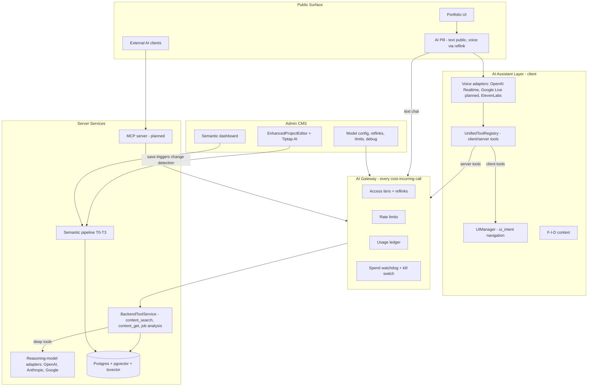

# 00-overview — System Map & Spec Index

**Status:** current
**Owner domain:** cross-cutting (system map, spec index, conventions)
**Last verified against code:** 2026-07-02 (`e2d75b4`, branch `claude/semantic-content-management-review` == `feature/semantic-content-management-2`)

This folder is the entry point for any agent or human working on the project. Read this file, then load only the spec(s) that own the domain you're touching.

---

## 1. What this project is

A portfolio website that *is itself* the flagship portfolio piece — a production Next.js 15 application whose embedded AI assistant demonstrates, live, the owner's command of current AI engineering.

- **Public visitors:** SSR portfolio (project grid/list/timeline, Tiptap-rendered case studies, Three.js wave hero) + a floating AI pill: **text chat for everyone** (rate-limited, bot-challenged), **voice for invited guests** via reflinks. The agent answers from portfolio content via RAG and drives the UI through declarative navigation tools.
- **External AI agents:** a public, heavily safeguarded **MCP server** (planned — see `mcp-server/`) exposing read-only portfolio search/retrieval.
- **Admin:** full CMS under `/admin` — project editor with AI assist, semantic content dashboard, voice + reasoning model config, reflinks, rate limits, spend watchdog, conversation replay/debug.

**Deployment target:** Vercel serverless. Durable state lives in Postgres (Prisma + pgvector); in-memory caches are per-instance memoization only, never correctness-bearing.

## 2. System map

**The load-bearing seam:** `BackendToolService` + the server side of `UnifiedToolRegistry` form the single data-access chain. Voice adapters reach it via `/api/ai/tools/execute`; the MCP server will expose a curated read-only subset of the same implementations; deep tools may internally consult the reasoning model. Nothing else talks to the semantic index directly.

## 3. Spec index

| Spec | Status | Owns | Key open work |
|---|---|---|---|
| [00-overview](./README.md) | current | system map, decision registry, conventions | keep index honest |
| [portfolio-core](../portfolio-core/requirements.md) | current — largely implemented | public pages, project APIs, homepage, SSR/SEO, analytics, auth | hygiene deletions, `status` column drop |
| [admin-cms](../admin-cms/requirements.md) | current — largely implemented | admin shell, project editor, homepage composer | delete legacy editors |
| [media](../media/requirements.md) | current — implemented | media library, upload, storage providers | trimmed to reality; usage tracking backlogged |
| [rich-content](../rich-content/requirements.md) | current — implemented | Tiptap editor, extensions, renderers | parallel API cancelled; versioning backlogged |
| [ui-system](../ui-system/requirements.md) | current — implemented | theme, GSAP animation, wave hero, layout | test-page removal |
| [ai-assistant](../ai-assistant/requirements.md) | current — core implemented | visitor AI: voice adapters, pill UI, tool registry, F-I-D, navigation | provider merge, Google adapter, D41 exploration |
| [ai-admin](../ai-admin/requirements.md) | current — partially implemented | model registry + aliases, pricing-as-data, reasoning-model adapters, editing AI | registry/aliases, adapter layer, Anthropic fix |
| [semantic-content](../semantic-content/requirements.md) | current — implemented, verification pending | T0–T3 pipeline, chunking, embeddings, search, budgets | verification tasks, hybrid retrieval, ProjectAIIndex retirement |
| [access-and-cost](../access-and-cost/requirements.md) | current — **mostly unimplemented** | AI gateway, public text chat, rate limiting, reflinks, usage ledger, watchdog | nearly everything (Phase 2) |
| [mcp-server](../mcp-server/requirements.md) | current — **unimplemented** | external MCP server | everything (Phase 4) |
| [_archive](../_archive/) | archived | superseded specs & analysis docs | — |

Master direction document: [`ARCHITECTURE_ALIGNMENT_PROPOSAL.md`](../ARCHITECTURE_ALIGNMENT_PROPOSAL.md) (frozen rationale; the registry below is the living copy of its decisions). Roadmap phases live in its Section 7.

## 4. Decision registry

See [decision-registry.md](./decision-registry.md) — D1–D44. Rule of the registry: *implemented-and-working beats specced-but-imaginary; where neither is built, the simpler design wins.* When a spec sentence conflicts with a registry decision, the registry wins and the spec must be fixed — do not preserve both with a note.

## 5. Spec conventions (binding)

1. **Shape:** each spec = `requirements.md` + `design.md` + `tasks.md` (plus optional focused design sub-files). **Soft cap ~50KB per file** — split by subsystem, not doc type, when a design outgrows it.
2. **Status header** at the top of every file: `Status: current | archived | superseded-by:<link>`, `Owner domain`, `Last verified against code: <date> (<commit>)`.
3. **Contracts:** each spec declares "consumes / provides" tables. A data model or API is *specified* in exactly one spec; everyone else links to the owner.
4. **No embedded implementation code** beyond interface signatures — pasted class bodies drift instantly.
5. **Requirements format:** EARS/user-story style ("WHEN … THEN the system SHALL …").
6. **Task ledgers:** regenerated from code truth, never copied. A parent may be `[x]` only if all children are. Duplicate task/requirement numbers are forbidden. Completed history goes in a short "Already implemented" section, not a sea of checked boxes.
7. **Naming:** tool names use underscores (`ui_intent`, `content_search`). "MCP" refers exclusively to the real external MCP server. Tiers are T0–T3.
8. **Models & pricing are data** (registry D4/D38): no model IDs or prices in spec text or code — reference role aliases (`default-chat`, `default-cheap`, `default-realtime`, `default-embedding`, `default-reasoning`).

## 6. Repo orientation

- App repo: `portfolio-projects/` — Next.js 15.4 App Router, React 19, Prisma 6 (Postgres + pgvector), Tailwind 4, Tiptap 3, NextAuth, `@openai/agents`, `@elevenlabs/client`.
- Specs: `portfolio-projects/.kiro/specs/` (this tree) — the only spec location, versioned with the code.
- Key source areas: `src/lib/content/` (semantic pipeline), `src/lib/ai/` (tools, providers), `src/lib/voice/` + `src/components/providers/conversational-agent-provider.tsx` (voice), `src/lib/navigation/` (UIManager), `src/app/api/ai/` + `src/app/api/admin/` (API), `src/app/admin/` (CMS UI).
- Verification: `npm run type-check && npm run build && npm test`; semantic health via `npm run diagnostics`.
