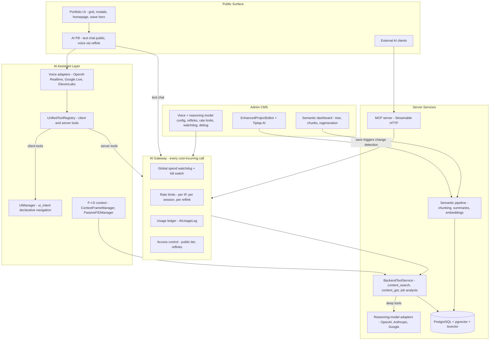

# Architecture Alignment Proposal (Merged, Canonical)

**Status:** APPROVED — owner questions resolved 2026-07-02; Phase 1 (spec rewrite) executed 2026-07-02
**Date:** 2026-07-02
**Supersedes:** `ARCHITECTURE_ALIGNMENT_PROPOSAL.md` and `ARCHITECTURE_ALIGNMENT_PROPOSAL (2).md` (two generations of the same audit, merged here; originals archived in `_archive/`)
**Scope:** This document proposes; it does not implement. Every change flows **proposal → spec → implementation**, in separate sessions. Nothing in here (including the MCP server) is built before its spec exists.

---

## How to use this document

This is the single source of truth for *direction*. When a spec or piece of code contradicts this document, this document wins until the specs are regenerated; after that, the specs win. The Decision Registry (Section 3) has been migrated to `00-overview/decision-registry.md` — that copy is the living one; this document is the frozen rationale record.

Follow-up agent sessions execute the roadmap in Section 7, one phase per session, using the rewritten specs as context.

---

## 1. Project identity and value proposition

**One sentence:** A portfolio website that *is itself* the flagship portfolio piece — a production Next.js application whose embedded AI assistant demonstrates, live, the owner's command of current AI engineering.

**What a visitor experiences:**

- A polished portfolio: project grid/list/timeline, rich Tiptap-rendered case studies with carousels, downloads, and interactive embeds; configurable homepage with a Three.js wave hero; light/dark themes.
- An AI portfolio guide (pill-shaped floating interface): **text chat for everyone** (rate-limited), **voice for invited guests** via reflinks. The agent answers questions grounded in portfolio content via RAG, and *drives the UI* — opening projects, scrolling, highlighting — through declarative navigation tools.
- For recruiters with a reflink: voice conversation (OpenAI Realtime primary; Google/Gemini Live planned; ElevenLabs maintained), job-spec analysis against the owner's actual experience — powered by a proper reasoning model, not the realtime voice model.
- For AI agents (Claude, ChatGPT, etc.): a public, **heavily safeguarded MCP server** exposing portfolio search and project retrieval — the portfolio is queryable by the visitor's own AI tooling, and the safeguarding itself is part of the showcase.

**What it showcases technically:**

| Capability | Implementation |
|---|---|
| Speech-to-speech agents | Multi-provider voice adapter layer: OpenAI Realtime (`@openai/agents`, WebRTC) primary + Google (Gemini Live, planned) + ElevenLabs Agents (`@elevenlabs/client`) behind one `IConversationalAgentAdapter` interface |
| Reasoning-model layer | Classic/text LLM adapters (OpenAI, Anthropic, Google) behind a common interface; admin-selectable **reasoning model** serves MCP tools and deep server tools, shared by voice agents and external MCP clients (one backend chain, no endpoint clones) |
| Tool calling / agent-driven UI | Unified tool registry with `client`/`server` execution contexts; declarative `ui_intent` navigation via `UIManager` + semantic ID registry |
| RAG / context engineering | Heading-bounded hierarchical chunking (T0–T3) with contextual prefixes, pgvector + HNSW, hybrid retrieval, F-I-D (Frame–Index–Details) progressive context |
| Interoperability & endpoint security | Real MCP server (Streamable HTTP) exposing portfolio tools to external agents — gateway-fronted, allowlisted, metered, fail-closed |
| Cost & abuse defense | Unified usage ledger, per-IP/session rate limits, bot challenge, global spend watchdog with kill switch |
| Full-stack product engineering | Admin CMS (Tiptap editor with AI assist, media pipeline, homepage composer), NextAuth, Prisma/PostgreSQL, SSR/SEO |

**Admin experience:** a complete CMS under `/admin` — project editor with AI-assisted writing, semantic content dashboard (chunk tree, regeneration, embedding health), voice + reasoning model configuration, reflink management, conversation replay/debug, rate-limit and spend controls.

**Deployment target:** Vercel serverless (confirmed by owner 2026-07-02). Cloudflare Turnstile is used for bot challenge regardless of host; a full Cloudflare/OpenNext migration is explicitly out of scope for this effort and would be a separate future spec if ever pursued.

---

## 2. Ground truth assessment

### 2.1 Repository state

- App repo: `portfolio-projects/` (Next.js 15.4.4, React 19.1, Prisma 6.x, Tailwind 4, Tiptap 3.0.9, `@openai/agents` 0.1.0, `@elevenlabs/client` 0.6.1).
- **`main` is a September 2025 snapshot.** The real head of development is **`feature/semantic-content-management-2`** (137 commits ahead, direct continuation of `main`; the only main-side commit it lacks is the PR #7 merge commit itself). The working branch `claude/semantic-content-management-review` sits at the same head (`e2d75b4`).
- ~28 other branches exist; all substantive work relevant to the target architecture is contained in or superseded by the semantic branch. `develop` is stale.
- **Spec location (owner decision):** the canonical spec tree lives at `portfolio-projects/.kiro/specs/` and versions with the app repo. The former workspace-level tree (`Portfolio/.kiro/specs/`, including two nested standalone git repos) was merged in and removed; the nested git histories were zipped to `Portfolio/backups/` first.

### 2.2 What the branch adds over `main` (the target baseline)

- **Semantic/RAG system** (`src/lib/content/`, 27 services): `SmartContentGenerator` (T0–T3 tiers, heading-bounded chunking), `ContentIngestionService`, `StageBasedProcessingService` (resumable chunk→summarize→embed→validate pipeline), `VectorOperations` (raw SQL pgvector, `vector(1536)`, HNSW), `ContentSearchService` (cosine similarity × importance weighting, MMR diversification), `SummaryGenerationService`, budget/cost services, diagnostics/health monitoring.
- **Schema:** pgvector enabled; new models `ContextChunk`, `ContentEntity`, `SemanticBudget`, `SemanticOperation`, `ChunkingConfig`, `SummaryGenerationConfig`, `SummaryGenerationLog`, `BatchEmbeddingJob`, `ContentVersion`; `ProjectAIIndex` gains `embeddingVector` and chunk relations.
- **Tool architecture v2:** declarative `ui_intent` / `ui_describe` (via `src/lib/navigation/UIManager.ts` + `SemanticIDRegistry`) replace imperative navigation tools; semantic server tools `content_search`, `content_get`, `content_getHierarchy`, `content_searchSection`, `content_getRelated`; **entire legacy internal `src/lib/mcp/` deleted**.
- **F-I-D context:** `ContextFrameManager` (server) + `PassiveFIDManager` (client, cache + `/api/ai/context/fid`).
- **Admin semantic UI:** `/admin/semantic` dashboard, tree view, chunk editor, config, budget, bulk operations (~53 admin semantic API routes).

### 2.3 Reliability and completeness gaps (carried into the roadmap)

| Gap | Location |
|---|---|
| Rate-limit middleware built but **wired to zero routes** | `src/lib/middleware/rate-limiting.ts` (`withRateLimit` unused) |
| Budget deduction TODO — placeholder `estimatedCost: 0.001` | `src/app/api/ai/tools/execute/route.ts` |
| Mock endpoints: conversation transcripts/search/analytics, `context`, `analyze-job`, voice analytics | `src/app/api/ai/conversation/*`, `api/ai/context/route.ts`, `api/ai/analyze-job`, `api/admin/ai/voice-analytics` |
| Registered client tools with no handlers | `fillFormField`, `submitForm`, `animateElement` |
| Duplicate conversational-agent providers (production vs admin) | `src/components/providers/conversational-agent-provider.tsx` vs `src/contexts/ConversationalAgentContext.tsx` |
| Orphaned tool: defined, never registered, no handler | `content_navigateTo` in `server-tools.ts` |
| `BackendToolService` stubs: hardcoded profile, mock file processing, unpersisted contact form / job analysis | `src/lib/ai/tools/BackendToolService.ts` |
| Hardcoded ElevenLabs fallback agent ID; `localhost:3000` fallbacks | `ElevenLabsAdapter.ts`, `voice-config.ts`, `BackendToolService.ts` |
| Public AI invisible without reflink (`publicAIAccess: 'disabled'`) | `src/lib/services/ai/public-access-manager.ts`, `ai-interface-wrapper.tsx` |
| `semantic-system-fixes` spec items (SSE lifetime, queue UI, persistence verification) — partially fixed by later branch commits, unverified | spec vs branch commits `2c4add4`, `146dc21` |
| No CI; ESLint bypassed in builds; `strict: false`; tests excluded from `tsc` | `next.config.ts`, `tsconfig.json`, missing `.github/workflows` |
| Hygiene: ~23 loose root scripts, ~36 root markdown logs, 29 `src/app/test-*` pages, stale `Architecture.md` | repo root, `src/app/` |
| **Two parallel semantic indexing systems**: Gen-1 `ProjectAIIndex` (own embedding, `contentTiers Json`, fed by `project-indexer.ts` / legacy `content-ingestion.ts`) coexists with `ContentEntity`/`ContextChunk`, bridged by `ContextChunk.projectIndexId` | `prisma/schema.prisma`, `src/lib/services/` |
| **Legacy T0–T4 ingestion still exported**: `src/lib/services/content-ingestion.ts` (1,183 lines) creates `tier: 4` chunks and is re-exported from `src/lib/content/index.ts` | superseded by `ContentIngestionService` + `StageBasedProcessingService` |
| **Orphaned Gen-1 server conversation stack** (~3,500 lines): `conversation-manager.ts`, `unified-conversation-manager.ts`, `conversation-transport.ts`, `context-manager.ts`, `context-injector.ts` — production flows through client adapters; only admin debug reaches `/api/ai/conversation` | `src/lib/services/ai/` |
| **Copy-pasted pricing constants in 10+ files** (`SelectiveSectionRegenerator`, `ContentIngestionService`, `ChunkingConfigService`, `CostEstimationService`, both AI providers, …); `OPENAI_PRICING_REFERENCE.md` documents a past manual update sweep | scattered |
| Structural duplication: `src/services/` vs `src/lib/services/`; `src/hooks/` vs `src/lib/hooks/` | no placement rule |

### 2.4 Spec drift summary (pre-rewrite; resolved by the Phase 1 rewrite)

The nine legacy spec folders described three eras (original portfolio build → satellite extraction → AI/semantic era) without reconciliation:

- **Superseded but unmarked:** `ai-architecture-redesign` (executed, absorbed into `ai-system`); `semantic-system-fixes` (partially overtaken by branch commits); portfolio-projects requirements still mandating the Novel editor, draft/published status, mobile-first.
- **Never implemented, still specced:** rich-content `/api/content/*` API + versioning; ui-system `/api/homepage-settings`, `WaveConfiguration` table, `/api/ui/*` endpoints; media-management usage tracking.
- **Bookkeeping unreliable:** duplicate task numbers (three "9.21"s in portfolio-projects; five "task 8" groups in client-side-ai; two "Task 15"s in semantic-content-management), a **triplicate "Requirement 15"** in client-side-ai, `ai-system` Requirements 9–13 duplicated after having been "moved" to the semantic spec, parents `[ ]` with all children `[x]` and vice versa.
- **Naming drift:** `ui.intent` vs `ui.navigate` vs code's `ui_intent`; `content.search` vs `content_search`; three reflink-validation endpoint variants; `process-content`/`quick-action` (design) vs implemented `edit-content`/`process-prompt`.
- **Internal contradictions:** T0–T4 vs T0–T3 (semantic spec + code won); "distributed persistent cache" vs "server-side memory" for conversations (DB-backed persistence won); server-side text pipeline vs client-direct adapters (client-direct won); `client-side-ai/design.md` at 257KB contained the same T0–T4 section twice and two "Provided APIs" sections.
- **Factual errors frozen in spec text:** `AnthropicProvider.supports = { jsonMode: false, functionCalling: false, vision: false }` (wrong since early 2024); stale hardcoded pricing tables that were copy-pasted into 10+ code files; model ID lists two generations old; "MCP" used as branding for plain function calling.

Appendix A preserves the condensed file-level audit for provenance.

---

## 3. Canonical Decision Registry

Every entry resolves a documented conflict. **Rule: implemented-and-working beats specced-but-imaginary; where neither is built, the simpler design wins.** The living copy of this registry is `00-overview/decision-registry.md`.

### Platform & baseline

| # | Decision | Rationale / what it overrides |
|---|---|---|
| D1 | **`feature/semantic-content-management-2` is the implementation baseline.** Merge into `main` (Phase 0), then all work proceeds from `main`. (Phase 1 spec ledgers were written against the branch head `e2d75b4`, which equals the future post-merge `main` — owner-approved ordering.) | Direct continuation of main; contains the semantic system, tool architecture v2, internal-MCP deletion. |
| D2 | **Stack pinned:** Next.js 15.x / React 19 / Prisma 6 / Tailwind 4 / Tiptap 3. No framework migrations in this effort. | Specs saying "Next.js 14 / React 18" are stale descriptions, not directives. |
| D3 | **API keys live in environment variables only.** No provider keys in the database. | `ai-architecture-redesign` (executed). Overrides client-side-ai design's `AIConfiguration` model containing `openaiApiKey`. |
| D4 | **No hardcoded model IDs in code.** Models come from a config-driven registry (DB-backed, admin-editable, populated/refreshable from provider APIs) with role aliases (`default-chat`, `default-cheap`, `default-realtime`, `default-embedding`, **`default-reasoning`** — see D39). | 2024 names fossilized in enums/serializers/UI. Existing `AIModelConfig` + `ClientAIModelManager` are the foundation. |
| D5 | **TypeScript `strict: true` and ESLint enforced in CI** (Phase 5; incremental strictness allowed). | `strict: false` + `eslint.ignoreDuringBuilds: true` undercut the showcase claim. |

### Content & CMS

| # | Decision | Rationale / what it overrides |
|---|---|---|
| D6 | **Tiptap 3 is the only editor.** Purge Novel from requirements and design types (`NovelContent`, `NovelBlock`, `AINovelIntegration`). | Tiptap is implemented and live; Novel was abandoned. |
| D7 | **Project publication model: `visibility` (PUBLIC/PRIVATE) only.** Draft/published `status` removed from UX and specs; schema `status` column dropped in a Phase 3 migration. | Implemented editor already did this. |
| D8 | **Single content-save path:** project content persists through `/api/admin/projects/[id]` writing `ArticleContent` (`jsonContent` = Tiptap JSON as source of truth). The rich-content spec's parallel `/api/content/[projectId]` API is **cancelled**. | Never built; two owners for one save path caused spec confusion. |
| D9 | **Content versioning descoped to backlog.** The branch's `ContentVersion` model may remain dormant. | Never implemented; not showcase-critical. |
| D10 | **`EnhancedProjectEditor` is the only project editor.** `project-editor.tsx`, `unified-project-editor.tsx`, `project-preview-editor.tsx` are deleted (Phase 3). | Only `EnhancedProjectEditor` is routed. |
| D11 | **MediaItem: the Prisma model in code is canonical.** Spec-only aspirations (`storageProvider`, `optimizedUrls`, `usageCount`) trimmed; usage-tracking endpoints → backlog. | Code shape is live across the app. |
| D12 | **Homepage/wave config:** canonical = `HomepageConfig` model with `waveConfig` JSON + `/api/admin/homepage/config` and `/api/admin/homepage/wave-config`. ui-system's `/api/homepage-settings`, standalone `WaveConfiguration` table, and `/api/wave-config` CRUD are **cancelled**. | Matches implementation. |
| D13 | **ui-system's `/api/ui/themes`, `/api/ui/themes/switch`, `/api/ui/animate` endpoints are cancelled.** Theme and animation are client-side concerns; no server API. | Never built; server-driven animation is over-engineering. |

### UI & design system

| # | Decision | Rationale |
|---|---|---|
| D14 | **Desktop-first responsive design** (ui-system position). | ui-system owns the visual layer; matches implementation. |
| D15 | **GSAP is the animation orchestrator**; Framer Motion permitted for isolated component animation; Three.js for the wave hero. | Matches implementation. |
| D16 | **The 29 `src/app/test-*` pages are removed** (Phase 3). One consolidated admin-gated playground per subsystem may remain. | Public test routes look unprofessional and expand attack surface. |

### AI assistant & tools

| # | Decision | Rationale / what it overrides |
|---|---|---|
| D17 | **Tool names use underscore convention, exactly as in branch code:** `ui_intent`, `ui_describe`, `content_search`, `content_get`, `content_getHierarchy`, `content_searchSection`, `content_getRelated`. | Code wins; dots conflict with some provider tool-name validators. |
| D18 | **Declarative navigation (`ui_intent` via `UIManager`) is the only agent-facing navigation surface.** Handler-less registered tools (`fillFormField`, `submitForm`, `animateElement`) are **unregistered** (form tools → backlog). | The registry must never advertise tools that can't execute. |
| D19 | **The orphaned `content_navigateTo` definition is deleted.** Navigation-from-search = `content_search` results carrying `navTarget` + the agent calling `ui_intent`. | Defined but never registered or handled. |
| D20 | **Legacy internal "MCP" stays deleted** (branch state). The name MCP is reserved exclusively for the real external MCP server (D30). | The internal library pointed at a nonexistent route and duplicated tool names. |
| D21 | **One conversational-agent provider:** `src/components/providers/conversational-agent-provider.tsx`. The admin/debug `src/contexts/ConversationalAgentContext.tsx` is removed; admin debug UIs consume the production provider (Phase 3), reading **persisted conversation logs** rather than running a parallel pipeline. | Two state machines for the same adapters is drift waiting to happen; debugging production behavior requires the production path. |
| D22 | **Voice provider lineup and priority (owner, 2026-07-02): OpenAI Realtime = primary; Google (Gemini Live) adapter = to be added; ElevenLabs = maintained, last priority** (kept working, no new investment; hardcoded agent-ID fallback removed). All via WebRTC + ephemeral/short-lived tokens; provider + model chosen via `VoiceProviderConfig` in DB. Google's weaker tool-calling is a known risk — mitigations tracked under D41. | Supersedes the earlier "OpenAI primary, ElevenLabs secondary" wording. The adapter abstraction is a showcase asset. |
| D23 | **Canonical admin content-AI endpoints are the implemented ones:** `edit-content`, `improve-content`, `process-prompt`, `suggest-tags` under `/api/admin/ai/`. | Code wins. |
| D24 | **Canonical reflink validation endpoint: `POST /api/ai/reflink/validate`.** Other variants dropped from specs. | Code wins. |
| D25 | **F-I-D token budgets: Frame ≤ 400, Index ≤ 600, Details ≤ 1000.** | Settles requirements-vs-tasks drift. |
| D26 | **Telemetry: one DB-backed path** (`AIConversation`/`AIConversationMessage` + debug event emitter feeding `/admin/ai/debug` and conversation replay). All mock endpoints (transcripts, search, analytics, voice-analytics) are deleted, not finished. | The homegrown debug panel is a feature; the mocks are liabilities. |

### Semantic content / RAG

| # | Decision | Rationale |
|---|---|---|
| D27 | **Tier model: T0–T3.** All remaining T0–T4 references corrected; the legacy T0–T4 ingestion pipeline (`src/lib/services/content-ingestion.ts`) is deleted in Phase 3. | Settled by semantic spec + branch implementation. |
| D28 | **Chunking defaults (canonical):** `targetChunkSize: 300`, `maxSectionSize: 500`, `minSectionSize: 50`, `sectionBoundaryOverlap: 25`, `splitStrategy: 'paragraph'`, `respectHeadingBoundaries: true`, T1 summary ≤ 200 / T2 ≤ 150 tokens. Defaults live in `ChunkingConfig` (DB) — code values authoritative where they differ. | Settles design/README drift (README's `chunkOverlap: 50` was a typo). |
| D29 | **Embedding default: `text-embedding-3-small` (1536 dims), configurable.** Roadmap: **hybrid retrieval** — fuse pgvector similarity with the existing tsvector full-text index. Change-detection thresholds: code values (`ChangeDetectionConfigService`) are canonical. | Hybrid is 2026 baseline practice; the project owns both halves. |
| D37 | **One semantic index — retire `ProjectAIIndex`** (Phase 3): migrate its `summary` into the project's T1 chunk and keywords/topics into `ContentEntity`/`ContextChunk.metadata`; point `BackendToolService` and `/api/projects/search/ai-context` at `ContentSearchService`; drop `project-indexer.ts`, legacy `content-ingestion.ts`, project-indexing routes and admin page; Prisma migration drops `ContextChunk.projectIndexId` then `ProjectAIIndex`. | Gen-1 leftover; `ContextChunk` T0/T1 already carry the same concepts. Two parallel index systems bridged by an FK is the audit's single biggest redundancy. |

### Access, cost & interoperability

| # | Decision | Rationale |
|---|---|---|
| D30 | **A real MCP server ships as a showcase feature** — Streamable HTTP endpoint (`/api/mcp`), read-only tools `search_portfolio`, `get_project`, `list_projects` backed by the same chain as voice server tools, own rate bucket, ledger feature tag `mcp`. Gets its own spec before any code. **Owner emphasis (Q5): safeguarding is a first-class requirement** — real security AND a demonstration of building open endpoints securely. | MCP is the 2026 interop standard; "your AI can ask my portfolio directly" is a headline demo. |
| D31 | **Public access tiers:** anonymous visitors get **text chat** (rate-limited, bot-challenged, watchdog-protected); **voice and job analysis require a reflink**. The AI pill is visible to everyone; `publicAIAccess` default changes from `'disabled'` to the text-chat tier and moves to DB-backed settings. | Locked with owner. Full design in Section 4.2. |
| D32 | **One usage ledger.** `AIUsageLog` is the single cost record for *all* AI spend (voice, chat, tools, embeddings, summaries, MCP). `SemanticBudget`/`SemanticOperation` remain as the semantic pipeline's pre-flight gate but write actuals into the ledger. Reflink `spendUsed` and the global watchdog read from the ledger. Budget-estimation ceremony simplified; Batch API embedding stays only where already working. | Two disconnected cost systems can't feed one watchdog. |
| D33 | **Rate limiting is enforced through a single AI gateway** applied to every cost-incurring route. The unwired `withRateLimit` is wired or replaced — no route ships unguarded. | Enforcement, not library code, is the requirement. |
| D38 | **Pricing and model capabilities are data, not constants.** One module (`src/lib/ai/pricing.ts` or a table beside `AIModelConfig`) holding `{model → {input, output, embedding?, batchDiscount}}` with a single `estimateCost()` used by budget, estimation, regeneration, providers, and the ledger. Delete every local pricing constant (10+ files). Token accounting prefers provider `usage` fields over char/4 estimates (char/4 stays for pre-flight rough estimates only). | The duplication already caused a documented manual update sweep; stale spec pricing tables were the source. |

### Model orchestration (owner decisions, 2026-07-02)

| # | Decision | Rationale |
|---|---|---|
| D39 | **Reasoning-model layer with its own adapter family.** Classic/text LLM providers (OpenAI, Anthropic, Google) get adapters behind a common interface — parallel to (not merged with) the voice adapter family. A **`default-reasoning` role alias** (D4), selectable in the admin dashboard, powers: MCP server tools, deep server tools (e.g., job-spec ↔ candidate matching), and admin editing AI. **Voice agents and external MCP clients consume the same server tools through the same chain** — no cloned endpoints. Deep/expensive tools may internally invoke the reasoning model; quick lookups stay direct for latency. | Owner Q2: the realtime voice model is optimized for fast speech, not deep thinking; MCP requires a proper model anyway; unifying the data path avoids endpoint clones. Realized pragmatically: adapters first, orchestration later (D41). |
| D40 | **Anthropic provider: keep and fix** (owner Q1). Correct the capability table (tool use: yes, vision: yes, JSON via tool-forcing), route its pricing through D38, register its models in the D4 registry. | Cheap to keep, needed for the adapter-family showcase, and the frozen "no functionCalling/vision" table was factually wrong even for 2024 models. |
| D41 | **OPEN QUESTION (deliberately unresolved): voice ↔ reasoning orchestration.** Candidate patterns, to be prototyped behind the D39 seam without committing the architecture: (a) reasoning model in-the-loop for deep server tools only (accepted for deep endpoints where latency tolerates chaining); (b) side-by-side "watchdog" reasoning LLM following the transcript, making tool calls, and passively feeding grounded context to the voice model (relevant if Google's realtime tool-calling underperforms); (c) harness hardening for weaker tool-calling realtime models. The specs must keep tool execution unified (D39) so any of these can be layered later without endpoint changes. | Owner Q2/Q3: wants deeper grounded answers + unified MCP/voice chain, but is explicit that chaining latency makes this wrong for shallow endpoints and that the decision is not ready. Record, don't architect. |

### Hygiene, hosting & process

| # | Decision | Rationale |
|---|---|---|
| D34 | **Specs stay modular per domain** (no mega-spec — agent context budget), plus `00-overview`: system map, this Decision Registry (migrated), spec index with honest status. Superseded specs move to `.kiro/specs/_archive/`. | Locked with owner; matches 2026 spec-driven-development practice. |
| D35 | **`Architecture.md` in the repo is regenerated in Phase 1** from the new specs and kept current thereafter. | It described the "Iteration 2" era of 2025; it's the always-loaded context file for future agent sessions. |
| D36 | **Task ledgers must be tree-consistent:** a parent may be `[x]` only if all children are; duplicate task/requirement numbers forbidden; each rewritten spec gets numbering regenerated from scratch. | The old ledgers were unusable as status signals. |
| D42 | **Hard delete for hygiene debris** (owner Q4): root `test-*.js`/`debug-*.js` scripts, root implementation-log `.md` files, `src/app/test-*` pages, dead components (`page.new.tsx`, `*-test.tsx`). Git history is the archive; no `docs/history/` or `scripts/manual/` shuffling. Living guides in `docs/` stay. | Owner decision; supersedes the earlier "move to docs/history" wording. |
| D43 | **Hosting: Vercel, confirmed.** Specs state Vercel serverless as the deployment target. Serverless-honest state rules apply: durable state (rate limits, budgets, conversations, reflinks, configs) lives in Postgres; in-memory caches are per-instance memoization only, never correctness-bearing. Cloudflare Turnstile is used for bot challenge (host-independent). | Owner decision 2026-07-02; avoids stacking an OpenNext migration on top of this refactor. |
| D44 | **Canonical spec location: `portfolio-projects/.kiro/specs/`**, tracked in the app repo. The workspace-level `Portfolio/.kiro/specs/` tree and untracked `portfolio-projects/specs/` duplicate are removed; the two nested standalone git repos' histories zipped to `Portfolio/backups/` before deletion. | Owner decision; specs version with the code they describe. |

---

## 4. Target architecture

### 4.1 Domain map



Ten domains, each owned by exactly one spec (Section 6): portfolio core, admin CMS, media, rich content, UI system, AI assistant (visitor), AI admin (models + editing), semantic content/RAG, access control & cost defense, MCP server.

**The load-bearing seam (D39):** `BackendToolService` + `UnifiedToolRegistry` server tools are the single data-access chain. Voice adapters call them via `/api/ai/tools/execute`; the MCP server exposes a curated read-only subset of the same implementations; deep tools may internally consult the reasoning model. Nothing else talks to the semantic index directly.

### 4.2 Public text chat and cost defense (detailed design)

The codebase's biggest structural weakness is that access control exists as *libraries* while routes are unguarded. The fix is a chokepoint.

**AI Gateway (`src/lib/ai/gateway.ts`)** — a single wrapper every cost-incurring route passes through (`/api/ai/chat`, `/api/ai/openai/session`, `/api/ai/elevenlabs/token`, future Google session route, `/api/ai/tools/execute`, `/api/ai/analyze-job`, MCP tool calls, semantic regeneration jobs). Order of checks:

1. **Kill switch** — read `AIGlobalLimits` (one row, cached ~30s in-memory as best-effort memoization). If `status = 'tripped'` or `publicAIEnabled = false`: reject public requests with a friendly "assistant is resting" message; reflink behavior admin-configurable.
2. **Access tier resolution** — reflink token → validated reflink session; otherwise public tier from `AIPublicAccessSettings` (default: `text-only`). Public tier gets a **strict tool allowlist**: `content_search`, `content_get`, `ui_intent`, `ui_describe` only — never file upload, form, or job-spec tools.
3. **Session validation (public)** — public chat requires a **signed session token** (HttpOnly cookie, short-lived JWT) issued by `POST /api/ai/chat/session`. Issuance is where the bot challenge lives: **Cloudflare Turnstile** verification (admin-toggleable), plus per-IP session-creation caps. No token → no chat; scripted hits fail cheaply before any model call.
4. **Rate limits** — sliding windows keyed on **hashed IP + session ID** (IPs stored hashed for privacy), backed by the existing `AIRateLimit` tables. Configurable: messages/minute, messages/day, tokens/day per IP; concurrent-session cap per IP. Reflink traffic additionally checks per-reflink token/spend budgets (closing the budget-deduction TODO).
5. **Execute + meter** — run the model call; write actual usage (tokens, computed cost via D38, provider, feature, session, reflink) to `AIUsageLog`; increment watchdog counters atomically.

**Global watchdog** — `AIGlobalLimits` (new model): `dailySpendCapUsd`, `monthlySpendCapUsd`, `currentDaySpendUsd`, `currentMonthSpendUsd`, `status: active | tripped`, `trippedAt`, `tripReason`, `publicAIEnabled`, `disableReflinksOnTrip`. Counters updated on every ledger write; caps checked *before* each call and *after* each write. On trip: public AI disabled globally, admin notified via the existing security-notifier channel, and **re-enable is manual only**. **Fail closed:** if the ledger or limits row is unreadable, public requests are rejected.

**Anti-circumvention posture** (a determined adversary with unlimited IPs can only be *bounded*, not stopped — which is exactly what the watchdog is for):

- All enforcement server-side; client state is advisory only.
- Turnstile gates session issuance; session tokens bound to the issuing IP hash.
- Voice never available publicly — the expensive modality stays invitation-only; reflink voice sessions get server-enforced duration caps at token issuance.
- MCP server and chat share the same gateway and ledger, so the watchdog covers every entry point.

**Admin surface** — extend `/admin/ai/rate-limiting` into an **Access & Spend** panel: public chat on/off, limit knobs, Turnstile toggle, daily/monthly caps, live spend-vs-cap gauges, trip history, re-enable button. Reflink budgets remain on `/admin/ai/reflinks`.

### 4.3 MCP server (summary; full spec in `mcp-server/`)

- Endpoint: `POST /api/mcp` implementing MCP **Streamable HTTP** transport; stateless per-request handling to fit Vercel serverless.
- Tools (read-only v1): `search_portfolio(query, limit)` → `ContentSearchService` hybrid search; `get_project(slug)` → public project payload; `list_projects(tag?, sort?)` → public listing. **Only PUBLIC-visibility content is reachable — enforced in the service layer, not the prompt.**
- Deep tools (v2 candidates, gated on D41 prototyping): job-spec matching via the reasoning model — the same implementation the voice agent's deep tools use.
- Auth: anonymous allowed (public showcase) but routed through the AI Gateway with its own rate bucket and ledger feature tag `mcp`; optional bearer keys later if abuse warrants.
- Security is a headline requirement (owner Q5): input validation on every tool arg, output filtering to public data, no write tools in v1, fail-closed on gateway errors, and the hardening documented visitor-facing as part of the showcase.
- Discoverability: documented on the site's About/AI page ("point your agent at this URL").

### 4.4 What is explicitly *not* in the target

Cancelled or backlogged: rich-content `/api/content/*` + versioning UI (D8/D9), ui-system server APIs (D13), media usage-tracking endpoints (D11), form-filling client tools (D18), real-time collaboration, Redis (Postgres + per-instance memoization suffice at this scale), Gen-1 server conversation pipeline, `ProjectAIIndex` (D37), a committed voice↔reasoning orchestration architecture (D41 — open), Cloudflare/OpenNext migration (D43).

---

## 5. 2026 modernization commentary (review of 2025-era decisions)

Recorded so spec rewrites inherit the reasoning, not just the conclusions.

**Validated — keep and advertise:**

- **Unified tool registry with `client`/`server` execution contexts.** Both OpenAI and ElevenLabs converged on exactly this split; the abstraction was ahead of its time.
- **F-I-D + `content_search` as a tool.** The industry's 2025 lesson was that *agentic retrieval* (small frame + search tools, details on demand) beats stuffing pre-assembled context. F-I-D is that pattern under another name; the NAV_CONTEXT replace-don't-append pattern is exactly right for realtime sessions. Document prominently.
- **Heading-bounded chunking with contextual prefixes** — later branded "contextual retrieval" industry-wide; the section-hash surgical-regeneration approach beats what most RAG tutorials still teach.
- **pgvector + HNSW in the app database.** Dedicated vector stores are for orders of magnitude more vectors; owning the SQL is itself a showcase point.
- **Ephemeral tokens + client-direct WebRTC** for voice — still the canonical serverless pattern; server-injected prompts + reflink gating on top is genuinely good design.
- **Multi-provider adapter layer** — provider churn accelerated; the hedge and the demonstrated abstraction both aged well. Now extended to a second adapter family for reasoning models (D39).
- **Modular spec-driven development** — became mainstream practice. The missing piece was a canonical overview + decision registry, which this effort adds.

**Update — the world moved:**

- **Model naming.** Everything hardcoded in 2024/25 is generations old. The durable answer is D4's registry-with-aliases — code should never know a model's name.
- **MCP.** When the internal "MCP" code was written the protocol was weeks old; it is now the cross-vendor standard, its transport moved from SSE to Streamable HTTP, and remote servers are the norm. The internal misnomer is gone (branch); the real server (D30) is one of the highest-value features per line of code in this plan.
- **Hybrid retrieval.** Pure-vector search lost to vector+keyword fusion in practice; the project already owns both halves (D29).
- **Public LLM endpoint hygiene became table stakes:** bot challenge before session issuance, strict tool allowlists for anonymous tiers, prompt-injection hardening, spend kill switches. Section 4.2 is the 2026-standard shape.
- **Cheap model tiers for public traffic.** The public text tier defaults to the `default-cheap` alias.
- **Hand-rolled multi-provider abstraction for admin text AI:** the Vercel AI SDK (or comparable) now covers provider switching, streaming, tool calls, structured outputs, and usage accounting. Voice adapters must stay hand-rolled (provider SDKs genuinely differ); the classic-LLM adapter layer (D39) may be built *on* the AI SDK if the diff stays contained — evaluate in its spec, don't mandate.
- **Chat-history-free single-shot editing** was a 2024 cost defense; with prompt caching, short edit sessions with history are cheap and better UX. Keep single-shot as default, not as a hard constraint.
- **NextAuth v4** works but is in maintenance mode; Auth.js v5 is optional Phase 5+ hygiene.

**Invert the investment:**

- The **semantic budget bureaucracy** (estimation modals, projections, Batch API ceremony) was designed against 2024 cost anxieties; embedding the whole portfolio costs ~a tenth of a cent. Meanwhile the *actual* cost risks — voice minutes and public chat abuse — had unwired enforcement. This proposal shrinks the former and spends the effort on the gateway/watchdog.
- The **bespoke analytics mocks** predate the OpenTelemetry-GenAI consolidation. For a portfolio, the homegrown debug panel and conversation replay are *features*; keep one real DB-backed telemetry path and delete the mocks. Freeze feature growth on bespoke observability.

**Simplify:**

- One conversational-agent provider (D21), one editor (D10), one save path (D8), one telemetry path (D26), one semantic index (D37), one pricing source (D38), one gateway (D33).
- `strict: false` and the ESLint bypass matter more to the "portfolio-worthy engineering" story than any single feature; cheap to fix, visible to anyone reading the repo.

---

## 6. Spec restructure plan (executed in Phase 1)

### 6.1 Target spec tree — at `portfolio-projects/.kiro/specs/` (D44)

```
portfolio-projects/.kiro/specs/
├── ARCHITECTURE_ALIGNMENT_PROPOSAL.md   # this document (frozen rationale)
├── 00-overview/            # system map, decision registry (living copy), spec index w/ status, conventions
├── portfolio-core/         # public pages, project APIs, homepage, SSR/SEO, analytics, auth
├── admin-cms/              # admin shell, project editor, homepage composer
├── media/                  # media library & storage, trimmed to implemented reality (D11)
├── rich-content/           # Tiptap editor + extensions + display (D8/D9 applied)
├── ui-system/              # theme, GSAP animation, wave, layout (D12–D16) + reference docs
├── ai-assistant/           # visitor AI: voice adapters, pill UI, tools, F-I-D, navigation
├── ai-admin/               # model registry (D4/D38), provider adapters incl. reasoning layer (D39/D40), editing AI
├── semantic-content/       # T0–T3 pipeline, chunking, embeddings, search + Batch API docs
├── access-and-cost/        # NEW: gateway, public chat, rate limits, reflinks, watchdog (Section 4.2)
├── mcp-server/             # NEW: Section 4.3 expanded into requirements/design/tasks
└── _archive/               # superseded specs & analysis docs, original proposal generations
```

### 6.2 Conventions (also recorded in `00-overview/README.md`)

1. Each spec keeps the `requirements.md` / `design.md` / `tasks.md` shape and must stand alone within an agent context window (**soft cap ~50KB per file**; split by subsystem, not doc type, when a design outgrows it). The 257KB client-side-ai design is decomposed, not migrated.
2. Every spec file starts with a **status header**: `Status: current | archived | superseded-by:<link>`, `Owner domain`, `Last verified against code: <date> (<commit>)`, plus "consumes/provides" contract tables and a pointer to `00-overview`.
3. **One owner per concept:** a data model or API is *specified* in exactly one spec; everyone else links.
4. **No embedded implementation code** beyond interface signatures — pasted class bodies drift instantly; real code is the truth for bodies.
5. Requirements keep the EARS/user-story format; completed "CRITICAL IMPLEMENTATION NOTE" battle scars are deleted or distilled into the decision registry.
6. Task ledgers are regenerated from **code truth** (branch `e2d75b4`), not copied: completed work is recorded in a short "already implemented" section; only genuinely open work becomes tasks. D36 numbering rules apply.
7. `semantic-system-fixes` open items are folded into `semantic-content/tasks.md` as verification tasks; the folder is archived.
8. `Architecture.md` (repo root) is regenerated (D35) as a compact generated-from-specs overview.

---

## 7. Code alignment roadmap

Each phase is one focused agent session ending in a verifiable state. **Phase 1 (specs) ran first by owner decision**; ledgers were written against branch head `e2d75b4`, which is the identical tree Phase 0 merges into `main`. Every code phase ends with `npm run type-check && npm run build && npm test` green plus a manual smoke of the floating AI + semantic dashboard.

### Phase 0 — Merge & stabilize (the branch becomes main)

| # | Task | Acceptance criteria |
|---|---|---|
| 0.1 | Merge `feature/semantic-content-management-2` (== `claude/semantic-content-management-review`) → `main`; push | Merge commit on `main`; no lost files vs branch tree |
| 0.2 | Database: enable pgvector in the target environment, run branch migrations, run HNSW index scripts | `\dx` shows `vector`; migrations clean; HNSW indexes on `context_chunks` |
| 0.3 | Stale-import sweep: nothing imports deleted internal-MCP files or removed hooks | `npm run type-check` and `npm run build` pass |
| 0.4 | Regenerate Prisma client; reseed/verify dev data | `prisma generate` + app boot clean |
| 0.5 | End-to-end semantic verification (closes semantic-system-fixes claims): ingest one project through all four stages | T0–T3 chunks persisted with embeddings; SSE progress survives a 10-min operation; queue panel reflects the run; chunks present after completion |
| 0.6 | Smoke-test voice + text agent (OpenAI + ElevenLabs), `ui_intent` navigation, `content_search` grounding | A conversation can open a project modal and answer from chunk content |

### Phase 1 — Spec rewrite ✅ (this session, 2026-07-02)

| # | Task | Acceptance criteria |
|---|---|---|
| 1.1 | Create `00-overview` (system map, migrated Decision Registry, spec index) | Registry entries D1–D44 present with status |
| 1.2 | Rewrite the 10 domain specs per Section 6.2 | Every file ≤ ~50KB; no duplicate numbering; ledgers match code truth |
| 1.3 | Archive superseded specs/analysis docs to `_archive/`; consolidate to `portfolio-projects/.kiro/specs/`; zip + remove nested spec git repos and old trees (D44) | Single spec tree; backups in `Portfolio/backups/` |
| 1.4 | Regenerate `Architecture.md` | Describes branch-head reality; links to specs |

### Phase 2 — Access control & public chat (Section 4.2)

| # | Task | Acceptance criteria |
|---|---|---|
| 2.1 | Schema: `AIGlobalLimits`, `AIPublicAccessSettings`, ledger fields on `AIUsageLog` (feature tag, hashed IP, session ID) | Migration applied |
| 2.2 | Implement AI Gateway; wire onto **every** cost-incurring route | Grep proves no unguarded route; unit tests for check order incl. fail-closed |
| 2.3 | Public text chat: `POST /api/ai/chat/session` (Turnstile-gated) + chat endpoint using `default-cheap` alias + public tool allowlist | Anonymous user can chat; scripted call without session token rejected before any model call |
| 2.4 | Watchdog: counters, trip logic, admin notification, manual re-enable | Simulated spend past cap trips switch; button re-enables |
| 2.5 | Admin Access & Spend panel | All Section 4.2 knobs configurable; live gauges from ledger |
| 2.6 | Close budget TODOs: real per-call cost into ledger (uses D38 pricing module — build it here); reflink `spendUsed` from ledger; `SemanticBudget` actuals mirrored | `estimatedCost: 0.001` placeholder gone |
| 2.7 | AI pill visible to anonymous visitors in text mode; voice affordance only with reflink | Public homepage shows working text assistant |

### Phase 3 — Consolidation & hygiene

| # | Task | Acceptance criteria |
|---|---|---|
| 3.1 | Single conversational-agent provider (D21); admin debug reads persisted logs | `ConversationalAgentContext.tsx` deleted; debug pages functional |
| 3.2 | Tool registry cleanup (D18/D19); delete Gen-1 server conversation stack (`conversation-manager`, `unified-conversation-manager`, `conversation-transport`, `context-manager`; fold `context-injector` into `context-provider`) | Registry lists only executable tools; no imports of deleted modules; agent smoke test passes |
| 3.3 | Delete mock endpoints (D26) and dead code (legacy editors D10, `page.new.tsx`, duplicate token route) | No route returns fabricated data; build passes |
| 3.4 | Model registry (D4): remove hardcoded model enums/IDs incl. ElevenLabs agent ID; admin-manageable lists + aliases; fix Anthropic capability table (D40) | Grep finds no model IDs outside seed/config |
| 3.5 | Repo hygiene (D42, **hard delete**): ~23 root scripts, ~36 root markdown logs, 29 `test-*` pages, `UIManagerDebugPanel` off the homepage, one-off `/api/admin/semantic/*` diagnostic routes (~9); drop `status` column (D7) | Repo root contains only config + README + Architecture.md; no public test routes |
| 3.6 | Retire `ProjectAIIndex` (D37): data migration, re-point consumers, drop routes/services/page, Prisma migration | Semantic search unaffected; schema has one index system |
| 3.7 | Hybrid retrieval (D29): fuse pgvector + tsvector in `ContentSearchService` | Keyword-exact queries (project names, tech terms) rank correctly |

### Phase 4 — Adapters, MCP server & showcase features

| # | Task | Acceptance criteria |
|---|---|---|
| 4.1 | Reasoning-model adapter layer (D39/D40): common interface, OpenAI + Anthropic (fixed) + Google adapters, `default-reasoning` alias in admin, admin editing AI migrated onto it (AI SDK optional per §5) | Admin editing works via any configured provider; capability table correct |
| 4.2 | Implement `mcp-server` spec: Streamable HTTP endpoint, 3 read-only tools, gateway integration, security hardening checklist | An MCP client can connect and search; calls appear in ledger tagged `mcp`; hardening tests pass |
| 4.3 | Google voice adapter (Gemini Live) per D22; provider selectable in admin voice config | Voice session works on Google; tool-calling behavior documented, gaps feed D41 |
| 4.4 | Job-analysis productization for reflink users (persist `AIJobAnalysis`, admin review view) via the reasoning model — first concrete D39 deep tool | Analysis stored and visible in admin |
| 4.5 | D41 prototyping (time-boxed, optional): watchdog-LLM / in-loop patterns behind the D39 seam | Findings recorded in `ai-assistant` spec; no architecture commitment |
| 4.6 | Showcase storytelling: About/AI page explaining the architecture (with MCP URL), README refresh | Visitor-facing explanation exists and matches reality |

### Phase 5 — CI & quality

| # | Task | Acceptance criteria |
|---|---|---|
| 5.1 | GitHub Actions: typecheck, lint, test, build on PR; ESLint no longer bypassed | Red CI blocks merge; `ignoreDuringBuilds` removed |
| 5.2 | TypeScript strictness ramp | `strict: true` compiles |
| 5.3 | Test triage: keep/repair the 72 Jest suites, include tests in `tsc`, add gateway/watchdog coverage | `npm test` green in CI |
| 5.4 | Deployment/environment guide | Documented env matrix incl. pgvector, Turnstile, provider keys |
| 5.5 | Optional: Auth.js v5 migration | Low-risk hygiene, individually approvable |

**Dependencies:** 0 → 2 → 3 → 4 → 5 in order (1 already done); 3 and 4 can swap if desired; 5.4 any time after 2.

---

## Appendix A — Condensed file-level audit (provenance)

From the first-generation audit; resolved by the Phase 1 rewrite but preserved so nothing silently vanishes.

**Numbering/duplication defects (all fixed by regeneration):** ai-system requirements 9–13 duplicated (tier set moved to semantic spec but never deleted); client-side-ai triple "Requirement 15" and task-number collisions (three 8s, two 7s/9s/10s); semantic-content-management double "Task 15"; ELEVENLABS_CLIENT_MIGRATION double "success criteria 6"; client-side-ai design contained the T0–T4 section twice and two "Provided APIs" sections across 6,583 lines.

**Cross-spec contradictions (resolved):** T0–T4 vs T0–T3 → T0–T3 (D27); ContextChunk ownership → semantic spec; "distributed persistent cache" vs in-memory → DB-backed persistence + per-instance memoization (D43); server-side vs client-direct text chat → client-direct with a thin gateway-fronted `/api/ai/chat` for the public tier (Section 4.2 supersedes the old open question); stale specs/README; two diverged spec trees → one tree (D44); ai-architecture-redesign → archived.

**Factual errors (fixed by D38/D40):** Anthropic capability table claiming no tool-use/vision; stale hardcoded pricing conflating input/output; two-generation-old model ID lists; "MCP" as branding for function calling (D20/D30).

**Code-level findings feeding Phases 2–4:** parallel `ProjectAIIndex` system (D37); legacy T0–T4 ingestion exported from the new barrel (D27); two ~700-line agent providers (D21); ~3,500-line orphaned Gen-1 server conversation stack (Phase 3.2); debug/test surface shipped as production incl. `UIManagerDebugPanel` on the homepage (D42); pricing constants in 10+ files (D38); `src/services` vs `src/lib/services`, `src/hooks` vs `src/lib/hooks` placement drift.

## Appendix B — Owner decision record (2026-07-02)

- **Q1 (Anthropic):** keep and fix → D40.
- **Q2 (public text path / model unification):** MCP and deep endpoints get their own admin-selectable reasoning model, not the realtime model; unify the data chain so voice tools and MCP clients share endpoints; add adapters for classic model providers (OpenAI, Anthropic, Google) alongside voice adapters; voice↔reasoning hand-off (side-by-side watchdog, in-loop chaining) is interesting but **explicitly left open** — don't overcomplicate before adapters exist → D39, D41.
- **Q3 (voice providers):** ElevenLabs is *last* priority; OpenAI voice primary and **Google voice must be added**; Google's weaker tool use → harness work or watchdog-LLM ideas tracked under D41 → D22.
- **Q4 (delete vs archive):** hard delete → D42.
- **Q5 (MCP):** definitely in, safeguarded very well — both for real security and to showcase secure open-endpoint implementation → D30, D43-adjacent hardening in Section 4.3.
- **Hosting:** stay on Vercel; Turnstile regardless; Cloudflare migration out of scope → D43.
- **Spec location:** `portfolio-projects/.kiro/specs/` is the only spec folder → D44.
- **Git strategy for Phase 1:** specs written and committed on `claude/semantic-content-management-review`; Phase 0 merge happens later. Nested spec-repo histories zipped to `Portfolio/backups/` before deleting old trees.
