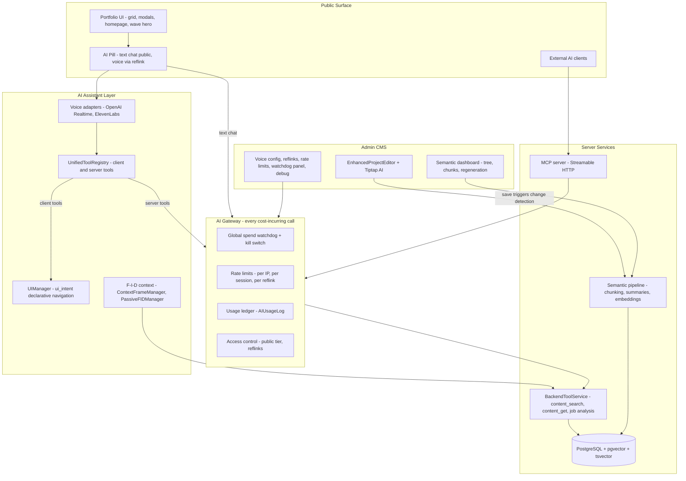

# Architecture Alignment Proposal

**Status:** Approved direction — master input for spec restructuring and code alignment
**Date:** 2026-07-02
**Scope:** This document proposes; it does not implement. Every change flows **proposal → spec → implementation**, in separate sessions. Nothing in here (including the MCP server) is to be built before its spec exists.

---

## How to use this document

This is the single source of truth for *direction*. Follow-up agent sessions will:

1. **Phase 1 (specs):** Rewrite the `.kiro/specs/` tree per Section 6, applying every entry in the Decision Registry (Section 3).
2. **Phases 0, 2–5 (code):** Execute the roadmap in Section 7, one phase per session, using the rewritten specs as context.

When a spec or piece of code contradicts this document, this document wins until the specs are regenerated; after that, the specs win.

---

## 1. Project identity and value proposition

**One sentence:** A portfolio website that *is itself* the flagship portfolio piece — a production Next.js application whose embedded AI assistant demonstrates, live, the owner's command of current AI engineering.

**What a visitor experiences:**

- A polished portfolio: project grid/list/timeline, rich Tiptap-rendered case studies with carousels, downloads, and interactive embeds; configurable homepage with a Three.js wave hero; light/dark themes.
- An AI portfolio guide (pill-shaped floating interface): **text chat for everyone** (rate-limited), **voice for invited guests** via reflinks. The agent answers questions grounded in portfolio content via RAG, and *drives the UI* — opening projects, scrolling, highlighting — through declarative navigation tools.
- For recruiters with a reflink: voice conversation (OpenAI Realtime or ElevenLabs, WebRTC), job-spec analysis against the owner's actual experience.
- For AI agents (Claude, ChatGPT, etc.): a public **MCP server** exposing portfolio search and project retrieval — the portfolio is queryable by the visitor's own AI tooling.

**What it showcases technically:**

| Capability | Implementation |
|---|---|
| Speech-to-speech agents | Dual-provider adapter layer: OpenAI Realtime (`@openai/agents`, WebRTC) + ElevenLabs Agents (`@elevenlabs/client`) behind one `IConversationalAgentAdapter` interface |
| Tool calling / agent-driven UI | Unified tool registry with `client`/`server` execution contexts; declarative `ui_intent` navigation via `UIManager` + semantic ID registry |
| RAG / context engineering | Heading-bounded hierarchical chunking (T0–T3) with contextual prefixes, pgvector + HNSW, hybrid retrieval, F-I-D (Frame–Index–Details) progressive context |
| Interoperability | Real MCP server (Streamable HTTP) exposing portfolio tools to external agents |
| Cost & abuse defense | Unified usage ledger, per-IP/session rate limits, bot challenge, global spend watchdog with kill switch |
| Full-stack product engineering | Admin CMS (Tiptap editor with AI assist, media pipeline with 5 storage providers, homepage composer), NextAuth, Prisma/PostgreSQL, SSR/SEO |

**Admin experience:** a complete CMS under `/admin` — project editor with AI-assisted writing, semantic content dashboard (chunk tree, regeneration, embedding health), voice provider configuration, reflink management, conversation replay/debug, rate-limit and spend controls.

---

## 2. Ground truth assessment

### 2.1 Repository state

- App repo: `portfolio-projects/` (Next.js 15.4.4, React 19.1, Prisma 6.x, Tailwind 4, Tiptap 3.0.9, `@openai/agents` 0.1.0, `@elevenlabs/client` 0.6.1).
- **`main` is a September 2025 snapshot.** The real head of development is **`feature/semantic-content-management-2`** — 137 commits ahead, a direct continuation of `main` (the only main-side commit it lacks is the PR #7 merge commit itself; a three-dot diff is empty). Now pushed to origin. Head commit `e2d75b4` ("WIP, no idea") sits on top of commits that fixed the late-stage semantic bugs ("all stages work properly now with vectors being properly embedded", HNSW reindexing).
- ~28 other branches exist; all substantive work relevant to the target architecture is contained in or superseded by the semantic branch. `develop` diverged before the semantic work and is stale.

### 2.2 What the branch adds over `main` (this is the target baseline)

- **Semantic/RAG system** (`src/lib/content/`, 27 services): `SmartContentGenerator` (T0–T3 tiers, heading-bounded chunking), `ContentIngestionService`, `StageBasedProcessingService` (resumable chunk→summarize→embed→validate pipeline), `VectorOperations` (raw SQL pgvector, `vector(1536)`, HNSW), `ContentSearchService` (cosine similarity × importance weighting, MMR diversification), `SummaryGenerationService`, budget/cost services, diagnostics/health monitoring.
- **Schema:** pgvector extension enabled; new models `ContextChunk`, `ContentEntity`, `SemanticBudget`, `SemanticOperation`, `ChunkingConfig`, `SummaryGenerationConfig`, `SummaryGenerationLog`, `BatchEmbeddingJob`, `ContentVersion`; `ProjectAIIndex` gains `embeddingVector` and chunk relations.
- **Tool architecture v2:** declarative `ui_intent` / `ui_describe` (via `src/lib/navigation/UIManager.ts` + `SemanticIDRegistry`) replace imperative `navigateTo`/`showProjectDetails`/etc.; semantic server tools `content_search`, `content_get`, `content_getHierarchy`, `content_searchSection`, `content_getRelated`; **entire legacy `src/lib/mcp/` deleted**.
- **F-I-D context:** `ContextFrameManager` (server) + `PassiveFIDManager` (client, cache + `/api/ai/context/fid`).
- **Admin semantic UI:** `/admin/semantic` dashboard, tree view, chunk editor, config, budget, bulk operations (~53 admin semantic API routes).

### 2.3 Reliability and completeness gaps (carried into the roadmap)

| Gap | Location |
|---|---|
| Rate-limit middleware built but **wired to zero routes** | `src/lib/middleware/rate-limiting.ts` (`withRateLimit` unused) |
| Budget deduction TODO — placeholder `estimatedCost: 0.001` | `src/app/api/ai/tools/execute/route.ts` |
| Mock endpoints: conversation transcripts/search/analytics, `context`, `analyze-job`, voice analytics | `src/app/api/ai/conversation/*`, `api/ai/context/route.ts`, `api/ai/analyze-job`, `api/admin/ai/voice-analytics` |
| Registered client tools with no handlers | `fillFormField`, `submitForm`, `animateElement` still registered on the branch (`reportUIState` already removed there in favor of `ui_describe`) |
| Duplicate conversational-agent providers (production vs admin) | `src/components/providers/conversational-agent-provider.tsx` vs `src/contexts/ConversationalAgentContext.tsx` |
| Orphaned tool: defined, never registered, no handler | `content_navigateTo` in branch `server-tools.ts` |
| `BackendToolService` stubs: hardcoded profile, mock file processing, unpersisted contact form / job analysis | `src/lib/ai/tools/BackendToolService.ts` |
| Hardcoded ElevenLabs fallback agent ID; `localhost:3000` fallbacks | `ElevenLabsAdapter.ts`, `voice-config.ts`, `BackendToolService.ts` |
| Public AI invisible without reflink (`publicAIAccess: 'disabled'`) | `src/lib/services/ai/public-access-manager.ts`, `ai-interface-wrapper.tsx` |
| `semantic-system-fixes` spec items (SSE lifetime, queue UI, persistence verification) — partially fixed by later branch commits, unverified | spec vs branch commits `2c4add4`, `146dc21` |
| No CI; ESLint bypassed in builds; `strict: false`; tests excluded from `tsc` | `next.config.ts`, `tsconfig.json`, missing `.github/workflows` |
| Hygiene: ~23 loose root scripts, ~36 root markdown logs, 29 `src/app/test-*` pages, stale `Architecture.md` | repo root, `src/app/` |

### 2.4 Spec drift summary

The nine spec folders describe three eras (original portfolio build → satellite extraction → AI/semantic era) without reconciliation:

- **Superseded but unmarked:** `ai-architecture-redesign` (executed, absorbed into `ai-system`); `semantic-system-fixes` (partially overtaken by branch commits); portfolio-projects requirements still mandating the Novel editor, draft/published status, mobile-first, `/api/ai/*` paths.
- **Never implemented, still specced:** rich-content `/api/content/*` API + versioning; ui-system `/api/homepage-settings`, `WaveConfiguration` table, `/api/ui/*` endpoints; media-management usage tracking / analytics endpoints.
- **Bookkeeping unreliable:** duplicate task numbers (three "9.21"s in portfolio-projects; five "task 8" groups in client-side-ai; two "Task 15"s in semantic-content-management), triplicate "Requirement 15", parents `[ ]` with all children `[x]`, parents `[X]` with all children `[ ]`, "Ready to Implement" READMEs atop 84%-checked task lists.
- **Naming drift:** `ui.intent` vs `ui.navigate` vs code's `ui_intent`; `content.search` vs code's `content_search`; three reflink-validation endpoint variants; `process-content`/`quick-action` (design) vs implemented `edit-content`/`process-prompt`; `PUBLIC_PROFILE` vs `PUBLIC_ACCESS`.

---

## 3. Canonical Decision Registry

Every entry resolves a documented conflict. **Rule: implemented-and-working beats specced-but-imaginary; where neither is built, the simpler design wins.** Spec rewrites must apply all of these; code alignment closes the remaining deltas.

### Platform & baseline

| # | Decision | Rationale / what it overrides |
|---|---|---|
| D1 | **`feature/semantic-content-management-2` is the implementation baseline.** Merge into `main` (Phase 0), then all work proceeds from `main`. | Direct continuation of main; contains the semantic system, tool architecture v2, MCP deletion. Overrides any spec statement describing `main`-era architecture as current. |
| D2 | **Stack pinned:** Next.js 15.x / React 19 / Prisma 6 / Tailwind 4 / Tiptap 3. No framework migrations in this effort. | Specs saying "Next.js 14 / React 18" are stale descriptions, not directives. |
| D3 | **API keys live in environment variables only.** No provider keys in the database. | `ai-architecture-redesign` (executed). Overrides client-side-ai design's `AIConfiguration` model containing `openaiApiKey`. |
| D4 | **No hardcoded model IDs in code.** Models come from a config-driven registry (DB-backed, admin-editable, populated/refreshable from provider APIs) with role aliases (`default-chat`, `default-cheap`, `default-realtime`, `default-embedding`). | 2024 names (`gpt-4o`, `claude-3-5-sonnet-20241022`, `gpt-3.5-turbo`, `gpt-4o-realtime-preview-2025-06-03`) fossilized in enums/serializers/UI. Existing `AIModelConfig` + `ClientAIModelManager` are the foundation; enums with dated model lists are removed. |
| D5 | **TypeScript `strict: true` and ESLint enforced in CI** (Phase 5; incremental strictness allowed via per-flag enablement). | `strict: false` + `eslint.ignoreDuringBuilds: true` undercut the showcase claim. |

### Content & CMS

| # | Decision | Rationale / what it overrides |
|---|---|---|
| D6 | **Tiptap 3 is the only editor.** Purge Novel from portfolio-projects Req 23 and design types (`NovelContent`, `NovelBlock`, `AINovelIntegration`). | Tiptap is implemented and live (`TiptapEditorWithAI`); Novel was abandoned. |
| D7 | **Project publication model: `visibility` (PUBLIC/PRIVATE) only.** Draft/published `status` is removed from UX and specs; the schema `status` column is deprecated and dropped in a Phase 3 migration. | Req 22.9 + implemented editor already did this; Req 17 + SQL schema lag. |
| D8 | **Single content-save path:** project content persists through the admin projects API (`/api/admin/projects/[id]`) writing `ArticleContent` (`jsonContent` = Tiptap JSON as source of truth, `content` string as derived/legacy). The rich-content spec's parallel `/api/content/[projectId]` API is **cancelled**. | The parallel API was never built; two owners for one save path caused spec confusion. |
| D9 | **Content versioning is descoped to backlog.** Neither the portfolio `/api/versions/*` design nor the rich-content versioning API ships in this effort. The branch's `ContentVersion` model may remain dormant. | Never implemented in either spec's flavor; not showcase-critical. |
| D10 | **`EnhancedProjectEditor` is the only project editor.** `project-editor.tsx`, `unified-project-editor.tsx`, `project-preview-editor.tsx` are deleted (Phase 3). | Only `EnhancedProjectEditor` is routed (`/admin/projects/editor/[[...id]]`). |
| D11 | **MediaItem: the Prisma model in code is canonical.** The media-management spec's provider-rich TS shape (`storageProvider`, `optimizedUrls`, `usageCount`) is a spec-only aspiration — trimmed to match code; usage-tracking endpoints move to backlog. | Code shape is live across the app. |
| D12 | **Homepage/wave config:** canonical = `HomepageConfig` model with `waveConfig` JSON + `/api/admin/homepage/config` and `/api/admin/homepage/wave-config`. ui-system's `/api/homepage-settings`, standalone `WaveConfiguration` table, and `/api/wave-config` CRUD are **cancelled**. | Matches implementation. |
| D13 | **ui-system's `/api/ui/themes`, `/api/ui/themes/switch`, `/api/ui/animate` endpoints are cancelled.** Theme and animation are client-side concerns (`src/lib/ui/theme.tsx`, GSAP utilities); no server API. | Never built; server-driven animation API is over-engineering. |

### UI & design system

| # | Decision | Rationale |
|---|---|---|
| D14 | **Desktop-first responsive design** (ui-system position). Portfolio-projects design's "mobile-first" wording is corrected. | ui-system owns the visual layer; matches implementation. |
| D15 | **GSAP is the animation orchestrator** (coordinated transitions, theme changes, AI-driven navigation); Framer Motion permitted for isolated component animation; Three.js for the wave hero. | Matches implementation. |
| D16 | **The 29 `src/app/test-*` pages are removed or gated behind a dev-only flag** (Phase 3). One consolidated `/admin/ai/voice-test` style playground per subsystem may remain, admin-gated. | Public test routes on a production portfolio look unprofessional and expand attack surface. |

### AI assistant & tools

| # | Decision | Rationale / what it overrides |
|---|---|---|
| D17 | **Tool names use underscore convention, exactly as in branch code:** `ui_intent`, `ui_describe`, `content_search`, `content_get`, `content_getHierarchy`, `content_searchSection`, `content_getRelated`. Specs saying `ui.intent`, `ui.navigate`, `content.search` are updated. | Code wins; dots conflict with some provider tool-name validators anyway. |
| D18 | **Declarative navigation (`ui_intent` via `UIManager`) is the only agent-facing navigation surface.** Imperative tools (`navigateTo`, `showProjectDetails`, `reportUIState`, `ui_navigate`, `openProject`) are already removed on the branch; `scrollIntoView`/`highlightText`/etc. remain as marked internal/recovery tools. Still-registered handler-less tools (`fillFormField`, `submitForm`, `animateElement`) are **unregistered** (form tools move to backlog until a real use case ships). | Branch already did most of this; registry must never advertise tools that can't execute. |
| D19 | **The orphaned `content_navigateTo` definition is deleted.** Navigation-from-search is expressed via `content_search` results carrying `navTarget` + the agent calling `ui_intent`. | Defined but never registered or handled. |
| D20 | **Legacy internal "MCP" stays deleted** (branch state). The name MCP is reserved exclusively for the real external MCP server (D30). | The internal library pointed at a nonexistent `/api/ai/mcp` route and duplicated tool names. |
| D21 | **One conversational-agent provider:** `src/components/providers/conversational-agent-provider.tsx`. The admin/debug `src/contexts/ConversationalAgentContext.tsx` + `src/hooks/useConversationalAgent.ts` re-export are removed; admin debug UIs consume the production provider (Phase 3). | Two state machines for the same adapters is drift waiting to happen. |
| D22 | **Both voice providers stay** (OpenAI Realtime primary, ElevenLabs secondary), WebRTC transport, ephemeral tokens; provider + model chosen via `VoiceProviderConfig` in DB, never hardcoded (removes the hardcoded ElevenLabs agent ID fallback). | The adapter abstraction is a showcase asset. |
| D23 | **Canonical admin content-AI endpoints are the implemented ones:** `edit-content`, `improve-content`, `process-prompt`, `suggest-tags` under `/api/admin/ai/`. Design names `process-content`/`quick-action` are dropped. | Code wins. |
| D24 | **Canonical reflink validation endpoint: `POST /api/ai/reflink/validate`.** Variants (`/api/public/reflink/validate`, `/api/reflinks/validate/[code]`, `/api/ai/reflinks/validate`) are dropped from specs. | Code wins. |
| D25 | **F-I-D token budgets: Frame ≤ 400, Index ≤ 600, Details ≤ 1000.** | Settles requirements-vs-tasks drift on the Index budget. |
| D26 | **Telemetry: one DB-backed path** (`AIConversation`/`AIConversationMessage` + debug event emitter feeding `/admin/ai/debug` and conversation replay). All mock endpoints (transcripts, search, analytics, voice-analytics) are deleted, not finished. | The homegrown debug panel is a feature; the mocks are liabilities. |

### Semantic content / RAG

| # | Decision | Rationale |
|---|---|---|
| D27 | **Tier model: T0–T3.** All remaining T0–T4 references (ai-system design, client-side-ai) are corrected. | Settled by semantic-content-management spec + branch implementation. |
| D28 | **Chunking defaults (canonical):** `targetChunkSize: 300`, `maxSectionSize: 500`, `minSectionSize: 50`, `sectionBoundaryOverlap: 25`, `splitStrategy: 'paragraph'`, `respectHeadingBoundaries: true`, T1 summary ≤ 200 / T2 ≤ 150 tokens. README's `chunkOverlap: 50` is a typo. Defaults live in `ChunkingConfig` (DB) — code values are authoritative where they differ. | Settles design/README drift. |
| D29 | **Embedding default: `text-embedding-3-small` (1536 dims), configurable via `ChunkingConfig`.** Roadmap item: **hybrid retrieval** — fuse pgvector similarity with the existing tsvector full-text index (reciprocal-rank fusion or weighted union) rather than letting the keyword path rot. Change-detection thresholds: the values in `ChangeDetectionConfigService` (code) are canonical; the three conflicting spec versions are replaced by them. | Model is fine for this scale and stays swappable per D4; hybrid is 2026 baseline practice. |

### Access, cost & interoperability

| # | Decision | Rationale |
|---|---|---|
| D30 | **A real MCP server ships as a showcase feature** — Streamable HTTP endpoint (e.g. `/api/mcp`), exposing read-only tools `search_portfolio`, `get_project`, `list_projects` backed by `ContentSearchService`/`BackendToolService`, with its own rate-limit bucket and inclusion in the usage ledger. Gets its own spec before any code. | MCP is the 2026 interop standard; "your AI can ask my portfolio directly" is a headline demo. |
| D31 | **Public access tiers:** anonymous visitors get **text chat** (rate-limited, bot-challenged, watchdog-protected); **voice and job analysis require a reflink**. The AI pill is visible to everyone (replacing today's hidden-without-reflink behavior); `publicAIAccess` default changes from `'disabled'` to the text-chat tier (today's `'basic_only'` — rename/clarify in the access-and-cost spec) and moves from JSON config to DB-backed `AIPublicAccessSettings`. The `PUBLIC_PROFILE` vs `PUBLIC_ACCESS` constant question dissolves — public access is a first-class tier, not a magic reflink. | Locked with owner. Full design in Section 4.2. |
| D32 | **One usage ledger.** `AIUsageLog` becomes the single cost record for *all* AI spend (voice, chat, tools, embeddings, summaries). `SemanticBudget`/`SemanticOperation` remain as the semantic pipeline's *pre-flight budget gate* but write their actuals into the ledger. Reflink `spendUsed` and the global watchdog both read from the ledger. Budget-estimation ceremony (modals, projections) is simplified; Batch API embedding stays only if already working (costs at this scale don't justify new complexity). | Two disconnected cost systems can't feed one watchdog. |
| D33 | **Rate limiting is enforced through a single AI gateway** applied to every cost-incurring route (Section 4.2). The existing unwired `withRateLimit` is either wired or replaced by the gateway — no route ships unguarded. | Enforcement, not library code, is the requirement. |

### Specs & process

| # | Decision | Rationale |
|---|---|---|
| D34 | **Specs stay modular per domain** (no mega-spec — agent context budget), plus a small `00-overview` spec: system map, this Decision Registry (migrated), and a spec index with honest status. Superseded specs move to `.kiro/specs/_archive/`. | Locked with owner; matches 2026 spec-driven-development practice. |
| D35 | **`Architecture.md` in the repo is regenerated in Phase 1** from the new specs and kept current thereafter (it currently describes the "Iteration 2" era of 2025). | Standing user rule; it's the always-loaded context file for future agent sessions. |
| D36 | **Task ledgers must be tree-consistent:** a parent may be `[x]` only if all children are; duplicate task/requirement numbers are forbidden; each rewritten spec gets its numbering regenerated from scratch. | The current ledgers are unusable as status signals. |

---

## 4. Target architecture

### 4.1 Domain map



Nine domains, each owned by exactly one spec (Section 6): portfolio core, media, rich content, UI system, AI assistant (visitor), AI admin (content editing), semantic content/RAG, access control & cost defense, MCP server.

### 4.2 Public text chat and cost defense (new design — detailed)

The current codebase's biggest structural weakness is that access control exists as *libraries* while routes are unguarded. The fix is a chokepoint.

**AI Gateway (`src/lib/ai/gateway.ts`)** — a single wrapper every cost-incurring route passes through (`/api/ai/chat`, `/api/ai/openai/session`, `/api/ai/elevenlabs/token`, `/api/ai/tools/execute`, `/api/ai/analyze-job`, MCP tool calls, semantic regeneration jobs). Order of checks:

1. **Kill switch** — read `AIGlobalLimits` (one row, cached ~30s in-memory). If `status = 'tripped'` or `publicAIEnabled = false`: reject public requests with a friendly "assistant is resting" message; reflink requests configurable (admin chooses whether the trip also disables reflink traffic).
2. **Access tier resolution** — reflink token → validated reflink session; otherwise public tier from `AIPublicAccessSettings` (default: `text-only`). Public tier gets a **strict tool allowlist**: `content_search`, `content_get`, `ui_intent`, `ui_describe` only — never file upload, form, or job-spec tools.
3. **Session validation (public)** — public chat requires a **signed session token** (HttpOnly cookie, short-lived JWT) issued by `POST /api/ai/chat/session`. Issuance is where the bot challenge lives: **Cloudflare Turnstile** verification (admin-toggleable), plus per-IP session-creation caps. No token → no chat, so scripted hits to the chat endpoint fail cheaply before any model call.
4. **Rate limits** — sliding windows keyed on **hashed IP + session ID** (IPs stored hashed for privacy), backed by the existing `AIRateLimit` tables. Configurable dimensions: messages/minute, messages/day, tokens/day per IP; concurrent-session cap per IP. Reflink traffic additionally checks per-reflink token/spend budgets (closing the existing budget-deduction TODO).
5. **Execute + meter** — run the model call; write actual usage (tokens, computed cost, provider, feature, session, reflink) to the **usage ledger** (`AIUsageLog`); increment watchdog counters atomically.

**Global watchdog** — `AIGlobalLimits` (new model): `dailySpendCapUsd`, `monthlySpendCapUsd`, `currentDaySpendUsd`, `currentMonthSpendUsd`, `status: active | tripped`, `trippedAt`, `tripReason`, `publicAIEnabled`, `disableReflinksOnTrip`. Counters updated on every ledger write; caps checked *before* each call (step 1) and *after* each write (so a burst that crosses the cap trips the switch within one request). On trip: public AI disabled globally, admin notified via the existing security-notifier channel, and **re-enable is manual only** — a button in the admin panel; the daily counter reset does *not* auto-clear a trip. **Fail closed:** if the ledger or limits row is unreadable, public requests are rejected.

**Anti-circumvention posture** (accepting that a determined adversary with unlimited IPs can only be *bounded*, not stopped — which is exactly what the watchdog is for):

- All enforcement server-side; client state is advisory only.
- Turnstile (or equivalent) gates session issuance; session tokens are bound to the issuing IP hash.
- Voice never available publicly — the expensive modality stays invitation-only, and reflink voice sessions get server-enforced duration caps at token issuance.
- MCP server and chat share the same gateway and ledger, so the watchdog covers every entry point.

**Admin surface** — extend `/admin/ai/rate-limiting` into an **Access & Spend** panel: public chat on/off, per-IP/session limit knobs, Turnstile toggle, daily/monthly caps, live spend-vs-cap gauges (from the ledger), trip history, and the re-enable button. Reflink budgets remain on `/admin/ai/reflinks`.

### 4.3 MCP server (new design — summary; full spec in Phase 1)

- Endpoint: `POST /api/mcp` implementing MCP **Streamable HTTP** transport; stateless per-request handling to fit Vercel serverless.
- Tools (read-only v1): `search_portfolio(query, limit)` → `ContentSearchService` hybrid search; `get_project(slug)` → public project payload; `list_projects(tag?, sort?)` → public listing. Only PUBLIC-visibility content is reachable.
- Auth: anonymous allowed (it's a public showcase) but routed through the AI Gateway with its own rate bucket and ledger feature tag `mcp`; optional bearer keys later if abuse warrants.
- Discoverability: documented on the site's About/AI page ("point your agent at this URL").

### 4.4 What is explicitly *not* in the target

Cancelled or backlogged (from the registry): rich-content `/api/content/*` + versioning UI (D8/D9), ui-system server APIs (D13), media usage-tracking endpoints (D11), form-filling client tools (D18), real-time collaboration (rich-content Req 9–10), Redis (in-memory caches suffice at this scale), separate `/api/public/ai/chat`-era endpoints superseded by the gateway design.

---

## 5. 2026 modernization commentary (review of 2025-era decisions)

Recorded so spec rewrites inherit the reasoning, not just the conclusions.

**Validated — keep as-is:**

- **Unified tool registry with `client`/`server` execution contexts.** Both OpenAI and ElevenLabs converged on exactly this split; the abstraction was ahead of its time.
- **F-I-D + `content_search` as a tool.** The industry's 2025 lesson was that *agentic retrieval* (small frame + search tools, details on demand) beats stuffing pre-assembled context. F-I-D is that pattern under another name. Keep; simplify budgets per D25.
- **Heading-bounded chunking with contextual prefixes** (`Project: {title} | Section: …` before embedding) — later branded "contextual retrieval" industry-wide; structure-aware chunking remains best practice.
- **pgvector + HNSW in the app database.** Dedicated vector stores are for orders of magnitude more vectors; at portfolio scale this is the recommended architecture, and owning the SQL is itself a showcase point.
- **Ephemeral tokens + client-direct WebRTC** for voice — still the canonical serverless pattern.
- **Dual-provider adapter layer** — provider churn accelerated; the hedge and the demonstrated abstraction both aged well.
- **Modular spec-driven development** — the 2023–24 Kiro-style approach became mainstream practice (constitution files, per-domain specs sized to agent context windows). The missing piece was a canonical overview + decision registry, which this effort adds.

**Update — the world moved:**

- **Model naming.** Everything hardcoded in 2024/25 (`gpt-4o`, `claude-3-5-sonnet-20241022`, realtime preview builds) is generations old. The durable answer is D4's registry-with-aliases — the code should never know a model's name.
- **MCP.** When the internal "MCP" code was written, the protocol was weeks old. It has since become the cross-vendor standard, its transport moved from SSE to Streamable HTTP, and remote servers are the norm. The internal misnomer is gone (branch); the real server (D30) is now one of the highest-value features per line of code in this plan.
- **Hybrid retrieval.** Pure-vector search lost to vector+keyword fusion in practice; the project already owns both halves (pgvector + tsvector), so D29's fusion is cheap.
- **Public LLM endpoint hygiene became table stakes:** bot challenge before session issuance, strict tool allowlists for anonymous tiers, prompt-injection hardening of system prompts, and spend kill switches. Section 4.2 is the 2026-standard shape of this.
- **Cheap model tiers for public traffic.** Providers now ship mini/cheap tiers for both chat and realtime; the public text tier should default to the `default-cheap` alias.

**Invert the investment:**

- The **semantic budget bureaucracy** (estimation modals, projection services, Batch API ceremony) was designed against 2024 cost anxieties. Reality: embedding the whole portfolio costs ~a tenth of a cent; full regeneration with summaries is pennies. Meanwhile the *actual* cost risks — voice minutes and public chat abuse — had unwired enforcement. This proposal deliberately shrinks the former and spends the effort on the gateway/watchdog.
- The **bespoke analytics mocks** predate the consolidation around OpenTelemetry GenAI conventions and dedicated LLM-observability tools. For a portfolio, the homegrown debug panel and conversation replay are *features* (they demonstrate skill) — so keep one real DB-backed telemetry path and delete the mocks, rather than building a second observability product.

**Simplify:**

- One conversational-agent provider (D21), one editor (D10), one save path (D8), one telemetry path (D26).
- `strict: false` and ESLint bypass matter more to the "portfolio-worthy engineering" story than any single feature; they are cheap to fix and visible to anyone who reads the repo.

---

## 6. Spec restructure plan

### 6.1 Target spec tree

```
.kiro/specs/
├── 00-overview/            # NEW: system map, decision registry, spec index w/ status
├── portfolio-core/         # from portfolio-projects: pages, project APIs, homepage, SSR, analytics, auth
├── admin-cms/              # split from portfolio-projects: admin shell, project editor, homepage composer
├── media/                  # from media-management-system, trimmed to implemented reality (D11)
├── rich-content/           # from rich-content-system: Tiptap editor + extensions + display (D8/D9 applied)
├── ui-system/              # theme, GSAP animation, wave, layout constants (D12–D16 applied)
├── ai-assistant/           # from client-side-ai: voice adapters, pill UI, tools, F-I-D, navigation
├── ai-admin/               # from ai-system: content-editing AI, model registry (D4), provider status
├── semantic-content/       # from semantic-content-management + open semantic-system-fixes items
├── access-and-cost/        # NEW: gateway, public chat, rate limits, reflinks, watchdog (Section 4.2)
├── mcp-server/             # NEW: Section 4.3 expanded into requirements/design/tasks
└── _archive/               # ai-architecture-redesign, semantic-system-fixes, old client-side-ai monolith,
                            # analysis docs (oai_doc.md, ELEVENLABS_CLIENT_MIGRATION.md, etc.), old README
```

### 6.2 Rules for the rewrite (Phase 1 session contract)

1. Each spec keeps the `requirements.md` / `design.md` / `tasks.md` shape and must stand alone within an agent context window (~soft cap 50KB per file; split domains rather than exceed it). The 263KB client-side-ai design is decomposed, not migrated.
2. Every spec starts with: status line, owned domain, "consumes/provides" contract tables (keep the existing convention — it worked), and a pointer to `00-overview`.
3. Task ledgers are regenerated from **code truth** (post-merge), not copied: completed work is recorded in a short "already implemented" section; only genuinely open work becomes tasks. D36 numbering rules apply.
4. Apply every registry decision; where a spec sentence conflicts with the registry, rewrite it — do not preserve both with a note.
5. `semantic-system-fixes` open items (SSE lifetime verification, queue UI, persistence verification, T3 title rule) are folded into `semantic-content/tasks.md` as verification tasks, then the folder is archived.
6. Regenerate `portfolio-projects/Architecture.md` (D35) as a compact generated-from-specs overview.
7. The nested git repos inside `.kiro/specs/` (`.kiro/specs/.git`, `.kiro/specs/portfolio-projects/.git`) are removed after confirming the workspace history isn't needed — specs version with the main repo going forward.

---

## 7. Code alignment roadmap

Each phase is sized for one focused agent session and ends in a verifiable state. Phase 1 is the spec rewrite (Section 6); it runs after Phase 0 so task ledgers can be written against merged code truth.

### Phase 0 — Merge & stabilize (the branch becomes main)

| # | Task | Acceptance criteria |
|---|---|---|
| 0.1 | Merge `feature/semantic-content-management-2` → `main` (fast-forward-like merge; the branch is a direct continuation) | Merge commit on `main`, pushed; no lost files vs branch tree |
| 0.2 | Database: enable pgvector in the target environment, run branch migrations, run HNSW index scripts (`scripts/create-vector-indexes*.ts`) | `\dx` shows `vector`; migrations applied cleanly; HNSW indexes present on `context_chunks` |
| 0.3 | Stale-import sweep: nothing imports deleted MCP files, removed hooks (`useNavigationTools`, `hooks/useConversationalAgent`), or removed tools | `npm run type-check` and `npm run build` pass |
| 0.4 | Regenerate Prisma client (preview features `postgresqlExtensions`, `typedSql`); reseed/verify dev data | `prisma generate` + app boot clean |
| 0.5 | End-to-end semantic verification (this also closes semantic-system-fixes claims): ingest one project through all four stages | T0–T3 chunks persisted with embeddings and valid `projectIndexId`; SSE progress survives a 10-min operation; queue panel reflects the run; chunks still present after completion |
| 0.6 | Smoke-test voice + text agent on merged code (OpenAI + ElevenLabs), `ui_intent` navigation, `content_search` grounding | A conversation can open a project modal and answer from chunk content |

### Phase 1 — Spec rewrite (Section 6)

| # | Task | Acceptance criteria |
|---|---|---|
| 1.1 | Create `00-overview` (system map, migrated Decision Registry, spec index) | Registry entries D1–D36 present with status |
| 1.2 | Rewrite the 10 domain specs per Section 6.2 | Every file ≤ ~50KB; no duplicate numbering; ledgers match code truth |
| 1.3 | Archive superseded specs and analysis docs to `_archive/`; remove nested spec git repos | `.kiro/specs/` contains only the new tree + archive |
| 1.4 | Regenerate `Architecture.md` | Describes post-merge reality; links to specs |

### Phase 2 — Access control & public chat (Section 4.2)

| # | Task | Acceptance criteria |
|---|---|---|
| 2.1 | Schema: `AIGlobalLimits`, `AIPublicAccessSettings` persistence, ledger fields on `AIUsageLog` (feature tag, hashed IP, session ID) | Migration applied; models in schema |
| 2.2 | Implement AI Gateway; wire it onto **every** cost-incurring route (chat, both token routes, tools/execute, analyze-job, semantic regeneration) | Grep proves no unguarded route; unit tests for check order incl. fail-closed |
| 2.3 | Public text chat: `POST /api/ai/chat/session` (Turnstile-gated token issuance) + server-side chat endpoint using `default-cheap` alias, public tool allowlist | Anonymous user can chat; scripted call without session token is rejected before any model call |
| 2.4 | Watchdog: counters, trip logic, admin notification, manual re-enable | Simulated spend past cap trips switch; public AI off; button re-enables |
| 2.5 | Admin Access & Spend panel (extend `/admin/ai/rate-limiting`) | All knobs in Section 4.2 configurable; live gauges render from ledger |
| 2.6 | Close budget TODOs: real per-call cost computation into ledger; reflink `spendUsed` deducted from ledger writes; `SemanticBudget` actuals mirrored to ledger | `estimatedCost: 0.001` placeholder gone; reflink budget status reflects real usage |
| 2.7 | Make AI pill visible to anonymous visitors in text mode; voice affordance shown only with reflink | Public homepage shows working text assistant |

### Phase 3 — Consolidation & hygiene

| # | Task | Acceptance criteria |
|---|---|---|
| 3.1 | Single conversational-agent provider (D21); migrate admin debug components | `contexts/ConversationalAgentContext.tsx` deleted; debug pages functional |
| 3.2 | Tool registry cleanup (D18/D19): unregister handler-less tools, delete `content_navigateTo`, align spec tool tables | Registry lists only executable tools; agent smoke test passes |
| 3.3 | Delete mock endpoints (D26) and dead code (legacy editors D10, `useRealtimeSession`, `page.new.tsx`, `openai/token` duplicate route) | No route returns fabricated data; build passes |
| 3.4 | Model registry (D4): remove hardcoded model enums/IDs incl. ElevenLabs agent ID; admin-manageable lists + aliases | Grep finds no model IDs outside seed/config; voice + chat + embeddings resolve via aliases |
| 3.5 | Repo hygiene: move ~23 root scripts → `scripts/manual/` (or delete), ~36 root markdown logs → `docs/history/`, remove/gate 29 `test-*` pages (D16), drop `status` column (D7), update `.gitignore` | Repo root contains only config + README + Architecture.md; public route table has no test pages |
| 3.6 | Hybrid retrieval (D29): fuse pgvector + tsvector in `ContentSearchService` | Measurable: keyword-exact queries (project names, tech terms) rank correctly in `content_search` |

### Phase 4 — MCP server & showcase polish

| # | Task | Acceptance criteria |
|---|---|---|
| 4.1 | Implement `mcp-server` spec: Streamable HTTP endpoint, 3 read-only tools, gateway integration | Claude/another MCP client can connect and search the portfolio; calls appear in ledger with `mcp` tag |
| 4.2 | Showcase storytelling: About/AI page explaining the architecture (with the MCP URL), README refresh | Visitor-facing explanation exists and matches reality |
| 4.3 | Job-analysis productization for reflink users (persist `AIJobAnalysis`, admin review view) — closes BackendToolService TODO | Reflink user analysis stored and visible in admin |

### Phase 5 — CI & quality

| # | Task | Acceptance criteria |
|---|---|---|
| 5.1 | GitHub Actions: typecheck, lint, test, build on PR; ESLint no longer bypassed in `next.config.ts` | Red CI blocks merge; `ignoreDuringBuilds` removed |
| 5.2 | TypeScript strictness ramp (enable flags incrementally, fix fallout) | `strict: true` compiles |
| 5.3 | Test triage: keep/repair the 72 Jest suites, include tests in `tsc`, add gateway/watchdog coverage | `npm test` green in CI |
| 5.4 | Deployment/environment guide (closes ai-architecture-redesign task 19, the last open item there) | Documented env matrix incl. pgvector, Turnstile, provider keys |

**Dependencies:** 0 → 1 → 2 → 3 → 4 → 5 in order; 3 and 4 can swap if desired; 5.4 can happen any time after 2.

---

## Appendix: source material

This proposal synthesizes five research passes over (a) all nine `.kiro/specs/` folders read in full, and (b) code ground truth on both `main` and `feature/semantic-content-management-2` (via git). Detailed inconsistency catalogs (duplicate task numbers, endpoint variants, checkbox contradictions) live in those reports and are resolved here by registry entries D1–D36; the Phase 1 spec rewrite should treat the registry as exhaustive for *decisions* but re-verify file-level details against post-merge code.
