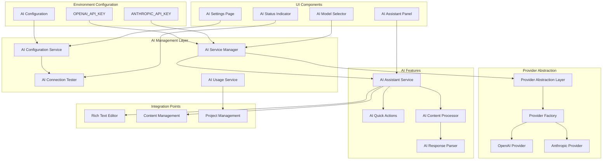
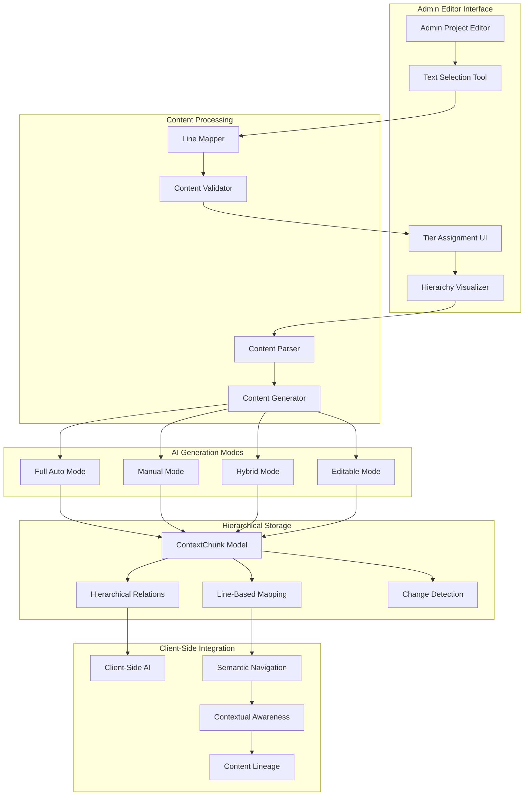

# AI System - Design Document

## Overview

The AI System provides a comprehensive artificial intelligence platform for content creation, editing, and enhancement within the portfolio system. Built on a provider-agnostic architecture, it supports multiple AI providers (OpenAI, Anthropic) through a unified interface while maintaining security, performance, and cost-effectiveness. The system emphasizes user intent preservation, structured content processing, and seamless integration with rich text editing capabilities.

## Architecture

### System Architecture



## Hierarchical Content Management System

### Admin-Side Content Organization Architecture

The AI System provides comprehensive admin-side content management capabilities that integrate with the client-side-ai spec's hierarchical content system. This enables both manual and AI-assisted organization of project content into semantic tiers with proper relationships.

**Content Management Workflow:**


**Content Tier Structure and Relationships:**
```typescript
interface HierarchicalContentTier {
  // Basic tier information
  tier: 0 | 1 | 2 | 3 | 4;
  chunkId: string;
  title?: string;
  content: string;
  tokenCount: number;
  
  // Hierarchical relationships
  parentChunkId?: string;           // Points to parent chunk
  rootChunkId?: string;             // Points to T0/T1 root
  sectionGroup?: string;            // Groups related chunks (e.g., "architecture", "performance")
  derivationPath?: string;          // e.g., "T0→T1→T2.1→T3.5"
  
  // Line-based content mapping for admin editor
  startLine?: number;               // Starting line number in source article
  endLine?: number;                 // Ending line number in source article
  sourceHash?: string;              // Hash of source content for change detection
  
  // Generation metadata
  generationMode: 'auto' | 'manual' | 'hybrid' | 'user-defined';
  lastModified: Date;
  modifiedBy: 'user' | 'ai' | 'system';
}
```

**Content Generation Modes:**

1. **Full Auto Mode**: AI analyzes entire article and generates complete hierarchy
   - Automatic section detection and boundary identification
   - AI-generated summaries for all tier levels
   - Optimal parent-child relationship assignment
   - Batch processing with progress tracking

2. **Manual Mode**: User manually selects text and assigns tiers
   - Line-based text selection with visual feedback
   - Manual tier assignment with hierarchy validation
   - User-written summaries and titles
   - Drag-and-drop hierarchy reorganization

3. **Hybrid Mode**: User defines structure, AI generates content
   - User selects text boundaries and tier assignments
   - AI generates summaries and titles for selected sections
   - Automatic relationship inference based on user selections
   - AI-assisted content refinement and optimization

4. **Editable Mode**: All generated content remains user-editable
   - Post-generation editing of all AI-created content
   - Manual override of AI-suggested relationships
   - Incremental regeneration of specific tiers
   - Version control and rollback capabilities

**Admin Editor Integration Features:**

```typescript
interface AdminContentManagementFeatures {
  // Text selection and validation
  textSelection: {
    lineBasedSelection: boolean;        // Only allow line-boundary selections
    nonOverlappingValidation: boolean;  // Prevent overlapping tier assignments
    visualFeedback: boolean;            // Highlight selected text and conflicts
    selectionPersistence: boolean;      // Remember selections across sessions
  };
  
  // Tier assignment and hierarchy
  tierAssignment: {
    dragDropReorganization: boolean;    // Drag-and-drop tier restructuring
    hierarchyVisualization: boolean;    // Tree view of content relationships
    conflictResolution: boolean;        // Handle overlapping or invalid assignments
    bulkOperations: boolean;            // Batch tier assignment and modification
  };
  
  // AI-assisted generation
  aiGeneration: {
    progressTracking: boolean;          // Real-time generation progress
    costEstimation: boolean;            // Token usage and cost prediction
    batchProcessing: boolean;           // Process multiple sections simultaneously
    qualityValidation: boolean;         // Validate generated content quality
  };
  
  // Content management
  contentManagement: {
    changeDetection: boolean;           // Detect article changes requiring regeneration
    versionControl: boolean;            // Track changes and enable rollback
    exportImport: boolean;              // Export/import tier assignments
    previewMode: boolean;               // Preview hierarchical content structure
  };
}
```

### Integration with Client-Side AI System

The admin-side content management system provides the foundation for the client-side-ai spec's hierarchical content consumption:

**Data Flow Integration:**
```typescript
interface AdminToClientIntegration {
  // Content hierarchy provision
  hierarchicalContent: {
    purpose: "Provide structured content with relationships for client-side AI navigation";
    dataStructure: "ContextChunk with parentChunkId, rootChunkId, sectionGroup, derivationPath";
    updateTriggers: "Automatic regeneration on article changes, manual tier updates";
    lineMapping: "startLine/endLine for precise scrolling and navigation";
  };
  
  // Semantic navigation support
  navigationSupport: {
    purpose: "Enable client-side AI to navigate to specific content sections";
    implementation: "Line-number based scrolling, section group identification";
    contextAwareness: "Understanding of content relationships and hierarchy";
    progressiveDisclosure: "Appropriate tier level based on user intent";
  };
  
  // Content relationship understanding
  relationshipMapping: {
    purpose: "Enable AI to understand how content pieces relate to each other";
    parentChildRelations: "T1 summaries → T2 key points → T3 details → T4 full content";
    sectionGrouping: "Related chunks grouped by topic (architecture, performance, etc.)";
    contentLineage: "Trace content from detailed chunks back to high-level summaries";
  };
}
```

## External API Dependencies

### Required from Client-Side AI System

```typescript
interface RequiredClientSideAIAPIs {
  // Hierarchical content storage
  contentHierarchy: {
    provider: "client-side-ai";
    version: "1.0.0";
    purpose: "Store and retrieve hierarchical content with relationships";
    interface: "ContentSearchService, VectorOperations";
    usage: "Admin system needs to read/write hierarchical content structure";
  };
  
  // Vector index management
  vectorIndexing: {
    provider: "client-side-ai";
    version: "1.0.0";
    purpose: "Maintain vector indexes for semantic search during content updates";
    interface: "IndexMaintenanceService";
    usage: "Admin content changes trigger vector index updates";
  };
  
  // Content search capabilities
  contentSearch: {
    provider: "client-side-ai";
    version: "1.0.0";
    purpose: "Search and retrieve content for admin editing and validation";
    interface: "ContentSearchService";
    usage: "Admin needs to search existing content for relationship validation";
  };
}
```

### Required from Rich Content System

```typescript
interface RequiredRichContentAPIs {
  // Text selection and editing
  textSelection: {
    provider: "rich-content-system";
    version: "1.0.0";
    purpose: "Get and set text selections for targeted AI editing and tier assignment";
    interface: "TextSelectionManager";
    usage: "AI assistant and admin editor need to work with user text selections";
  };
  
  // Content structure access
  contentStructure: {
    provider: "rich-content-system";
    version: "1.0.0";
    purpose: "Access Tiptap JSON content structure for AI processing and line mapping";
    interface: "TiptapEditorWithAI";
    usage: "AI needs to understand and modify rich text content with line precision";
  };
  
  // Content change application
  contentUpdates: {
    provider: "rich-content-system";
    version: "1.0.0";
    purpose: "Apply AI-generated content changes to editor";
    interface: "ContentUpdateManager";
    usage: "AI responses need to be applied to editor content";
  };
}
```

### Required from Portfolio-Projects System

```typescript
interface RequiredPortfolioAPIs {
  "GET /api/projects/[id]": {
    provider: "portfolio-projects";
    version: "1.0.0";
    purpose: "Get project data for AI content processing";
    requiredFields: ["id", "title", "content", "tags", "mediaItems"];
    usage: "AI needs full project context for content editing and suggestions";
  };
  
  "PUT /api/projects/[id]": {
    provider: "portfolio-projects";
    version: "1.0.0";
    purpose: "Update project content after AI processing";
    requestBody: "Partial<Project>";
    usage: "Save AI-enhanced content back to project";
  };
  
  auth: {
    provider: "portfolio-projects";
    version: "1.0.0";
    purpose: "Admin authentication for AI features";
    implementation: "NextAuth session validation";
    usage: "Protect AI endpoints and ensure only admin can use AI features";
  };
}
```

### Required from Data & API Layer

```typescript
interface RequiredDataAPIs {
  
  // Authentication
  auth: {
    provider: "data-api-layer";
    version: "1.0.0";
    purpose: "Verify user permissions for AI operations";
    implementation: "NextAuth session validation middleware";
    usage: "Applied to all AI endpoints for security";
  };
  
  // User preferences
  "GET /api/user/preferences": {
    provider: "data-api-layer";
    version: "1.0.0";
    purpose: "Get user AI preferences and settings";
    requiredFields: ["aiSettings", "defaultModel", "systemPrompt"];
    usage: "Personalize AI behavior per user";
  };
}
```

### Required from UI System

```typescript
interface RequiredUISystemAPIs {
  // Base components
  components: {
    Button: "Consistent button styling for AI actions";
    Card: "Container component for AI settings and panels";
    Input: "Form inputs for AI configuration";
    Select: "Dropdown components for model selection";
    Badge: "Status indicators for AI connection state";
    Progress: "Progress indicators for AI operations";
    Alert: "Error and warning messages for AI issues";
    Modal: "Modal components for AI dialogs and confirmations";
    Tooltip: "Tooltips for AI feature explanations";
  };
  
  // Design tokens
  designSystem: {
    colors: "Color palette for AI UI components";
    spacing: "Consistent spacing values";
    typography: "Text styles for AI content";
    animations: "Transition animations for AI interactions";
    shadows: "Drop shadows for AI panels";
    borderRadius: "Consistent border radius values";
  };
  
  // Layout patterns
  patterns: {
    panelLayout: "Side panel structure for AI assistant";
    settingsLayout: "Settings page patterns";
    modalLayout: "Modal patterns for AI dialogs";
    formLayout: "Form patterns for AI configuration";
    gridLayout: "Grid layouts for AI analytics";
  };
  
  // Theme integration
  theme: {
    currentTheme: "Current theme (light/dark) for AI components";
    themeToggle: "Theme switching functionality";
    themeVariables: "CSS variables for theme-aware styling";
  };
}
```

## Provided APIs

### AI Management APIs

```typescript
interface ProvidedAPIs {
  // AI configuration endpoint
  "GET /api/admin/ai/config": {
    version: "1.0.0";
    consumers: ["rich-content-system"];
    purpose: "Get current AI configuration and available models";
    response: "AIConfiguration";
    changelog: {
      "1.0.0": "Initial AI configuration API";
    };
  };
  
  // AI provider status endpoint
  "GET /api/admin/ai/providers": {
    version: "1.0.0";
    consumers: ["rich-content-system"];
    purpose: "Get AI provider connection status and capabilities";
    parameters: {
      refresh?: "Force refresh of cached status";
    };
    response: "AIProviderStatus[]";
  };
  
  // AI content processing endpoint
  "POST /api/admin/ai/process-content": {
    version: "1.0.0";
    consumers: ["rich-content-system"];
    purpose: "Process content with AI for editing and enhancement";
    requestBody: {
      model: "string";
      operation: "AIOperationType";
      content: "string | TiptapContent";
      selectedText?: "TextSelection";
      context: "ProjectContext";
      customPrompt?: "string";
    };
    response: "AIContentResponse";
  };
  
  // AI quick actions endpoint
  "POST /api/admin/ai/quick-action": {
    version: "1.0.0";
    consumers: ["rich-content-system"];
    purpose: "Execute predefined AI quick actions";
    requestBody: {
      action: "make_professional | make_casual | suggest_tags";
      content: "string | TiptapContent";
      selectedText?: "TextSelection";
      context: "ProjectContext";
    };
    response: "AIQuickActionResponse";
  };
  
  // AI settings management endpoint
  "PUT /api/admin/ai/settings": {
    version: "1.0.0";
    consumers: ["rich-content-system"];
    purpose: "Update AI configuration and model settings";
    requestBody: {
      modelConfig: "ModelConfiguration";
      defaultParams: "AIDefaultParams";
      systemPrompt?: "string";
    };
    response: "AISettingsUpdateResult";
  };
  
  // AI usage analytics endpoint
  "GET /api/admin/ai/usage": {
    version: "1.0.0";
    consumers: ["data-api-layer"];
    purpose: "Get AI usage statistics and cost information";
    parameters: {
      timeRange?: "Usage time range filter";
      provider?: "Filter by AI provider";
    };
    response: "AIUsageAnalytics";
  };
}
```

## Provided Components

### React Components

```typescript
interface ProvidedComponents {
  // AI Settings management interface
  AISettingsPage: {
    version: "1.0.0";
    consumers: ["data-api-layer"];
    location: "src/components/ai/ai-settings-page.tsx";
    purpose: "Complete AI configuration interface";
    props: {
      // No props - reads from environment and API
    };
    dependencies: ["UI System Card", "UI System Button", "UI System Input"];
  };
  
  // AI Assistant panel for content editing
  AIAssistantPanel: {
    version: "1.0.0";
    consumers: ["rich-content-system"];
    location: "src/components/ai/ai-assistant-panel.tsx";
    purpose: "AI assistance interface for content editing";
    props: {
      projectContext: "ProjectContext";
      onContentChange: "(content: string | TiptapContent) => void";
      selectedText?: "TextSelection";
      editorRef?: "EditorRef";
    };
    dependencies: ["UI System Card", "AI Model Selector", "AI Status Indicator"];
  };
  
  // AI Model selection dropdown
  AIModelSelector: {
    version: "1.0.0";
    consumers: ["rich-content-system"];
    location: "src/components/ai/ai-model-selector.tsx";
    purpose: "Unified model selection across all providers";
    props: {
      selectedModel?: "string";
      onModelChange: "(model: string) => void";
      availableModels: "AIModel[]";
      groupByProvider?: "boolean";
    };
    dependencies: ["UI System Select", "UI System Badge"];
  };
  
  // AI Status indicator
  AIStatusIndicator: {
    version: "1.0.0";
    consumers: ["rich-content-system"];
    location: "src/components/ai/ai-status-indicator.tsx";
    purpose: "Display AI provider connection status";
    props: {
      provider: "AIProviderType";
      status: "AIConnectionStatus";
      onRefresh?: "() => void";
      showDetails?: "boolean";
    };
    dependencies: ["UI System Badge", "UI System Button"];
  };
  
  // AI Quick Actions toolbar
  AIQuickActions: {
    version: "1.0.0";
    consumers: ["rich-content-system"];
    location: "src/components/ai/ai-quick-actions.tsx";
    purpose: "Quick action buttons for common AI tasks";
    props: {
      selectedText?: "TextSelection";
      onAction: "(action: AIQuickActionType, result: AIActionResult) => void";
      disabled?: "boolean";
      availableActions?: "AIQuickActionType[]";
    };
    dependencies: ["UI System Button"];
  };
}
```

### React Hooks

```typescript
interface ProvidedHooks {
  // AI configuration management
  useAIConfig: {
    version: "1.0.0";
    consumers: ["rich-content-system"];
    location: "src/hooks/use-ai-config.ts";
    purpose: "Manage AI configuration and provider status";
    returns: {
      config: "AIConfiguration";
      providers: "AIProviderStatus[]";
      updateConfig: "(config: Partial<AIConfiguration>) => Promise<void>";
      testConnection: "(provider: AIProviderType) => Promise<boolean>";
      refreshStatus: "() => void";
      loading: "boolean";
      error: "string | null";
    };
  };
  
  // AI content processing
  useAIContentProcessor: {
    version: "1.0.0";
    consumers: ["rich-content-system"];
    location: "src/hooks/use-ai-content-processor.ts";
    purpose: "Process content with AI assistance";
    parameters: {
      projectContext: "ProjectContext";
      model?: "string";
    };
    returns: {
      processContent: "(operation: AIOperation) => Promise<AIContentResponse>";
      quickAction: "(action: AIQuickActionType) => Promise<AIActionResult>";
      isProcessing: "boolean";
      error: "string | null";
      usage: "AIUsageStats";
    };
  };
  
  // AI model management
  useAIModels: {
    version: "1.0.0";
    consumers: ["rich-content-system"];
    location: "src/hooks/use-ai-models.ts";
    purpose: "Manage available AI models and selection";
    returns: {
      availableModels: "AIModel[]";
      selectedModel: "string | null";
      setSelectedModel: "(model: string) => void";
      getModelsByProvider: "(provider: AIProviderType) => AIModel[]";
      isModelAvailable: "(model: string) => boolean";
    };
  };
  
  // AI usage analytics
  useAIUsage: {
    version: "1.0.0";
    consumers: ["data-api-layer"];
    location: "src/hooks/use-ai-usage.ts";
    purpose: "Track and analyze AI usage patterns";
    returns: {
      usage: "AIUsageAnalytics";
      trackUsage: "(operation: AIOperation, tokens: number, cost: number) => void";
      getCostEstimate: "(operation: AIOperation) => Promise<number>";
      getUsageByTimeRange: "(range: TimeRange) => AIUsageData";
    };
  };
}
```

## Data Models

### Core AI Models

```typescript
interface AIConfiguration {
  // Environment-based provider status
  providers: {
    openai: {
      configured: boolean;
      keyPreview: string; // Masked API key
      connected: boolean;
      models: string; // Comma-separated model IDs
      lastTested: Date;
    };
    anthropic: {
      configured: boolean;
      keyPreview: string; // Masked API key
      connected: boolean;
      models: string; // Comma-separated model IDs
      lastTested: Date;
    };
  };
  
  // Default parameters
  defaultParams: {
    temperature: number; // 0-1
    maxTokens: number;
    systemPrompt: string;
  };
  
  // Session preferences
  sessionPreferences: {
    selectedModel?: string;
    lastUsedProvider: AIProviderType;
  };
}

interface AIModel {
  id: string;
  name: string;
  provider: AIProviderType;
  description: string;
  maxTokens: number;
  costPer1kTokens: number;
  capabilities: AIModelCapability[];
  available: boolean;
}

interface AIProviderStatus {
  provider: AIProviderType;
  configured: boolean;
  connected: boolean;
  error?: string;
  models: AIModel[];
  lastTested: Date;
  responseTime?: number;
  rateLimitInfo?: {
    remaining: number;
    resetTime: Date;
  };
}

interface AIConnectionStatus {
  state: 'online' | 'offline' | 'error' | 'no-api-key' | 'testing' | 'rate-limited';
  message: string;
  lastChecked: Date;
  provider: AIProviderType;
  error?: {
    code: string;
    details: string;
    actionable: boolean;
    settingsLink?: boolean;
  };
}

type AIProviderType = 'openai' | 'anthropic';
type AIModelCapability = 'text-generation' | 'json-mode' | 'function-calling' | 'vision';
```

### AI Operation Models

```typescript
interface AIOperation {
  type: AIOperationType;
  model: string;
  content: string | TiptapContent;
  selectedText?: TextSelection;
  context: ProjectContext;
  customPrompt?: string;
  parameters?: {
    temperature?: number;
    maxTokens?: number;
  };
}

interface AIContentResponse {
  success: boolean;
  changes?: {
    // Full content replacement
    fullContent?: string | TiptapContent;
    
    // Partial text replacement
    partialUpdate?: {
      start: number;
      end: number;
      newText: string;
      reasoning: string;
    };
    
    // Metadata suggestions
    suggestedTags?: {
      add: string[];
      remove: string[];
      reasoning: string;
    };
    
    // Other metadata changes
    suggestedTitle?: string;
    suggestedDescription?: string;
  };
  
  // AI response metadata
  reasoning: string;
  confidence: number;
  warnings: string[];
  model: string;
  tokensUsed: number;
  cost: number;
  processingTime: number;
  
  // Error information
  error?: {
    code: string;
    message: string;
    retryable: boolean;
  };
}

interface AIQuickActionResponse extends AIContentResponse {
  action: AIQuickActionType;
  appliedChanges: boolean;
}

interface TextSelection {
  start: number;
  end: number;
  text: string;
  context?: string; // Surrounding text for better AI understanding
}

interface ProjectContext {
  projectId: string;
  title: string;
  description: string;
  tags: string[];
  existingContent: string | TiptapContent;
  metadata?: {
    workDate?: Date;
    technologies?: string[];
    category?: string;
  };
}

type AIOperationType = 
  | 'rewrite' 
  | 'improve' 
  | 'expand' 
  | 'summarize' 
  | 'make_professional' 
  | 'make_casual' 
  | 'suggest_tags'
  | 'custom_prompt';

type AIQuickActionType = 'make_professional' | 'make_casual' | 'suggest_tags';
```

### AI Usage and Analytics Models

```typescript
interface AIUsageAnalytics {
  // Usage statistics
  totalRequests: number;
  totalTokens: number;
  totalCost: number;
  
  // Time-based usage
  usageByTimeRange: {
    daily: AIUsageData[];
    weekly: AIUsageData[];
    monthly: AIUsageData[];
  };
  
  // Provider breakdown
  usageByProvider: Record<AIProviderType, AIUsageData>;
  
  // Operation breakdown
  usageByOperation: Record<AIOperationType, AIUsageData>;
  
  // Model performance
  modelPerformance: {
    model: string;
    averageResponseTime: number;
    successRate: number;
    averageCost: number;
    usageCount: number;
  }[];
  
  // Cost projections
  costProjections: {
    daily: number;
    weekly: number;
    monthly: number;
  };
}

interface AIUsageData {
  date: Date;
  requests: number;
  tokens: number;
  cost: number;
  errors: number;
  averageResponseTime: number;
}

interface AIUsageSession {
  id: string;
  userId: string;
  projectId: string;
  startTime: Date;
  endTime?: Date;
  operations: AIOperationLog[];
  totalTokens: number;
  totalCost: number;
}

interface AIOperationLog {
  id: string;
  sessionId: string;
  operation: AIOperationType;
  model: string;
  tokensUsed: number;
  cost: number;
  responseTime: number;
  success: boolean;
  error?: string;
  timestamp: Date;
}
```

## Provider Abstraction Layer

### Provider Interface

```typescript
interface AIProvider {
  name: AIProviderType;
  
  // Connection and validation
  testConnection(): Promise<boolean>;
  listModels(): Promise<string[]>;
  validateApiKey(): Promise<boolean>;
  
  // AI operations
  chat(request: ProviderChatRequest): Promise<ProviderChatResponse>;
  
  // Utility methods
  estimateTokens(text: string): number;
  calculateCost(tokens: number, model: string): number;
  
  // Provider capabilities
  supports: {
    jsonMode: boolean;
    functionCalling: boolean;
    vision: boolean;
    streaming: boolean;
  };
}

interface ProviderChatRequest {
  model: string;
  messages: ChatMessage[];
  temperature?: number;
  maxTokens?: number;
  systemPrompt?: string;
  jsonMode?: boolean;
}

interface ProviderChatResponse {
  content: string;
  model: string;
  tokensUsed: number;
  cost: number;
  finishReason: 'stop' | 'length' | 'error';
  responseTime: number;
}

interface ChatMessage {
  role: 'user' | 'assistant' | 'system';
  content: string;
}
```

### Provider Implementations

```typescript
// OpenAI Provider
class OpenAIProvider implements AIProvider {
  name = 'openai' as const;
  private client: OpenAI;
  
  constructor() {
    const apiKey = process.env.OPENAI_API_KEY;
    if (!apiKey) throw new Error('OPENAI_API_KEY not configured');
    this.client = new OpenAI({ apiKey });
  }
  
  async testConnection(): Promise<boolean> {
    try {
      await this.client.models.list();
      return true;
    } catch {
      return false;
    }
  }
  
  async listModels(): Promise<string[]> {
    const response = await this.client.models.list();
    return response.data
      .filter(model => model.id.includes('gpt'))
      .map(model => model.id)
      .sort();
  }
  
  async chat(request: ProviderChatRequest): Promise<ProviderChatResponse> {
    const startTime = Date.now();
    
    const messages: OpenAI.Chat.ChatCompletionMessageParam[] = [];
    if (request.systemPrompt) {
      messages.push({ role: 'system', content: request.systemPrompt });
    }
    messages.push(...request.messages.map(msg => ({
      role: msg.role as 'user' | 'assistant',
      content: msg.content
    })));
    
    const completion = await this.client.chat.completions.create({
      model: request.model,
      messages,
      temperature: request.temperature || 0.7,
      max_tokens: request.maxTokens || 4000,
      response_format: request.jsonMode ? { type: 'json_object' } : undefined
    });
    
    const choice = completion.choices[0];
    const tokensUsed = completion.usage?.total_tokens || 0;
    const responseTime = Date.now() - startTime;
    
    return {
      content: choice.message.content || '',
      model: request.model,
      tokensUsed,
      cost: this.calculateCost(tokensUsed, request.model),
      finishReason: choice.finish_reason === 'stop' ? 'stop' : 
                   choice.finish_reason === 'length' ? 'length' : 'error',
      responseTime
    };
  }
  
  estimateTokens(text: string): number {
    // Rough estimation: ~4 characters per token
    return Math.ceil(text.length / 4);
  }
  
  calculateCost(tokens: number, model: string): number {
    const costs: Record<string, number> = {
      'gpt-4o': 0.03,
      'gpt-4o-mini': 0.0015,
      'gpt-3.5-turbo': 0.002
    };
    
    const costPer1k = costs[model] || 0.002;
    return (tokens / 1000) * costPer1k;
  }
  
  supports = {
    jsonMode: true,
    functionCalling: true,
    vision: true,
    streaming: true
  };
}

// Anthropic Provider
class AnthropicProvider implements AIProvider {
  name = 'anthropic' as const;
  private client: Anthropic;
  
  constructor() {
    const apiKey = process.env.ANTHROPIC_API_KEY;
    if (!apiKey) throw new Error('ANTHROPIC_API_KEY not configured');
    this.client = new Anthropic({ apiKey });
  }
  
  async testConnection(): Promise<boolean> {
    try {
      await this.client.messages.create({
        model: 'claude-3-5-haiku-20241022',
        max_tokens: 1,
        messages: [{ role: 'user', content: 'test' }]
      });
      return true;
    } catch {
      return false;
    }
  }
  
  async listModels(): Promise<string[]> {
    // Anthropic doesn't have a models endpoint, return known models
    return [
      'claude-3-5-sonnet-20241022',
      'claude-3-5-haiku-20241022',
      'claude-3-opus-20240229'
    ];
  }
  
  async chat(request: ProviderChatRequest): Promise<ProviderChatResponse> {
    const startTime = Date.now();
    
    const messages = request.messages.map(msg => ({
      role: msg.role as 'user' | 'assistant',
      content: msg.content
    }));
    
    const response = await this.client.messages.create({
      model: request.model,
      max_tokens: request.maxTokens || 4000,
      temperature: request.temperature || 0.7,
      system: request.systemPrompt,
      messages
    });
    
    const content = response.content[0];
    const tokensUsed = response.usage.input_tokens + response.usage.output_tokens;
    const responseTime = Date.now() - startTime;
    
    return {
      content: content.type === 'text' ? content.text : '',
      model: request.model,
      tokensUsed,
      cost: this.calculateCost(tokensUsed, request.model),
      finishReason: response.stop_reason === 'end_turn' ? 'stop' : 
                   response.stop_reason === 'max_tokens' ? 'length' : 'error',
      responseTime
    };
  }
  
  estimateTokens(text: string): number {
    return Math.ceil(text.length / 4);
  }
  
  calculateCost(tokens: number, model: string): number {
    const costs: Record<string, number> = {
      'claude-3-5-sonnet-20241022': 0.015,
      'claude-3-5-haiku-20241022': 0.0025,
      'claude-3-opus-20240229': 0.075
    };
    
    const costPer1k = costs[model] || 0.015;
    return (tokens / 1000) * costPer1k;
  }
  
  supports = {
    jsonMode: false,
    functionCalling: false,
    vision: false,
    streaming: true
  };
}
```

## Performance and Caching Strategy

### AI Status Caching

```typescript
interface AICacheStrategy {
  // Provider status caching
  providerStatus: {
    ttl: 600; // 10 minutes
    key: 'ai-provider-status';
    invalidateOn: ['env-change', 'manual-refresh'];
  };
  
  // Model list caching
  modelList: {
    ttl: 3600; // 1 hour
    key: 'ai-models-{provider}';
    invalidateOn: ['provider-config-change'];
  };
  
  // Session-based response caching
  responseCache: {
    ttl: 1800; // 30 minutes
    maxSize: 100; // responses
    keyPattern: 'ai-response-{hash}';
  };
  
  // Usage statistics caching
  usageStats: {
    ttl: 300; // 5 minutes
    key: 'ai-usage-stats';
    invalidateOn: ['new-ai-operation'];
  };
}

class AICacheManager {
  private cache = new Map<string, CacheEntry>();
  
  async get<T>(key: string): Promise<T | null> {
    const entry = this.cache.get(key);
    if (!entry || entry.expiresAt < Date.now()) {
      this.cache.delete(key);
      return null;
    }
    return entry.data as T;
  }
  
  set<T>(key: string, data: T, ttl: number): void {
    this.cache.set(key, {
      data,
      expiresAt: Date.now() + (ttl * 1000)
    });
  }
  
  invalidate(pattern: string): void {
    for (const key of this.cache.keys()) {
      if (key.includes(pattern)) {
        this.cache.delete(key);
      }
    }
  }
}

interface CacheEntry {
  data: any;
  expiresAt: number;
}
```

## Security Considerations

### API Key Management

```typescript
interface AISecurityConfig {
  // Environment variable validation
  validateEnvironment(): {
    openaiConfigured: boolean;
    anthropicConfigured: boolean;
    encryptionKeyPresent: boolean;
  };
  
  // API key masking for display
  maskApiKey(key: string): string;
  
  // Rate limiting per user/session
  rateLimiting: {
    requestsPerMinute: 30;
    requestsPerHour: 200;
    costLimitPerDay: 10.00; // USD
  };
  
  // Request validation
  validateRequest(request: AIOperation): ValidationResult;
  
  // Content filtering
  filterContent(content: string): {
    safe: boolean;
    issues: string[];
  };
}
```

This design provides a comprehensive foundation for the AI System while maintaining clear boundaries with other system domains and following the hybrid UI development approach.