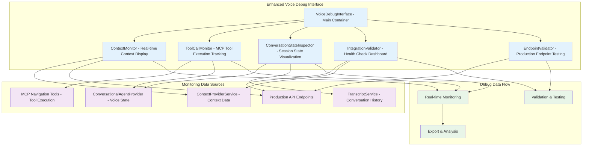

# Unified Serverless Conversational AI Module - Design Document

## Overview

The Unified Serverless Conversational AI Module is a core component for the Next.js portfolio website, enabling real-time, voice-guided interaction and UI navigation. This architecture is specifically designed for serverless hosting environments, where the Next.js server handles only stateless HTTP requests for obtaining ephemeral access tokens, proxying specific API calls, and receiving asynchronous client-side logs. All real-time bidirectional audio and AI signaling occurs directly between the client browser and AI providers' cloud infrastructure through a provider-agnostic interface that supports dynamic switching between OpenAI Realtime API and ElevenLabs Conversational AI.

### Pill-Shaped Floating AI Interface Design

The system features a distinctive pill-shaped floating interface that serves as the primary interaction point for users:

**Visual Design:**
- **Pill Shape**: Rounded container with dynamic border-radius (50px when collapsed, 16px when expanded)
- **Dynamic Positioning**: Starts centered at 50vh from bottom, smoothly transitions to 24px from bottom on scroll
- **No Chat History**: Focus on immediate voice interaction rather than traditional chat display
- **Attention-Grabbing Animations**: Sophisticated edge glow effects cycling through blue, purple, and green colors
- **Interactive Elements**: 
  - Microphone button with pulse rings during listening state
  - Text input field for manual command entry
  - Status indicator showing listening/processing/idle states
  - Expandable response area for temporary AI feedback (auto-contracts after display)

**GSAP-Powered Animations:**
- **Position Transitions**: Smooth movement between center and bottom positions based on scroll
- **Edge Glow Effects**: Color-cycling glow animations to attract user attention
- **Pulse Animations**: Interaction hints and feedback for user engagement
- **Scale Animations**: Responsive feedback for user interactions
- **Background Gradient**: Dynamic overlay that follows interface position

**User Experience:**
- **Voice-First Design**: Primary interaction through microphone with text input as fallback
- **Immediate Feedback**: Real-time status indicators and response display
- **Contextual Positioning**: Interface adapts position based on user scroll behavior
- **Accessibility**: Supports both voice and text input methods
- **Progressive Enhancement**: Works without JavaScript as basic form, enhanced with AI capabilities

## Architecture

### SSR Integration and Compatibility

The Client-Side AI system is designed to work seamlessly alongside Server-Side Rendered (SSR) portfolio content without conflicts or dependencies:

**SSR Compatibility Principles:**
- **Independent Initialization**: AI features initialize after SSR hydration as optional enhancements
- **No SSR Dependencies**: Core portfolio content (projects, bio, experience) renders completely without AI features
- **Shared URL Structure**: AI navigation tools work with the same URLs that SSR generates (`/`, `/projects`, `/projects/[slug]`)
- **Element Targeting**: AI tools target server-rendered elements using semantic IDs and data attributes
- **Progressive Enhancement**: AI features enhance SSR content without replacing or breaking core functionality

**Integration Architecture:**
- **Hydration Boundaries**: AI system waits for React hydration completion before initializing
- **Error Isolation**: AI system failures don't affect SSR content functionality
- **Performance Isolation**: AI features don't block or delay SSR content rendering
- **Crawler Compatibility**: AI features remain inactive for search engine crawlers and users with JavaScript disabled

### Unified Tool Call System Architecture

The architecture has been completely redesigned around a **Unified Tool Call System** that provides a single source of truth for tool definitions and a predictable execution pipeline. This addresses the previous complexity of muddled tool taxonomy, inconsistent execution flows, and redundant tool definitions.

**Key Architectural Improvements:**
- **Unified Tool Taxonomy**: Clear categorization of tools as `client` or `server` execution context
- **Single Tool Registry**: Centralized `UnifiedToolRegistry` managing all tool definitions
- **Streamlined Execution Pipeline**: Single `_executeUnifiedTool` method handles all tool execution
- **Provider-Agnostic Design**: Same tool system works across OpenAI Realtime and ElevenLabs
- **Consolidated Server Endpoint**: Single `/api/ai/tools/execute` for all server-side tool execution
- **Enhanced Debugging**: Unified debug events and telemetry across all execution paths

### Conversation Monitoring by ID System

The system includes a comprehensive conversation monitoring capability that allows administrators to monitor any voice conversation by ID, enabling real integration testing and debugging across browser tabs.

**Key Components:**
- **Database-Backed Conversation Storage**: Leverages existing ConversationHistoryManager for persistent voice conversation storage
- **Unified Monitoring Interface**: Single conversation ID input controls all monitoring components
- **Real-time Updates**: Server-Sent Events (SSE) for live conversation monitoring
- **Cross-Session Debugging**: Monitor conversations from external sessions by ID

**Architecture Overview:**
```typescript
// Conversation monitoring flow
Client Tab 1: Voice conversation → generates sessionId → logs to database
Admin Tab 2: Enter sessionId → monitor real-time → view transcript + tool calls + metadata

// Database storage (existing schema)
ConversationHistoryManager → AIConversation + AIConversationMessage tables
Voice adapters → _reportTranscriptToServer() → /api/ai/conversation/log → database

// Real-time monitoring
SSE endpoint → /api/admin/ai/conversation/[id]/events → streams debug events
ConversationMonitorProvider → manages conversation ID state → updates all components
```

**Integration with Current Voice System:**
- **OpenAI Realtime Adapter**: Already has `_sessionId` and `_reportTranscriptToServer()` methods
- **ElevenLabs Adapter**: Already has `_conversationId` and conversation logging integration  
- **Unified Conversation Manager**: Already provides `getDebugDataForSession()` and `getRecentConversationSessions()`
- **Existing Debug Infrastructure**: `debugEventEmitter` and `UnifiedConversationLogger` already capture events

**Unified Session ID Strategy:**
```typescript
// Session ID mapping for complete traceability
interface SessionIdMapping {
  unifiedSessionId: string;        // Our generated ID (primary key for monitoring)
  contextId?: string;              // From AdapterInitOptions (if provided)
  providerSessionIds: {
    openai?: string;               // OpenAI's internal session ID (if provided)
    elevenlabs?: string;           // ElevenLabs conversation ID (if provided)
  };
  ourGeneratedIds: {
    openai?: string;               // Our generated session_id for OpenAI
    elevenlabs?: string;           // Our generated sessionId for ElevenLabs
  };
}

// Voice adapter unified session management
class VoiceAdapter extends BaseConversationalAgentAdapter {
  private get unifiedSessionId(): string {
    // Priority: contextId > our generated ID > provider ID > fallback
    return this._options?.contextId || 
           this._ourGeneratedSessionId || 
           this._providerSessionId || 
           this.generateUnifiedSessionId();
  }
  
  // Store all session IDs for complete traceability
  private _sessionMapping: SessionIdMapping = {
    unifiedSessionId: this.unifiedSessionId,
    contextId: this._options?.contextId,
    providerSessionIds: {},
    ourGeneratedIds: {}
  };
}
```

### Unified UI Management System with Passive F-I-D Context Provider

The system implements a **passive F-I-D (Frame → Index → Details) context provider** that automatically injects contextual information into AI conversations based on UI state changes. Unlike traditional active tool-based approaches, this system proactively provides the AI with relevant context without requiring explicit tool calls, significantly reducing API overhead and improving response latency.

**Passive vs Active Context Architecture:**
- **Passive F-I-D**: System automatically pushes context updates to AI based on UI navigation (modal opens/closes)
- **Active Tools**: AI explicitly calls tools like `content.search`, `ui.describe` when it needs information
- **Hybrid Approach**: Passive context provides baseline awareness, active tools handle specific deep-dive requests

The system has been consolidated into a single **UIManager** class that handles navigation, UI state description, and passive context management.

#### UIManager with Passive F-I-D Integration

**UIManager Unified Approach:**
- **Triple Functionality**: Navigation (`ui.navigate()`), state description (`ui.describe()`), and passive F-I-D context management
- **Automatic Context Updates**: Detects significant UI changes (modal open/close) and triggers F-I-D context refresh
- **Client-Side Caching**: Maintains session-duration cache of F-I-D contexts to minimize server requests
- **OpenAI Integration**: Uses NAV_CONTEXT pattern to silently inject context into realtime conversations

**Passive F-I-D Context Flow:**
```typescript
// User opens project modal
UIManager.executeIntent({target: {type: "project", id: "aurora-avatar"}})
  ↓
// UIManager detects significant navigation change
UIManager._onSignificantNavigation()
  ↓
// Check client-side cache first
PassiveFIDManager.getOrFetchContext(currentUIState)
  ↓
// If cache miss, fetch from server
fetch('/api/ai/context/fid', {uiState, intent: userIntent})
  ↓
// Update OpenAI conversation with NAV_CONTEXT
OpenAIRealtimeAdapter.pushPassiveContext(fidContext)
  ↓
// AI has immediate awareness of current context for next interaction
```

**Key Benefits:**
- **Zero Tool Calls**: AI gets context automatically without explicit requests
- **Sub-Second Updates**: Client-side caching eliminates server round-trips for repeated contexts
- **Intelligent Caching**: Session-based cache with per-project invalidation
- **Non-Interrupting**: Context updates don't trigger AI responses, just provide awareness

#### UIManager Class Structure with Passive F-I-D

```typescript
export class UIManager {
  // Navigation functionality (existing)
  async executeIntent(params: UIIntentParams, sessionId?: string): Promise<NavigationResult>
  configureTiming(config: Partial<NavigationTimingConfig>): void
  getNavigationState(): NavigationState
  canAcceptNewRequest(): boolean
  
  // UI state description functionality
  describe(): UIDescribeResponse
  
  // New passive F-I-D context management
  private _passiveFIDManager: PassiveFIDManager
  private _lastUIStateHash: string
  private _onSignificantNavigation(newState: UIState): Promise<void>
  enablePassiveContext(voiceAdapter: IConversationalAgentAdapter): void
  disablePassiveContext(): void
  
  // Shared internal state management
  private _getCurrentRoute(): string
  private _getAvailableSections(currentState: any): Array<SectionInfo>
  private _getAvailableTransitions(currentState: any): Array<TransitionInfo>
  private _detectSignificantChange(oldState: UIState, newState: UIState): boolean
}

// New client-side F-I-D context manager
export class PassiveFIDManager {
  private _cache: Map<string, FIDContext> = new Map()
  private _userIntent: string | null = null
  
  async getOrFetchContext(uiState: UIState): Promise<FIDContext>
  setUserIntent(intent: string): void
  clearCache(projectId?: string): void
  private _generateCacheKey(uiState: UIState): string
  private _fetchFromServer(uiState: UIState): Promise<FIDContext>
}
```

#### Tool Integration

The UIManager exposes two AI tools:

**1. ui.navigate Tool**
```typescript
{
  name: 'ui.navigate',
  description: 'Navigate to specific UI locations with declarative intent',
  parameters: {
    target: { type: 'object' }, // section, project, route, modal, element
    behavior: { type: 'object' }, // openIfNeeded, closeBlocking, etc.
    scope: { type: 'object' } // route, modalId, projectId context
  }
}
```

**2. ui.describe Tool**
```typescript
{
  name: 'ui.describe',
  description: 'Get current UI state and available navigation affordances',
  parameters: {
    includeTransitions: { type: 'boolean', default: true },
    includeSections: { type: 'boolean', default: true }
  }
}
```

#### UI State Response Format

```typescript
interface UIDescribeResponse {
  epoch: number;                        // Monotonic version number
  route: string;                        // "home", "projects", "about", etc.
  viewStack: string[];                  // ["home", "projectModal:aurora-avatar"]
  sections: Array<{ 
    id: string; 
    title: string; 
    containerId?: string;               // Which modal/container it's in
  }>;
  transitions: Array<{
    id: string;                         // "open:projectModal", "route:about"
    kind: "open"|"close"|"route"|"tab";
    target?: string;                    // Target identifier
    requires?: string[];                // Prerequisites
  }>;
}
```

**Passive F-I-D Context Structure:**
- **Frame (≤400 tokens)**: Portfolio owner bio, general capabilities, current UI context rules
- **Index (≤400-600 tokens)**: Current route context, available projects/sections, navigation affordances
- **Details (≤1000 tokens)**: Current project summary + optional intent-based content search results

**Context Update Triggers:**
- **Immediate**: Modal open/close, route changes, project selection
- **Debounced (5s)**: Scroll position changes, visible content anchors
- **Optional**: User intent detection (configurable proactive content search)

**Caching Strategy:**
- **Session Duration**: 20 minutes (typical voice conversation length)
- **Cache Key**: `${route}-${projectId}-${intentHash}`
- **Invalidation**: Per-project when content updates, full cache on session end
- **Storage**: Client-side Map with automatic cleanup

#### OpenAI Realtime NAV_CONTEXT Implementation Details

**System Prompt Integration:**
```typescript
// Add to session initialization
const sessionInstructions = `
You will occasionally receive NAV_CONTEXT messages (metadata.channel="nav").
Treat them as the user's current location/state. Do not read them aloud.
Use them to ground your next answer. If irrelevant, ignore.
Always consult your NAV_CONTEXT for current UI state before calling tools.
`;
```

**Conversation Item Management:**
```typescript
// Core utility functions
function uuid() {
  return globalThis.crypto?.randomUUID?.() ?? Math.random().toString(36).slice(2);
}

function waitForCreatedWithToken(transport: any, token: string): Promise<string> {
  return new Promise<string>((resolve, reject) => {
    const onEvent = (e: any) => {
      if (e.type === "conversation.item.added") {
        const parts = e.item?.content ?? [];
        const text = parts.find((p: any) => p.type === "input_text")?.text || "";
        if (text.includes(token)) {
          cleanup(); 
          resolve(e.item.id);
        }
      } else if (e.type === "error") {
        cleanup(); 
        reject(new Error(e.error?.message || "server error"));
      }
    };
    
    const cleanup = () => transport.off?.("event", onEvent);
    transport.on("event", onEvent);
    setTimeout(() => { cleanup(); reject(new Error("Ack timeout")); }, 5000);
  });
}

// Push passive context with token-based correlation (avoids metadata rejection)
async function pushNavContext(transport: any, ctx: {
  frame: string;      // e.g., "ProjectPage"
  index?: object;     // current route, available sections
  details?: object;   // project summary, intent-based content
}): Promise<{ id: string; token: string }> {
  const token = uuid(); // correlation token
  const text = `NAV_CONTEXT ${token} ${JSON.stringify(ctx)}`;
  
  // Send item without metadata (metadata causes rejection)
  await transport.sendEvent({
    type: "conversation.item.create",
    item: {
      type: "message",
      role: "user",
      content: [{ type: "input_text", text }]
    }
  });
  
  // Wait for server acknowledgment and capture item.id
  const id = await waitForCreatedWithToken(transport, token);
  return { id, token };
}

// Replace previous context to avoid bloating conversation
let trackedNavItemIds: Set<string> = new Set();

async function replaceNavContext(transport: any, ctx: any): Promise<{ id: string; token: string }> {
  // 1) Delete all existing NAV_CONTEXT items
  for (const itemId of trackedNavItemIds) {
    try {
      await transport.sendEvent({ 
        type: "conversation.item.delete", 
        item_id: itemId 
      });
    } catch (error) {
      console.warn('Failed to delete NAV_CONTEXT item:', itemId, error);
    }
  }
  trackedNavItemIds.clear();
  
  // 2) Create new context item with token correlation
  const result = await pushNavContext(transport, ctx);
  trackedNavItemIds.add(result.id);
  
  return result;
}
```

**Context Structure:**
```typescript
interface FIDContext {
  frame: {
    portfolioOwner: string;
    currentCapabilities: string[];
    uiContext: string;
  };
  index: {
    route: string;
    availableProjects: ProjectSummary[];
    currentProject?: string;
    visibleSections: string[];
  };
  details: {
    projectSummary?: string;
    intentBasedContent?: ContentSearchResult[];
    selectedText?: string;
  };
}
```

**Integration with Voice Adapters:**
```typescript
// In OpenAIRealtimeAdapter
class OpenAIRealtimeAdapter {
  private trackedNavItemIds: Set<string> = new Set();
  private pendingTokens: Map<string, { resolve: (id: string) => void; reject: (error: Error) => void; timeout: NodeJS.Timeout }> = new Map();
  private tokenListenerSetup: boolean = false;
  
  private uuid(): string {
    return globalThis.crypto?.randomUUID?.() ?? Math.random().toString(36).slice(2);
  }
  
  private setupTokenListener(): void {
    if (this.tokenListenerSetup || !this._session) return;
    this.tokenListenerSetup = true;

    const onEvent = (e: any) => {
      if (e.type === "conversation.item.added") {
        const parts = e.item?.content ?? [];
        const text = parts.find((p: any) => p.type === "input_text")?.text || "";

        // Track NAV_CONTEXT messages
        if (text.startsWith('NAV_CONTEXT ')) {
          this.trackedNavItemIds.add(e.item.id);
        }

        // Resolve pending tokens
        for (const [token, pending] of this.pendingTokens.entries()) {
          if (text.includes(token)) {
            clearTimeout(pending.timeout);
            this.pendingTokens.delete(token);
            pending.resolve(e.item.id);
            break;
          }
        }
      } else if (e.type === "error") {
        // Reject all pending tokens on error
        for (const [token, pending] of this.pendingTokens.entries()) {
          clearTimeout(pending.timeout);
          pending.reject(new Error(e.error?.message || "server error"));
        }
        this.pendingTokens.clear();
      }
    };

    this._session.on('transport_event', onEvent);
  }
  
  private waitForCreatedWithToken(token: string): Promise<string> {
    return new Promise<string>((resolve, reject) => {
      if (!this._session) {
        reject(new Error("No session available"));
        return;
      }
      
      this.setupTokenListener();
      
      const timeout = setTimeout(() => {
        this.pendingTokens.delete(token);
        reject(new Error("Ack timeout"));
      }, 10000);
      
      this.pendingTokens.set(token, { resolve, reject, timeout });
    });
  }
  
  async pushPassiveContext(fidContext: FIDContext): Promise<{ id: string; token: string }> {
    // Delete all existing NAV_CONTEXT messages first
    for (const itemId of this.trackedNavItemIds) {
      try {
        await this.sendEvent({
          type: "conversation.item.delete",
          item_id: itemId
        });
      } catch (error) {
        console.warn('Failed to delete NAV_CONTEXT item:', itemId, error);
      }
    }
    this.trackedNavItemIds.clear();
    
    // Create new context with token correlation
    const token = this.uuid();
    const text = `NAV_CONTEXT ${token} ${JSON.stringify(fidContext)}`;
    
    await this.sendEvent({
      type: "conversation.item.create",
      item: {
        type: "message",
        role: "user",
        content: [{ type: "input_text", text }]
      }
    });
    
    const id = await this.waitForCreatedWithToken(token);
    this.trackedNavItemIds.add(id);
    
    return { id, token };
  }
}
```

#### Declarative Navigation Tools

```typescript
// New declarative navigation interface
interface UIIntentParams {
  epoch?: number;                       // Client's last-known UI state version
  target: 
    | { type: "section"; id: string }   // e.g., {type:"section", id:"contact"}
    | { type: "route"; id: string }     // e.g., {type:"route", id:"home"}
    | { type: "project"; id: string }   // e.g., {type:"project", id:"aurora-avatar"}
    | { type: "element"; id: string };  // tab, accordion, etc.
  behavior?: {
    openIfNeeded?: boolean;             // open modal or navigate if required
    closeBlocking?: boolean;            // close top modal if it blocks target
    waitForReadyMs?: number;            // wait for loader/transition
    scrollBehavior?: "smooth"|"instant";
  };
  scope?: { 
    route?: string; 
    modalId?: string; 
    projectId?: string; 
  };
  idempotencyKey?: string;
}

interface UIDescribeResponse {
  epoch: number;                        // Monotonic int that bumps on view changes
  route: string;                        // "home", "projects", etc.
  viewStack: string[];                  // ["home", "projectModal:aurora-avatar"]
  sections: Array<{ 
    id: string; 
    title: string; 
    containerId?: string; 
  }>;
  transitions: Array<{
    id: string;                         // "open:projectModal"
    kind: "open"|"close"|"route"|"tab";
    target?: string;                    // "projectModal:aurora-avatar"
    requires?: string[];                // transitions that must happen first
  }>;
}
```

#### Stateless Server Architecture with Client-Side State Tracking

**CRITICAL DESIGN PRINCIPLE**: The server remains completely stateless to support Vercel free tier hosting. All UI state tracking occurs client-side and is passed to server tools as context.

**Client-Side State Management:**
```typescript
interface UIState {
  // Hierarchical navigation path (breadcrumb style)
  breadcrumbPath: string;              // "home.projects.aurora-avatar.technical-details"
  
  // Currently visible content anchors (debounced scroll updates)
  visibleAnchors: string[];            // ["linear-algebra-deepdive", "normal-distribution-chart"]
  
  // Active search/filter state (debounced updates)
  activeFilters?: {
    searchTerm?: string;               // Current search query if any
    tags?: string[];                   // Active tag filters
    techStack?: string[];              // Active technology filters
  };
  
  // Minimal interaction context for AI awareness
  lastUserAction?: {
    type: 'navigate' | 'search' | 'filter' | 'scroll';
    timestamp: number;
  };
}

// Every server tool call includes current UI state
interface ServerToolRequest {
  toolName: string;
  parameters: any;
  sessionId: string;
  reflinkId?: string;
  uiState: UIState;                     // Current UI state from client
}
```

**Background State Updates to AI (Non-Interrupting):**
When users navigate manually, the client uses OpenAI's `backgroundResult()` to update AI context without forcing responses:

```typescript
// Debounced state updates to prevent spam
const debouncedStateUpdate = debounce((uiState: UIState) => {
  // Use OpenAI's backgroundResult for non-interrupting updates
  voiceAdapter.sendBackgroundResult({
    type: 'ui_state_update',
    breadcrumbPath: uiState.breadcrumbPath,
    visibleAnchors: uiState.visibleAnchors,
    activeFilters: uiState.activeFilters,
    timestamp: Date.now()
  });
}, 2000);

// Scroll updates: only when visible anchors change, max 1 per 10 seconds
const debouncedScrollUpdate = debounce((visibleAnchors: string[]) => {
  if (anchorsChanged(visibleAnchors)) {
    const newState = { ...getCurrentUIState(), visibleAnchors };
    debouncedStateUpdate(newState);
  }
}, 10000);

// Search/filter updates: max 1 per 5 seconds
const debouncedFilterUpdate = debounce((filters: ActiveFilters) => {
  const newState = { ...getCurrentUIState(), activeFilters: filters };
  debouncedStateUpdate(newState);
}, 5000);
```

#### Hierarchical Content System (T0-T4 Tiers)

**Content Tier Generation Strategy (Hybrid Approach):**
The system supports both automatic generation and user-defined section markers for optimal flexibility:

```markdown
<!-- User-defined tier markers in article markdown -->
<!-- T1: Revolutionary avatar system with 80% latency reduction -->
<!-- T2: Problem: VR avatars had 200ms lag | Solution: Custom IK pipeline | Impact: 80% faster, 60fps stable -->
<!-- T3: Implemented physics-informed Kalman filtering with custom IK solver, reducing avatar lag from 200ms to 40ms while maintaining 60fps stability across all VR platforms -->

# Avatar System Architecture
[rest of article content - auto-generated tiers if no markers present]
```

**Tier Generation Logic:**
1. **User Markers Present**: Use user-defined T1/T2/T3 content (no API costs)
2. **No Markers**: Auto-generate using OpenAI API on content save
3. **Hybrid**: User markers override auto-generation for specific tiers
4. **Fallback**: Always generate T0 (metadata) and T4 (full content) automatically

**Content Tier Structure:**
```typescript
interface ContentTier {
  T0: { id: string; slug: string; title: string; tags: string[] };           // Handle/metadata
  T1: { oneLiner: string };                                                  // 20-30 words
  T2: { bullets: string[] };                                                 // 3 bullets: problem/solution/impact
  T3: { summary: string; metrics?: Record<string, any> };                    // 100-150 words + metrics
  T4: { fullContent: string; links?: Record<string, string> };               // Complete case study
}

// Database schema for pgvector integration with hierarchical relationships
interface ContextChunk {
  id: string;
  entityType: 'bio' | 'project' | 'tech' | 'experience';
  slug: string;
  tier: 0 | 1 | 2 | 3 | 4;
  title?: string;
  tags: string[];
  tech: string[];
  chunk: string;                        // The actual text content
  embedding: number[];                  // Vector embedding for semantic search
  
  // NEW: Hierarchical relationship fields
  parentChunkId?: string;               // Points to parent chunk for tier relationships
  rootChunkId?: string;                 // Points to T0/T1 root for content lineage
  sectionGroup?: string;                // Groups related chunks by topic/section
  derivationPath?: string;              // e.g., "T1→T2.1→T3.5" for content traceability
  
  // NEW: Line-based content location for admin editor integration
  startLine?: number;                   // Starting line number in article content
  endLine?: number;                     // Ending line number in article content
  
  createdAt: Date;
}
```

### Admin-Side Content Management Integration

**CRITICAL CONTEXT**: The hierarchical content system integrates with the admin-side AI system (`ai-system` spec) for content creation and management. This integration enables sophisticated content authoring workflows in the project editor (`/admin/projects/editor/*`).

#### Manual Content Hierarchy Selection

**Admin Editor UI Features:**
- **Line-Based Selection**: Admins can select contiguous lines of article content (no overlapping or mid-line selections)
- **Tier Assignment**: Selected content can be assigned to specific tiers (T2, T3) which determines subdivision behavior
- **Visual Hierarchy Display**: Editor shows current tier assignments with visual indicators and relationship lines
- **Conflict Detection**: System prevents overlapping selections and validates tier hierarchy rules

**Selection Behavior Examples:**
```typescript
// Example 1: Short section assigned to T2
const selection = {
  startLine: 45,
  endLine: 52,
  assignedTier: 2,
  content: "Algorithm Overview\n\nThis section describes the custom IK pipeline...",
  subdivisionStrategy: "single-t3" // Creates one T3 item, multiple T4 chunks if needed
};

// Example 2: Large section assigned to T2  
const selection = {
  startLine: 100,
  endLine: 200,
  assignedTier: 2,
  content: "Technical Implementation\n\nDetailed algorithm description...",
  subdivisionStrategy: "multiple-t3" // Creates multiple T3 sections, each with T4 chunks
};
```

#### AI-Powered Content Generation Modes

**Full Auto Mode:**
- AI analyzes entire article content
- Generates complete T0-T4 hierarchy automatically
- Creates semantic relationships and line mappings
- Populates all tier summaries and metadata

**Manual Subdivision + AI Population:**
- Admin manually selects content sections and assigns tiers
- AI generates summaries and higher-tier content for selected sections
- AI creates hierarchical relationships between manual selections
- System validates and suggests improvements to manual structure

**Hybrid Mode:**
- Combines manual selections with AI-generated content
- Admin can override AI suggestions for specific sections
- AI fills gaps in manual hierarchy (e.g., generates T1 summary from manual T2/T3 selections)
- Maintains consistency between manual and AI-generated content

#### Content Hierarchy Rules and Validation

**Tier Relationship Rules:**
```typescript
interface HierarchyRules {
  // T2 sections must not overlap in line ranges
  t2NonOverlapping: boolean;
  
  // T3 content must be derived from T2 parent or standalone
  t3ParentValidation: boolean;
  
  // T4 chunks must belong to T3 sections
  t4ChunkAssignment: boolean;
  
  // Line ranges must be contiguous and non-overlapping within same tier
  lineRangeValidation: boolean;
}
```

**Subdivision Logic:**
1. **Short T2 Section** (< 500 words): Creates single T3 summary + title, entire content becomes single T4 chunk
2. **Medium T2 Section** (500-1500 words): Creates single T3 summary, content chunked into multiple T4 pieces
3. **Large T2 Section** (> 1500 words): Creates multiple T3 subsections, each with multiple T4 chunks
4. **Auto-Detection**: AI analyzes content structure to determine optimal subdivision strategy

#### Client-Side AI Integration Points

**Navigation and Scrolling:**
- Client-side AI can navigate to specific content using line numbers
- `startLine` and `endLine` fields enable precise scrolling to content sections
- UI navigation tools can highlight specific tier content in the editor

**Content Search Integration:**
- Hierarchical relationships enable "show me related content" queries
- Line-based mapping allows "scroll to this content" navigation commands
- Section groups enable "search within this topic" functionality

**Real-Time Content Updates:**
- Changes in admin editor trigger hierarchical content regeneration
- Client-side AI receives updated content structure for improved context
- Line number mappings update automatically when content is edited

#### Cross-System Compatibility

**Data Flow:**
```
Admin Editor (ai-system) → Content Hierarchy Generation → Database Storage → Client-Side AI Consumption

1. Admin selects content lines in editor
2. AI system generates tier hierarchy and summaries  
3. Content stored with line mappings and relationships
4. Client-side AI uses hierarchical data for navigation and search
5. Voice AI can reference specific content sections and scroll to them
```

**API Integration Points:**
- `POST /api/admin/content/generate-hierarchy` - Trigger hierarchy generation
- `GET /api/content/hierarchy/{chunkId}` - Get hierarchical relationships
- `GET /api/content/by-line-range/{entityId}` - Get content by line numbers
- `POST /api/content/update-hierarchy` - Update manual tier assignments

This integration ensures that content created and managed in the admin system is immediately available and navigable through the client-side AI voice interface, creating a seamless content authoring and consumption experience.

#### Hierarchical Content System (T0-T4 Tiers)

**Content Tier Generation Strategy (Hybrid Approach):**
The system supports both automatic generation and user-defined section markers for optimal flexibility:

```markdown
<!-- User-defined tier markers in article markdown -->
<!-- T1: Revolutionary avatar system with 80% latency reduction -->
<!-- T2: Problem: VR avatars had 200ms lag | Solution: Custom IK pipeline | Impact: 80% faster, 60fps stable -->
<!-- T3: Implemented physics-informed Kalman filtering with custom IK solver, reducing avatar lag from 200ms to 40ms while maintaining 60fps stability across all VR platforms -->

# Avatar System Architecture
[rest of article content - auto-generated tiers if no markers present]
```

**Tier Generation Logic:**
1. **User Markers Present**: Use user-defined T1/T2/T3 content (no API costs)
2. **No Markers**: Auto-generate using OpenAI API on content save
3. **Hybrid**: User markers override auto-generation for specific tiers
4. **Fallback**: Always generate T0 (metadata) and T4 (full content) automatically

**Enhanced Content Tier Structure with Hierarchical Relationships:**
```typescript
interface ContentTier {
  T0: { id: string; slug: string; title: string; tags: string[] };           // Handle/metadata
  T1: { oneLiner: string };                                                  // 20-30 words
  T2: { bullets: string[] };                                                 // 3 bullets: problem/solution/impact
  T3: { summary: string; metrics?: Record<string, any> };                    // 100-150 words + metrics
  T4: { fullContent: string; links?: Record<string, string> };               // Complete case study
}

// Enhanced database schema with hierarchical relationships and line mapping
interface ContextChunk {
  id: string;
  entityType: 'bio' | 'project' | 'tech' | 'experience';
  slug: string;
  tier: 0 | 1 | 2 | 3 | 4;
  title?: string;
  tags: string[];
  tech: string[];
  chunk: string;                        // The actual text content
  embedding: number[];                  // Vector embedding for semantic search
  
  // NEW: Hierarchical relationship fields
  parentChunkId?: string;               // Points to parent chunk
  rootChunkId?: string;                 // Points to T0/T1 root
  sectionGroup?: string;                // Groups related chunks (e.g., "architecture", "performance")
  derivationPath?: string;              // e.g., "T0→T1→T2.1→T3.5"
  
  // NEW: Line-based content mapping for admin editor integration
  startLine?: number;                   // Starting line number in source article
  endLine?: number;                     // Ending line number in source article
  sourceHash?: string;                  // Hash of source content for change detection
  
  createdAt: Date;
}
```

**Admin-Side Content Management Integration:**
The hierarchical content system integrates with the admin project editor (`/admin/projects/editor/*`) to enable:

1. **Manual Text Selection and Tier Assignment**: Admins can select portions of text (line-based, non-overlapping) and assign them to specific tiers
2. **Visual Hierarchy Management**: UI shows the hierarchical relationships between content chunks
3. **AI-Assisted Generation**: Integration with the ai-system spec for automatic tier generation and summarization
4. **Line-Based Content Mapping**: Each chunk stores its source line numbers for precise scrolling and navigation
5. **Change Detection**: Source content hashing enables detection of article changes that require tier regeneration

**Content Generation Modes:**
- **Full Auto**: AI generates all subdivisions and populates hierarchical summaries
- **Manual**: User subdivides manually with manual input of summaries
- **Hybrid**: User subdivides manually, AI populates chosen hierarchy with summaries
- **Editable**: All generated content remains editable by user or AI in admin interface

**Client-Side AI Integration:**
The client-side AI system consumes this hierarchical data for:
- **Semantic Navigation**: AI can navigate to specific content sections using line numbers
- **Contextual Awareness**: Understanding relationships between content pieces
- **Progressive Disclosure**: Showing appropriate tier level based on user intent
- **Content Lineage**: Tracing content from detailed chunks back to high-level summaries

#### Content Discovery Tools

```typescript
// Semantic content search across portfolio with hierarchical support
interface ContentSearchParams {
  query: string;                        // Natural language query
  scope?: {
    route?: string;                     // Limit to current route context
    projectId?: string;                 // Limit to specific project
    sectionGroup?: string;              // Limit to specific section group
  };
  k?: number;                          // Number of results (default: 5)
  maxTier?: 1 | 2 | 3 | 4;            // Maximum content tier to return
  diversifyBy?: 'project' | 'type';    // Ensure results span different projects/types
  includeHierarchy?: boolean;           // Include parent/child relationships in results
}

interface ContentSearchResult {
  items: Array<{
    id: string;
    project?: string;
    title: string;
    oneLiner: string;                   // T1 summary for quick scanning
    why: string;                        // 1 sentence justification for relevance
    navTarget: UIIntentParams;          // What ui.intent should use to show this
    score: number;
    facets: { tech: string[]; year?: number; type: string; tier: number };
    // NEW: Hierarchical context
    parentChunk?: string;               // Parent chunk ID
    childChunks?: string[];             // Child chunk IDs
    sectionGroup?: string;              // Section group identifier
    lineRange?: { start: number; end: number }; // Line numbers for scrolling
  }>;
  more: boolean;                        // Whether more results available
  cursor?: string;                      // For pagination
}

// Hierarchical content retrieval
interface ContentHierarchyParams {
  chunkId: string;                      // Root chunk to explore
  includeAncestors?: boolean;           // Include parent chain
  includeDescendants?: boolean;         // Include all children
  includeSiblings?: boolean;            // Include same-level chunks
  maxDepth?: number;                    // Maximum hierarchy depth
}

interface ContentHierarchyResult {
  root: ContextChunk;
  ancestors: ContextChunk[];            // Parent chain to root
  descendants: ContextChunk[];          // All children recursively
  siblings: ContextChunk[];             // Same-level chunks
  sectionSummary: string;               // AI-generated section overview
}

// Fetch specific content details
interface ContentGetParams {
  ids: string[];                        // Specific content IDs to fetch
  maxTokens?: number;                   // Token budget for response (default: 900)
  includeLineNumbers?: boolean;         // Include source line mapping
}

interface ContentGetResult {
  items: Array<{
    id: string;
    content: string;                    // HTML or markdown content
    tokenEstimate: number;
    tier: number;
    lineRange?: { start: number; end: number }; // Source line mapping
    hierarchyPath?: string;             // Derivation path (e.g., "T0→T1→T2.1")
  }>;
}
```

### Unified Tool Call System Components

#### I. Unified Tool Taxonomy and Definition

All tools adhere to a single `UnifiedToolDefinition` interface with explicit execution context:

```typescript
// src/lib/ai/tools/types.ts
export type ToolExecutionContext = 'client' | 'server';

export interface UnifiedToolDefinition {
  name: string;
  description: string;
  parameters: {
    type: 'object';
    properties: Record<string, any>;
    required?: string[];
  };
  executionContext: ToolExecutionContext; // Defines where tool logic runs
  outputSchema?: {
    type: 'object';
    properties: Record<string, any>;
  };
}

// Client-Only Tool Example
export const navigateToToolDefinition: UnifiedToolDefinition = {
  name: 'navigateTo',
  description: 'Navigate to a specific page or URL in the portfolio.',
  parameters: {
    type: 'object',
    properties: {
      path: { type: 'string', description: 'The URL path to navigate to.' },
      newTab: { type: 'boolean', description: 'Whether to open in a new tab.', default: false }
    },
    required: ['path']
  },
  executionContext: 'client' // Runs directly in browser
};

// Server-Only Tool Example
export const loadProjectContextToolDefinition: UnifiedToolDefinition = {
  name: 'loadProjectContext',
  description: 'Load detailed context for a specific project from the server.',
  parameters: {
    type: 'object',
    properties: {
      projectId: { type: 'string', description: 'The ID of the project to load context for.' },
      includeContent: { type: 'boolean', description: 'Whether to include full article content.', default: false }
    },
    required: ['projectId']
  },
  executionContext: 'server' // Requires server-side logic
};

// New Declarative Navigation Tools
export const uiIntentToolDefinition: UnifiedToolDefinition = {
  name: 'ui.intent',
  description: 'Achieve a navigation goal declaratively; the UI will perform all required steps.',
  parameters: {
    type: 'object',
    properties: {
      epoch: { type: 'number', description: 'Agent\'s last-known UI state version' },
      target: {
        type: 'object',
        oneOf: [
          { type: 'object', properties: { type: { const: 'section' }, id: { type: 'string' } } },
          { type: 'object', properties: { type: { const: 'route' }, id: { type: 'string' } } },
          { type: 'object', properties: { type: { const: 'project' }, id: { type: 'string' } } },
          { type: 'object', properties: { type: { const: 'element' }, id: { type: 'string' } } }
        ]
      },
      behavior: {
        type: 'object',
        properties: {
          openIfNeeded: { type: 'boolean', default: true },
          closeBlocking: { type: 'boolean', default: true },
          waitForReadyMs: { type: 'number', default: 1500 },
          scrollBehavior: { type: 'string', enum: ['smooth', 'instant'], default: 'smooth' }
        }
      },
      scope: {
        type: 'object',
        properties: {
          route: { type: 'string' },
          modalId: { type: 'string' },
          projectId: { type: 'string' }
        }
      },
      idempotencyKey: { type: 'string' }
    },
    required: ['target']
  },
  executionContext: 'client'
};

export const uiDescribeToolDefinition: UnifiedToolDefinition = {
  name: 'ui.describe',
  description: 'Get current UI state and available navigation affordances.',
  parameters: {
    type: 'object',
    properties: {}
  },
  executionContext: 'client'
};

// New Content Discovery Tools
export const contentSearchToolDefinition: UnifiedToolDefinition = {
  name: 'content.search',
  description: 'Search portfolio content semantically across projects and sections.',
  parameters: {
    type: 'object',
    properties: {
      query: { type: 'string', description: 'Natural language search query' },
      scope: {
        type: 'object',
        properties: {
          route: { type: 'string' },
          projectId: { type: 'string' }
        }
      },
      k: { type: 'number', default: 5, description: 'Number of results to return' },
      maxTier: { type: 'number', enum: [1, 2, 3, 4], default: 2 },
      diversifyBy: { type: 'string', enum: ['project', 'type'] }
    },
    required: ['query']
  },
  executionContext: 'server'
};

export const contentGetToolDefinition: UnifiedToolDefinition = {
  name: 'content.get',
  description: 'Fetch specific content details by ID with token budget control.',
  parameters: {
    type: 'object',
    properties: {
      ids: { 
        type: 'array', 
        items: { type: 'string' },
        description: 'Content IDs to fetch'
      },
      maxTokens: { type: 'number', default: 900, description: 'Token budget for response' }
    },
    required: ['ids']
  },
  executionContext: 'server'
};
```

#### II. Centralized Tool Registry

```typescript
// src/lib/ai/tools/UnifiedToolRegistry.ts
export class UnifiedToolRegistry {
  private static instance: UnifiedToolRegistry;
  private tools: Map<string, UnifiedToolDefinition> = new Map();

  static getInstance(): UnifiedToolRegistry {
    if (!UnifiedToolRegistry.instance) {
      UnifiedToolRegistry.instance = new UnifiedToolRegistry();
    }
    return UnifiedToolRegistry.instance;
  }

  registerTool(tool: UnifiedToolDefinition): void {
    this.tools.set(tool.name, tool);
  }

  getToolDefinition(toolName: string): UnifiedToolDefinition | undefined {
    return this.tools.get(toolName);
  }

  getClientToolDefinitions(): UnifiedToolDefinition[] {
    return Array.from(this.tools.values()).filter(tool => tool.executionContext === 'client');
  }

  getServerToolDefinitions(): UnifiedToolDefinition[] {
    return Array.from(this.tools.values()).filter(tool => tool.executionContext === 'server');
  }

  // Provider-specific formatters
  getOpenAIToolsArray(): Array<{ type: 'function'; name: string; description: string; parameters: any }> {
    return this.getAllToolDefinitions().map(tool => ({
      type: 'function',
      name: tool.name,
      description: tool.description,
      parameters: tool.parameters
    }));
  }

  getElevenLabsClientToolsExecutor(executor: (toolCall: { name: string; arguments: any }) => Promise<any>): Record<string, Function> {
    const elevenLabsClientTools: Record<string, Function> = {};
    this.getAllToolDefinitions().forEach(toolDef => {
      elevenLabsClientTools[toolDef.name] = async (parameters: any) => {
        return executor({ name: toolDef.name, arguments: parameters });
      };
    });
    return elevenLabsClientTools;
  }
}
```

#### III. Streamlined Tool Execution Pipeline

**Client-Side Unified Tool Executor:**

```typescript
// BaseConversationalAgentAdapter._executeUnifiedTool
protected async _executeUnifiedTool(toolName: string, args: any): Promise<any> {
  const toolDef = unifiedToolRegistry.getToolDefinition(toolName);
  if (!toolDef) {
    throw new Error(`Tool '${toolName}' not found in registry.`);
  }

  const toolCallId = uuidv4();
  const sessionId = this._options?.contextId || 'unknown-session';
  
  debugEventEmitter.emitToolCallStart(toolName, args, sessionId, toolCallId);

  try {
    let result: any;
    
    if (toolDef.executionContext === 'client') {
      // Execute directly using UIManager
      const uiToolHandler = (uiManager as any)[toolName];
      if (typeof uiToolHandler === 'function') {
        const uiResult = await uiToolHandler(args);
        result = uiResult.data || uiResult.message;
      } else {
        throw new Error(`Client-side UI tool handler for '${toolName}' not found.`);
      }
    } else if (toolDef.executionContext === 'server') {
      // Make generic API call to unified server endpoint
      const response = await fetch('/api/ai/tools/execute', {
        method: 'POST',
        headers: { 'Content-Type': 'application/json' },
        body: JSON.stringify({
          toolName: toolName,
          parameters: args,
          sessionId: sessionId,
          reflinkId: this._options?.reflinkId
        }),
      });

      if (!response.ok) {
        throw new Error(`Server tool '${toolName}' failed: ${response.status}`);
      }

      const serverResult = await response.json();
      result = serverResult.data;
    }

    debugEventEmitter.emitToolCallComplete(toolName, result, Date.now() - startTime, true, sessionId, toolCallId);
    return result;
  } catch (error) {
    debugEventEmitter.emitToolCallComplete(toolName, { error: error.message }, Date.now() - startTime, false, sessionId, toolCallId);
    throw error;
  }
}
```

**Server-Side Unified Tool Execution Endpoint:**

```typescript
// src/app/api/ai/tools/execute/route.ts
export async function POST(request: NextRequest) {
  const { toolName, parameters, sessionId, reflinkId } = await request.json();
  
  const toolDef = unifiedToolRegistry.getToolDefinition(toolName);
  if (!toolDef || toolDef.executionContext === 'client') {
    return NextResponse.json({ 
      success: false, 
      error: `Tool '${toolName}' not found or is client-only.` 
    }, { status: 400 });
  }

  // Validate reflink and access level
  const validation = await contextInjector.validateAndFilterContext(sessionId, reflinkId);
  if (!validation.valid) {
    return NextResponse.json({ 
      success: false, 
      error: validation.error || 'Access denied.' 
    }, { status: 403 });
  }

  // Execute tool via BackendToolService
  const backendService = BackendToolService.getInstance();
  const toolResult = await backendService.executeTool(
    toolName, 
    parameters, 
    sessionId, 
    validation.accessLevel, 
    reflinkId
  );

  return NextResponse.json({
    success: toolResult.success,
    data: toolResult.data,
    error: toolResult.error,
    metadata: {
      timestamp: Date.now(),
      source: 'server',
      sessionId
    }
  });
}
```

#### IV. Simplified Backend Tool Service

```typescript
// src/lib/ai/tools/BackendToolService.ts (replaces mcpServer)
export class BackendToolService {
  private static instance: BackendToolService;

  static getInstance(): BackendToolService {
    if (!BackendToolService.instance) {
      BackendToolService.instance = new BackendToolService();
    }
    return BackendToolService.instance;
  }

  async executeTool(
    toolName: string,
    args: Record<string, any>,
    sessionId: string,
    accessLevel: string,
    reflinkId?: string
  ): Promise<{ success: boolean; data?: any; error?: string }> {
    
    const toolDef = unifiedToolRegistry.getToolDefinition(toolName);
    if (!toolDef || toolDef.executionContext === 'client') {
      return { success: false, error: `Tool '${toolName}' not a server-side tool.` };
    }

    try {
      switch (toolName) {
        case 'loadProjectContext':
          return await this.handleLoadProjectContext(args, accessLevel);
        case 'loadUserProfile':
          return await this.handleLoadUserProfile(args, accessLevel);
        case 'processJobSpec':
          return await this.handleProcessJobSpec(args, sessionId, reflinkId);
        case 'searchProjects':
          return await this.handleSearchProjects(args, accessLevel);
        case 'submitContactForm':
          return await this.handleSubmitContactForm(args);
        case 'analyzeUserIntent':
          return await this.handleAnalyzeUserIntent(args);
        case 'generateNavigationSuggestions':
          return await this.handleGenerateNavigationSuggestions(args);
        default:
          return { success: false, error: `Unknown server tool: ${toolName}` };
      }
    } catch (error) {
      return { 
        success: false, 
        error: error instanceof Error ? error.message : String(error) 
      };
    }
  }

  // Individual tool handlers...
  private async handleLoadProjectContext(args: any, accessLevel: string) {
    // Implementation using projectIndexer, contextManager services
    return { success: true, data: { message: `Loaded context for ${args.projectId}` } };
  }

  // ... other handlers
}
```

### Unified Serverless Architecture with Provider Abstraction

**Client Layer (Browser) - OpenAI Realtime Agent Architecture:**

The **single `RealtimeAgent` instance** is created client-side within the `OpenAIRealtimeAdapter`. This `RealtimeAgent` defines the AI's core logic and tool definitions:

```typescript
// Client-side agent instantiation (src/app/page.tsx or websocket/page.tsx)
const agent = new RealtimeAgent({
  name: 'Portfolio Assistant',
  instructions: 'You are a friendly portfolio assistant...', // Core system prompt
  tools: [navigateToProjectTool, loadProjectDetailsTool, refundBackchannel], // Client-side tool definitions
  // No handoffs needed for our use case
});

// RealtimeSession manages direct interface to OpenAI Realtime API
// https://platform.openai.com/docs/api-reference/realtime_sessions
const session = new RealtimeSession(agent, {
  transport: 'webrtc', // Or WebRTC (default)
  model: 'gpt-realtime',
  outputGuardrails: guardrails, // Client-side guardrail definitions
  outputGuardrailSettings: { debounceTextLength: 200 },
  config: {
    audio: { output: { voice: 'cedar' } }, // TTS voice
  },
});
```

**Server Services (Context & Security) - Ephemeral Token Generation & Context Injection:**

### OpenAI Realtime Session Object Format and Tool Handling Architecture

The OpenAI Realtime API expects sessions to be created with the following structure, with **critical tool handling differences** from other providers:

```typescript
// Request format for POST /api/ai/openai/session
// Request format for POST https://api.openai.com/v1/realtime/client_secrets
{
  expires_after: { anchor: "created_at", seconds: 600 },
  session: {
    type: "realtime",
    model: 'gpt-realtime',
    instructions: 'System instructions for the AI assistant...',
    tools: [
      {
        type: 'function',
        name: 'navigateTo',
        description: 'Navigate to a specific page or URL',
        parameters: {
          type: 'object',
          properties: {
            path: { type: 'string', description: 'The path or URL to navigate to' }
          },
          required: ['path']
        }      
      }
    ],
    audio: {
      input: {
        format: {
          type: 'audio/pcm',
          rate: 24000
        },
        turn_detection: {
          type: 'server_vad',
          threshold: 0.5,
          prefix_padding_ms: 300,
          silence_duration_ms: 200,
          create_response: true,
          interrupt_response: true
        },
        transcription: {
          model: 'whisper-1'
        }
      },
      output: {
        format: {
          type: 'audio/pcm',
          rate: 24000
        },
        voice: 'alloy'
      }
    }
  }
}

// CRITICAL: OpenAI Tool Execution Architecture
// Unlike ElevenLabs, OpenAI Realtime SDK executes tools automatically on the client
// We create a wrapper system to maintain control over tool execution:

// 1. Server-side tool injection (src/app/api/ai/openai/session/route.ts)
const allTools = unifiedToolRegistry.getOpenAIToolsArray();
// Tools are injected into the session configuration server-side

// 2. Client-side tool redefinition with wrapper (src/lib/voice/OpenAIRealtimeAdapter.ts)
const openaiTools = allToolDefinitions.map(toolDef => {
  return tool({
    name: toolDef.name,
    description: toolDef.description,
    parameters: zodSchema, // Converted from JSON schema
    execute: async (parameters: any) => {
      // Wrapper that calls our unified execution system
      return await this._executeUnifiedTool(toolDef.name, parameters);
    },
  });
});

// 3. Unified execution routing in BaseConversationalAgentAdapter
protected async _executeUnifiedTool(toolName: string, args: any): Promise<any> {
  const toolDef = unifiedToolRegistry.getToolDefinition(toolName);
  
  if (toolDef.executionContext === 'client') {
    // Execute directly using UIManager
    const uiResult = await uiManager[toolName](args);
    return uiResult.data || uiResult.message;
  } else if (toolDef.executionContext === 'server') {
    // Make API call to unified server endpoint
    const response = await fetch('/api/ai/tools/execute', {
      method: 'POST',
      body: JSON.stringify({
        toolName: toolName,
        parameters: args,
        sessionId: this._options?.contextId,
        reflinkId: this._options?.reflinkId
      }),
    });
    return (await response.json()).data;
  }
}

// Response format from OpenAI API
{
  "value": "ek_68af296e8e408191a1120ab6383263c2",
  "expires_at": 1756310470,
  "session": {
    "type": "realtime",
    "object": "realtime.session",
    "id": "sess_C9CiUVUzUzYIssh3ELY1d",
    "model": "gpt-realtime",
    "output_modalities": ["audio"],
    "instructions": "You are a friendly assistant.",
    "tools": [],
    "tool_choice": "auto",
    "max_output_tokens": "inf",
    "tracing": null,
    "truncation": "auto",
    "prompt": null,
    "expires_at": 0,
    "audio": {
      "input": {
        "format": {
          "type": "audio/pcm",
          "rate": 24000
        },
        "transcription": null,
        "noise_reduction": null,
        "turn_detection": {
          "type": "server_vad",
          "threshold": 0.5,
          "prefix_padding_ms": 300,
          "silence_duration_ms": 200,
          "idle_timeout_ms": null,
          "create_response": true,
          "interrupt_response": true
        }
      },
      "output": {
        "format": {
          "type": "audio/pcm",
          "rate": 24000
        },
        "voice": "alloy",
        "speed": 1.0
      }
    },
    "include": null
  }
}
```

The `POST /api/ai/openai/session` endpoint generates ephemeral OpenAI `client_secret` tokens and **crucially injects the `RealtimeAgent`'s system prompt and client-side tool definitions** into the session configuration:

```typescript
// Server-side token generation (src/app/api/ai/openai/session/route.ts)
const response = await fetch('https://api.openai.com/v1/realtime/client_secrets', {
  method: 'POST',
  headers: {
    Authorization: `Bearer ${apiKey}`,
    'Content-Type': 'application/json',
  },
  body: JSON.stringify({
    expires_after: { anchor: "created_at", seconds: 600 },
    session: {
      type: 'realtime',
      model: 'gpt-realtime',
      // Server-injected instructions from ContextConfigurationManager
      instructions: AIConfiguration.systemPromptTemplate,
      // Server-injected client-side tool definitions (JSON schema)
      tools: [
        {
          type: 'function',
          name: 'navigateToProject',
          description: 'Navigate to a specific project page.',
          parameters: {
            type: 'object',
            properties: {
              projectSlug: { type: 'string', description: 'The URL slug of the project.' }
            },
            required: ['projectSlug']
          }          
        }
        // Additional client-side UI tools and backend API tools...
      ]
    }
  })
});
```



```mermaid
graph TB
    subgraph "Client Layer (Browser)"
        CI[Pill-Shaped Floating AI Interface]
        CAP[ConversationalAgentProvider - React Context]
        ICAA[IConversationalAgentAdapter Interface]
        OAI_ADAPTER[OpenAIRealtimeAdapter - WebRTC Direct]
        EL_ADAPTER[ElevenLabsAdapter - Signed URL Conversations]
        UIM[UIManager - Client-Side Execution]
        UCH[useConversationalAgent Hook]
        TC[TranscriptContext - Conversation History]
        AE[Audio Element - Unified Playback]
        RA[RealtimeAgent - Client-Side AI Logic]
        RS[RealtimeSession - OpenAI API Interface]
    end
    
    subgraph "API Layer (Next.js Server)"
        OAI_SESSION["/api/ai/openai/session - Ephemeral Tokens"]
        EL_TOKEN["/api/ai/elevenlabs/token - Conversation Tokens"]
        EL_AGENTS["/api/ai/elevenlabs/agents - Agent Management"]
        CONV_LOG["/api/ai/conversation/log - Transcript Collection"]
        CONTEXT_API["/api/ai/context - Dynamic Context Loading"]
    end
    
    subgraph "Server Services (Context & Security)"
        CM[Context Manager]
        CP[Context Provider System - Existing]
        PI[Project Indexer]
        ACL[Access Control Layer - Reflink-Based]
        RL[Rate Limiter]
        TS[Transcript Service]
        AS[Analytics Service]
    end
    
    subgraph "Voice AI Providers (External)"
        OPENAI_RT[OpenAI GPT Realtime API - WebRTC]
        EL_CONVAI[ElevenLabs Conversational AI Platform]
    end
    
    subgraph "Data Layer"
        DB[(Database)]
        CACHE[Redis Cache]
    end
    
    %% Client to Server API calls
    CI -->|Initialize Session| OAI_SESSION
    CI -->|Get EL Token| EL_TOKEN
    CI -->|Load Context| CONTEXT_API
    CI -->|Log Transcripts| CONV_LOG
    
    %% Server to Services
    OAI_SESSION --> ACL
    EL_TOKEN --> ACL
    CONTEXT_API --> CM
    CONV_LOG --> TS
    
    %% Services to Data
    CM --> CP
    CM --> PI
    ACL --> DB
    TS --> DB
    AS --> DB
    CP --> CACHE
    
    %% Client to Voice Providers (Direct)
    OAI_ADAPTER -.->|WebRTC Connection| OPENAI_RT
    EL_ADAPTER -.->|Signed URL Conversation| EL_CONVAI
    
    %% Voice Provider Responses
    OPENAI_RT -.->|Real-time Audio + Transcripts| OAI_ADAPTER
    EL_CONVAI -.->|Real-time Audio + Transcripts| EL_ADAPTER
    
    %% Adapter to Context
    OAI_ADAPTER --> CAP
    EL_ADAPTER --> CAP
    CAP --> TC
    CAP --> UNT
    
    %% Navigation Tools
    UNT -->|Execute UI Commands| CI
    
    %% Server manages agents for ElevenLabs
    EL_AGENTS --> EL_CONVAI
    
    classDef client fill:#e1f5fe
    classDef server fill:#f3e5f5
    classDef external fill:#fff3e0
    classDef data fill:#e8f5e8
    
    class CI,CAP,ICAA,OAI_ADAPTER,EL_ADAPTER,UNT,UCH,TC,AE client
    class OAI_SESSION,EL_TOKEN,EL_AGENTS,CONV_LOG,CONTEXT_API,CM,CP,PI,ACL,RL,TS,AS server
    class OPENAI_RT,EL_CONVAI external
    class DB,CACHE data
```

### Reflink-Based Access Control Architecture

The system implements a sophisticated reflink-based access control system that provides personalized AI experiences for invited users while controlling costs and preventing abuse.

#### Reflink-Based Tool Configuration System

**CRITICAL IMPLEMENTATION DETAIL**: The system supports reflink-based tool configuration where different reflinks can enable different sets of tools and features:

```typescript
// UnifiedToolRegistry modification for reflink-based filtering
export class UnifiedToolRegistry {
  // New method for reflink-based tool filtering
  getToolsForReflink(reflinkId?: string): UnifiedToolDefinition[] {
    // Query AIReflink.enabledTools to determine allowed tools
    // If no reflink provided, use special "PUBLIC_PROFILE" reflink
    return this.getAllToolDefinitions().filter(tool => {
      return this.isToolEnabledForReflink(tool.name, reflinkId);
    });
  }

  // Server-side reflink configuration query
  private async isToolEnabledForReflink(toolName: string, reflinkId?: string): Promise<boolean> {
    // Determine which reflink to query
    const targetReflink = reflinkId || 'PUBLIC_PROFILE';
    
    // Query AIReflink.enabledTools from database
    const reflink = await prisma.aIReflink.findUnique({
      where: { reflink: targetReflink },
      select: { enabledTools: true, isActive: true }
    });
    
    if (!reflink?.isActive) {
      // If reflink not found or inactive, deny all tools for security
      return false;
    }
    
    // If enabledTools is null/empty, all tools are disabled
    if (!reflink.enabledTools || reflink.enabledTools.length === 0) {
      return false;
    }
    
    // Use reflink-specific tool configuration
    return reflink.enabledTools.includes(toolName);
  }
}

// Client-side initialization with reflink-based tool loading
// src/lib/voice/OpenAIRealtimeAdapter.ts
private async _initializeAgent() {
  // Get reflink from options or URL
  const reflinkId = this._options?.reflinkId || new URLSearchParams(window.location.search).get('ref');
  
  // Query server for allowed tools based on reflink
  const allowedTools = await this.getToolsForReflink(reflinkId);
  
  // Create OpenAI tools only for allowed tools
  const openaiTools = allowedTools.map(toolDef => {
    return tool({
      name: toolDef.name,
      description: toolDef.description,
      parameters: this.convertToZodSchema(toolDef.parameters),
      execute: async (parameters: any) => {
        return await this._executeUnifiedTool(toolDef.name, parameters);
      },
    });
  });

  this._agent = new RealtimeAgent({
    name: agentName,
    tools: openaiTools, // Only tools allowed for this reflink
  });
}

// Server-side tool filtering endpoint
// src/app/api/ai/tools/allowed/route.ts
export async function GET(request: NextRequest) {
  const { searchParams } = new URL(request.url);
  const reflinkId = searchParams.get('reflinkId');
  
  // Validate reflink and get access level
  const validation = await contextInjector.validateAndFilterContext('', reflinkId);
  
  // Get tools allowed for this reflink/access level
  const allowedTools = unifiedToolRegistry.getToolsForReflink(reflinkId, validation.accessLevel);
  
  return NextResponse.json({
    tools: allowedTools.map(tool => ({
      name: tool.name,
      description: tool.description,
      executionContext: tool.executionContext
    })),
    accessLevel: validation.accessLevel,
    reflinkId: reflinkId
  });
}
```

#### Public Profile Configuration

The system uses a **special "public" reflink** stored in the database that defines which tools and features are available to users without reflinks:

```typescript
// Enhanced AIReflink model with tool configuration
interface AIReflink {
  id: string;
  reflink: string;
  recipientName?: string;
  recipientEmail?: string;
  customContext?: string;
  tokenLimit?: number;
  spendLimit?: number;
  expiresAt?: Date;
  isActive: boolean;
  enabledTools?: string[]; // NEW: Array of tool names, null/empty = all tools disabled
  createdAt: Date;
  updatedAt: Date;
  // ... existing fields
}

// Special public reflink (seeded in database)
const publicReflink: AIReflink = {
  id: 'public-profile',
  reflink: 'PUBLIC_PROFILE', // Special identifier, not user-accessible
  recipientName: 'Public User',
  recipientEmail: null,
  customContext: 'Default public access configuration',
  tokenLimit: 1000,
  spendLimit: 0.10,
  expiresAt: null, // Never expires
  isActive: true,
  enabledTools: [], // Initially empty (all tools disabled), configurable via admin
  // ... other fields
};

// Premium reflink example
const premiumReflink: AIReflink = {
  id: 'reflink-recruiter-123',
  reflink: 'recruiter-tech-lead-2024',
  recipientName: 'Tech Lead Recruiter',
  recipientEmail: 'recruiter@company.com',
  enabledTools: [
    // All navigation tools
    'navigateTo', 'showProjectDetails', 'scrollIntoView', 'highlightText',
    // Full context access
    'loadProjectContext', 'loadUserProfile', 'searchProjects',
    // Premium features
    'processJobSpec', 'analyzeUserIntent', 'submitContactForm',
    // Advanced navigation
    'generateNavigationSuggestions', 'getNavigationHistory'
  ],
  tokenLimit: 10000,
  spendLimit: 5.00,
  isActive: true,
  // ... other fields
};

// Basic reflink example (limited tools)
const basicReflink: AIReflink = {
  id: 'reflink-client-456',
  reflink: 'client-demo-2024',
  recipientName: 'Potential Client',
  enabledTools: [
    'navigateTo', 'showProjectDetails', 'scrollIntoView',
    'loadProjectContext', 'searchProjects'
    // No job analysis or form submission tools
  ],
  tokenLimit: 2000,
  spendLimit: 1.00,
  isActive: true,
  // ... other fields
};
```

```mermaid
graph TB
    subgraph "Visitor Access Flow (Server-Side Authority)"
        V[Visitor Arrives Client]
        HTTPR[HTTP Request to Server (e.g., /api/ai/session-init)]
        RD[Reflink Detection - Server-Side]
        RV[Reflink Validation - Server-Side]
        SS[Server-Side Session State]
        AC[Access Control Decision]
        RESP[HTTP Response to Client - UI Config, Tokens, Public Context]
    end
    
    subgraph "Access Levels"
        NA[No Access - Hidden UI]
        BA[Basic Access - Text Only]
        LA[Limited Access - No Premium]
        PA[Premium Access - Full Features]
    end
    
    subgraph "Reflink Management (Admin & Persistent)"
        RC[Reflink Creation - Admin]
        BT[Budget Tracking - Persistent DB]
        CT[Cost Tracking - Persistent DB]
        PN[Personalization - Persistent DB]
    end
    
    subgraph "Admin Controls"
        PS[Public Settings - Admin UI]
        RM[Reflink Management - Admin UI]
        CA[Cost Analytics - Admin UI]
        UA[Usage Analytics - Admin UI]
    end
    
    V --> HTTPR
    HTTPR --> RD
    RD --> RV
    RV --> SS
    SS --> AC
    AC --> RESP
    
    AC --> NA
    AC --> BA
    AC --> LA
    AC --> PA
    
    RC --> BT
    BT --> CT
    CT --> PN
    
    PS --> AC
    RM --> RC
    CA --> BT
    UA --> CT
    
    note1[All reflink detection, validation, and session state management occurs exclusively on the server.]
    note2[Client receives an authenticated session identifier, ephemeral tokens, and UI configuration based on server-side access control.]
```

**Reflink Flow (Revised):**
1.  **Client Request**: Visitor's browser makes an initial HTTP request to the server's session initialization endpoint (e.g., `/api/ai/session-init`), potentially including a `?ref=` parameter.
2.  **Server-Side Detection**: The server-side API handler parses URL parameters to detect a reflink.
3.  **Server-Side Validation**: A dedicated server-side service (`ReflinkManager`) performs database lookup to validate the reflink's existence, expiration, and remaining budget.
4.  **Server-Side Session Storage**: If valid, the reflink context (access level, personalized details, budget status) is securely stored *server-side* in the user's authenticated session (e.g., using `next-auth` session or a dedicated server-side session store in a persistent database).
5.  **Access Control Decision**: Based on the validated reflink (or public access settings if no reflink) and current budget, the server determines the user's `AccessLevel` and `FeatureAvailability`.
6.  **Ephemeral Token Generation**: For voice-enabled sessions, the server uses the `TokenGenerator` to create a secure, ephemeral token for the selected voice AI provider (e.g., OpenAI, ElevenLabs). Crucially, the server also injects the *full, potentially sensitive system prompt and initial context* directly into this token's configuration (if the provider API allows, e.g., OpenAI's `client_secrets` endpoint `session.instructions`). Only *publicly safe* context is returned to the client.
7.  **Client UI Configuration**: The server returns a structured response to the client containing the user's `AccessLevel`, `FeatureAvailability`, `WelcomeMessage`, `AccessMessage`, *publicly visible* `PersonalizedContext`, `BudgetStatus`, and the `ephemeralToken` for the voice AI provider. The client-side UI then reactively renders the appropriate interface and uses the token to initialize its direct connection to the voice AI provider.
8.  **Cost Tracking**: All subsequent AI interactions are tracked. For direct client-to-provider voice interactions, the client-side voice agent *must report usage metrics back to our server* via API calls, which are then attributed to the server-side session and tracked against the reflink's budget (`ReflinkManager`, `VoiceCostTracker`), decrementing budget limits in the persistent database.
9.  **Personalization**: The client-side voice agent uses recipient information from the `publicContext` (and accesses server-side `privateContext` via `load_context` tools) to personalize conversations.

**Access Control Matrix:**

| Access Level | AI Interface | Voice AI | Job Analysis | Advanced Navigation | Rate Limits |
| :----------- | :------------- | :------- | :----------- | :------------------ | :---------- |
| No Access    | Hidden         | ❌       | ❌           | ❌                  | N/A         |
| Basic Access | Text Only      | ❌       | ❌           | Basic               | Strict (5/day) |
| Limited Access | Text + Basic Voice | ❌       | ❌           | Standard            | Moderate (20/day) |
| Premium (Reflink) | Full Interface | ✅       | ✅           | Full                | Budget-based |

## Server-Side Architecture Requirements

### Critical Server-Side Enforcement (Revised)

**All AI orchestration, database operations, and sensitive context management MUST be server-side only. Client-side code SHALL NOT import or directly access database clients (e.g., Prisma) or AI service managers.**

```typescript
// ❌ NEVER DO THIS - Client-side Prisma import or direct database access
import { prisma } from '@/lib/prisma'; // This breaks in browser and is insecure
const users = await prisma.user.findMany(); // Client-side database query

// ❌ NEVER DO THIS - Backend AI service calls in client-side code
const aiService = new AIServiceManager(); // This belongs to backend ai-system spec
const response = await aiService.processInput(input); // Backend AI functionality

// ✅ CORRECT - Client-side voice AI configuration management
const voiceConfig = new ClientAIModelManager();
const providerConfig = voiceConfig.getVoiceProviderConfig('openai');

// ✅ CORRECT - Client-side API calls to server-side endpoints
const response = await fetch('/api/ai/unified-conversation', {
  method: 'POST',
  body: JSON.stringify({ input, options })
});

// ✅ CORRECT - Client-side direct connection to AI providers with server-generated tokens
// Client connects to OpenAI/ElevenLabs SDKs directly, streams microphone audio, plays TTS.
// Our server's role is initial token generation and on-demand context via separate API calls.
```

**Client-Server Boundary (Revised):**
-   **Client-Side**: UI components, API calls to server-side endpoints, direct WebRTC/WebSocket for *voice AI interaction with providers*, TTS audio *playback* from the provider, UI state reporting via API calls or WebRTC Data Channels (if used for non-audio data), execution of commands generated by the *client-side voice agent*.
-   **Server-Side**: All AI orchestration (for text/hybrid), database access, AI service calls (for text/hybrid), ephemeral token generation for voice providers, system prompt and hidden context injection into voice provider tokens, reflink validation, session management, context building, abuse detection, logging of voice interaction metrics (reported by client), and analytics.

**Simplified Caching Strategy:**
-   **Active Conversations**: Kept in server-side memory for low-latency access with database persistence for durability.
-   **Historical Data**: Persisted in the database for long-term storage and admin review.
-   **Context Data**: Cached via Context Provider system with appropriate TTL for performance.
-   **Session Management**: Server-side session state with reflink context, managed via standard session storage with database persistence.

## Unified Systems Architecture

### Provider-Agnostic Tool Call and Conversation Management

The architecture ensures that tool calls, conversation history, and debugging work consistently across OpenAI Realtime and ElevenLabs providers:

```typescript
// Unified tool call system - works with both providers
interface UnifiedToolCall {
  id: string;
  name: string;
  arguments: any;
  timestamp: Date;
  provider: 'openai' | 'elevenlabs';
  executionTime?: number;
  result?: any;
  error?: string;
}

// Unified transcript system - consistent across providers
interface UnifiedTranscriptItem {
  id: string;
  type: 'user_speech' | 'ai_response' | 'tool_call' | 'system_message';
  content: string;
  timestamp: Date;
  provider: 'openai' | 'elevenlabs';
  metadata: {
    confidence?: number;
    toolName?: string;
    toolArgs?: any;
    toolResult?: any;
  };
}

// Unified conversation logging - same format for both providers
interface UnifiedConversationLog {
  sessionId: string;
  provider: 'openai' | 'elevenlabs';
  transcript: UnifiedTranscriptItem[];
  toolCalls: UnifiedToolCall[];
  connectionEvents: ConnectionEvent[];
  metadata: {
    startTime: Date;
    endTime?: Date;
    totalDuration?: number;
    tokensUsed?: number;
    costUsd?: number;
  };
}
```

### Admin Debug Interface Integration

The admin debug page works seamlessly with both providers through the unified systems:

```typescript
// Admin debug page - provider agnostic
export function AdminVoiceDebugPage() {
  const { activeProvider, transcript, toolCalls, connectionStatus } = useConversationalAgent();
  
  // Works with both OpenAI and ElevenLabs
  const debugData = useDebugMonitoring(sessionId); // Unified debug data
  const conversationHistory = useConversationHistory(sessionId); // Unified history
  
  return (
    <div>
      <ProviderStatus provider={activeProvider} status={connectionStatus} />
      <UnifiedTranscriptView transcript={transcript} /> {/* Same component for both */}
      <UnifiedToolCallMonitor toolCalls={toolCalls} /> {/* Same component for both */}
      <UnifiedDebugEvents events={debugData.events} /> {/* Same component for both */}
    </div>
  );
}
```

## Key Architectural Benefits

The Unified Tool Call System provides significant improvements over the previous architecture:

### 1. Predictable Execution
Every tool call follows one of two clear paths:
- **Client tools**: Direct function call via `UINavigationTools`
- **Server tools**: Single `/api/ai/tools/execute` endpoint

### 2. No Complex Routing Logic
AI adapters become thin clients that delegate execution decisions to the `_executeUnifiedTool` method, eliminating provider-specific routing complexity.

### 3. Single Source of Truth
All tool definitions reside in `UnifiedToolRegistry`, ensuring consistency and simplifying updates across the entire system.

### 4. Provider Agnostic
Adapters don't need to know tool implementation details - they only need the tool's `name`, `parameters`, and `executionContext`.

### 5. Clear Boundaries
Client-side UI manipulation is distinct from server-side data processing, with explicit execution context declarations.

### 6. Simplified Debugging
Fewer execution paths and consistent event emission via `debugEventEmitter` make tracing tool calls across the client-server boundary much easier.

### 7. Enhanced Maintainability
Adding new tools or AI providers follows a consistent pattern: define in registry, implement logic, and the system automatically picks it up.

### 8. Improved Security
All server-side operations are gated by a single API endpoint with robust authentication, authorization, and rate limiting.

## Provided APIs

### Unified Conversational AI APIs
```typescript
interface ProvidedConversationalAPIs {
  "ClientAIModelManager": {
    version: "2.0.0";
    consumers: ["OpenAIRealtimeAdapter", "ElevenLabsAdapter", "UnifiedConversationManager", "AdminVoiceConfigInterface"];
    purpose: "Robust configuration management for client-side voice AI systems with automatic fallbacks";
    location: "src/lib/voice/ClientAIModelManager.ts";
    exports: {
      getProviderConfig: "Get provider configuration with automatic fallback to defaults (never returns null)";
      getAllProviderConfigs: "Get all configurations for a specific provider";
      saveProviderConfig: "Save provider configuration with validation";
      deleteProviderConfig: "Delete provider configuration";
      validateConfig: "Validate configuration using provider-specific serializers";
      getAvailableVoiceModels: "Get available voice models across providers";
      reloadConfiguration: "Hot-reload configuration from database";
      getConfigurationStats: "Get configuration statistics and cache metrics";
      destroy: "Cleanup resources including Prisma client disconnection";
    };
    features: [
      "automatic-fallback-handling", 
      "comprehensive-validation", 
      "configuration-caching", 
      "hot-reload-support",
      "provider-agnostic-interface",
      "proper-resource-cleanup",
      "health-checks-and-recommendations"
    ];
    changelog: {
      "2.0.0": "Enhanced with automatic fallbacks, unified validation, centralized environment management";
      "1.0.0": "Initial implementation with basic JSON storage";
    };
  };
  
  "ConversationalAgentProvider": {
    version: "1.0.0";
    consumers: ["portfolio-ui-components", "admin-debug-interfaces"];
    purpose: "React Context Provider for unified voice agent management across all providers";
    location: "src/contexts/ConversationalAgentContext.tsx";
    exports: {
      useConversationalAgent: "Hook for accessing voice agent functionality";
      ConversationalAgentProvider: "Context provider for unified voice agent state";
    };
    features: [
      "provider-switching", 
      "conversation-continuity", 
      "unified-transcripts-across-providers",
      "unified-tool-call-system",
      "provider-agnostic-debugging",
      "admin-debug-integration"
    ];
    unifiedSystems: {
      transcriptManagement: "Single transcript system works with OpenAI and ElevenLabs adapters";
      toolCallSystem: "Unified tool execution and result reporting across all providers";
      debugInterface: "Admin debug page works with all voice providers seamlessly";
      conversationHistory: "Provider-agnostic conversation storage and retrieval";
    };
  };
  
  "IConversationalAgentAdapter": {
    version: "1.0.0";
    consumers: ["OpenAIRealtimeAdapter", "ElevenLabsAdapter"];
    purpose: "Provider-agnostic interface for voice AI implementations with unified systems";
    location: "src/lib/voice/IConversationalAgentAdapter.ts";
    methods: {
      init: "Initialize adapter with callbacks and audio element";
      connect: "Establish connection to voice AI provider";
      disconnect: "Terminate voice AI connection";
      sendMessage: "Send text input to voice AI";
      startAudioInput: "Begin microphone capture";
      stopAudioInput: "End microphone capture";
      mute: "Mute/unmute AI audio output";
      interrupt: "Interrupt current AI speech";
    };
    unifiedIntegration: {
      transcriptSystem: "All adapters use same transcript format and event system";
      toolCallSystem: "Standardized tool call and result reporting across providers";
      debugEvents: "Consistent debug event emission for admin monitoring";
      conversationLogging: "Unified conversation data format for server reporting";
    };
  };
  
  "OpenAIRealtimeAdapter": {
    version: "1.0.0";
    consumers: ["ConversationalAgentProvider"];
    purpose: "OpenAI Realtime API integration with WebRTC";
    location: "src/lib/voice/OpenAIRealtimeAdapter.ts";
    features: ["webrtc-connection", "real-time-stt-tts", "tool-calling", "interruption-handling"];
    dependencies: ["@openai/agents/realtime"];
  };
  
  "ElevenLabsAdapter": {
    version: "1.0.0";
    consumers: ["ConversationalAgentProvider"];
    purpose: "ElevenLabs Conversational AI integration with signed URLs";
    location: "src/lib/voice/ElevenLabsAdapter.ts";
    features: ["signed-url-conversations", "agent-management", "real-time-audio"];
    dependencies: ["REST API calls only"];
  };
  
  "UIManager": {
    version: "2.0.0";
    consumers: ["voice-agents", "ai-navigation-system"];
    purpose: "Unified UI state management and navigation for voice agents";
    location: "src/lib/navigation/UIManager.ts";
    tools: {
      executeIntent: "Declarative navigation to UI locations";
      describe: "Get current UI state and available affordances";
      showProjectDetails: "Display project detail modals";
      scrollIntoView: "Scroll to specific page elements";
      highlightText: "Apply visual emphasis to content";
      clearHighlights: "Remove all visual highlights";
      focusElement: "Focus on specific UI elements";
    };
  };
  
  "VoiceConfigurationSerializers": {
    version: "1.0.0";
    consumers: ["ClientAIModelManager", "AdminVoiceConfigInterface", "VoiceConfigValidator"];
    purpose: "Provider-specific configuration serialization, validation, and schema generation";
    location: "src/lib/voice/config-serializers/";
    exports: {
      OpenAIRealtimeSerializer: "OpenAI Realtime API configuration management";
      ElevenLabsSerializer: "ElevenLabs Conversational AI configuration management";
      getSerializerForProvider: "Factory function for provider-specific serializers";
      VoiceConfigSerializer: "Base interface for all configuration serializers";
    };
    features: [
      "type-safe-serialization",
      "comprehensive-validation-with-suggestions",
      "json-schema-generation-for-admin-ui",
      "environment-variable-validation",
      "provider-specific-custom-validation",
      "default-configuration-management"
    ];
  };
  
  "VoiceConfigurationTypes": {
    version: "1.0.0";
    consumers: ["all-voice-ai-components"];
    purpose: "Centralized configuration types, schemas, and validation utilities";
    location: "src/types/voice-config.ts";
    exports: {
      OpenAIRealtimeConfig: "Complete OpenAI Realtime configuration interface";
      ElevenLabsConfig: "Complete ElevenLabs configuration interface";
      VoiceProviderConfig: "Union type for all provider configurations";
      ValidationResult: "Unified validation result interface";
      validateEnvironmentVariable: "Single source of truth for environment validation";
      getEnvironmentVariable: "Secure environment variable access with validation";
      validateEnvironmentVariables: "Batch environment variable validation";
      DEFAULT_OPENAI_CONFIG: "Default OpenAI configuration";
      DEFAULT_ELEVENLABS_CONFIG: "Default ElevenLabs configuration";
    };
    features: [
      "comprehensive-zod-schemas",
      "environment-variable-utilities",
      "type-guards-and-utilities",
      "default-configurations",
      "single-source-of-truth-for-types"
    ];
  };
  
  "VoiceConfigValidator": {
    version: "2.0.0";
    consumers: ["ClientAIModelManager", "AdminVoiceConfigInterface"];
    purpose: "Comprehensive configuration validation with health checks and recommendations";
    location: "src/lib/voice/config-validation.ts";
    exports: {
      validateConfig: "Validate any voice provider configuration";
      validateOpenAIConfig: "OpenAI-specific configuration validation";
      validateElevenLabsConfig: "ElevenLabs-specific configuration validation";
      performHealthCheck: "Comprehensive configuration health assessment";
    };
    features: [
      "layered-validation-architecture",
      "health-checks-with-recommendations",
      "environment-variable-validation",
      "provider-specific-validation-rules"
    ];
    changelog: {
      "2.0.0": "Enhanced to use serializer validation first, then augment with environment checks";
      "1.0.0": "Initial implementation with basic validation";
    };
  };
}
```

### Database Models

```typescript
interface ProvidedDatabaseModels {
  "VoiceProviderConfig": {
    version: "1.0.0";
    consumers: ["ClientAIModelManager", "AdminVoiceConfigInterface"];
    purpose: "Persistent storage for voice AI provider configurations";
    location: "prisma/schema.prisma";
    fields: {
      id: "String @id @default(cuid())";
      provider: "String (openai | elevenlabs)";
      name: "String (user-defined config name)";
      isDefault: "Boolean (default configuration for provider)";
      configJson: "String (serialized provider-specific configuration)";
      createdAt: "DateTime @default(now())";
      updatedAt: "DateTime @updatedAt";
    };
    indexes: ["provider", "isDefault", "provider_isDefault"];
  };
}
```

### Voice Provider Integration APIs
```typescript
interface VoiceProviderAPIs {
  "GET /api/ai/openai/session": {
    version: "1.0.0";
    purpose: "Generate ephemeral OpenAI Realtime session tokens";
    location: "src/app/api/ai/openai/session/route.ts";
    response: "OpenAI client_secret for WebRTC connection";
    security: "Server-side API key management";
    usage: "Client requests token for direct OpenAI Realtime connection";
  };
  
  "GET /api/ai/elevenlabs/token": {
    version: "1.0.0";
    purpose: "Generate ElevenLabs conversation tokens";
    location: "src/app/api/ai/elevenlabs/token/route.ts";
    response: "ElevenLabs conversation token for signed URL conversations";
    security: "Server-side API key management";
    usage: "Client requests token for ElevenLabs conversation interface";
  };
  
  "GET /api/ai/elevenlabs/agents": {
    version: "1.0.0";
    purpose: "Manage ElevenLabs conversational AI agents";
    location: "src/app/api/ai/elevenlabs/agents/route.ts";
    response: "List of available ElevenLabs agents";
    usage: "Server manages agents with portfolio context injection";
  };
  
  "POST /api/ai/conversation/log": {
    version: "1.0.0";
    purpose: "Asynchronous conversation transcript logging";
    location: "src/app/api/ai/conversation/log/route.ts";
    payload: "Unified conversation data from all providers";
    usage: "Client-side voice agents report usage and transcripts";
  };
  
  "GET /api/ai/context": {
    version: "1.0.0";
    purpose: "Dynamic context loading for voice agents";
    location: "src/app/api/ai/context/route.ts";
    response: "Filtered context based on access level and reflink permissions";
    usage: "Voice agents request additional context during conversations";
  };
}
```

## Data Models

### Enhanced ClientAIModelManager Configuration Models

The configuration system has been enhanced to address validation consistency, environment variable management, and provider abstraction. All configuration types are now centralized in `src/types/voice-config.ts` with comprehensive Zod schemas and validation utilities.

```typescript
// Comprehensive configuration types from src/types/voice-config.ts
interface BaseVoiceProviderConfig {
  provider: 'openai' | 'elevenlabs';
  enabled: boolean;
  displayName: string;
  description: string;
  version: string;
  // Environment variable fallbacks for secure API key management
  apiKeyEnvVar?: string;
  baseUrlEnvVar?: string;
}

// Enhanced OpenAI Realtime configuration with comprehensive session settings
interface OpenAIRealtimeConfig extends BaseVoiceProviderConfig {
  provider: 'openai';
  model: OpenAIRealtimeModel; // 'gpt-realtime' | 'gpt-4o-realtime-preview-2025-06-03' | string
  voice: OpenAIVoice; // alloy, ash, ballad, coral, echo, sage, shimmer, verse, marin, cedar
  temperature: number;
  maxTokens: number | 'inf';
  instructions: string;
  tools: OpenAIToolConfig[];
  sessionConfig: OpenAISessionConfig;
  capabilities: VoiceCapability[];
}

// Detailed OpenAI session configuration
interface OpenAISessionConfig {
  transport: TransportType; // 'websocket' | 'webrtc' | 'http'
  model: OpenAIRealtimeModel;
  maxOutputTokens?: number | 'inf';
  temperature?: number;
  audio: {
    input: OpenAIAudioInputConfig;
    output: OpenAIAudioOutputConfig;
  };
  toolChoice?: 'auto' | 'none' | 'required';
}

// Enhanced ElevenLabs configuration with voice settings and conversation config
interface ElevenLabsConfig extends BaseVoiceProviderConfig {
  provider: 'elevenlabs';
  agentId: string;
  voiceId: string;
  model: string; // 'eleven_turbo_v2_5' | 'eleven_turbo_v2' | 'eleven_multilingual_v2'
  voiceSettings: ElevenLabsVoiceSettings;
  conversationConfig: ElevenLabsConversationConfig;
  capabilities: VoiceCapability[];
}

// Detailed voice settings for ElevenLabs
interface ElevenLabsVoiceSettings {
  stability: number; // 0-1
  similarityBoost: number; // 0-1
  style: number; // 0-1
  useSpeakerBoost: boolean;
}

// Enhanced conversation configuration
interface ElevenLabsConversationConfig {
  language: string; // ISO 639-1 format
  maxDuration: number; // seconds
  timeoutMs: number;
  enableInterruption: boolean;
  enableBackchannel: boolean;
}

// Union type for all provider configurations
type VoiceProviderConfig = OpenAIRealtimeConfig | ElevenLabsConfig;

// Enhanced database record with proper indexing
interface VoiceProviderConfigRecord {
  id: string;
  provider: 'openai' | 'elevenlabs';
  name: string; // User-defined config name
  isDefault: boolean;
  configJson: string; // Serialized provider-specific config
  createdAt: Date;
  updatedAt: Date;
}

// Enhanced validation result types for consistency
interface ValidationResult {
  valid: boolean;
  errors: ValidationError[];
  warnings?: ValidationWarning[];
}

interface ValidationError {
  field: string;
  message: string;
  code: string;
  value?: any;
  suggestion?: string;
}

interface ValidationWarning {
  field: string;
  message: string;
  suggestion?: string;
}

// Environment variable validation utilities
interface EnvValidationResult {
  available: boolean;
  value?: string;
  error?: string;
}

// Enhanced serializer interface with comprehensive validation
interface VoiceConfigSerializer<T extends BaseVoiceProviderConfig> {
  serialize(config: T): string;
  deserialize(json: string): T;
  validate(config: Partial<T>): ValidationResult; // Enhanced validation result
  getDefaultConfig(): T;
  getConfigSchema(): ConfigSchema; // JSON Schema for admin UI generation
  getProviderType(): VoiceProvider;
}

// Enhanced ClientAIModelManager with automatic fallback support
interface ClientAIModelManagerOptions {
  cache?: {
    ttl: number; // Time to live in milliseconds
    maxSize: number; // Maximum cached entries
  };
  autoReload?: boolean;
  reloadInterval?: number;
}

// Configuration with metadata for runtime use
interface VoiceProviderConfigWithMetadata {
  id: string;
  provider: VoiceProvider;
  name: string;
  isDefault: boolean;
  config: VoiceProviderConfig;
  createdAt: Date;
  updatedAt: Date;
}

// Enhanced capabilities and audio types
type VoiceCapability = 
  | 'streaming' 
  | 'interruption' 
  | 'toolCalling' 
  | 'realTimeAudio' 
  | 'voiceActivityDetection'
  | 'contextInjection'
  | 'customInstructions';

type AudioFormat = 'pcm16' | 'g711_ulaw' | 'g711_alaw' | 'opus' | 'mp3';
type TransportType = 'websocket' | 'webrtc' | 'http';
type OpenAIVoice = 'alloy' | 'ash' | 'ballad' | 'coral' | 'echo' | 'shimmer' | 'sage' | 'verse' | 'marin' | 'cedar';
type OpenAIRealtimeModel = 'gpt-realtime' | 'gpt-4o-realtime-preview-2025-06-03' | string;
```

### Configuration System Architecture Improvements

The enhanced configuration system addresses critical issues identified in the current implementation to create a robust, maintainable, and dependable configuration pipeline:

#### 1. Unified Validation Results System

**Problem**: Two different validation result types (`ValidationResult` vs `ConfigValidationResult`) created inconsistency and reduced actionable feedback.

**Solution**: Standardize on the detailed `ValidationResult` interface throughout the system:

```typescript
interface ValidationResult {
  valid: boolean;
  errors: ValidationError[];
  warnings?: ValidationWarning[];
}

interface ValidationError {
  field: string;
  message: string;
  code: string;
  value?: any;
  suggestion?: string;
}
```

**Implementation**:
- Remove `ConfigValidationResult` type from `src/types/voice-config.ts`
- Update `VoiceConfigValidator` to return `ValidationResult` format
- Ensure all validation functions provide field-specific errors with actionable suggestions

#### 2. Centralized Environment Variable Management

**Problem**: Environment variable validation was duplicated across serializers, `VoiceConfigValidator`, and API routes, leading to inconsistent behavior.

**Solution**: Establish `src/types/voice-config.ts` utilities as the single source of truth:

```typescript
// Single source of truth for environment validation
export function validateEnvironmentVariable(envVar: string, fallback?: string): EnvValidationResult;
export function getEnvironmentVariable(envVar: string, required: boolean, fallback?: string): string | undefined;
export function validateEnvironmentVariables(envVars: Array<{name: string; required?: boolean; fallback?: string}>): Record<string, EnvValidationResult>;
```

**Implementation**:
- Remove private `validateEnvironmentVariable` methods from serializers
- Update `VoiceConfigValidator` to use centralized utilities instead of reimplementing logic
- Update API routes to use `getEnvironmentVariable(envVar, required: true)` for early validation
- Ensure consistent error messages and behavior across all environment variable usage

#### 3. Enhanced ClientAIModelManager with Automatic Fallbacks

**Problem**: API routes contained repetitive fallback logic when configurations weren't found in the database.

**Solution**: Centralize fallback logic in `ClientAIModelManager.getProviderConfig()`:

```typescript
async getProviderConfig(provider: VoiceProvider, configName?: string): Promise<VoiceProviderConfigWithMetadata> {
  // Query database first
  const record = await this.queryProviderConfig(provider, configName);
  
  if (!record) {
    // Automatic fallback to serializer default
    const serializer = getSerializerForProvider(provider);
    const defaultConfig = serializer.getDefaultConfig();
    return {
      id: 'default-fallback',
      provider,
      name: 'Default',
      isDefault: true,
      config: defaultConfig,
      createdAt: new Date(),
      updatedAt: new Date()
    };
  }
  
  return this.deserializeConfig(record);
}
```

**Implementation**:
- Modify `getProviderConfig()` to never return `null` - always provide a fallback
- Remove repetitive `if (configWithMetadata)` checks from API routes
- Simplify API route logic by relying on manager's automatic fallback behavior

#### 4. Consolidated Validation Logic

**Problem**: `VoiceConfigValidator` re-ran Zod schema validation that serializers already performed, creating redundancy.

**Solution**: Layer validation properly with serializers as the foundation:

```typescript
static validateConfig(config: Partial<VoiceProviderConfig>): ValidationResult {
  // Use serializer validation first (includes Zod + custom checks)
  const serializer = getSerializerForProvider(config.provider);
  const baseResult = serializer.validate(config);
  
  if (!baseResult.valid) {
    return baseResult;
  }
  
  // Augment with higher-level validation (environment, cross-config logic)
  const envResults = this.validateConfigEnvironmentVariables(config as VoiceProviderConfig);
  const warnings = [...(baseResult.warnings || [])];
  
  // Add environment warnings
  envResults.filter(r => !r.available).forEach(r => {
    warnings.push({
      field: 'environment',
      message: r.error || 'Environment variable issue',
      suggestion: 'Ensure all required environment variables are properly configured'
    });
  });
  
  return {
    valid: true,
    errors: [],
    warnings: warnings.length > 0 ? warnings : undefined
  };
}
```

#### 5. Proper Resource Management

**Problem**: `ClientAIModelManager.destroy()` didn't properly disconnect Prisma client connections.

**Solution**: Add proper cleanup to prevent connection leaks:

```typescript
destroy(): void {
  if (this.reloadTimer) {
    clearInterval(this.reloadTimer);
    this.reloadTimer = undefined;
  }
  
  this.cache.clear();
  
  // Proper Prisma client cleanup
  if (this.prisma) {
    this.prisma.$disconnect().catch(error => {
      console.warn('Failed to disconnect Prisma client:', error);
    });
  }
}
```

#### 6. Type System Alignment

**Problem**: `src/types/voice-agent.ts` contained duplicate configuration interfaces that could diverge from the main definitions.

**Solution**: Establish `src/types/voice-config.ts` as the single source of truth:

```typescript
// In src/types/voice-agent.ts - reference, don't duplicate
import { OpenAIRealtimeConfig, ElevenLabsConfig } from './voice-config';

export interface AdapterInitOptions {
  // Reference the complete types instead of creating simplified versions
  providerConfig?: {
    openai?: Partial<OpenAIRealtimeConfig>;
    elevenlabs?: Partial<ElevenLabsConfig>;
  };
}
```

#### 7. Enhanced API Route Error Handling

**Problem**: API routes didn't validate environment variables early, leading to unclear error messages.

**Solution**: Implement early validation with clear error responses:

```typescript
// In API routes - validate environment early
export async function GET(request: NextRequest) {
  try {
    // Early environment validation with clear errors
    const openaiApiKey = getEnvironmentVariable('OPENAI_API_KEY', true);
    
    // Continue with logic knowing environment is valid
    const modelManager = getClientAIModelManager();
    const configWithMetadata = await modelManager.getProviderConfig('openai');
    
    // No need for null checks - manager provides automatic fallbacks
    const config = configWithMetadata.config as OpenAIRealtimeConfig;
    
  } catch (error) {
    if (error.message.includes('Required environment variable')) {
      return NextResponse.json(
        { error: 'OpenAI API key not configured' },
        { status: 500 }
      );
    }
    throw error;
  }
}
```

These improvements create a robust, maintainable configuration system that eliminates redundancy, provides consistent validation, and ensures reliable fallback behavior throughout the voice AI system.
```

## Conversation Monitoring System Technical Specifications

### Database Storage Enhancement

**Leverage Existing Schema with Unified Session ID Mapping:**
```typescript
// Enhanced ConversationHistoryManager integration with unified session IDs
interface ConversationStorage {
  // Voice adapters already report to this endpoint
  endpoint: '/api/ai/conversation/log';
  
  // Current implementation: logs to console (TODO: implement database storage)
  // Enhanced implementation: save to existing AIConversation + AIConversationMessage tables
  
  // Unified session ID mapping for complete traceability
  sessionMapping: {
    unifiedSessionId: string;      // Primary key for monitoring (contextId or generated)
    contextId?: string;            // From AdapterInitOptions (if provided)
    providerSessionIds: {
      openai?: string;             // OpenAI internal session ID (if provided)
      elevenlabs?: string;         // ElevenLabs conversation ID (if provided)
    };
    ourGeneratedIds: {
      openai?: string;             // Our session_id for OpenAI API calls
      elevenlabs?: string;         // Our sessionId for ElevenLabs API calls
    };
  };
  
  // Batch saving strategy
  triggers: [
    'session_end',           // Final save when voice session ends
    'periodic_5min',         // Incremental saves every 5 minutes during active sessions
    'tool_call_complete',    // Save after each tool execution
    'transcript_batch'       // Save transcript items in batches of 10
  ];
}

// Voice adapter integration (already implemented, enhanced with unified session IDs)
OpenAIRealtimeAdapter._reportTranscriptToServer() → /api/ai/conversation/log (with unified session mapping)
ElevenLabsAdapter._reportConversationMetadata() → /api/ai/conversation/log (with unified session mapping)
```

**Storage Format (JSON in existing database):**
```typescript
// Estimated storage per 20-minute voice session
interface ConversationStorageEstimate {
  transcriptItems: '400 items × 350 bytes = ~140KB';
  toolCalls: '50 calls × 550 bytes = ~27KB';
  connectionEvents: '30 events × 150 bytes = ~4KB';
  metadata: '~10KB';
  totalPerSession: '~180KB';
  
  // PostgreSQL impact
  monthlyStorage: {
    '100 conversations': '~18MB',
    '1000 conversations': '~180MB'
  };
}
```

### Real-time Monitoring Architecture

**Server-Sent Events Implementation:**
```typescript
// SSE endpoint for real-time conversation monitoring
GET /api/admin/ai/conversation/[id]/events

// Implementation approach
export async function GET(request: NextRequest) {
  const conversationId = params.id;
  
  const encoder = new TextEncoder();
  const stream = new ReadableStream({
    start(controller) {
      // Send existing conversation data
      const existingData = await getConversationData(conversationId);
      controller.enqueue(encoder.encode(`data: ${JSON.stringify(existingData)}\n\n`));
      
      // Subscribe to real-time events for this conversation
      const eventHandler = (event: DebugEvent) => {
        if (event.sessionId === conversationId) {
          controller.enqueue(encoder.encode(`data: ${JSON.stringify(event)}\n\n`));
        }
      };
      
      debugEventEmitter.on('tool_call_start', eventHandler);
      debugEventEmitter.on('tool_call_complete', eventHandler);
      debugEventEmitter.on('transcript_update', eventHandler);
      
      // Cleanup on disconnect
      request.signal.addEventListener('abort', () => {
        debugEventEmitter.off('tool_call_start', eventHandler);
        debugEventEmitter.off('tool_call_complete', eventHandler);
        debugEventEmitter.off('transcript_update', eventHandler);
      });
    }
  });
  
  return new Response(stream, {
    headers: {
      'Content-Type': 'text/event-stream',
      'Cache-Control': 'no-cache',
      'Connection': 'keep-alive',
    },
  });
}
```

**Client-side Integration:**
```typescript
// ConversationMonitorProvider implementation
export function ConversationMonitorProvider({ children }: { children: React.ReactNode }) {
  const [conversationId, setConversationId] = useState<string>('');
  const [conversationData, setConversationData] = useState<ConversationData | null>(null);
  const [isAutoRefresh, setIsAutoRefresh] = useState(false);
  const [eventSource, setEventSource] = useState<EventSource | null>(null);
  
  // Manual refresh function
  const refreshConversation = useCallback(async () => {
    if (!conversationId) return;
    
    try {
      // Get conversation data from existing debug API
      const response = await fetch(`/api/admin/ai/conversation/debug?sessionId=${conversationId}`);
      const data = await response.json();
      setConversationData(data.data);
    } catch (error) {
      console.error('Failed to refresh conversation:', error);
    }
  }, [conversationId]);
  
  // SSE connection for real-time updates (only when auto-refresh enabled)
  useEffect(() => {
    if (!conversationId || !isAutoRefresh) {
      if (eventSource) {
        eventSource.close();
        setEventSource(null);
      }
      return;
    }
    
    const es = new EventSource(`/api/admin/ai/conversation/${conversationId}/events`);
    
    es.onmessage = (event) => {
      const data = JSON.parse(event.data);
      setConversationData(prev => ({
        ...prev,
        ...data
      }));
    };
    
    es.onerror = () => {
      console.warn('SSE connection failed, falling back to manual refresh');
      es.close();
      setEventSource(null);
    };
    
    setEventSource(es);
    
    return () => {
      es.close();
    };
  }, [conversationId, isAutoRefresh]);
  
  return (
    <ConversationMonitorContext.Provider value={{
      conversationId,
      setConversationId,
      conversationData,
      refreshConversation,
      isAutoRefresh,
      setIsAutoRefresh
    }}>
      {children}
    </ConversationMonitorContext.Provider>
  );
}
```

### Integration with Existing Systems

**UnifiedConversationManager Integration:**
```typescript
// Leverage existing debug methods (already implemented)
interface ExistingDebugMethods {
  getDebugDataForSession: (sessionId: string) => ConversationDebugData | null;
  getRecentConversationSessions: () => Array<{sessionId: string, timestamp: Date, lastInput: string}>;
  getLastDebugData: () => ConversationDebugData | null;
  
  // Global debug data storage (already implemented)
  globalDebugStorage: 'global.__unifiedConversationDebugData';
}

// Voice adapter session management (already implemented)
interface VoiceAdapterIntegration {
  OpenAIRealtimeAdapter: {
    sessionId: '_sessionId property';
    reporting: '_reportTranscriptToServer() method';
    logging: 'Already sends to /api/ai/conversation/log';
  };
  
  ElevenLabsAdapter: {
    sessionId: '_conversationId property';
    reporting: '_reportConversationMetadata() method';
    logging: 'Already sends to /api/ai/conversation/log';
  };
}
```

**Admin Interface Refactoring:**
```typescript
// Remove duplicate components, keep upper section
interface AdminInterfaceChanges {
  keep: [
    'ContextMonitor (upper section)',
    'ToolCallMonitor (upper section)', 
    'Live Conversation Transcript'
  ];
  
  remove: [
    'Expandable ContextMonitor',
    'Expandable ToolCallMonitor',
    'Duplicate ConversationStateInspector'
  ];
  
  enhance: [
    'Single conversation ID input for all components',
    'Manual refresh buttons (no auto-refresh timers)',
    'Optional auto-refresh checkbox for real-time monitoring',
    'Conversation source selection (manual/current/recent)'
  ];
}
```

## External API Dependencies

### Required from Portfolio-Projects System (Server-Side Calls Only)

```typescript
interface RequiredPortfolioAPIs {
  "GET /api/public/projects": {
    provider: "portfolio-projects";
    version: "1.0.0";
    purpose: "Get public project list for AI context";
    requiredFields: ["id", "title", "description", "tags", "summary"];
    usage: "Server-side AI agent needs project context for visitor conversations";
  };
  
  "GET /api/public/projects/[slug]": {
    provider: "portfolio-projects";
    version: "1.0.0";
    purpose: "Get detailed project information for AI responses";
    requiredFields: ["id", "title", "content", "tags", "media", "links"];
    usage: "Server-side AI agent provides detailed project information to visitors";
  };
  
  "GET /api/public/profile": {
    provider: "portfolio-projects";
    version: "1.0.0";
    purpose: "Get portfolio owner profile for AI context";
    requiredFields: ["name", "bio", "skills", "experience", "resume"];
    usage: "Server-side AI agent answers questions about portfolio owner background";
  };
  
  "POST /api/public/contact": {
    provider: "portfolio-projects";
    version: "1.0.0";
    purpose: "Submit contact form data on behalf of visitors";
    requiredFields: ["name", "email", "message"];
    usage: "Server-side AI agent can submit contact forms with visitor-provided information via an internal API call (triggered by client-side voice agent tool call to server).";
  };
  
  "POST /api/public/file-upload": {
    provider: "portfolio-projects";
    version: "1.0.0";
    purpose: "Upload files for AI processing and analysis";
    requiredFields: ["file", "type", "sessionId"];
    usage: "Server-side AI agent processes uploaded job postings, resumes, and documents via an internal API call (triggered by client-side voice agent tool call to server).";
  };
  
  "GET /api/public/processing-status/[taskId]": {
    provider: "portfolio-projects";
    version: "1.0.0";
    purpose: "Check status of background file processing tasks";
    requiredFields: ["taskId", "status", "progress"];
    usage: "Server-side AI agent monitors background processing and updates context when complete via an internal API call (triggered by client-side voice agent tool call to server).";
  };
}
```

### Required from UI System (Client-Side Interface for Server-Side Commands & Client-Side Agent Tool Calls)

```typescript
interface RequiredUISystemAPIs {
  // Navigation and routing (executed client-side upon receiving server commands or client-side agent tool calls)
  navigation: {
    openProjectModal: "(projectId: string, highlightSections?: string[]) => void";
    navigateToProject: "(projectSlug: string) => void";
    scrollToSection: "(sectionId: string) => void";
    highlightText: "(selector: string, text: string) => void";
    clearHighlights: "() => void"; // Added for completeness
    focusElement: "(selector: string) => void"; // Added for completeness
    animateElement: "(selector: string, animation: AnimationOptions) => void"; // Added for completeness
  };
  
  // Modal management (executed client-side upon receiving server commands or client-side agent tool calls)
  modals: {
    ProjectModal: "Project detail modal component";
    openModal: "(modalType: string, props: any) => void";
    closeModal: "(modalId: string) => void";
    isModalOpen: "(modalType: string) => boolean";
  };
  
  // Theme integration
  theme: {
    currentTheme: "Current theme (light/dark) for chat interface";
    themeVariables: "CSS variables for theme-aware styling";
    adaptToTheme: "(component: React.Component) => React.Component";
  };
  
  // Base components
  components: {
    Button: "Consistent button styling";
    Card: "Container component for chat interface";
    Input: "Form inputs for job analysis";
    Badge: "Status indicators";
    Progress: "Progress indicators for analysis";
    Alert: "Error and warning messages";
    Tooltip: "Tooltips for feature explanations";
  };
  
  // Admin layout components (CRITICAL for admin integration)
  adminComponents: {
    AdminLayout: "Main admin layout wrapper with sidebar and header";
    AdminPageLayout: "Page layout with title, description, breadcrumbs, and actions";
    AdminSidebar: "Sidebar navigation component that must be updated for new admin pages";
  };
}```

### Required from Media Management System (Server-Side Calls Only)

```typescript
interface RequiredMediaAPIs {
  // Public media access
  "GET /api/public/media/[id]": {
    provider: "media-management-system";
    version: "1.0.0";
    purpose: "Access media items for AI context and display";
    usage: "Server-side AI agent can reference and display project media in conversations";
  };
  
  // Media summaries for AI context
  getProjectMediaSummary: {
    provider: "media-management-system";
    version: "1.0.0";
    purpose: "Get media summaries for AI conversation context";
    usage: "Server-side AI agent understands what media is available for each project";
  };
}
```

### Required from Environment Configuration

```typescript
interface RequiredEnvironmentAPIs {
  // Voice AI provider API keys
  environmentVariables: {
    OPENAI_API_KEY: "OpenAI API key for Realtime API access";
    ELEVENLABS_API_KEY: "ElevenLabs API key for Conversational AI access";
    VOICE_AI_CONFIG?: "Optional JSON configuration for voice AI settings";
  };
  
  // Configuration validation
  configValidation: {
    purpose: "Validate voice AI provider configurations on startup";
    usage: "ClientAIModelManager validates environment setup and provides fallbacks";
  };
}
```


### Required from Voice AI Providers (External - Direct Client Connection - REAL IMPLEMENTATION REQUIRED)

**🚨 CRITICAL: These are REAL API integrations, not mocks. Actual packages must be installed and used. 🚨**

```typescript
interface RequiredVoiceServices {
  // OpenAI GPT Realtime (Direct Client Connection - PRODUCTION IMPLEMENTATION)
  OpenAIRealtimeAPI: {
    provider: "openai";
    version: "1.0.0";
    purpose: "Client-side voice agent with real-time speech-to-speech capabilities";
    requiredFeatures: ["webrtc-transport", "real-time-stt", "real-time-tts", "voice-activity-detection", "interruption-handling", "tool-calling", "conversation-history", "server-injected-instructions"];
    usage: "Client connects directly to OpenAI GPT Realtime API using ephemeral tokens generated by our server.";
    implementation: {
      // MUST INSTALL: npm install @openai/agents zod@3 uuid @types/uuid
      realPackage: "@openai/agents"; // CORRECTED - actual package name
      realImports: "import { RealtimeAgent, RealtimeSession, tool } from '@openai/agents/realtime';";
      realConnection: "WebRTC connection to api.openai.com/v1/realtime";
      realAudio: "navigator.mediaDevices.getUserMedia() for microphone access";
      realResponses: "Actual AI voice responses, not browser TTS";
    };
    configuration: {
      model: "gpt-realtime";
      clientSDK: "@openai/agents/realtime"; // CORRECTED - actual import path
      tokenEndpoint: "/api/ai/openai/session"; // Our server generates ephemeral tokens
      contextInjection: "server-side-system-prompt"; // System prompts injected by server into session config
      toolIntegration: "client-side-navigation-tools"; // Navigation tools for UI manipulation
    };
    
    // Detailed Tool Definition and Execution Flow
    clientSideToolDefinitions: {
      // Client-Side UI Tools (Direct UI Manipulation)
      uiManagerTools: {
        definition: `
          const navigateUITool = tool({
            name: 'ui.navigate',
            description: 'Navigate to specific UI locations with declarative intent',
            parameters: z.object({
              target: z.object({
                type: z.enum(['section', 'project', 'route', 'modal']),
                id: z.string(),
                projectId: z.string().optional(),
                sectionId: z.string().optional()
              }),
              behavior: z.object({
                openIfNeeded: z.boolean().optional(),
                closeBlocking: z.boolean().optional()
              }).optional()
            }),
            execute: async (params) => {
              // Calls client-side UIManager function directly
              return await uiManager.executeIntent(params);
            },
          });
          
          const describeUITool = tool({
            name: 'ui.describe',
            description: 'Get current UI state and available navigation affordances',
            parameters: z.object({
              includeTransitions: z.boolean().default(true),
              includeSections: z.boolean().default(true)
            }),
            execute: async (params) => {
              return uiManager.describe();
            },
          });
        `;
        integration: "Direct execution via UIManager without server round-trips";
        approval: "Auto-approved for seamless UX (needsApproval: false)";
      };
      
      // Client-Side to Server-Side Backend Tools
      backendApiTools: {
        definition: `
          const loadProjectDetailsTool = tool({
            name: 'LoadProjectDetailedContext',
            description: 'Load detailed context for a given project.',
            parameters: z.object({ 
              projectId: z.string().describe('The ID of the project.') 
            }),
            execute: async ({ projectId }, details) => {
              // Client-side tool calls our server's API
              const response = await fetch('/api/ai/context/load', {
                method: 'POST',
                headers: { 'Content-Type': 'application/json' },
                body: JSON.stringify({
                  projectId: projectId,
                  sessionId: details.context.sessionId,
                }),
              });
              const data = await response.json();
              return data.safeContent; // Return processed content from server
            },
            // No needsApproval: true - default is false for seamless UX
          });
        `;
        integration: "Client-side tool makes fetch() calls to our Next.js server APIs";
        approval: "Auto-approved for seamless UX (needsApproval: false)";
      };
    };
    
    // Event Handling for Tool Calls (Logging and Auto-Approval)
    eventHandling: {
      toolApprovalFlow: `
        // Client-side RealtimeSession event listeners
        session.current.on('tool_approval_requested', (context, agent, approvalRequest) => {
          // Log for debugging/traceability (not for user confirmation)
          console.log('Tool call requested (for logging):', approvalRequest.approvalItem);
          
          // Automatically approve to maintain seamless UX
          session.current?.approve(approvalRequest.approvalItem);
        });
        
        session.current.on('mcp_tool_call_completed', (context, agent, toolCall) => {
          // Log tool completion for traceability
          console.log('Custom MCP tool call completed:', toolCall);
        });
      `;
      historyCapture: `
        session.current.on('history_updated', (history) => {
          setHistory(history); // Update client UI state
          
          // Send conversation history to server for persistent storage
          // history contains: RealtimeItem[] with type: 'message'|'tool_call'|'tool_call_output'
          // Each item includes tokensUsed and costUsd metrics
        });
      `;
    };
  };
  
  // ElevenLabs Conversational AI (Updated for @elevenlabs/client Integration)
  ElevenLabsConversationalAI: {
    provider: "elevenlabs";
    version: "2.0.0";
    purpose: "Conversational AI platform with native client-side tool support and WebRTC conversations";
    requiredFeatures: ["agent-management", "conversation-tokens", "webrtc-connection", "real-time-conversation", "client-side-tools", "context-overrides"];
    usage: "Server manages agents and generates conversation tokens with context injection, client uses @elevenlabs/client for direct WebRTC with native tool execution";
    implementation: {
      // CRITICAL: Updated to use @elevenlabs/client for native tool support
      realPackages: "@elevenlabs/client"; // Vanilla JavaScript API with native client tools
      realConnection: "WebRTC connection via Conversation.startSession()";
      realInterface: "Direct Conversation API with clientTools support";
      realAudio: "Platform handles all audio processing via WebRTC";
      realResponses: "Platform provides complete conversational AI experience with tool execution";
      architecture: "Server-managed agents with context injection, client-side native tool execution";
    };
    configuration: {
      platformAPI: "https://api.elevenlabs.io/v1/convai/"; // Platform REST API
      agentManagement: "ElevenLabs SDK for server-side agent management"; // Server-side only
      conversationToken: "GET /v1/convai/conversation/token?agent_id={agentId}"; // Token endpoint
      contextInjection: "overrides-object-with-agent-prompt-and-tts-settings"; // Server-injected via overrides
      conversationInterface: "webrtc-via-conversation-startsession"; // WebRTC via @elevenlabs/client
      clientTools: "native-client-side-tool-execution"; // Native tool support in @elevenlabs/client
    };
    
    // Updated ElevenLabs Implementation Pattern (for @elevenlabs/client)
    serverSideImplementation: {
      contextInjectionAndTokenGeneration: `
        // Server-side context injection and token generation (updated for @elevenlabs/client)
        export async function GET(request: NextRequest) {
          const modelManager = getClientAIModelManager();
          const elevenLabsConfig = await modelManager.getProviderConfig('elevenlabs');
          
          // Dynamic context injection using contextInjector
          const { injectedPrompt, welcomeMessage, accessLevel, capabilities } = await contextInjector.generateElevenLabsPrompt({
            sessionId: searchParams.get('sessionId'),
            reflinkCode: searchParams.get('ref'),
            query: 'initial conversation',
            contextConfig: elevenLabsConfig.context,
            elevenLabsSpecificConfig: elevenLabsConfig
          });
          
          // Construct overrides for server-side context injection
          const overrides = {
            agent: {
              prompt: {
                prompt: \`\${elevenLabsConfig.context?.systemPrompt}\\n\\n\${injectedPrompt}\`,
              },
              firstMessage: welcomeMessage || elevenLabsConfig.context?.firstMessage,
              language: elevenLabsConfig.conversationConfig.language,
            },
            tts: {
              voiceId: elevenLabsConfig.voiceId,
              stability: elevenLabsConfig.voiceSettings.stability,
              similarityBoost: elevenLabsConfig.voiceSettings.similarityBoost,
              style: elevenLabsConfig.voiceSettings.style,
              useSpeakerBoost: elevenLabsConfig.voiceSettings.useSpeakerBoost,
            },
            conversation: {
              textOnly: elevenLabsConfig.conversationConfig.textOnly,
              maxDurationSeconds: elevenLabsConfig.conversationConfig.maxDuration,
            },
          };
          
          // Generate conversation token
          const tokenResponse = await fetch(\`https://api.elevenlabs.io/v1/convai/conversation/token?agent_id=\${agentId}\`, {
            method: 'GET',
            headers: { 'xi-api-key': process.env.ELEVENLABS_API_KEY }
          });
          
          const tokenData = await tokenResponse.json();
          
          return NextResponse.json({
            conversation_token: tokenData.token,
            agent_id: agentId,
            overrides: overrides, // CRITICAL: Server-injected context and settings
            clientToolsDefinitions: elevenLabsConfig.tools || createDefaultElevenLabsClientTools(),
            accessLevel, capabilities, budgetStatus
          });
        }
      `;
    };
    
    clientSideImplementation: {
      conversationAPIUsage: `
        // Client-side ElevenLabs conversation (updated for @elevenlabs/client)
        import { Conversation, ConnectionType, ConversationOptions } from '@elevenlabs/client';
        
        export class ElevenLabsAdapter extends BaseConversationalAgentAdapter {
          private _conversationInstance: Conversation | null = null;
          
          async connect(): Promise<void> {
            // Get token, overrides, and client tools from server
            const tokenResponse = await fetch('/api/ai/elevenlabs/token');
            const { conversation_token, overrides, clientToolsDefinitions } = await tokenResponse.json();
            
            // Request microphone permission before startSession
            await navigator.mediaDevices.getUserMedia({ audio: true });
            
            const conversationOptions: ConversationOptions = {
              connectionType: 'webrtc',
              conversationToken: conversation_token,
              userId: this._options?.contextId,
              overrides: overrides, // Server-injected prompt and voice settings
              clientTools: this._createClientToolsForElevenLabs(clientToolsDefinitions),
              onConnect: () => this._handleConnectionEvent({ type: 'connected' }),
              onDisconnect: () => this._handleConnectionEvent({ type: 'disconnected' }),
              onMessage: (message) => this._handleElevenLabsMessage(message),
              onError: (error) => this._setError(new VoiceAgentError(error, 'elevenlabs')),
              onModeChange: (mode) => this._handleModeChange(mode)
            };
            
            this._conversationInstance = await Conversation.startSession(conversationOptions);
          }
          
          // Create executable client tools from server definitions
          private _createClientToolsForElevenLabs(toolDefinitions: ToolDefinition[]): { [key: string]: Function } {
            const clientTools: { [key: string]: Function } = {};
            
            toolDefinitions.forEach(toolDef => {
              clientTools[toolDef.name] = async (parameters: any) => {
                switch (toolDef.name) {
                  case 'navigateTo':
                    return await uiNavigationTools.navigateTo(parameters);
                  case 'loadContext':
                    const response = await fetch('/api/ai/context/load', {
                      method: 'POST',
                      headers: { 'Content-Type': 'application/json' },
                      body: JSON.stringify({ sessionId: this._options?.contextId, query: parameters.query })
                    });
                    return await response.json();
                  // Additional client-side tools...
                }
              };
            });
            
            return clientTools;
          }
        }
      `;
      
      nativeToolExecution: `
        // Native client-side tool execution (key advantage of @elevenlabs/client)
        const clientTools = {
          navigateTo: async (parameters) => {
            // Direct UI manipulation - no server round-trip needed
            return await uiNavigationTools.navigateTo(parameters);
          },
          
          loadContext: async (parameters) => {
            // Server API call for context - returns data to ElevenLabs agent
            const response = await fetch('/api/ai/context/load', {
              method: 'POST',
              body: JSON.stringify({ query: parameters.query, sessionId: contextId })
            });
            return await response.json();
          },
          
          analyzeJobSpec: async (parameters) => {
            // Server API call for job analysis
            const response = await fetch('/api/public/ai/analyze-job', {
              method: 'POST',
              body: JSON.stringify({ jobSpec: parameters.jobDescription, sessionId: contextId })
            });
            return await response.json();
          }
        };
      `;
    };
    
    // Native Tool Calling Support in @elevenlabs/client
    toolCallCapabilities: {
      nativeSupport: "The @elevenlabs/client library provides native client-side tool execution";
      implementation: "Tools are registered via clientTools object in Conversation.startSession()";
      execution: "ElevenLabs agent can invoke client-side tools directly with automatic result reporting";
      advantages: "No message parsing needed - tools execute immediately with return values sent back to agent";
      serverIntegration: "Client tools can make API calls to our server for context loading and server-side operations";
    };
  };
  
  // Future Voice AI Providers (Extensible Architecture)
  FutureProviders: {
    providers: ["anthropic-voice", "google-voice", "azure-voice"];
    version: "future";
    purpose: "Extensible architecture for additional voice AI providers";
    requiredFeatures: ["provider-abstraction", "unified-interface", "consistent-session-management", "server-context-injection"];
    usage: "New providers can be added through the IConversationalAgentAdapter interface with minimal code changes.";
    configuration: {
      abstractionLayer: "IConversationalAgentAdapter";
      providerInterface: "ConversationalAgentProvider";
      navigationTools: "UIManager and tools like ui_intent";
      contextProvider: "ContextProviderService Integration";
    };
  };
}
```

### Required from Context Provider System (Server-Side Integration)

```typescript
interface RequiredContextProviderAPIs {
  // Context Provider System Integration
  ContextProviderSystem: {
    provider: "context-provider-system";
    version: "1.0.0";
    purpose: "Secure context injection and management for AI agents";
    requiredFeatures: ["context-filtering", "access-control", "dynamic-loading", "caching"];
    usage: "Server-side context injection into voice agent tokens and on-demand context loading for client requests.";
    configuration: {
      contextInjection: "system-prompt-and-initial-context";
      dynamicLoading: "filtered-context-on-demand";
      accessControl: "reflink-based-permissions";
      caching: "distributed-cache-integration";
    };
  };
}
```

## OpenAI Realtime API Integration Details

### RealtimeAgent and RealtimeSession Architecture

Based on the OpenAI Agents SDK analysis, the client-side architecture follows this specific pattern:

#### 1. Client-Side Agent Instantiation

```typescript
// src/app/page.tsx or src/app/websocket/page.tsx
import { RealtimeAgent, RealtimeSession, tool } from '@openai/agents/realtime';
import { z } from 'zod';

// Define client-side tools for UI navigation
const navigateToProjectTool = tool({
  name: 'navigateToProject',
  description: 'Navigate to a specific project page in the portfolio.',
  parameters: z.object({
    projectSlug: z.string().describe('The URL slug of the project.'),
  }),
  execute: async ({ projectSlug }) => {
    // Direct client-side UI manipulation
    UINavigationTools.navigateTo(projectSlug);
    return `Navigated to project: ${projectSlug}`;
  },
  // Omit needsApproval: true for seamless UX
});

// Define client-side tools that call our backend
const loadProjectDetailsTool = tool({
  name: 'LoadProjectDetailedContext',
  description: 'Load detailed context for a given project.',
  parameters: z.object({
    projectId: z.string().describe('The ID of the project.'),
  }),
  execute: async ({ projectId }, details) => {
    // Client-side tool calls our server's API
    const response = await fetch('/api/ai/context/load', {
      method: 'POST',
      headers: { 'Content-Type': 'application/json' },
      body: JSON.stringify({
        projectId: projectId,
        sessionId: details.context.sessionId,
      }),
    });
    const data = await response.json();
    return data.safeContent;
  },
});

// Create the RealtimeAgent with tools
const agent = new RealtimeAgent({
  name: 'Portfolio Assistant',
  instructions: 'You are a friendly portfolio assistant...', // Will be overridden by server
  tools: [navigateToProjectTool, loadProjectDetailsTool],
});

// Create RealtimeSession for OpenAI API interface 
// https://platform.openai.com/docs/api-reference/realtime_sessions
const session = new RealtimeSession(agent, {
  transport: 'websocket', // Or WebRTC (default)
  model: 'gpt-realtime',
  outputGuardrails: guardrails,
  outputGuardrailSettings: { debounceTextLength: 200 },
  config: {
    audio: { output: { voice: 'cedar' } },
  },
});
```

#### 2. Server-Side Token Generation with Context Injection

```typescript
// src/app/api/ai/openai/session/route.ts
import OpenAI from 'openai';
import { getSystemPrompt, getClientToolDefinitions } from '@/lib/ai/context-config';

export async function POST(req: NextRequest) {
  // Auth, reflink validation, sessionId extraction...
  const clientApiKey = process.env.OPENAI_API_KEY;
  const systemPrompt = await getSystemPrompt(sessionId, reflink);
  const clientTools = await getClientToolDefinitions(sessionId);
  
  const openaiClient = new OpenAI({ apiKey: clientApiKey });
  
  const response = await openaiClient.beta.realtime.clientSecrets.create({
    session: {
      type: 'realtime',
      model: 'gpt-realtime',
      instructions: systemPrompt, // Server-injected, not client-visible
      tools: clientTools, // Server-injected tool definitions
      // Optional: system_context for initial key-value context
      // system_context: { user_name: "John Doe", current_page: "/projects" }
    },
  });
  
  // Return only the ephemeral client_secret to the client
  return NextResponse.json({ 
    value: response.value, 
    expires_at: response.expires_at 
  });
}
```

#### 3. OpenAIRealtimeAdapter Implementation Pattern

```typescript
// src/lib/voice/OpenAIRealtimeAdapter.ts
export class OpenAIRealtimeAdapter implements IConversationalAgentAdapter {
  private session: RealtimeSession | null = null;
  private recorder: WavRecorder;
  private player: WavStreamPlayer;
  
  async initialize(agentConfig: AgentConfig, sessionConfig: SessionConfig) {
    const agent = new RealtimeAgent(agentConfig);
    this.session = new RealtimeSession(agent, sessionConfig);
    
    // Setup event listeners
    this.setupEventListeners();
  }
  
  async connect(ephemeralToken: string) {
    await this.session?.connect({ apiKey: ephemeralToken });
  }
  
  private setupEventListeners() {
    // Audio handling
    this.session?.on('audio', (event) => {
      this.player.add16BitPCM(event.data, event.responseId);
      this.emit('voice_response_audio', event);
    });
    
    // History and transcripts
    this.session?.on('history_updated', (history) => {
      // Process RealtimeItem[] array containing:
      // - type: 'message' (user/AI speech/text with content, role, itemId, timestamp)
      // - type: 'tool_call' (name, arguments, itemId, callId)
      // - type: 'tool_call_output' (output, itemId, callId)
      // Each item includes tokensUsed and costUsd metrics
      this.emit('history_updated', history);
    });
    
    // Tool approval (auto-approve for seamless UX)
    this.session?.on('tool_approval_requested', (context, agent, approvalRequest) => {
      console.log('Tool call requested (for logging):', approvalRequest.approvalItem);
      this.session?.approve(approvalRequest.approvalItem);
    });
    
    // Guardrail handling
    this.session?.on('guardrail_tripped', (context, agent, guardrailError) => {
      console.error('Guardrail Tripped:', guardrailError);
      // Report to server for abuse detection
      fetch('/api/ai/unified-conversation', {
        method: 'POST',
        body: JSON.stringify({ 
          mode: 'guardrail_report', 
          content: guardrailError 
        })
      });
      // Optionally interrupt AI speech
      this.session?.interrupt();
    });
  }
  
  async startMicrophoneStream() {
    this.recorder.record(async (data) => {
      await this.session?.sendAudio(data.mono as unknown as ArrayBuffer);
    });
  }
  
  async sendMessage(text: string) {
    await this.session?.sendMessage(text);
  }
  
  async interrupt() {
    this.player.interrupt();
  }
}
```

#### 4. Realtime History and Guardrail Management

**Conversation History (`RealtimeItem[]`):**
The `RealtimeSession` provides comprehensive conversation history through `history_updated` events:

```typescript
session.current.on('history_updated', (history: RealtimeItem[]) => {
  // history contains:
  // - type: 'message' for user and AI speech/text (content, role, itemId, timestamp)
  // - type: 'tool_call' for tool invocations (name, arguments, itemId, callId)
  // - type: 'tool_call_output' for tool results (output, itemId, callId)
  // Each RealtimeItem includes tokensUsed and costUsd metrics
  
  setHistory(history); // Update client UI
  
  // Send to server for persistent storage
  const metrics = aggregateMetrics(history);
  fetch('/api/ai/unified-conversation', {
    method: 'POST',
    body: JSON.stringify({ history, metrics })
  });
});
```

**Output Guardrails (`RealtimeOutputGuardrail`):**
Client-side guardrails execute on AI-generated text before TTS:

```typescript
const guardrails: RealtimeOutputGuardrail[] = [{
  name: 'Content Policy Enforcement',
  execute: async ({ agentOutput }) => {
    const sensitiveContentDetected = detectSensitiveContent(agentOutput);
    return {
      tripwireTriggered: sensitiveContentDetected,
      outputInfo: { sensitiveContentDetected },
    };
  },
}];

// Configure on RealtimeSession
const session = new RealtimeSession(agent, { 
  outputGuardrails: guardrails,
  // ...
});
```

#### 5. Conversation Mode Switching (Text + Voice)

The single client-side `RealtimeAgent` handles both input modes seamlessly:

- **Voice Input:** `session.sendAudio(audioData)` via microphone capture
- **Text Input:** `session.sendMessage(text)` from chat interface
- **Unified Context:** Both inputs integrate into single conversational thread
- **Server Logging:** All interactions reported to `UnifiedConversationManager`

## Implementation Architecture Details

### Critical Issues Addressed

**Missing Core Implementations:**
- AIServiceManager: Abstraction layer for LLM provider interactions (BLOCKING)
- mcpServer tool logic: Server-side MCP tool implementations (MISSING)
- Real token generation: Replace mock implementations with actual ephemeral tokens (MOCK DEPENDENCY)

**Broken Integrations:**
- OpenAI Realtime tool registration: Dynamic tool registration not functioning
- Unified tool dispatching: No clear dispatch mechanism for tool calls
- Tool result reporting: AI providers not receiving tool execution feedback

**Anti-Patterns:**
- Server-side fetch calls: Server-to-self HTTP calls in content providers
- Context layer redundancy: Overlapping ContextInjector and ContextProvider functionality
- Conversation manager duplication: Multiple managers with overlapping responsibilities

## Enhanced Architecture Based on OpenAI SDK Analysis

### Refined OpenAIRealtimeAdapter Implementation

Based on the OpenAI Agents SDK examples, the `OpenAIRealtimeAdapter` should follow this enhanced pattern:

```typescript
// src/lib/voice/OpenAIRealtimeAdapter.ts
import { RealtimeAgent, RealtimeSession, tool } from '@openai/agents/realtime';
import { WavRecorder, WavStreamPlayer } from '@openai/agents/wav';
import { z } from 'zod';

export class OpenAIRealtimeAdapter implements IConversationalAgentAdapter {
  private session: RealtimeSession | null = null;
  private recorder: WavRecorder;
  private player: WavStreamPlayer;
  private agent: RealtimeAgent | null = null;
  
  constructor() {
    this.recorder = new WavRecorder({ sampleRate: 24000 });
    this.player = new WavStreamPlayer({ sampleRate: 24000 });
  }
  
  async initialize(config: AdapterConfig) {
    // Create client-side tools
    const navigationTools = this.createNavigationTools();
    const backendTools = this.createBackendTools();
    
    // Create RealtimeAgent with tools
    this.agent = new RealtimeAgent({
      name: 'Portfolio Assistant',
      instructions: 'You are a friendly portfolio assistant...', // Will be overridden by server
      tools: [...navigationTools, ...backendTools],
    });
    
    // Create RealtimeSession
    // https://platform.openai.com/docs/api-reference/realtime_sessions
    this.session = new RealtimeSession(this.agent, {
      transport: 'websocket',
      model: 'gpt-realtime',
      outputGuardrails: this.createGuardrails(),
      outputGuardrailSettings: { debounceTextLength: 200 },
      config: {
        audio: { output: { voice: 'cedar' } },
      },
    });
    
    this.setupEventListeners();
  }
  
  private createNavigationTools() {
    return [
      tool({
        name: 'navigateToProject',
        description: 'Navigate to a specific project page.',
        parameters: z.object({
          projectSlug: z.string().describe('The URL slug of the project.'),
        }),
        execute: async ({ projectSlug }) => {
          UINavigationTools.navigateTo(projectSlug);
          return `Navigated to project: ${projectSlug}`;
        },
      }),
      
      tool({
        name: 'showProjectDetails',
        description: 'Show project details in a modal.',
        parameters: z.object({
          projectId: z.string().describe('The ID of the project.'),
          highlightSections: z.array(z.string()).optional(),
        }),
        execute: async ({ projectId, highlightSections }) => {
          UINavigationTools.showProjectDetails(projectId, highlightSections);
          return `Showing details for project: ${projectId}`;
        },
      }),
      
      tool({
        name: 'highlightText',
        description: 'Highlight specific text on the page.',
        parameters: z.object({
          selector: z.string().describe('CSS selector for the element.'),
          text: z.string().describe('Text to highlight.'),
        }),
        execute: async ({ selector, text }) => {
          UINavigationTools.highlightText(selector, text);
          return `Highlighted text: ${text}`;
        },
      }),
    ];
  }
  
  private createBackendTools() {
    return [
      tool({
        name: 'loadProjectContext',
        description: 'Load detailed context for a project.',
        parameters: z.object({
          projectId: z.string().describe('The ID of the project.'),
        }),
        execute: async ({ projectId }, details) => {
          const response = await fetch('/api/ai/context/load', {
            method: 'POST',
            headers: { 'Content-Type': 'application/json' },
            body: JSON.stringify({
              projectId,
              sessionId: details.context.sessionId,
            }),
          });
          const data = await response.json();
          return data.safeContent;
        },
      }),
      
      tool({
        name: 'analyzeJobSpec',
        description: 'Analyze a job specification against portfolio.',
        parameters: z.object({
          jobDescription: z.string().describe('The job description text.'),
        }),
        execute: async ({ jobDescription }, details) => {
          const response = await fetch('/api/ai/mcp/process-job-spec', {
            method: 'POST',
            headers: { 'Content-Type': 'application/json' },
            body: JSON.stringify({
              jobDescription,
              sessionId: details.context.sessionId,
            }),
          });
          const data = await response.json();
          return data.analysis;
        },
      }),
    ];
  }
  
  private createGuardrails() {
    return [
      {
        name: 'Content Policy Enforcement',
        execute: async ({ agentOutput }) => {
          const sensitiveContentDetected = this.detectSensitiveContent(agentOutput);
          return {
            tripwireTriggered: sensitiveContentDetected,
            outputInfo: { sensitiveContentDetected },
          };
        },
      },
    ];
  }
  
  private setupEventListeners() {
    if (!this.session) return;
    
    // Audio handling
    this.session.on('audio', (event) => {
      this.player.add16BitPCM(event.data, event.responseId);
      this.emit('voice_response_audio', event);
    });
    
    // Transport events
    this.session.on('transport_event', (event) => {
      if (event.type === 'connected') {
        this.emit('connected');
      } else if (event.type === 'disconnected') {
        this.emit('disconnected');
      }
    });
    
    // Audio interruption
    this.session.on('audio_interrupted', () => {
      this.player.interrupt();
      this.emit('audio_interrupted');
    });
    
    // History updates with comprehensive conversation data
    this.session.on('history_updated', (history) => {
      // Process RealtimeItem[] array
      const metrics = this.calculateMetrics(history);
      this.emit('history_updated', { history, metrics });
      
      // Report to server for persistent storage
      this.reportConversationData(history, metrics);
    });
    
    // Error handling
    this.session.on('error', (error) => {
      console.error('RealtimeSession error:', error);
      this.emit('error', error);
    });
    
    // Guardrail handling
    this.session.on('guardrail_tripped', (context, agent, guardrailError) => {
      console.error('Guardrail Tripped:', guardrailError);
      this.emit('guardrail_tripped', guardrailError);
      
      // Report to server for abuse detection
      fetch('/api/ai/unified-conversation', {
        method: 'POST',
        body: JSON.stringify({
          mode: 'guardrail_report',
          content: guardrailError,
        }),
      });
      
      // Optionally interrupt AI speech for severe violations
      if (guardrailError.severity === 'high') {
        this.session?.interrupt();
      }
    });
    
    // Tool approval (auto-approve for seamless UX)
    this.session.on('tool_approval_requested', (context, agent, approvalRequest) => {
      console.log('Tool call requested (for logging):', approvalRequest.approvalItem);
      this.emit('tool_call_requested', approvalRequest.approvalItem);
      
      // Auto-approve for seamless UX
      this.session?.approve(approvalRequest.approvalItem);
    });
    
    // Tool completion
    this.session.on('mcp_tool_call_completed', (context, agent, toolCall) => {
      console.log('Tool call completed:', toolCall);
      this.emit('tool_call_completed', toolCall);
    });
  }
  
  async connect() {
    // Get ephemeral token from server
    const response = await fetch('/api/ai/openai/session', {
      method: 'POST',
      headers: { 'Content-Type': 'application/json' },
      body: JSON.stringify({
        sessionId: this.sessionId,
        reflink: this.reflink,
      }),
    });
    
    const { value: token } = await response.json();
    
    // Connect to OpenAI Realtime API
    await this.session?.connect({ apiKey: token });
  }
  
  async startMicrophoneStream() {
    await this.recorder.begin();
    this.recorder.record(async (data) => {
      if (this.session) {
        await this.session.sendAudio(data.mono as unknown as ArrayBuffer);
      }
    });
  }
  
  async stopMicrophoneStream() {
    this.recorder.pause();
  }
  
  async sendMessage(text: string) {
    await this.session?.sendMessage(text);
  }
  
  async interrupt() {
    this.player.interrupt();
  }
  
  async mute(muted: boolean) {
    await this.session?.mute(muted);
  }
  
  private calculateMetrics(history: RealtimeItem[]) {
    return history.reduce((acc, item) => {
      acc.totalTokens += item.tokensUsed || 0;
      acc.totalCost += item.costUsd || 0;
      return acc;
    }, { totalTokens: 0, totalCost: 0 });
  }
  
  private async reportConversationData(history: RealtimeItem[], metrics: any) {
    try {
      await fetch('/api/ai/conversation/log', {
        method: 'POST',
        headers: { 'Content-Type': 'application/json' },
        body: JSON.stringify({
          provider: 'openai-realtime',
          history,
          metrics,
          sessionId: this.sessionId,
          timestamp: new Date().toISOString(),
        }),
      });
    } catch (error) {
      console.error('Failed to report conversation data:', error);
      // Queue for retry if needed
    }
  }
}
```

### Enhanced Server-Side Token Generation

The server-side token generation endpoint should inject comprehensive context and tool definitions:

```typescript
// src/app/api/ai/openai/session/route.ts
import OpenAI from 'openai';
import { getSystemPrompt, getClientToolDefinitions } from '@/lib/ai/context-config';
import { validateReflink } from '@/lib/services/reflink-manager';

export async function POST(req: NextRequest) {
  try {
    const { sessionId, reflink } = await req.json();
    
    // Validate reflink and get access level
    const accessLevel = await validateReflink(reflink);
    
    // Get dynamic system prompt with context injection
    const systemPrompt = await getSystemPrompt(sessionId, reflink, accessLevel);
    
    // Get client-side tool definitions based on access level
    const clientTools = await getClientToolDefinitions(sessionId, accessLevel);
    
    const openaiClient = new OpenAI({ 
      apiKey: process.env.OPENAI_API_KEY 
    });
    
    const response = await openaiClient.beta.realtime.clientSecrets.create({
      session: {
        type: 'realtime',
        model: 'gpt-realtime',
        instructions: systemPrompt, // Server-injected, comprehensive context
        tools: clientTools, // Server-injected tool definitions
        // Optional initial context
        system_context: {
          user_access_level: accessLevel,
          session_id: sessionId,
          reflink_context: reflink ? await getReflinkContext(reflink) : null,
        },
      },
    });
    
    // Log token generation for analytics
    await logTokenGeneration(sessionId, reflink, response.expires_at);
    
    return NextResponse.json({
      value: response.value,
      expires_at: response.expires_at,
    });
    
  } catch (error) {
    console.error('Token generation failed:', error);
    return NextResponse.json(
      { error: 'Failed to generate session token' },
      { status: 500 }
    );
  }
}

async function getSystemPrompt(sessionId: string, reflink: string | null, accessLevel: string) {
  const basePrompt = `You are a friendly portfolio assistant for [Portfolio Owner Name]. 
  You help visitors learn about their background, projects, and expertise.`;
  
  // Add context based on access level
  const contextualPrompt = await buildContextualPrompt(basePrompt, accessLevel, reflink);
  
  // Add current portfolio context
  const portfolioContext = await getPortfolioContext();
  
  return `${contextualPrompt}\n\nCurrent Portfolio Context:\n${portfolioContext}`;
}

async function getClientToolDefinitions(sessionId: string, accessLevel: string) {
  const baseTool = [
    {
      type: 'function',
      name: 'navigateToProject',
      description: 'Navigate to a specific project page.',
      parameters: {
        type: 'object',
        properties: {
          projectSlug: { type: 'string', description: 'The URL slug of the project.' }
        },
        required: ['projectSlug'],
      }      
    },
    {
      type: 'function',
      name: 'loadProjectContext',
      description: 'Load detailed context for a project.',
      parameters: {
        type: 'object',
        properties: {
          projectId: { type: 'string', description: 'The ID of the project.' }
        },
        required: ['projectId'],
      }      
    },
  ];
  
  // Add premium tools based on access level
  if (accessLevel === 'premium') {
    baseTool.push({
      type: 'function',
      name: 'analyzeJobSpec',
      description: 'Analyze a job specification against portfolio.',
      parameters: {
        type: 'object',
        properties: {
          jobDescription: { type: 'string', description: 'The job description text.' }
        },
        required: ['jobDescription'],
      }      
    });
  }
  
  return baseTool;
}
```

### Core Service Implementation Patterns

```typescript
// AIServiceManager Implementation Pattern
interface AIServiceManagerImplementation {
  location: "src/lib/ai/service-manager.ts";
  
  class AIServiceManager {
    private providers: Map<string, AIProvider>;
    
    async getConfiguredModels(): Promise<ModelConfig[]> {
      // Database query or hardcoded configuration
      return await prisma.aiModel.findMany({ where: { enabled: true } });
    }
    
    getProviderForModel(model: string): string {
      // Model to provider mapping
      const modelProviderMap = {
        'gpt-4o': 'openai',
        'gpt-4': 'openai',
        'claude-3': 'anthropic'
      };
      return modelProviderMap[model] || 'openai';
    }
    
    async chat(request: ProviderChatRequest): Promise<ProviderChatResponse> {
      const provider = this.getProviderForModel(request.model);
      const aiProvider = this.providers.get(provider);
      return await aiProvider.chat(request);
    }
  }
}

// MCP Server Implementation Pattern
interface MCPServerImplementation {
  location: "src/lib/mcp/server.ts";
  
  class MCPServer {
    async executeTool(toolCall: MCPToolCall): Promise<MCPToolResult> {
      switch (toolCall.name) {
        case 'loadProjectContext':
          return await this.contextManager.loadProjectContext(toolCall.arguments.projectId);
        case 'loadUserProfile':
          return await this.contextManager.loadUserProfile();
        case 'searchProjects':
          return await this.projectIndexer.search(toolCall.arguments.query);
        case 'processJobSpec':
          return await this.jobAnalyzer.process(toolCall.arguments.jobSpec);
        default:
          throw new Error(`Unknown tool: ${toolCall.name}`);
      }
    }
  }
}

// Tool Dispatching Implementation Pattern
interface ToolDispatchingImplementation {
  location: "src/lib/voice/BaseConversationalAgentAdapter.ts";
  
  class BaseConversationalAgentAdapter {
    private toolsRegistry: Map<string, { type: 'client' | 'server', handler: Function }>;
    
    async _executeTool(toolCall: ToolCall): Promise<ToolResult> {
      const toolDef = this.toolsRegistry.get(toolCall.name);
      
      if (toolDef.type === 'client') {
        // Direct client-side execution
        return await toolDef.handler(toolCall.arguments);
      } else {
        // Server-side API call
        const response = await fetch(`/api/ai/mcp/${toolCall.name}`, {
          method: 'POST',
          body: JSON.stringify(toolCall.arguments)
        });
        return await response.json();
      }
    }
  }
}
```

### Anti-Pattern Elimination Patterns

```typescript
// Content Source Manager Fix Pattern
interface ContentSourceManagerFix {
  location: "src/lib/services/ai/content-source-manager.ts";
  
  // ❌ BEFORE (Anti-pattern)
  async isAvailable(): Promise<boolean> {
    const response = await fetch('/api/projects'); // Server-to-self call
    return response.ok;
  }
  
  // ✅ AFTER (Fixed)
  async isAvailable(): Promise<boolean> {
    if (typeof window === 'undefined') {
      // Server-side: Direct database access
      const count = await prisma.project.count();
      return count > 0;
    } else {
      // Client-side: API call
      const response = await fetch('/api/projects');
      return response.ok;
    }
  }
}

// Context Layer Consolidation Pattern
interface ContextConsolidationPattern {
  // ❌ BEFORE (Redundant layers)
  ContextInjector: "Separate service for context injection";
  ContextProvider: "Separate service for context provision";
  
  // ✅ AFTER (Consolidated)
  ContextProvider: {
    purpose: "Single interface for all context operations";
    methods: {
      injectContext: "Merged from ContextInjector";
      provideContext: "Original ContextProvider functionality";
      generateEphemeralToken: "Real implementation, not mock";
    };
  };
}
```

### Decoupled Debugging Architecture

```typescript
interface DecoupledDebuggingArchitecture {
  // Client-side event emission
  debugEventEmitter: {
    location: "src/lib/debug/debugEventEmitter.ts";
    usage: "Emit events from all system components";
    events: {
      tool_call_start: "{ toolName: string, arguments: any, timestamp: number }";
      tool_call_complete: "{ toolName: string, result: any, duration: number }";
      mcp_tool_server_start: "{ toolName: string, arguments: any }";
      connection_status: "{ provider: string, status: 'connected' | 'disconnected' }";
    };
  };
  
  // Server-side persistence
  AIDebugEvent: {
    model: "Prisma model for storing debug events";
    fields: {
      id: "string";
      conversationId: "string";
      eventType: "string";
      eventData: "Json";
      timestamp: "DateTime";
      source: "string"; // 'client' | 'server'
    };
  };
  
  // Admin API endpoints
  adminDebugAPI: {
    "GET /api/admin/debug/conversation/[id]": "Historical debug events";
    "GET /api/admin/debug/conversation/[id]/stream": "Real-time SSE stream";
    authentication: "Admin role required";
    authorization: "Conversation access validation";
  };
  
  // Updated monitoring components
  monitoringComponents: {
    dataSource: "Server-persisted debug events, not live client state";
    realTimeUpdates: "SSE/WebSocket streams from server";
    independence: "Works without active client connections";
  };
}
```

### Required from MCP System (Client-Side Navigation)

```typescript
interface RequiredMCPAPIs {
  // MCP Navigation Tools (Client-Side)
  MCPNavigationTools: {
    provider: "mcp-system";
    version: "1.0.0";
    purpose: "Client-side navigation tools for voice agent UI manipulation";
    requiredFeatures: ["tool-registration", "immediate-execution", "state-reporting", "error-handling"];
    usage: "Voice agents execute navigation commands directly on client-side via MCP tools.";
    tools: {
      openProjectModal: "(projectId: string, highlightSections?: string[]) => void";
      navigateToProject: "(projectSlug: string) => void";
      scrollToSection: "(sectionId: string) => void";
      highlightText: "(selector: string, text: string) => void";
      clearHighlights: "() => void";
      focusElement: "(selector: string) => void";
      animateElement: "(selector: string, animation: AnimationOptions) => void";
    };
  };
  
  // MCP Server Tools (Server-Side Context)
  MCPServerTools: {
    provider: "mcp-system";
    version: "1.0.0";
    purpose: "Server-side tools for context loading and processing";
    requiredFeatures: ["secure-context-loading", "access-control", "filtering", "caching"];
    usage: "Voice agents request additional context from server via MCP tools.";
    tools: {
      loadProjectContext: "(projectId: string) => Promise<FilteredContext>";
      loadUserProfile: "() => Promise<FilteredProfile>";
      processJobSpec: "(jobSpec: string) => Promise<JobAnalysis>";
      getNavigationHistory: "() => Promise<NavigationState>";
    };
  };
}
```

## Admin Integration Architecture

### Critical Admin Integration Requirements

All admin interfaces created in this spec MUST integrate seamlessly with the existing admin system architecture. This is a fundamental requirement that affects all admin-related tasks.

**Admin Layout Integration Pattern:**
```typescript
// REQUIRED pattern for all admin pages
export default async function AIAdminPage() {
  const session = await getSession(); // Using centralized auth-utils
  
  if (!session?.user || (session.user as any)?.role !== "admin") {
    redirect("/admin/login");
  }

  return (
    <AdminLayout>
      <AdminPageLayout
        title="AI Feature Name"
        description="Description of the AI admin feature"
        breadcrumbs={[
          { label: "Dashboard", href: "/admin" },
          { label: "AI Assistant", href: "/admin/ai" },
          { label: "Feature Name", href: "/admin/ai/feature-name" }
        ]}
      >
        <YourAIAdminComponent />
      </AdminPageLayout>
    </AdminLayout>
  );
}
```

**Admin Sidebar Integration Pattern (Revised to include new pages):**
```typescript
// REQUIRED: Update AdminSidebar component to include new AI admin pages
{
  id: 'ai-assistant',
  title: 'AI Assistant',
  icon: Bot,
  items: [
    { id: 'ai-settings', title: 'AI Settings', href: '/admin/ai', icon: Settings },
    { id: 'content-sources', title: 'Content Sources', href: '/admin/ai/content-sources', icon: FileText },
    { id: 'project-indexing', title: 'Project Indexing', href: '/admin/ai/project-indexing', icon: Database },
    { id: 'context-config', title: 'Context Config', href: '/admin/ai/context-config', icon: SlidersHorizontal },
    { id: 'rate-limiting', title: 'Rate Limiting', href: '/admin/ai/rate-limiting', icon: BarChart3 },
    { id: 'reflinks', title: 'Reflinks', href: '/admin/ai/reflinks', icon: Hash },
    { id: 'security', title: 'Security', href: '/admin/ai/security', icon: Shield },
    { id: 'abuse-detection', title: 'Abuse Detection', href: '/admin/ai/abuse-detection', icon: Bot },
    { id: 'unified-conversation', title: 'Unified Conversation', href: '/admin/ai/unified-conversation', icon: MessageSquare }, // Added for admin debug/test
    { id: 'debug', title: 'Debug & Test Panel', href: '/admin/ai/debug', icon: Bug }
  ]
}
```

**Admin Route Structure:**
- All AI admin routes MUST follow: `/admin/ai/[feature-name]`
- All AI admin pages MUST be placed in: `src/app/admin/ai/[feature-name]/page.tsx`
- All AI admin components MUST be placed in: `src/components/admin/[feature-name].tsx` (adjusted for general admin components, not AI-specific folder)

**Admin Component Architecture:**
```typescript
interface AIAdminComponentProps {
  // Standard admin component props
  className?: string;
  
  // AI-specific props (fetched via API calls from server)
  aiConfig?: AIConfiguration;
  onConfigChange?: (config: AIConfiguration) => void;
  
  // Integration with existing admin systems
  adminContext: AdminContext; // Assuming an admin context provider
  permissions: AdminPermissions; // Assuming an admin permissions system
}

// All AI admin components MUST use existing admin UI components
import { Card, CardContent, CardHeader, CardTitle } from "@/components/ui/card";
import { Button } from "@/components/ui/button";
import { Input } from "@/components/ui/input";
import { Badge } from "@/components/ui/badge";
// etc.
```

This integration pattern ensures:
1.  Consistent user experience across all admin features
2.  Proper authentication and authorization
3.  Unified navigation and routing
4.  Consistent styling and theming
5.  Maintainable code structure

## Reflink System Components and Interfaces

### Reflink Management Services (Server-Side Only)

**ReflinkManager**
```typescript
interface ReflinkManager {
  // Enhanced reflink creation with personalization
  createPersonalizedReflink(params: PersonalizedReflinkParams): Promise<PersonalizedReflink>;
  updateReflinkBudget(id: string, budget: BudgetUpdate): Promise<PersonalizedReflink>;
  
  // Budget and cost tracking (in persistent database)
  trackUsage(reflinkId: string, usage: UsageEvent): Promise<void>;
  getRemainingBudget(reflinkId: string): Promise<BudgetStatus>;
  
  // Validation with budget checking (server-side)
  validateReflinkWithBudget(code: string): Promise<ReflinkValidationResult>;
  
  // Analytics and reporting
  getReflinkAnalytics(reflinkId: string, timeRange: TimeRange): Promise<ReflinkAnalytics>;
  getCostBreakdown(reflinkId: string): Promise<CostBreakdown>;
}

interface PersonalizedReflinkParams {
  code?: string; // Optional custom code, otherwise generate hash
  recipientName: string;
  recipientEmail?: string;
  customContext: string; // Personal notes/context for AI
  
  // Budget controls
  tokenLimit?: number;
  spendLimit: number; // USD amount
  expiresAt?: Date;
  
  // Feature access
  enableVoiceAI: boolean;
  enableJobAnalysis: boolean;
  enableAdvancedNavigation: boolean;
}

interface PersonalizedReflink {
  id: string;
  code: string;
  recipientName: string;
  recipientEmail?: string;
  customContext: string;
  
  // Budget tracking
  tokenLimit?: number;
  tokensUsed: number;
  spendLimit: number;
  spendUsed: number;
  
  // Feature flags
  enableVoiceAI: boolean;
  enableJobAnalysis: boolean;
  enableAdvancedNavigation: boolean;
  
  // Status
  isActive: boolean;
  expiresAt?: Date;
  createdAt: Date;
  lastUsedAt?: Date;
}

interface BudgetStatus {
  tokensRemaining?: number;
  spendRemaining: number;
  isExhausted: boolean;
  estimatedRequestsRemaining: number;
}

interface UsageEvent {
  type: 'llm_request' | 'voice_generation' | 'voice_processing';
  tokens?: number;
  cost: number;
  metadata: Record<string, any>;
}

interface ReflinkValidationResult {
  valid: boolean;
  reflink?: PersonalizedReflink;
  budgetStatus?: BudgetStatus;
  reason?: 'not_found' | 'expired' | 'budget_exhausted' | 'inactive';
  welcomeMessage?: string;
}
```

**ReflinkSessionManager (Server-Side Only - Manages Server-Side Session State)**
```typescript
interface ReflinkSessionManager {
  // Session lifecycle (server-side operations)
  detectReflinkFromURL(url: string): string | null; // Utility for server-side URL parsing
  initializeReflinkSession(reflinkCode: string): Promise<ReflinkSession | null>; // Server-side
  getActiveReflinkSession(sessionId: string): ReflinkSession | null; // Retrieves from server-side session store
  
  // Access control (server-side determination)
  getAccessLevel(sessionId: string): AccessLevel;
  isFeatureEnabled(sessionId: string, feature: AIFeature): boolean;
  
  // Personalization (server-side retrieval)
  getPersonalizedContext(sessionId: string): PersonalizedContext;
  getWelcomeMessage(sessionId: string): string;
  
  // Budget monitoring (server-side via ReflinkManager)
  checkBudgetStatus(sessionId: string): Promise<BudgetStatus>;
  onBudgetExhausted(sessionId: string, callback: () => void): void; // Server-side callback registration
}

interface ReflinkSession {
  reflink: PersonalizedReflink;
  accessLevel: AccessLevel;
  personalizedContext: PersonalizedContext;
  budgetStatus: BudgetStatus;
  sessionStartTime: Date;
}

interface PersonalizedContext {
  recipientName: string;
  customNotes: string;
  conversationStarters: string[];
  emphasizedTopics: string[];
}

type AccessLevel = 'no_access' | 'basic' | 'limited' | 'premium';
type AIFeature = 'chat_interface' | 'voice_ai' | 'job_analysis' | 'advanced_navigation' | 'file_upload';
```

### Public Access Control Services (Server-Side Only)

**PublicAccessManager**
```typescript
interface PublicAccessManager {
  // Admin configuration (persistent database)
  getPublicAccessSettings(): Promise<PublicAccessSettings>;
  updatePublicAccessSettings(settings: PublicAccessSettings): Promise<void>;
  
  // Access determination (server-side)
  determineAccessLevel(hasReflink: boolean, reflinkValid: boolean): AccessLevel;
  getFeatureAvailability(accessLevel: AccessLevel): FeatureAvailability;
  
  // Messaging (server-side retrieval)
  getAccessLevelMessage(accessLevel: AccessLevel): AccessMessage;
  getUpgradeMessage(requestedFeature: AIFeature): UpgradeMessage;
}

interface PublicAccessSettings {
  publicAIAccess: 'disabled' | 'basic_only' | 'limited_features';
  basicAccessDailyLimit: number;
  limitedAccessDailyLimit: number;
  
  // Feature-specific controls
  allowPublicVoice: boolean;
  allowPublicJobAnalysis: boolean;
  allowPublicAdvancedNav: boolean;
  
  // Messaging customization
  disabledMessage: string;
  basicAccessMessage: string;
  limitedAccessMessage: string;
  upgradePromptMessage: string;
}

interface FeatureAvailability {
  chatInterface: boolean;
  voiceAI: boolean;
  jobAnalysis: boolean;
  advancedNavigation: boolean;
  fileUpload: boolean;
  dailyLimit: number;
}

interface AccessMessage {
  title: string;
  description: string;
  actionText?: string;
  actionUrl?: string;
}

interface UpgradeMessage {
  feature: string;
  message: string;
  contactInfo: string;
}
```

## Multi-Provider Voice Agent Architecture

### Voice Agent Abstraction Layer

The system implements a provider-agnostic abstraction layer that supports multiple voice AI services while maintaining consistent functionality and security.

```mermaid
graph TB
    subgraph "Abstraction Layer (Client-Side)"
        VAM[Voice Agent Manager]
        VPI[Voice Provider Interface]
        UTI[Unified Tool Interface]
        EH[Event Handler]
        SM[Session Manager]
    end
    
    subgraph "Provider Implementations (Client-Side)"
        OAI_IMPL[OpenAI Realtime Agent SDK Wrapper]
        EL_IMPL[ElevenLabs Conversational AI SDK Wrapper]
        FUTURE_IMPL[Future Provider SDK Wrappers]
    end
    
    subgraph "Shared Components (Client-Side)"
        NCE[Navigation Command Executor]
        CTX_CALL[Context Loader API Caller]
        HL[History Logger API Caller]
        SF[Security Filter (Basic)]
        UTIL[Utility Functions]
    end
    
    VAM --> VPI
    VPI --> OAI_IMPL
    VPI --> EL_IMPL
    VPI --> FUTURE_IMPL
    
    UTI --> NCE
    UTI --> CTX_CALL
    EH --> HL
    SM --> UTIL
    SM --> SF
```

### Provider Interface Definition

```typescript
interface VoiceProvider {
  readonly name: string;
  readonly capabilities: ProviderCapabilities;
  
  // Session management
  initialize(config: ProviderConfig): Promise<void>;
  connect(token: string, publicContext?: any): Promise<VoiceSession>; // publicContext might be passed here if not injected via token
  disconnect(): Promise<void>;
  
  // Tool management
  registerTools(tools: UnifiedTool[]): void;
  
  // Event handling
  on(event: VoiceEvent, handler: EventHandler): void;
  off(event: VoiceEvent, handler: EventHandler): void;

  // Manual input/interruption
  sendMessage(text: string): Promise<void>;
  interrupt(): Promise<void>;

  // History management
  getHistory(): VoiceAgentHistoryItem[];
  updateHistory(updater: (currentHistory: VoiceAgentHistoryItem[]) => VoiceAgentHistoryItem[]): Promise<void>;
}

interface ProviderCapabilities {
  supportsInterruption: boolean;
  supportsTextInput: boolean;
  supportsCustomVoices: boolean;
  supportsRealTimeTranscription: boolean;
  maxToolsSupported: number;
  supportsServerInjectedInstructions: boolean; // Crucial for hidden context
}

interface UnifiedTool {
  name: string;
  description: string;
  parameters: ToolParameters;
  execute: ToolExecutor;
  needsApproval?: boolean;
  executionContext: 'client' | 'server'; // 'client' implies direct execution, 'server' implies API call to our backend
}

type VoiceEvent = 'connected' | 'disconnected' | 'audio_interrupted' | 'history_updated' | 'tool_call_requested' | 'guardrail_tripped' | 'error';
type EventHandler = (...args: any[]) => void;
type VoiceAgentHistoryItem = { type: 'message' | 'tool_call', role: 'user' | 'assistant' | 'system', content: string, timestamp: Date };
```

## Components and Interfaces

## Voice Architecture Design (Revised)

### Voice System Overview

The voice system uses a **Client-Side Voice Agent Architecture** with server-controlled context injection. Multiple voice AI providers (OpenAI GPT Realtime, ElevenLabs Conversational AI) run directly in the browser, while our server provides secure context injection, ephemeral tokens, and on-demand context loading.

**Client Browser** → **Voice AI Provider (OpenAI/ElevenLabs) Direct WebRTC/WebSocket**
**Our Server** → **Context Injection** → **Ephemeral Token Generation** → **On-Demand Context Loading**

```mermaid
graph TB
    subgraph "Client Browser"
        MIC[Microphone - Raw Audio Capture]
        SPK[Speakers - TTS Audio Playback]
        VAM[Voice Agent Manager - Multi-Provider Abstraction]
        OAI[OpenAI Realtime Agent SDK]
        EL[ElevenLabs Conversational AI SDK]
        NCE[Navigation Command Executor (Client-Side UI Tools)]
        CTX_LOADER[Context Loader (Calls Server APIs)]
        UI[Voice UI Controls]
        USR[UI State Reporter (Reports to Server)]
    end
    
    subgraph "Our Server (Context & Token Management)"
        SIE[Session Init Endpoint]
        TG[Token Generator - Ephemeral Keys]
        CIJ[Context Injector - Server-Side System Prompts]
        CM[Context Manager - On-Demand Loading, Filtering]
        ACL[Access Control Layer - Reflink-Based]
        HS[History Service - Conversation Logging]
        CF[Context Filter - Security Layer]
        TCE[Server-Side Tool Execution Endpoints]
    end
    
    subgraph "Voice AI Providers"
        OPENAI[OpenAI GPT Realtime (Direct WebRTC/WebSocket)]
        ELEVENLABS[ElevenLabs Conversational AI (Direct WebSocket)]
        FUTURE[Future Providers]
    end
    
    subgraph "Server-Controlled Context Flow"
        direction TB
        S1[Client Requests Session (via SIE)] --> S2[Server Generates Ephemeral Token (TG)]
        S2 --> S3[Server Injects Hidden System Prompt/Context into Token (CIJ)]
        S3 --> S4[Server Returns Token + Public Context to Client]
        S4 --> S5[Client Initializes Voice Agent (VAM) with Token + Public Tools]
        S5 --> S6[Voice Agent Connects to AI Provider]
        S6 --> S7[Agent Calls Tools → Some Client (NCE), Some Server (CTX_LOADER/TCE)]
    end
    
    subgraph "Multi-Provider Abstraction (Client-Side)"
        direction TB
        M1[Voice Agent Manager] --> M2[Provider Detection]
        M2 --> M3[Provider-Specific SDK Wrapper]
        M3 --> M4[Unified Tool Interface]
        M4 --> M5[Consistent Event Handling]
        M5 --> M6[Provider-Agnostic Navigation Commands]
    end

    MIC -->|Raw Audio Capture| VAM
    VAM -->|Audio Stream| OPENAI
    VAM -->|Audio Stream| EL
    OPENAI -->|TTS Audio| VAM
    EL -->|TTS Audio| VAM
    VAM -->|Audio Output| SPK
    
    VAM -->|Tool Calls for Client-Side UI| NCE
    VAM -->|Tool Calls for Server-Side Context/Actions| CTX_LOADER
    VAM -->|Tool Calls for Server-Side Context/Actions| TCE
    
    CTX_LOADER -->|API Request for Context| CM
    CM --> ACL, CF
    TCE -->|API Request for Server-Side Tool Exec| HS, ACL
    
    USR -->|UI State Report API| HS
    
    HS --> DB
    CM --> DB, Cache
    ACL --> DB
```

### Voice Architecture Benefits (Revised)

**Why Client-Side Voice Agents (OpenAI GPT Realtime, ElevenLabs Conversational AI):**

1.  **Vercel Compatibility**: Eliminates the need for persistent server-side WebRTC connections, making the architecture fully compatible with serverless platforms like Vercel.
2.  **Simplified Server**: Our backend focuses on core responsibilities: secure ephemeral token generation, server-side context injection (including hidden prompts), on-demand context filtering and serving, server-side tool execution, and comprehensive logging/analytics. It removes the complexity of managing real-time audio streams, STT, and TTS directly.
3.  **Direct Real-Time Performance**: Client-side direct connection to powerful voice AI providers means minimal end-to-end latency for speech-to-speech interaction, leveraging their optimized, global infrastructure.
4.  **Provider-Managed Features**: We delegate complex features like Voice Activity Detection (VAD), real-time Speech-to-Text (STT), natural Text-to-Speech (TTS), and interruption handling directly to the voice AI providers.
5.  **Robust Interruption Handling**: Providers offer built-in, highly optimized interruption detection and management, ensuring a natural conversational flow.
6.  **Tool-Based Navigation**: The client-side voice agent can issue tool calls for UI navigation (e.g., opening modals, highlighting text) that are executed immediately in the browser, offering a highly responsive and integrated experience.
7.  **Server-Controlled Context**: Despite client-side execution, our server retains full control over the AI's core instructions and sensitive context by injecting it into the ephemeral token (not visible to the client) and serving filtered on-demand context via secure API calls.
8.  **Multi-Provider Flexibility**: An abstraction layer allows seamless integration and switching between different voice AI providers (OpenAI, ElevenLabs, etc.) based on performance, cost, or feature requirements.

### Voice System Implementation Strategy (Revised for Clarity)

**Phase 1: Foundation (Completed - Now focused on Client-Side Agent Integration)**
-   External voice services (OpenAI, ElevenLabs) API access and initial configuration are established.
-   Basic client-side SDK integration for streaming and playback is tested.
-   Ephemeral token generation endpoint on our server is functional.

**Phase 2: Client-Side Voice Agent Core (New Focus: Task 3.12)**
-   **Task 3.12.1:** Implement the **client-side Voice Agent Manager** abstraction layer, supporting OpenAI GPT Realtime and ElevenLabs Conversational AI SDKs.
-   **Task 3.12.2:** Develop the **server-side `/api/voice/session-init` endpoint** to generate ephemeral tokens with **server-injected system prompts and hidden context** (not visible to the client).
-   **Task 3.12.3:** Integrate **client-side voice agent SDKs** (OpenAI `@openai/agents-realtime`, ElevenLabs client SDK) within the Voice Agent Manager.
-   **Task 3.12.4:** Implement **client-side tools** for UI navigation (open modals, highlight, scroll) to be called by the voice agent.
-   **Task 3.12.5:** Implement **client-side tools** that make API calls to **our server** for on-demand, filtered context loading (e.g., detailed project content).

**Phase 3: Unified Conversation & Data Channel Integration (Task 3.X)**
-   **Task 3.X:** Establish optional bidirectional **WebRTC data channels (or API calls)** between the client and **our server** for UI state synchronization and server-initiated commands (e.g., text-mode navigation, updates that don't come from the voice agent).
-   **Task 3.X:** Implement seamless unified conversation handling where client input (text API or direct voice stream to provider) and AI responses (text API, TTS via provider, navigation commands executed client-side) are managed by the `UnifiedConversationManager` server-side for context and history.
-   **Task 3.X:** Build conversation continuity system that treats text and voice as the same conversation context, persistently stored server-side.

**Phase 4: Advanced Features (Later tasks)**
-   Enhanced speech-navigation synchronization (client-side).
-   Voice interruption and conversation control (provider-managed).
-   Voice-specific analytics and cost tracking (client reports to server).

### Latency Optimization Strategy (Revised)

**Target Latency: <2 seconds end-to-end (Measured from user speech start to first TTS audio byte on client)**
-   User speech → STT (via AI Provider): ~300-500ms (streaming, provider-side)
-   STT → AI processing (LLM): ~500-800ms (depends on context size, provider/server-side for context load)
-   AI response → TTS (via AI Provider): ~200-400ms (streaming, provider-side)
-   TTS → Audio playback: ~100-200ms (buffered, client-side)

**Optimization Techniques:**
1.  **Direct Provider Connection**: Client connects directly to OpenAI/ElevenLabs, minimizing network hops.
2.  **Streaming Audio**: Providers perform real-time STT and TTS generation, streaming audio to the client.
3.  **Audio Buffering**: Client-side audio playback is buffered for smooth experience.
4.  **Context Optimization**: Server-side context manager minimizes context size for voice interactions.
5.  **Ephemeral Tokens with Pre-injected Context**: Server injects the main system prompt and initial context into the ephemeral token, so the AI provider starts with relevant information immediately.
6.  **On-Demand Context**: Client-side tools call our server for *only* the specific, detailed context needed, reducing initial payload.
7.  **Client-Side Tool Execution**: Navigation and UI manipulation tools are executed directly on the client by the voice agent, eliminating server round-trips for UI updates.

### Voice Integration Components (Revised - Client Orchestrates Providers)

**VoiceManager (Client-Side - UI Orchestrator, Provider Abstraction)**
```typescript
interface VoiceManagerProps {
  // Connection configuration (received from server session init)
  providerConfig: ClientVoiceProviderConfig; // Client-safe config, no API secrets
  sessionId: string;
  
  // UI preferences
  conversationMode: 'text' | 'voice' | 'hybrid';
  allowModeSwitch: boolean;
  
  // Callbacks for UI updates
  onSpeechStart: () => void;
  onSpeechEnd: () => void;
  onUserInterrupt: () => void;
  onModeSwitch: (mode: ConversationMode) => void;
  onTranscriptionUpdate: (text: string, isInterim: boolean) => void;
  onVoiceResponseAudio: (audioBuffer: ArrayBuffer) => void; // For testing/playback control
  
  // Navigation integration (executes commands via client-side voice agent)
  onNavigationCommand: (command: NavigationCommand) => void; // Triggered by client-side voice agent tool call
  
  // UI State Reporting (sends client UI state to server)
  onSendUIStateUpdate: (update: UIStateUpdate) => Promise<void>; // API call to our server
  
  // Client-side control actions (for the UI to trigger)
  startVoiceSession: () => Promise<void>;
  stopVoiceSession: () => Promise<void>;
  sendTextInput: (text: string) => Promise<void>;
  manualInterrupt: () => Promise<void>; // For a 'stop' button
}

interface ClientVoiceProviderConfig { // Client-safe config for Voice AI SDKs
  provider: 'openai' | 'elevenlabs';
  ephemeralToken: string; // From server-side /api/voice/session-init
  publicContext: any; // Initial public context for client-side agent
  voiceId?: string;
  model?: string;
  audioConfig?: { /* client-side audio settings */ };
  // Add other provider-specific client-safe configs
}

type ConversationMode = 'text' | 'voice' | 'hybrid';
```

**VoiceConversationTransport (Client-Side - Abstraction over Provider SDKs)**
```typescript
interface VoiceConversationTransport { // Abstraction layer
  // Session management (connects to specific AI provider)
  initialize(config: ClientVoiceProviderConfig): Promise<void>;
  connect(): Promise<void>;
  disconnect(): Promise<void>;
  
  // Audio streaming/playback (managed by provider SDK)
  startMicrophoneStream(): Promise<void>; // Activates mic through provider SDK
  stopMicrophoneStream(): Promise<void>; // Deactivates mic through provider SDK
  
  // Data Channel communication (Client <-> Server) - if used for non-audio data
  sendUIStateUpdate(update: UIStateUpdate): Promise<void>; // Via HTTP API call or optional WebRTC Data Channel to our server
  
  // Eventing (receives from provider SDK, emits to VoiceManager)
  addEventListener(eventType: string, listener: (event: VoiceConversationEvent) => void): void;
  removeEventListener(eventType: string, listener: (event: VoiceConversationEvent) => void): void;
  
  // Agent input/control
  sendMessage(text: string): Promise<void>; // For text input to voice agent
  interrupt(): Promise<void>; // For manual interruption
  registerTools(tools: UnifiedTool[]): void; // Registers tools with the underlying provider SDK
  getHistory(): VoiceAgentHistoryItem[]; // Retrieves history from provider SDK
  updateHistory(updater: (currentHistory: VoiceAgentHistoryItem[]) => VoiceAgentHistoryItem[]): Promise<void>;
  
  // Status
  isConnected(): boolean;
  isStreamingMic(): boolean;
  isReceivingTTS(): boolean;
}

interface VoiceConversationEvent {
  type: 'connected' | 'disconnected' | 'audio_interrupted' | 'history_updated' | 'tool_call_requested' |
        'guardrail_tripped' | 'transcription_update' | 'voice_response_start' | 'voice_response_end' | 'error';
  data?: any;
  timestamp: Date;
}
```

**VoiceContextProvider (Client-Side - UI State & Command Execution)**
```typescript
interface VoiceContextProviderProps {
  children: React.ReactNode;
  navigationHooks: NavigationHooks; // UI system hooks to execute commands
  uiControlHooks: UIControlHooks; // UI system hooks to get current state
  // No direct conversation context here, client pulls from server as needed
}

interface NavigationHooks { // These are the client's callable UI functions
  openProjectModal: (projectId: string, options?: ModalOptions) => void;
  scrollToSection: (sectionId: string, behavior?: ScrollBehavior) => void;
  highlightContent: (selector: string, highlightType: HighlightType) => void;
  navigateToProject: (projectSlug: string) => void;
  closeModal: (modalId?: string) => void;
  // Add other UI element interaction hooks here for tool calls
  clickElement: (selector: string) => void;
  fillFormField: (selector: string, value: string) => void;
  submitForm: (formSelector: string) => void;
}

interface UIControlHooks { // Client functions to report UI state to server
  getCurrentModalState: () => ModalState;
  getScrollPosition: () => ScrollPosition;
  getVisibleContent: () => VisibleContent[];
  isElementInView: (elementId: string) => boolean;
  getThemeState: () => ThemeState;
  // Add functions to report form field values, active element, etc.
}
```

**VoiceCommandParser (Server-Side - Part of `UnifiedConversationManager` / `ToolCallManager`)**
```typescript
interface VoiceCommandParser { // Integrated into server-side AI agent / ToolCallManager
  // Command parsing from text responses (if LLM provides raw text with inline commands)
  parseNavigationCommands(aiResponse: string): NavigationCommand[];
  extractInlineCommands(text: string): { cleanText: string; commands: NavigationCommand[] };
  
  // Command validation (server-side validation for commands generated by our server for the client to execute)
  validateCommand(command: NavigationCommand): ValidationResult;
  sanitizeCommand(command: NavigationCommand): NavigationCommand;
  
  // Timing coordination (server-side, for commands sent by OUR server to client for execution. Client-side agent manages its own TTS sync)
  calculateCommandTiming(commands: NavigationCommand[], estimatedSpeechDuration: number, wordTimings?: WordTiming[]): TimedCommand[];
}

interface TimedCommand extends NavigationCommand {
  executionTime: number; // Planned execution time on client (relative to some event)
  speechOffset: number;  // Offset from speech start (if relevant for server-initiated commands)
  sequenceId: string;
}
```

## Client-Side Agent Navigation Architecture (Revised)

### Navigation Command Flow (Revised)

The navigation system integrates with the client-side voice agent architecture. The **client-side voice agent** is the primary source of navigation commands, executing them locally based on its LLM's tool calls. Our **server-side AI agent** orchestrates context and can send additional commands or receive UI state.

```mermaid
graph TB
    subgraph "Client Device"
        VAM[Voice Agent Manager (Receives LLM Tool Calls)]
        AI_LLM_CLIENT[Voice AI Provider (LLM)]
        NCE[Navigation Command Executor (Client-Side UI Tools)]
        UI[UI Components]
        USR[UI State Reporter (API Calls to Server)]
        MIC[Microphone]
        SPK[Speakers]
    end
    
    subgraph "Our Server (Context & AI Orchestration / MCP)"
        AI_LLM_SERVER[AI (LLM) Response Generation - for text/hybrid mode or server-side tool logic]
        NCP_SERVER[Navigation Command Processor - (Server-side decision, generates commands for client)]
        TCM_SERVER[Timing Coordination Manager (for server-sent commands)]
        UST[UI State Tracker (Receives UI state from client)]
        DCM_SERVER[Data Channel/API Manager - Server-Side]
        CTX_MGR[Context Manager]
    end
    
    MIC -->|Raw Audio Stream| AI_LLM_CLIENT
    AI_LLM_CLIENT -->|TTS Audio Stream| SPK
    
    AI_LLM_CLIENT -->|Tool Calls (e.g., open_project)| NCE
    NCE --> UI
    UI -->|UI State Changes| USR
    USR -->|Report UI State (API/Data Channel)| DCM_SERVER
    DCM_SERVER --> UST
    UST --> CTX_MGR
    CTX_MGR --> AI_LLM_SERVER --> NCP_SERVER
    
    NCP_SERVER -->|Server-Initiated Commands (API/Data Channel)| DCM_SERVER
    DCM_SERVER -->|Commands| NCE
    
    note1[Client-side voice agent directly calls UI navigation tools.]
    note2[Client reports UI state to our server for context awareness.]
    note3[Our server can also initiate commands (e.g., for text-only mode) which the client's NCE executes.]
    note4[Speech timing for client-side tools is coordinated by the client-side voice agent itself with its own TTS.]
```

### Navigation Command Processing Components (Revised - Client is primary executor)

**NavigationCommandProcessor (Our Server-Side - Origin & Orchestrator of *Server-Initiated* Commands, Context for Client-Side)**
```typescript
interface NavigationCommandProcessor { // Runs server-side
  // Command parsing and processing (server-side, if our LLM generates commands)
  parseNavigationCommands(aiResponse: string): NavigationCommand[];
  
  // Command generation (server-side decision, sends to client)
  generateAndSendCommandToClient(sessionId: string, command: NavigationCommand): Promise<void>;
  
  // Data channel/API communication (server-side, sends to client, receives from client)
  receiveUIStateFromClient(sessionId: string, uiState: UIState): void; // Server receives state updates from client
  
  // State management (server-side persistent storage of client's navigation history)
  trackNavigationHistory(sessionId: string, command: NavigationCommand, result: CommandResult): void;
  getNavigationContext(sessionId: string): NavigationContext; // Used by server's AI agent
  
  // Error handling (server-side)
  handleCommandFailure(sessionId: string, command: NavigationCommand, error: CommandError): void; // Client reports failures
  validateCommandExecution(command: NavigationCommand): ValidationResult; // Server validates commands it generates
}

interface NavigationCommand { // Server defines, client receives and executes via its NCE
  id: string;
  type: 'openProjectModal' | 'highlightText' | 'scrollToSection' | 'navigateToProject' | 'closeModal' | 'clickElement' | 'fillFormField' | 'submitForm' | 'focusElement' | 'animateElement';
  target: string; // CSS Selector, Project ID, Section ID etc.
  parameters: Record<string, any>; // highlightType, behavior, value, etc.
  timing: CommandTiming; // For server-initiated commands
  speechSync: SpeechSyncConfig; // For client-side agent to use (if provided by server context)
  priority: 'immediate' | 'queued' | 'background';
  timestamp: number; // When command was generated server-side
  expectedCompletionTime?: number; // Calculated server-side (for tracking)
}

interface CommandTiming { // For server-initiated commands
  executeAt: 'immediate' | 'textSpeechStart' | 'textSpeechEnd' | 'customOffset'; // 'textSpeech' refers to TTS generated by *our server* in text mode
  delay?: number; // milliseconds
  duration?: number; // for highlights/animations
  speechOffset?: number; // milliseconds from speech start
}

interface SpeechSyncConfig { // For client-side agent to use in its tool definitions
  enabled: boolean;
  syncPoint: 'start' | 'middle' | 'end' | 'custom';
  customOffset?: number;
  waitForSpeech?: boolean;
}
```

**NavigationCommandReceiver (Client-Side - Primary Executor, part of `VoiceContextProvider` or `VoiceAgentManager`)**
```typescript
interface NavigationCommandReceiver { // Client-side, receives from Voice Agent tool calls OR server API/Data Channel
  // Command reception and execution (client-side)
  receiveCommand(command: NavigationCommand): void; // Called by client-side voice agent or from server
  executeNavigationCommand(command: NavigationCommand): Promise<CommandResult>;
  
  // UI integration (calls actual UI system hooks)
  openProjectModal(projectId: string, options: ModalOptions): Promise<void>;
  highlightContent(selector: string, highlightConfig: HighlightConfig): Promise<void>;
  scrollToSection(sectionId: string, scrollConfig: ScrollConfig): Promise<void>;
  navigateToProject(projectSlug: string): Promise<void>;
  closeModal(modalId?: string): Promise<void>;
  clickElement(selector: string): Promise<void>; // For tool calls
  fillFormField(selector: string, value: string): Promise<void>; // For tool calls
  submitForm(formSelector: string): Promise<void>; // For tool calls
  focusElement(selector: string): Promise<void>; // For tool calls
  animateElement(selector: string, animation: AnimationOptions): Promise<void>; // For tool calls
  
  // State feedback (client sends to server)
  sendUIStateToAgent(state: UIState): Promise<void>; // Via API call or Data Channel to our server
  reportCommandResult(commandId: string, result: CommandResult): Promise<void>; // Acks to our server
  
  // Error handling (client-side, reports back to server)
  handleCommandError(command: NavigationCommand, error: Error): void;
  requestCommandRetry(commandId: string): Promise<void>; // Reports to our server
}

interface UIState { // Client-side state, reported to our server
  currentProject?: string;
  openModals: ModalInfo[];
  visibleSections: string[];
  highlightedElements: HighlightedElement[];
  scrollPosition: ScrollPosition;
  navigationHistory: NavigationStep[]; // Client's local history for "back"
  activeElement?: { selector: string; value?: string; textContent?: string };
  formState?: Record<string, any>;
  timestamp: number;
}

interface CommandResult { // Client's report back to our server
  commandId: string;
  success: boolean;
  executionTime: number;
  resultData?: any;
  error?: string;
}
```

**DataChannelManager (Both Sides - Client & Server - for non-audio data)**
```typescript
interface DataChannelManager { // If WebRTC data channels are still used for client-server communication
  // Data channel setup (managed by LiveKit SDK/Framework if LiveKit is used for data only, or custom WebRTC)
  initializeDataChannels(config: DataChannelConfig, isServer: boolean): Promise<void>;
  getNavigationChannel(): any; // Returns RTCDataChannel or similar abstraction
  getStateChannel(): any;
  
  // Message transmission
  sendNavigationCommand(command: NavigationCommand): Promise<void>; // From server to client
  sendUIState(state: UIState): Promise<void>; // From client to server
  
  // Message reception
  onNavigationCommand(callback: (command: NavigationCommand) => void): void; // On client
  onUIStateUpdate(callback: (state: UIState) => void): void; // On server
  
  // Connection management
  handleDataChannelReconnection(): Promise<void>;
  monitorDataChannelHealth(): void;
}
```

### Speech-Navigation Synchronization (Revised - Client-Side Voice Agent Orchestration)

**SpeechNavigationCoordinator (Client-Side Voice Agent Internal - Orchestrator)**
```typescript
interface SpeechNavigationCoordinator { // Internal to client-side Voice Agent Manager
  // Timing coordination (client-side, with provider-managed TTS service)
  coordinateCommandsWithSpeech(commands: NavigationCommand[], speechData: ClientSpeechData): TimedClientCommandSequence;
  calculateOptimalTiming(command: NavigationCommand, speechTiming: SpeechTiming): number;
  
  // Execution management (client-side, manages when to execute commands)
  scheduleCommandExecution(command: TimedClientCommand): void; // Executes commands at planned time
  handleSpeechInterruption(interruptionPoint: number): void; // Adjusts/cancels scheduled commands
  
  // Synchronization (client-side tracking of speech progress)
  syncCommandWithSpeechProgress(commandId: string, speechProgress: number): void;
  adjustTimingForSpeechSpeed(commands: TimedClientCommand[], speechSpeed: number): TimedClientCommand[];
}

interface ClientSpeechData { // Received from Voice AI Provider SDK
  text: string;
  estimatedDuration: number;
  wordTimings: WordTiming[]; // If provider offers this
  pausePoints: number[];
  emphasisPoints: EmphasisPoint[];
}

interface TimedClientCommand { // Client-side command with execution timing
  command: NavigationCommand;
  executionTime: number; // Planned execution time on client relative to speech start
}

interface TimedClientCommandSequence {
  commands: TimedClientCommand[];
  totalDuration: number;
  speechCoordination: SpeechCoordination;
  fallbackStrategy: FallbackStrategy;
}
```

### Integration Benefits (Revised)

1.  **Unified Architecture**: Client-side voice agents directly integrate AI processing with UI interaction, with our server providing secure context and logging.
2.  **Real-Time Execution**: Client-side tool calls for UI navigation provide immediate, low-latency responsiveness.
3.  **Speech Synchronization**: Client-side voice agents coordinate their own TTS output with local tool executions for natural demonstrations.
4.  **Bidirectional Communication**: Client UI state feeds back to our server via API calls (or data channels) for real-time context awareness.
5.  **Mode Agnostic**: The underlying navigation command structure is consistent, regardless of whether the AI's intent originates from text input processed by our server, or voice input processed by a client-side agent.
6.  **Error Resilience**: Client-side error handling for UI execution, with reporting back to our server for logging and potential re-orchestration.
7.  **Performance Optimized**: Direct client-to-provider connections for voice, and client-side UI manipulation for minimal latency.

---

### Client-Side Components (Revised for Reactive Role)

**AIAssistantChat (Client-Side - UI Controller)**
```typescript
interface AIAssistantChatProps {
  // Positioning and layout
  position: 'left' | 'right';
  isOpen: boolean;
  onToggle: () => void;
  
  // Client-side UI preferences/settings (passed to server for context)
  toneOptions: ToneOption[];
  currentTheme: 'light' | 'dark';
  
  // Unified conversation modes (client-side UI state)
  voiceEnabled: boolean; // From server-side ReflinkSession
  conversationMode: 'text' | 'voice' | 'hybrid';
  onConversationModeChange: (mode: 'text' | 'voice' | 'hybrid') => void;
  
  // Security and access (from server-side ReflinkSession)
  reflink?: string;
  accessLevel: 'no_access' | 'basic' | 'limited' | 'premium';
  rateLimitStatus: RateLimitStatus; // Client-side representation of server status
  
  // Callbacks for UI-driven actions (commands sent to server or client-side voice agent)
  onTextInput: (message: string) => Promise<void>; // Calls our server API
  onVoiceInputStart: () => Promise<void>; // Triggers client-side voice agent mic activation
  onVoiceInputStop: () => Promise<void>; // Triggers client-side voice agent mic deactivation
  onJobAnalysisRequest: (jobSpec: string) => Promise<void>; // Calls our server API
  
  // Callbacks for receiving AI-driven commands (UI execution, from client-side voice agent or server)
  onNavigationCommand: (command: NavigationCommand) => void; // Handled by NavigationCommandReceiver
  onMediaDisplay: (mediaId: string, context: string) => void;
  
  // Client-side UI state updates (to send to our server)
  onSendUIStateUpdate: (update: UIStateUpdate) => Promise<void>; // API call to our server
}

interface ToneOption {
  id: 'technical' | 'casual' | 'professional';
  label: string;
  description: string;
  systemPromptModifier: string; // Sent to server or used in client-side agent config
}
```

**ProjectNavigationModal (Client-Side - UI Component, reacts to commands)**
```typescript
interface ProjectNavigationModalProps {
  project: ProjectWithHighlights;
  currentSection: string;
  relevantSections: RelevantSection[];
  onNext: () => void;
  onPrevious: () => void;
  onClose: () => void;
  theme: 'light' | 'dark';
}

interface ProjectWithHighlights {
  id: string;
  title: string;
  content: TiptapContent;
  highlights: TextHighlight[];
}

interface RelevantSection {
  id: string;
  title: string;
  content: string;
  relevanceScore: number;
  highlightRanges: HighlightRange[];
}

interface TextHighlight {
  id: string;
  startOffset: number;
  endOffset: number;
  type: 'primary' | 'secondary';
  reason: string;
}
```

**JobAnalysisInterface (Client-Side - UI Component, sends request to server)**
```typescript
interface JobAnalysisInterfaceProps {
  onSubmit: (jobSpec: string, metadata: JobMetadata) => Promise<JobAnalysisResult>; // Calls our server API
  isAnalyzing: boolean;
  rateLimitRemaining: number; // From server-side ReflinkSession/RateLimiter
}

interface JobMetadata {
  company?: string;
  position?: string;
  source: 'paste' | 'upload';
  reflink?: string; // Sent to server
}

interface JobAnalysisResult { // Received from server
  id: string;
  jobSpec: string;
  analysis: {
    structured: StructuredAnalysis;
    conversational: string;
  };
  metadata: JobMetadata;
  timestamp: Date;
  tokensUsed: number;
  cost: number;
}

interface StructuredAnalysis {
  skillsMatch: SkillMatch[];
  experienceRelevance: ExperienceMatch[];
  strengths: string[];
  recommendations: string[];
  fitScore: number; // 0-100
}```

### AI Tool-Call System (Modular Architecture - Server and Client-Side Focused)

**Core Design Principle (Revised)**: The tool-call system is designed as a modular, framework-agnostic system. Tools for UI manipulation primarily run **client-side (as part of the voice agent's local tool definitions)**. Tools requiring sensitive data access, database writes, or complex server-side logic are handled by **our server-side AI agent/MCP** (triggered by client-side voice agent tool calls to our server).

**AIToolCallManager (Core Module - Server-Side Orchestrator for Server-Side Tools)**
```typescript
// Designed for easy extraction to @portfolio/ai-tools-core or similar package
interface AIToolCallManager { // Server-Side
  // Tool execution (server-side decision-making for server-side tools)
  executeToolCall(toolCall: ToolCall, context: ToolExecutionContext): Promise<ToolResult>;
  validateToolCall(toolCall: ToolCall): Promise<ValidationResult>;
  
  // File processing tools (server-side operations)
  uploadFile(fileData: ArrayBuffer, processingType: ProcessingType): Promise<UploadResult>;
  checkProcessingStatus(taskId: string): Promise<ProcessingStatus>;
  getProcessingResult(taskId: string): Promise<ProcessingResult>;
  
  // Context management tools (server-side operations)
  retrieveBackendContext(contextKey: string, sessionId: string): Promise<ContextData>; // Client-side tools call this via API
  updateConversationContext(sessionId: string, updates: ContextUpdate[]): Promise<void>;
  waitForProcessing(taskId: string, maxWaitTime: number): Promise<ProcessingResult>;
  
  // UI state query tools (queries current UI state from agent's cache)
  getUIElementState(sessionId: string, selector: string): Promise<ElementState>; // Queries server's UIStateTracker (populated by client reports)
  waitForUIElement(sessionId: string, selector: string, timeout: number): Promise<boolean>;
  detectUIChanges(sessionId: string, selectors: string[]): Promise<UIChangeEvent[]>;
  
  // Advanced workflow tools (server-side orchestration, can generate client commands)
  executeWorkflow(sessionId: string, workflow: WorkflowDefinition): Promise<WorkflowResult>;
  conditionalAction(sessionId: string, condition: Condition, actions: ToolCall[]): Promise<ToolResult[]>;
}

interface ToolCall { // Defined server-side for server-side tools
  id: string;
  type: ToolType;
  parameters: Record<string, any>;
  requiresConfirmation: boolean;
  priority: 'low' | 'medium' | 'high';
  timeout: number;
}

interface ToolExecutionContext { // Server-side context
  conversationId: string;
  sessionId: string;
  currentPage: string;
  userPermissions: Permission[];
  conversationContext: ConversationContext;
  uiState: UIState; // Current UI state as reported by client
}

interface ToolResult { // Server-side result
  success: boolean;
  data?: any;
  error?: string;
  contextUpdates?: ContextUpdate[];
  navigationCommands?: NavigationCommand[]; // Server-side tools can trigger client nav commands
  userMessage?: string;
}

type ToolType = 
  | 'form_fill_server' | 'form_submit_server' | 'element_click_server' | 'element_select_server' // Server-orchestrated actions
  | 'file_upload' | 'processing_wait' | 'context_retrieve'
  | 'ui_intent_server' | 'ui_wait_server' | 'workflow_execute'
  | 'conditional_action' | 'background_monitor' | 'contact_form_submit' | 'apply_form_submit'; // Specific backend calls
```

**ClientSideToolDefinitions (Client-Side - Voice Agent's Local Tools)**
```typescript
interface ClientSideToolDefinitions { // Defined client-side for the voice agent SDK
  // These tools are passed to the client-side voice agent SDK directly
  // They call UI functions or our server's APIs as needed.
  openProjectModalTool: UnifiedTool; // Calls NavigationHooks.openProjectModal
  highlightTextTool: UnifiedTool; // Calls NavigationHooks.highlightContent
  scrollToSectionTool: UnifiedTool; // Calls NavigationHooks.scrollToSection
  fillFormFieldTool: UnifiedTool; // Calls NavigationHooks.fillFormField
  submitFormClientTool: UnifiedTool; // Calls NavigationHooks.submitForm or an API endpoint
  loadDetailedContextTool: UnifiedTool; // Calls /api/ai/context/load on our server
  // ... and other UI-focused tools
}
```

**FormInteractionManager (Server-Side Logic - Orchestrates Client Commands/Server Tools)**
```typescript
interface FormInteractionManager { // Runs server-side, orchestrates form interactions
  // Form detection and analysis (server-side, potentially using content analysis)
  detectForms(pageContext: PageContext): Promise<FormInfo[]>;
  analyzeForm(formSelector: string): Promise<FormAnalysis>;
  
  // Form filling and submission (generates commands for client execution OR executes server-side APIs)
  createFillContactFormCommands(formData: ContactFormData, formSelector?: string): NavigationCommand[]; // For client-side form fill
  createSubmitFormServerToolCall(formSelector: string, formData: any, confirmationRequired?: boolean): ToolCall; // Server-side API call
  handleFormErrors(sessionId: string, formSelector: string, errors: FormError[]): Promise<void>; // Client reports errors to server
  
  // Form state management (server-side, receiving updates from client)
  saveFormState(sessionId: string, formSelector: string, state: FormState): Promise<void>; // Client reports state
  restoreFormState(sessionId: string, formSelector: string): Promise<FormState>;
}
```

**BackgroundProcessingManager (Server-Side Logic)**
```typescript
interface BackgroundProcessingManager { // Runs server-side
  // File processing
  processJobPosting(file: File, sessionId: string): Promise<JobProcessingTask>;
  processResume(file: File, sessionId: string): Promise<ResumeProcessingTask>;
  processDocument(file: File, type: DocumentType, sessionId: string): Promise<DocumentProcessingTask>;
  
  // Processing monitoring
  monitorProcessing(taskId: string, onUpdate: (status: ProcessingStatus) => void): Promise<void>;
  getProcessingProgress(taskId: string): Promise<ProcessingProgress>;
  cancelProcessing(taskId: string): Promise<void>;
  
  // Context integration
  integrateProcessingResults(taskId: string, conversationId: string): Promise<ContextIntegration>;
  updateConversationWithResults(conversationId: string, results: ProcessingResult): Promise<void>;
  
  // Background context retrieval
  retrieveRealtimeContext(contextKeys: string[]): Promise<ContextData[]>;
  subscribeToContextUpdates(contextKeys: string[], callback: (updates: ContextUpdate[]) => void): Promise<void>;
  unsubscribeFromContextUpdates(subscriptionId: string): Promise<void>;
}
```

**AdvancedUIController (Server-Side Logic - *Orchestrates* Client Commands, *Uses* Client Reports)**
```typescript
interface AdvancedUIController { // Runs server-side, but mostly for coordinating info, not direct DOM manipulation
  // Element interaction (generates commands for client to execute, or provides context for client-side agent)
  createSmartClickCommand(selector: string, options?: SmartClickOptions): NavigationCommand;
  createSmartFillCommand(selector: string, value: string, options?: SmartFillOptions): NavigationCommand;
  createSmartSelectCommand(selector: string, criteria: SelectionCriteria): NavigationCommand;
  
  // UI state management (server-side queries of client's reported state)
  getUIStateSnapshot(sessionId: string, selectors?: string[]): Promise<UISnapshot>; // From UIStateTracker
  compareUIStates(sessionId: string, snapshot1: UISnapshot, snapshot2: UISnapshot): Promise<UIChanges>;
  waitForUIChangeCommand(selector: string, expectedChange: ChangeType, timeout: number): NavigationCommand; // Server tells client to wait
  
  // Workflow execution (server-side orchestration, generates sequences of commands for client-side execution)
  executeUIWorkflow(sessionId: string, workflow: UIWorkflow): Promise<WorkflowResult>;
  pauseWorkflow(sessionId: string, workflowId: string): Promise<void>;
  resumeWorkflow(sessionId: string, workflowId: string): Promise<void>;
  
  // Error handling and recovery (server-side processing of client reports)
  detectUIErrors(sessionId: string, selectors?: string[]): Promise<UIError[]>;
  recoverFromUIError(sessionId: string, error: UIError): Promise<RecoveryResult>;
  retryFailedAction(sessionId: string, action: ToolCall, maxRetries: number): Promise<ToolResult>;
  
  // Accessibility support (generates commands for client to execute)
  createPerformAccessibleActionCommand(action: AccessibleAction): NavigationCommand;
}
```

### Voice Processing Services (Revised - All Provider-Managed, Client-Side Orchestration)

**VoiceSessionManager (Client-Side Internal Component for `VoiceAgentManager`)**
```typescript
interface VoiceSessionManager { // Internal to client-side VoiceAgentManager
  // Session lifecycle (managed by the client-side provider SDK)
  startVoiceSession(sessionId: string, config: ClientVoiceProviderConfig): Promise<VoiceProviderInstance>; // Client-side SDK connects
  endVoiceSession(sessionId: string): Promise<void>; // Client-side SDK disconnects
  
  // Audio processing (provider-managed STT/TTS via SDK)
  processAudioInput(audioData: ArrayBuffer): Promise<void>; // Passes raw audio to provider SDK (if needed for some providers)
  generateSpeechResponse(text: string, commands: NavigationCommand[]): Promise<void>; // Passes text to provider SDK
}

interface VoiceSession { // Client-side internal state
  id: string;
  userId?: string;
  reflink?: string;
  startTime: Date;
  provider: 'openai' | 'elevenlabs';
  voiceConfig: ClientVoiceProviderConfig;
  conversationContext: ConversationContext; // Client's view of conversation context
  navigationState: NavigationState; // Client's local view
  isActive: boolean;
  providerSDKInstance: any; // Reference to the underlying SDK
}

interface AudioResponse { // Client-side response from provider SDK
  audioStream: ReadableStream<Uint8Array>; // For client-side playback
  duration: number;
  navigationCommands: TimedClientCommand[]; // From provider tool calls
  speechMarkers: SpeechMarker[];
}
```

**NavigationCoordinator (Client-Side Internal Component for `VoiceAgentManager`)**
```typescript
interface NavigationCoordinator { // Internal to client-side VoiceAgentManager / NavigationCommandReceiver
  // Command execution (on client, calls client UI hooks)
  executeNavigationCommand(command: NavigationCommand, context: NavigationContext): Promise<void>;
  queueCommands(commands: TimedClientCommand[]): Promise<void>;
  
  // Timing synchronization (client-side, coordinates with provider TTS playback)
  synchronizeWithSpeech(speechProgress: number, commands: TimedClientCommand[]): Promise<void>;
  handleUserInterrupt(currentCommands: TimedClientCommand[]): Promise<void>; // Provider SDK handles
  
  // State management (client-side persistent storage of history, current UI state)
  getCurrentNavigationState(): NavigationState;
  updateNavigationHistory(step: NavigationStep): Promise<void>;
  
  // UI integration (client calls its own UI hooks)
  integrateWithUIHooks(hooks: NavigationHooks): void;
  validateUIState(requiredState: UIState): Promise<boolean>;
}
```

### Context Configuration Services (Server-Side Only)

**ContextConfigurationManager**
```typescript
interface ContextConfigurationManager { // Server-side service
  // Context provider settings (persistent database)
  getContextConfiguration(): Promise<ContextConfiguration>;
  updateContextConfiguration(config: ContextConfiguration): Promise<void>;
  
  // Template management (persistent database)
  getConversationTemplates(): Promise<ConversationTemplate[]>;
  updateConversationTemplate(templateId: string, template: ConversationTemplate): Promise<void>;
  createConversationTemplate(template: ConversationTemplate): Promise<string>;
  
  // Hidden context management (persistent database)
  getHiddenContext(): Promise<HiddenContextItem[]>;
  addHiddenContext(item: HiddenContextItem): Promise<void>;
  updateHiddenContext(itemId: string, item: HiddenContextItem): Promise<void>;
  
  // Key phrase and priority management (persistent database)
  getKeyPhrases(): Promise<KeyPhrase[]>;
  updateKeyPhrases(phrases: KeyPhrase[]): Promise<void>;
  getTopicPriorities(): Promise<TopicPriority[]>;
  updateTopicPriorities(priorities: TopicPriority[]): Promise<void>;
  
  // Preview and testing (uses server-side AI agent)
  previewConfiguration(config: ContextConfiguration, testQuery: string): Promise<PreviewResult>;
  validateConfiguration(config: ContextConfiguration): Promise<ValidationResult>;
}

interface ContextConfiguration { // Stored persistently
  // Context breadth and depth
  contextBreadth: 'narrow' | 'medium' | 'wide' | 'comprehensive';
  contextDepth: 'surface' | 'detailed' | 'comprehensive';
  maxContextTokens: number;
  contextWindowSize: number;
  
  // Content source weights (persistent)
  contentSourceWeights: {
    projects: number;
    about: number;
    resume: number;
    media: number;
    custom: number;
  };
  
  // Response configuration (persistent)
  responseStyle: ResponseStyleConfig;
  navigationBehavior: NavigationBehaviorConfig;
  conversationLimits: ConversationLimitsConfig;
  
  // AI personality settings (persistent)
  personalityTemplate: string; // Used for server-injected instructions
  expertiseLevel: 'beginner-friendly' | 'technical' | 'expert' | 'adaptive';
  communicationStyle: 'formal' | 'casual' | 'professional' | 'friendly';
  
  // Advanced settings (persistent)
  enableContextCaching: boolean; // Controls distributed cache usage
  contextRefreshInterval: number;
  prioritizeRecentContent: boolean;
}
```

### Backend Services (Revised - All Server-Side)

**ContextManager**```typescript
interface ContextManager { // Server-side service, uses distributed cache
  // Context building and management
  buildContext(sources: ContextSource[], query: string, accessLevel: AccessLevel, sessionId: string): Promise<string>;
  updateProjectIndex(projectId: string, content: TiptapContent): Promise<ProjectIndex>;
  searchRelevantContent(query: string, accessLevel: AccessLevel): Promise<RelevantContent[]>;
  
  // Session management (uses distributed cache for active sessions)
  getCachedContext(sessionId: string): Promise<CachedContext | null>;
  setCachedContext(sessionId: string, context: CachedContext): Promise<void>;
  
  // Context optimization
  optimizeContextSize(context: string, maxTokens: number): string;
  prioritizeContent(content: RelevantContent[], query: string): RelevantContent[];
  filterSensitiveContent(content: string, accessLevel: AccessLevel): string;
}
```

**SecurityManager**
```typescript
interface SecurityManager { // Server-side service, uses persistent database
  // Rate limiting
  checkRateLimit(ip: string, reflink?: string): Promise<RateLimitResult>;
  incrementUsage(ip: string, reflink?: string): Promise<void>;
  
  // Abuse detection
  analyzeContent(content: string): Promise<ContentAnalysis>;
  handleViolation(ip: string, violation: Violation): Promise<void>;
  
  // Blacklist management
  isBlacklisted(ip: string): Promise<boolean>;
  addToBlacklist(ip: string, reason: string): Promise<void>;
  removeFromBlacklist(ip: string): Promise<void>;
  
  // Reflink management (uses ReflinkManager)
  validateReflink(reflink: string): Promise<ReflinkValidation>;
  createReflink(config: ReflinkConfig): Promise<string>;
}
```

**UnifiedConversationManager (Server-Side MCP - Orchestrator of all AI functions)**
```typescript
interface UnifiedConversationManager { // Server-side MCP (for text/hybrid, and orchestrating voice interactions)
  // Unified conversation handling (receives input, orchestrates everything)
  startConversation(sessionId: string, reflink?: string): Promise<Conversation>; // Creates persistent DB entry
  processMessage(conversationId: string, input: MessageInput): Promise<ConversationResponse>;
  addMessage(conversationId: string, message: ChatMessage): Promise<void>;
  getConversationHistory(conversationId: string): Promise<ChatMessage[]>;
  
  // Mode-agnostic processing (internal orchestration)
  processTextInput(conversationId: string, text: string, context: ConversationContext): Promise<TextResponse>;
  processVoiceInputMetrics(conversationId: string, metrics: VoiceInputMetrics, context: ConversationContext): Promise<VoiceResponseMetrics>; // Processes client-reported voice metrics
  processHybridInput(conversationId: string, input: HybridInput, context: ConversationContext): Promise<HybridResponse>;
  
  // Context preservation across modes (persistent database)
  preserveContextAcrossModes(conversationId: string, newMode: 'text' | 'voice' | 'hybrid'): Promise<void>;
  syncConversationState(conversationId: string): Promise<ConversationState>;
  
  // Analytics and storage (persistent database)
  saveJobAnalysis(analysis: JobAnalysisResult): Promise<void>;
  getJobAnalyses(filters: AnalysisFilters): Promise<JobAnalysisResult[]>;
  exportAnalytics(format: 'csv' | 'json', filters: AnalysisFilters): Promise<string>;
  
  // Session management (persistent database and distributed cache)
  getActiveConversations(): Promise<ConversationSummary[]>;
  archiveConversation(conversationId: string): Promise<void>;
}

interface MessageInput { // Received by server-side UnifiedConversationManager
  type: 'text' | 'voice_metrics' | 'hybrid'; // 'voice_metrics' for client-reported usage
  content: string | VoiceInputMetrics | HybridContent; // Raw audio buffer removed
  timestamp: Date;
  mode: ConversationMode;
  context: ConversationContext;
}

interface VoiceInputMetrics { // Client-side voice agent reports this to our server
  provider: 'openai' | 'elevenlabs';
  tokensUsed: number;
  cost: number;
  duration: number; // of interaction
  transcription: string;
  toolCallsExecuted: ClientToolCallResult[];
  voiceAgentHistory: VoiceAgentHistoryItem[]; // Snapshot of provider's history
}

interface ClientToolCallResult {
  toolName: string;
  parameters: Record<string, any>;
  result: any;
  success: boolean;
  executionTime: number;
  error?: string;
  executionContext: 'client' | 'server'; // Was it a client-side UI action or a call to our server API?
}

interface ConversationResponse { // Sent from server-side UnifiedConversationManager (for text/hybrid modes)
  message: ConversationMessage;
  navigationCommands: NavigationCommand[]; // For client execution
  contextUpdates: string[];
  suggestions: string[];
  error?: {
    code: string;
    message: string;
    recoverable: boolean;
  };
}

interface VoiceResponseMetrics { // Server's acknowledgement of voice input metrics
  success: boolean;
  conversationId: string;
  messageId: string;
  feedback?: string;
}

interface HybridInput { // Sent to server
  textContent?: string;
  voiceMetrics?: VoiceInputMetrics; // Client-side voice agent reports its interaction
  preferredResponseMode: 'text' | 'voice' | 'both';
}

interface HybridResponse { // Sent from server (for text output/commands)
  textResponse: string;
  navigationCommands: NavigationCommand[];
  responseMode: 'text' | 'voice' | 'both';
}

interface Conversation { // Persistent database record
  id: string;
  sessionId: string;
  reflink?: string;
  ipAddress: string;
  userAgent: string;
  startTime: Date;
  lastActivity: Date;
  messageCount: number;
  tokensUsed: number;
  totalCost: number;
}
```

---

## Data Models (Revised - Emphasis on Persistence)

### Core Models

**AIConversation**
```typescript
interface AIConversation { // Persistent Database Model (Prisma)
  id: string;
  sessionId: string;
  reflink?: string;
  ipAddress: string;
  userAgent: string;
  startTime: Date;
  endTime?: Date;
  
  // Conversation data
  messages: AIConversationMessage[]; // Stored as related records
  totalTokens: number;
  totalCost: number;
  
  // Context and navigation (stored as metadata or separate records)
  contextSources: string[]; // JSON array of source IDs
  visitedProjects: string[]; // JSON array of project IDs (reported by client)
  navigationPath: NavigationStep[]; // JSON array of navigation steps (reported by client)
  
  // Analytics
  tone: 'technical' | 'casual' | 'professional';
  topics: string[]; // JSON array of topics
  satisfaction?: number;
  // Add other metadata fields from ConversationMetadata
  metadata: { // JSONB field for flexible metadata
    conversationMode: 'text' | 'voice' | 'hybrid';
    averageResponseTime: number; // Server-calculated for text, client-reported for voice
    errorCount: number;
    navigationCommandsUsed: number; // Client-reported
    voiceInteractionCount: number; // Client-reported
    // etc.
  }
}

interface AIConversationMessage { // Persistent Database Model (Prisma)
  id: string;
  conversationId: string;
  role: 'user' | 'assistant' | 'system';
  content: string; // Text content
  tokensUsed?: number;
  costUsd?: number;
  modelUsed?: string;
  transportMode?: 'text' | 'voice' | 'hybrid';
  timestamp: Date;
  metadata: { // JSONB field for flexible metadata
    processingTime?: number; // Server-calculated for text, client-reported for voice
    voiceData?: { // If message originated from/resulted in voice
      provider?: 'openai' | 'elevenlabs';
      duration?: number; // Client-reported
      audioUrl?: string; // URL to recorded audio file (if server stores)
      transcription?: string; // Client-reported
      voiceModel?: string;
      audioQuality?: string;
    };
    contextUsed?: string[];
    navigationCommands?: NavigationCommand[]; // Stored as JSON, either server-sent or client-agent executed
    clientToolCalls?: ClientToolCallResult[]; // Log of client-side voice agent tool calls
    errorDetails?: {
      code: string;
      message: string;
      stack?: string;
      recoverable: boolean;
    };
    performanceMetrics?: { /* ... */ };
    debugInfo?: { /* systemPrompt, contextString, aiRequest, aiResponse */ };
  };
}

interface NavigationStep { // Stored within AIConversation.navigationPath JSON
  timestamp: Date;
  projectId?: string;
  sectionId?: string;
  action: 'highlight' | 'navigate' | 'close' | 'tool_call';
  relevanceScore?: number;
  commandId?: string;
  source: 'server_orchestrated' | 'client_agent_executed'; // New field
}
```

**JobAnalysis**
```typescript
interface JobAnalysis { // Persistent Database Model (Prisma)
  id: string;
  conversationId: string;
  reflink?: string;
  
  // Job specification
  jobSpec: string;
  company?: string;
  position?: string;
  submissionTime: Date;
  
  // Analysis results (JSONB)
  structuredAnalysis: StructuredAnalysis;
  conversationalResponse: string;
  
  // Metadata
  tokensUsed: number;
  cost: number;
  processingTime: number;
  
  // Admin notes
  reviewed: boolean;
  adminNotes?: string;
  followUpRequired: boolean;
}
```

**SecurityLog**
```typescript
interface SecurityLog { // Persistent Database Model (Prisma)
  id: string;
  timestamp: Date;
  ipAddress: string;
  reflink?: string;
  
  // Event details
  eventType: 'rate_limit' | 'abuse_detected' | 'blacklist_add' | 'violation';
  severity: 'low' | 'medium' | 'high';
  description: string;
  
  // Context (JSONB)
  userAgent: string;
  requestPath: string;
  requestData?: any;
  
  // Actions taken
  actionTaken: string;
  automaticResponse: boolean;
  adminNotified: boolean;
}
```

**AIConfiguration**
```typescript
interface AIConfiguration { // Persistent Database Model (Prisma)
  id: string; // Singleton ID or per-tenant ID
  name: string; // e.g., "Default AI Settings"
  createdAt: Date;
  updatedAt: Date;

  // Environment Configs (JSONB)
  openaiApiKey?: string; // Stored securely
  anthropicApiKey?: string; // Stored securely
  elevenlabsApiKey?: string; // Stored securely
  // LiveKit related keys are removed as server is not running an agent

  // General Settings (JSONB)
  defaultLLMProvider: 'openai' | 'anthropic'; // For server-side text/hybrid processing
  defaultLLMModel: string;
  systemPromptTemplate: string; // Used by server for injection
  defaultTemperature: number;
  defaultMaxTokens: number;

  // Voice AI Specific Configs (JSONB)
  defaultVoiceAIProvider: 'openai' | 'elevenlabs'; // Default for client-side agent
  openaiVoiceModel: string;
  elevenlabsVoiceModel: string;
  openaiVoiceId?: string;
  elevenlabsVoiceId?: string;
  enableVoiceActivityDetection: boolean;
  voiceLatencyTargetMs: number;
  voiceAudioQuality: 'low' | 'medium' | 'high';

  // Rate Limiting Config (JSONB)
  defaultDailyLimit: number;
  windowSizeMs: number;
  logRetentionDays: number;

  // Security Config (JSONB)
  maxViolationsBeforeBlock: number;
  autoReinstateAfterDays: number;
  suspiciousActivityThreshold: number;
  contentAnalysisEnabled: boolean;
  spamDetectionThreshold: number;
  inappropriateDetectionThreshold: number;
  maxContentLength: number;
  enablePatternMatching: boolean;
  // Notification Config (JSONB)
  enableEmailNotifications: boolean;
  enableInAppNotifications: boolean;
  notificationEmailAddress?: string;
  notificationThreshold: 'all' | 'medium' | 'high';
  batchNotifications: boolean;
  batchIntervalMinutes: number;
  maxNotificationsPerHour: number;

  // Context Configuration (JSONB)
  contextBreadth: 'narrow' | 'medium' | 'wide' | 'comprehensive';
  contextDepth: 'surface' | 'detailed' | 'comprehensive';
  maxContextTokens: number;
  contentSourceWeights: { [key: string]: number }; // e.g., { projects: 0.7, about: 0.5 }
  responseStyle: 'technical' | 'casual' | 'professional';
  navigationBehavior: 'aggressive' | 'moderate' | 'minimal';
  enableContextCaching: boolean; // Controls distributed cache usage
  contextRefreshInterval: number;
  prioritizeRecentContent: boolean;
  // etc. for other configurable aspects
}
```

## Integration Points

### Theme Integration
```typescript
interface AIThemeConfig {
  chatInterface: {
    light: ChatTheme;
    dark: ChatTheme;
  };
  modalOverlay: {
    light: ModalTheme;
    dark: ModalTheme;
  };
  highlights: {
    light: HighlightTheme;
    dark: HighlightTheme;
  };
}

interface ChatTheme {
  background: string;
  border: string;
  text: string;
  accent: string;
  gradient?: string;
  translucency?: number;
}
```

### Performance Optimization (Revised for Distributed Caching)
```typescript
interface CacheStrategy {
  // Context caching (Distributed Cache)
  projectIndexes: {
    ttl: number; // 1 hour
    invalidateOn: ['project_update', 'content_change'];
  };
  
  // AI status caching (Distributed Cache)
  aiStatus: {
    ttl: number; // 15 minutes
    invalidateOn: ['settings_change', 'api_error'];
  };
  
  // Active conversation state (Distributed Cache for voice/hybrid continuity)
  activeConversations: {
    ttl: number; // Configurable, e.g., 30 minutes of inactivity
    maxSize: number; // Max number of active sessions in cache
  };
}```

## Modular Tool-Call System Architecture (Server-Side and Client-Side Focused)

### Extractable Components (Revised)

The AI Tool-Call System is designed as modular components that run **server-side (as part of the AI Agent/MCP)** for backend-dependent tasks, and **client-side (as part of the voice agent's local tool definitions)** for UI manipulation and client-only actions.

```typescript
// @portfolio/ai-tools-core/ (Server-Side and Shared Definitions)
interface AIToolsCore {
  ToolCallManager: "Core tool execution engine (server-side for backend tools)";
  ToolRegistry: "Plugin system for custom tools (server-side, also defines client-side tools)";
  ToolValidator: "Tool call validation and security (server-side for backend tools)";
  ToolResult: "Standardized result handling (server-side)";
  WorkflowManager: "Multi-step tool execution with conditional logic (server-side)";
  // Shared types for both client-side and server-side tool definitions
  UnifiedToolDefinition: "Interface for defining tools for both client-side agents and server-side execution.";
}

// @portfolio/ai-tools-client-commands/ (Defines commands for client UI execution)
interface AIToolsClientCommands {
  // These are *definitions* and *serializers* for commands sent to the client UI
  ClientUICommand: "Interface for commands client can execute (e.g., NavigationCommand)";
  CommandSerializer: "Utility to serialize/deserialize commands for API/Data Channel (if used)";
}

// @portfolio/ai-tools-server-web/ (Server-Side, interacts with backend web services)
interface AIToolsServerWeb {
  FormInteractionLogic: "Server-side logic to determine form interactions and execute backend form submissions";
  BackendAPIClient: "Client to interact with portfolio backend APIs (e.g., submit contact form)";
  FileUploadProcessor: "Server-side logic for file processing";
}

// @portfolio/ai-tools-react-executor/ (Client-Side, executes UI commands)
interface AIToolsReactExecutor {
  useClientUICommandExecutor: "React hook to listen for and execute ClientUICommands (triggered by client-side voice agent tool calls or server-initiated commands)";
  CommandExecutionComponent: "React component for visual feedback of command execution";
}

// Portfolio-specific integration layer (Server-Side and Client-Side Definitions)
interface PortfolioAIIntegration {
  PortfolioToolRegistry: "Portfolio-specific tool implementations (server-side tools and client-side tool definitions)";
  PortfolioContextProvider: "Portfolio context integration (server-side for detailed context, client-side for public context)";
  PortfolioFormHandlers: "Portfolio form interaction handlers (server-side for backend submission, client-side for UI filling)";
}
```

### Modular Package Structure (Revised)

```
packages/
├── ai-tools-core/                 # Framework-agnostic core (Server-Side, and shared types)
│   ├── src/
│   │   ├── tool-manager.ts        # Server-side execution for backend tools
│   │   ├── tool-registry.ts       # Server-side registry, defines client-side tools
│   │   ├── tool-validator.ts      # Server-side validation for backend tools
│   │   └── types.ts               # Shared types including UnifiedToolDefinition
│   └── package.json
├── ai-tools-client-commands/      # Definitions/Serializers for client UI commands (Shared)
│   ├── src/
│   │   ├── types.ts               # Defines ClientUICommand, NavigationCommand etc.
│   │   └── serializer.ts
│   └── package.json
├── ai-tools-server-web/           # Web-specific tools (Server-Side backend operations)
│   ├── src/
│   │   ├── form-logic.ts          # Logic for backend form submission APIs
│   │   ├── backend-api-client.ts
│   │   └── file-processor.ts
│   └── package.json
├── ai-tools-react-executor/       # React client-side UI command execution
│   ├── src/
│   │   ├── hooks/                 # useClientUICommandExecutor, listens for and executes commands
│   │   ├── components/            # CommandExecutionComponent
│   │   └── providers/
│   └── package.json
└── portfolio-ai-integration/     # Portfolio-specific (Server-Side and Client-Side definitions)
    ├── src/
    │   ├── portfolio-server-tools.ts    # Implements IAToolsCore server-side tools
    │   ├── portfolio-client-tool-definitions.ts # Defines client-side tools for voice agent SDKs (e.g., openProjectModal)
    │   ├── portfolio-context.ts         # Server-side context building
    │   └── portfolio-server-handlers.ts # Server-side API handlers for client-side tool calls (e.g., /api/ai/context/load)
    └── package.json
```

## Provided APIs (Revised)

### Client-Side AI APIs (Server-Side Endpoints)

```typescript
interface ProvidedAPIs {
  // Visitor conversation endpoints (for text/hybrid modes, or for logging voice agent metrics)
  "POST /api/ai/unified-conversation": { // Primary endpoint for all client input (text/hybrid input, voice agent metric reporting)
    version: "1.0.0";
    consumers: ["ui-system"];
    purpose: "Process visitor chat messages and client-reported voice agent metrics, providing AI responses (for text/hybrid), and logging interaction data.";
    requestBody: {
      content: "string | VoiceInputMetrics | HybridInput"; // User message or voice agent metrics
      mode: "'text' | 'voice_metrics' | 'hybrid'";
      sessionId: "string";
      metadata?: "ConversationInputMetadata"; // User prefs, UI state
      options?: "ConversationOptions"; // Model, temp, context include etc.
    };
    response: "ConversationResponse | VoiceResponseMetrics"; // Text response/commands or metric acknowledgement
  };

  "GET /api/ai/unified-conversation": { // Admin or Session-specific state
    version: "1.0.0";
    consumers: ["ui-system", "admin-dashboard"];
    purpose: "Get current conversation state and history (admin access) or session-specific for continuity (public)";
    parameters: {
      sessionId?: "string";
      includeHistory?: "boolean";
      includeMetrics?: "boolean";
    };
    response: "ConversationStateResponse";
  };
  
  "PATCH /api/ai/unified-conversation": { // Update conversation settings
    version: "1.0.0";
    consumers: ["ui-system", "admin-dashboard"];
    purpose: "Update conversation mode or other session settings.";
    requestBody: {
      sessionId: "string";
      mode?: "'text' | 'voice' | 'hybrid'";
      // other updateable settings
    };
    response: "ConversationUpdateResponse";
  };

  "DELETE /api/ai/unified-conversation": { // Clear conversation history
    version: "1.0.0";
    consumers: ["ui-system", "admin-dashboard"];
    purpose: "Clear conversation history for a given session.";
    parameters: {
      sessionId: "string";
    };
    response: "ConversationDeleteResponse";
  };
  
  // Public session initialization for access control and voice agent setup
  "POST /api/ai/session-init": { // Public endpoint for client to get session details and voice token
    version: "1.0.0";
    consumers: ["ui-system"];
    purpose: "Initialize client-side session, validate reflink, get access level/features, and generate ephemeral voice AI provider token with server-injected instructions.";
    requestBody: {
      reflink?: "string"; // From URL parameter
      sessionId?: "string"; // Client generated or from cookie
      requestedProvider?: "'openai' | 'elevenlabs'"; // Which voice provider client intends to use
    };
    response: "{ accessLevel: AccessLevel; featureAvailability: FeatureAvailability; welcomeMessage?: string; accessMessage?: AccessMessage; publicContext?: PersonalizedContext; budgetStatus?: BudgetStatus; sessionId: string; ephemeralToken?: string; providerConfig?: ClientVoiceProviderConfig; }";
  };

  // On-demand context loading for client-side voice agent tools
  "POST /api/ai/context/load": { // Endpoint for client-side voice agent tools to fetch detailed context
    version: "1.0.0";
    consumers: ["client-side-voice-agent-tools"];
    purpose: "Provide filtered, detailed context to client-side voice agent tools based on conversation state and reflink permissions.";
    requestBody: {
      topic: "string";
      projectId?: "string";
      sessionId: "string";
    };
    response: "{ safeContent: string; metadata: any; }"; // Filtered for access level
  };

  // Job analysis endpoint
  "POST /api/public/ai/analyze-job": { 
    version: "1.0.0";
    consumers: ["ui-system"];
    purpose: "Analyze job specifications against portfolio (server-side via AI agent).";
    requestBody: {
      jobSpec: "string";
      metadata: "JobMetadata";
      reflink?: "string";
      sessionId: "string";
    };
    response: "JobAnalysisResult";
  };
  
  // Admin analytics endpoints
  "GET /api/admin/ai/analytics": {
    version: "1.0.0";
    consumers: ["data-api-layer"];
    purpose: "Get visitor AI usage analytics for admin dashboard";
    response: "VisitorAIAnalytics";
  };
  
  "GET /api/admin/ai/conversations": { // Renamed for admin-specific path
    version: "1.0.0";
    consumers: ["data-api-layer"];
    purpose: "Get visitor conversations for admin review";
    parameters: {
      timeRange?: "string";
      reflink?: "string";
      includeJobAnalyses?: "boolean";
    };
    response: "ConversationList";
  };

  "GET /api/admin/ai/debug": { // Debug endpoint
    version: "1.0.0";
    consumers: ["admin-dashboard"];
    purpose: "Get last or session-specific debug data for AI interactions.";
    parameters: { sessionId?: "string"; };
    response: "DebugData";
  };
  
  // Admin settings endpoints (e.g., for ContextConfiguration, Reflinks, etc.)
  // These will follow the /api/admin/ai/[feature-name] pattern.
}
```

### React Components (Revised for Client-Side Reactive Role)

```typescript
interface ProvidedComponents {
  // Main chat interface with voice support (Client-Side UI)
  VisitorAIChatInterface: {
    version: "1.0.0";
    consumers: ["ui-system"];
    location: "src/components/visitor-ai/chat-interface.tsx";
    purpose: "Main chat interface for portfolio visitors with reactive voice/text/hybrid capabilities.";
    props: {
      position: "'left' | 'right'";
      theme: "'light' | 'dark'";
      // Access control data is passed from ReflinkSessionProvider
      accessLevel: "AccessLevel";
      featureAvailability: "FeatureAvailability";
      welcomeMessage?: "string";
      accessMessage?: "AccessMessage";
      personalizedContext?: "PersonalizedContext";
      budgetStatus?: "BudgetStatus";
      // Callbacks to interact with server-side AI agent
      onTextInput: "(message: string) => Promise<void>";
      onVoiceInputStart: "() => Promise<void>"; // Triggers client-side voice agent
      onVoiceInputStop: "() => Promise<void>"; // Triggers client-side voice agent
      onSendUIStateUpdate: "(update: UIStateUpdate) => Promise<void>"; // To our server
      // Props for executing AI-driven commands (from client-side voice agent or server)
      navigationCommandExecutor: "NavigationHooks"; // UI system hooks
    };
  };
  
  // Voice interface component (Integrated within chat interface, client-side UI)
  // Its role is mic control and audio playback, orchestrated by VoiceAgentManager.
  
  // Voice context provider (Client-side, executes commands)
  VoiceContextProvider: {
    version: "1.0.0";
    consumers: ["ui-system"];
    location: "src/components/visitor-ai/voice-context-provider.tsx";
    purpose: "Context provider for client-side execution of voice-driven navigation and UI commands (using client-side voice agent tools).";
    props: {
      navigationHooks: "NavigationHooks"; // UI system hooks
      uiControlHooks: "UIControlHooks"; // UI system hooks
      children: "React.ReactNode";
      // This provider passes the hooks to the client-side VoiceAgentManager for its tools
    };
  };
  
  // Job analysis interface (Client-side UI, sends request to server)
  JobAnalysisInterface: {
    version: "1.0.0";
    consumers: ["ui-system"];
    location: "src/components/visitor-ai/job-analysis.tsx";
    purpose: "Job specification analysis interface (sends requests to server-side AI agent).";
    props: {
      onSubmit: "(jobSpec: string, metadata: JobMetadata) => Promise<JobAnalysisResult>";
      reflink?: "string";
    };
  };
  
  // Admin analytics dashboard
  VisitorAIAnalyticsDashboard: {
    version: "1.0.0";
    consumers: ["data-api-layer"];
    location: "src/components/visitor-ai/analytics-dashboard.tsx";
    purpose: "Admin dashboard for visitor AI analytics";
    props: {
      timeRange: "TimeRange";
      onExportData: "(format: 'csv' | 'json') => void";
    };
  };
  
  // Context configuration interface
  ContextConfigurationInterface: {
    version: "1.0.0";
    consumers: ["data-api-layer"];
    location: "src/components/visitor-ai/context-configuration.tsx";
    purpose: "Admin interface for configuring AI context providers and conversation behavior (interacts with server-side config).";
    props: {
      currentConfig: "ContextConfiguration";
      onConfigUpdate: "(config: ContextConfiguration) => void";
      onPreviewTest: "(testQuery: string) => void";
    };
  };
  
  // Conversation template editor
  ConversationTemplateEditor: {
    version: "1.0.0";
    consumers: ["data-api-layer"];
    location: "src/components/visitor-ai/template-editor.tsx";
    purpose: "Editor for conversation templates and AI personality settings (interacts with server-side config).";
    props: {
      templates: "ConversationTemplate[]";
      onTemplateUpdate: "(templateId: string, template: ConversationTemplate) => void";
      onTemplateCreate: "(template: ConversationTemplate) => void";
    };
  };
  
  // Hidden context manager
  HiddenContextManager: {
    version: "1.0.0";
    consumers: ["data-api-layer"];
    location: "src/components/visitor-ai/hidden-context-manager.tsx";
    purpose: "Interface for managing hidden context items and background information (interacts with server-side config).";
    props: {
      hiddenContext: "HiddenContextItem[]";
      onContextUpdate: "(items: HiddenContextItem[]) => void";
      onContextTest: "(item: HiddenContextItem, testQuery: string) => void";
    };
  };
}
```

### React Hooks (Revised for Client-Side Reactive Role)

```typescript
interface ProvidedHooks {
  // Visitor chat management with voice support (Client-Side Orchestrator)
  useVisitorAIChat: { // High-level hook for the main chat interface
    version: "1.0.0";
    consumers: ["ui-system"];
    location: "src/hooks/use-visitor-ai-chat.ts";
    purpose: "Manages client-side aspects of AI chat, orchestrates input to server (for text) and client-side voice agent (for voice), reacts to server outputs and voice agent tool calls.";
    returns: {
      // Input handlers
      sendTextInput: "(message: string) => Promise<void>"; // Calls our server API
      startVoiceInput: "() => Promise<void>"; // Triggers client-side VoiceAgentManager
      stopVoiceInput: "() => Promise<void>"; // Triggers client-side VoiceAgentManager
      // State for UI
      messages: "ConversationMessage[]";
      isProcessing: "boolean"; // For text input, or when voice agent is processing
      currentMode: "'text' | 'voice' | 'hybrid'";
      sessionId: "string";
      isConnectedToVoiceProvider: "boolean";
      isMicActive: "boolean"; // Client-side mic status
      isSpeaking: "boolean"; // Client-side TTS playback status
      currentTranscription: "string";
      error: "string | null";
      // Actions
      switchMode: "(mode: 'text' | 'voice' | 'hybrid') => Promise<void>";
      clearChatHistory: "() => Promise<void>"; // Calls our server API
      // UI state reporting to server
      reportUIState: "(update: UIStateUpdate) => Promise<void>"; // Calls our server API
      // Commands received from server or client-side agent
      navigationCommands: "NavigationCommand[]"; // These are passed to useClientNavigationExecutor
    };
  };
  
  // Voice session management (Client-Side Voice AI Provider Abstraction)
  useVoiceAgentManager: { // Lower-level hook for client-side Voice AI provider management
    version: "1.0.0";
    consumers: ["ui-system"];
    location: "src/hooks/use-voice-agent-manager.ts";
    purpose: "Manages client-side connection to Voice AI providers (OpenAI/ElevenLabs), raw audio streaming, and handles provider-specific SDK interactions, tool calls, and events.";
    returns: {
      initialize: "(config: ClientVoiceProviderConfig) => Promise<void>";
      connect: "() => Promise<void>";
      disconnect: "() => Promise<void>";
      startMicStream: "() => Promise<void>";
      stopMicStream: "() => Promise<void>";
      sendTextInputToAgent: "(text: string) => Promise<void>"; // For hybrid mode sending text to voice agent
      manualInterruptAgent: "() => Promise<void>";
      registerAgentTools: "(tools: UnifiedTool[]) => void"; // Passes client-side tool definitions
      onTranscriptionUpdate: "(callback: (text: string, isInterim: boolean) => void) => void";
      onVoiceResponseAudio: "(callback: (audioBuffer: ArrayBuffer) => void) => void";
      onToolCall: "(callback: (toolCall: UnifiedTool) => void) => void"; // Emits client-side tool calls
      onAgentHistoryUpdate: "(callback: (history: VoiceAgentHistoryItem[]) => void) => void";
      onAgentUsageReport: "(callback: (metrics: VoiceInputMetrics) => void) => void"; // For reporting to our server
      isConnected: "boolean";
      isStreamingMic: "boolean";
      isAgentSpeaking: "boolean";
      error: "string | null";
    };
  };
  
  // Voice navigation coordination (Client-Side Command Executor)
  useClientNavigationExecutor: { // Executes commands from server OR client-side voice agent
    version: "1.0.0";
    consumers: ["ui-system"];
    location: "src/hooks/use-client-navigation-executor.ts";
    purpose: "Executes navigation commands received from the client-side voice agent's tool calls, or server-side AI agent via API calls/data channels.";
    props: {
      navigationHooks: "NavigationHooks"; // UI system hooks for execution
      uiControlHooks: "UIControlHooks"; // UI system hooks for state reporting
      onCommandExecuted: "(result: CommandResult) => Promise<void>"; // Reports back to our server
      onSendUIStateUpdate: "(update: UIStateUpdate) => Promise<void>"; // Reports state to our server
    };
    returns: {
      receiveCommand: "(command: NavigationCommand) => void"; // To accept commands from our server or client-side agent
      currentUIState: "UIState"; // Local copy of UI state, reported to our server
      lastExecutedCommand: "CommandResult | null";
    };
  };
  
  // Job analysis management (Client-Side API Wrapper)
  useJobAnalysis: {
    version: "1.0.0";
    consumers: ["ui-system"];
    location: "src/hooks/use-job-analysis.ts";
    purpose: "Handles client-side interaction with the server-side job specification analysis API.";
    returns: {
      analyzeJob: "(jobSpec: string, metadata: JobMetadata) => Promise<JobAnalysisResult>";
      isAnalyzing: "boolean";
      result: "JobAnalysisResult | null";
      error: "string | null";
    };
  };
  
  // Navigation assistance (Client-Side API Wrapper)
  useAINavigation: { // Asks server for navigation suggestions, or executes commands
    version: "1.0.0";
    consumers: ["ui-system"];
    location: "src/hooks/use-ai-navigation.ts";
    purpose: "Client-side hook for AI-guided portfolio navigation, interacting with the server-side agent.";
    returns: {
      getSuggestions: "(query: string) => Promise<NavigationSuggestions>"; // Server provides suggestions
      // Execution is now via useClientNavigationExecutor triggered by server commands or client-side agent tool calls
    };
  };
}
```

## Debug and Monitoring Architecture

### Comprehensive Voice AI Debug Interface

The enhanced voice debug interface provides complete visibility into AI context, tool execution, and integration health for development and troubleshooting.



### Debug Interface Components

#### Context Monitor
```typescript
interface ContextMonitorProps {
  conversationId: string;
  activeProvider: VoiceProvider;
}

interface ContextMonitorState {
  systemPrompt: string;
  injectedContext: ContextData;
  filteringResults: FilteringResults;
  contextSources: ContextSource[];
  realTimeUpdates: ContextUpdate[];
}

// Real-time context monitoring
const ContextMonitor: React.FC<ContextMonitorProps> = ({ conversationId, activeProvider }) => {
  // Monitor context injection and filtering
  // Display system prompts with highlighting
  // Show context source breakdown
  // Track context updates during conversation
};
```

#### Tool Call Monitor
```typescript
interface ToolCallMonitorProps {
  conversationId: string;
  onToolCallUpdate: (toolCall: ToolCallEvent) => void;
}

interface ToolCallEvent {
  id: string;
  toolName: string;
  parameters: Record<string, any>;
  executionTime: number;
  result: any;
  success: boolean;
  error?: string;
  timestamp: Date;
}

// Real-time tool call tracking
const ToolCallMonitor: React.FC<ToolCallMonitorProps> = ({ conversationId, onToolCallUpdate }) => {
  // Monitor MCP navigation tool calls
  // Track server API calls for context loading
  // Display tool execution timeline
  // Show success/failure indicators
};
```

#### Integration Validator
```typescript
interface IntegrationValidatorProps {
  onValidationComplete: (results: ValidationResults) => void;
}

interface ValidationResults {
  contextProvider: ValidationResult;
  mcpTools: ValidationResult;
  voiceAdapters: ValidationResult;
  apiEndpoints: ValidationResult;
  overall: 'healthy' | 'warning' | 'error';
}

// Comprehensive integration testing
const IntegrationValidator: React.FC<IntegrationValidatorProps> = ({ onValidationComplete }) => {
  // Test ContextProviderService integration
  // Validate MCP navigation tools
  // Check voice adapter functionality
  // Verify production endpoint connectivity
};
```

### Debug Data Collection

#### Real-time Monitoring Service
```typescript
class DebugMonitoringService {
  private contextUpdates: Subject<ContextUpdate> = new Subject();
  private toolCallEvents: Subject<ToolCallEvent> = new Subject();
  private conversationEvents: Subject<ConversationEvent> = new Subject();
  
  // Monitor context injection and updates
  monitorContext(conversationId: string): Observable<ContextUpdate> {
    // Track context provider calls
    // Monitor system prompt injection
    // Watch context filtering results
  }
  
  // Track tool call execution
  monitorToolCalls(conversationId: string): Observable<ToolCallEvent> {
    // Monitor MCP tool execution
    // Track API calls to server
    // Record tool results and timing
  }
  
  // Monitor conversation state
  monitorConversation(conversationId: string): Observable<ConversationEvent> {
    // Track voice session state
    // Monitor connection status
    // Record audio processing events
  }
  
  // Export complete debug session
  exportDebugSession(conversationId: string): Promise<DebugExport> {
    // Compile all monitoring data
    // Include context, tool calls, and conversation state
    // Generate comprehensive debug report
  }
}
```

### Production Endpoint Integration

#### Endpoint Validation
```typescript
class ProductionEndpointValidator {
  // Validate context API endpoint
  async validateContextAPI(): Promise<ValidationResult> {
    // Test /api/ai/context with real parameters
    // Verify context filtering and access control
    // Check response format and timing
  }
  
  // Validate voice provider endpoints
  async validateVoiceEndpoints(): Promise<ValidationResult> {
    // Test /api/ai/openai/session token generation
    // Verify /api/ai/elevenlabs/token creation
    // Check ephemeral token validity
  }
  
  // Validate MCP tool endpoints
  async validateMCPEndpoints(): Promise<ValidationResult> {
    // Test navigation tool registration
    // Verify tool execution pathways
    // Check tool result reporting
  }
  
  // Comprehensive integration test
  async runFullIntegrationTest(): Promise<IntegrationTestResults> {
    // Test complete voice conversation flow
    // Verify context injection and tool execution
    // Validate end-to-end functionality
  }
}
```

### Debug Interface Features

#### Real-time Context Visualization
- **System Prompt Display**: Show complete system prompts with injected context highlighted
- **Context Source Breakdown**: Display which content sources contributed to context
- **Filtering Results**: Show what content was included/excluded based on access level
- **Context Updates**: Track context changes during conversation progression

#### Tool Call Execution Tracking
- **MCP Tool Monitoring**: Real-time display of navigation tool calls with parameters
- **Server API Calls**: Track context loading and server communication
- **Execution Timeline**: Visual timeline of tool calls with timing and results
- **Error Handling**: Detailed error information for failed tool executions

#### Conversation State Inspection
- **Voice Session State**: Real-time display of connection and session status
- **Audio Processing**: Monitor microphone input and speaker output
- **Provider Information**: Show active voice provider and configuration
- **Conversation History**: Complete transcript with context and tool call correlation

#### Integration Health Dashboard
- **Component Status**: Health indicators for all integration points
- **Endpoint Connectivity**: Real-time status of production API endpoints
- **Performance Metrics**: Response times and success rates
- **Error Reporting**: Detailed error logs and troubleshooting information

This comprehensive debug and monitoring architecture ensures complete visibility into the voice AI system's operation, enabling effective development, testing, and troubleshooting while using the same production endpoints that will be used in the live system.

This design provides a comprehensive foundation for the client-side AI assistant while maintaining security, performance, and extensibility for future enhancements. The extensive integration points ensure seamless interaction with other system domains for navigation, content display, and analytics.