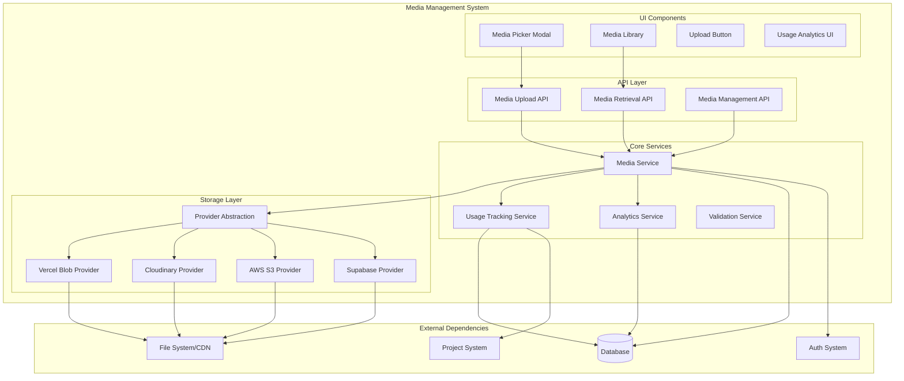

# Media Management System - Design Document

## Overview

The Media Management System provides a comprehensive solution for file storage, organization, and delivery within the portfolio platform. Built on a provider-agnostic architecture, it supports multiple storage backends while maintaining a consistent API and user experience. The system emphasizes performance, security, and ease of use while providing detailed analytics and usage tracking.

## Architecture

### System Architecture



## External API Dependencies

### Required from Portfolio-Projects System

```typescript
interface RequiredPortfolioAPIs {
  "GET /api/projects/[id]": {
    provider: "portfolio-projects";
    version: "1.0.0";
    purpose: "Validate project ownership for media uploads";
    requiredFields: ["id", "userId", "title"];
    usage: "Called before media upload to verify user can add media to project";
  };
  
  auth: {
    provider: "portfolio-projects";
    version: "1.0.0";
    purpose: "Verify user permissions for media operations";
    implementation: "NextAuth session validation middleware";
    usage: "Applied to all media management endpoints";
  };
}
```

### Required from UI System

```typescript
interface RequiredUISystemAPIs {
  // Base components
  components: {
    Button: "Shared button component with consistent styling";
    Modal: "Base modal component for media picker";
    Input: "Form input components for search and metadata";
    Card: "Container component for media items";
    Badge: "Status indicators for media items";
    Progress: "Upload progress indicators";
  };
  
  // Design tokens
  designSystem: {
    colors: "Color palette for media UI components";
    spacing: "Consistent spacing values";
    typography: "Text styles for media metadata";
    shadows: "Drop shadows for media cards";
    animations: "Transition animations for interactions";
  };
  
  // Layout patterns
  patterns: {
    gridLayout: "Responsive grid for media library";
    modalLayout: "Standard modal structure and behavior";
    formLayout: "Form patterns for media metadata editing";
  };
}
```

## Provided APIs

### Media Management APIs

```typescript
interface ProvidedAPIs {
  // Media upload endpoint
  "POST /api/media/upload": {
    version: "1.0.0";
    consumers: ["rich-content-system", "frontend-core"];
    purpose: "Upload media files to configured storage provider";
    requestBody: {
      files: "FormData with file uploads";
      projectId: "string (optional)";
      metadata: "MediaMetadata (optional)";
    };
    response: "UploadResult[]";
    changelog: {
      "1.0.0": "Initial implementation with multi-provider support";
    };
  };
  
  // Media retrieval endpoint
  "GET /api/media/[id]": {
    version: "1.0.0";
    consumers: ["rich-content-system", "frontend-core", "visitor-ai-system"];
    purpose: "Retrieve media item metadata and optimized URLs";
    parameters: {
      id: "Media item UUID";
      size?: "Requested image size (thumbnail, medium, large, original)";
      format?: "Requested format (webp, jpeg, png)";
    };
    response: "MediaItem";
    changelog: {
      "1.0.0": "Basic media retrieval with optimization";
    };
  };
  
  // Media listing endpoint
  "GET /api/media": {
    version: "1.0.0";
    consumers: ["rich-content-system"];
    purpose: "List media items with filtering and pagination";
    parameters: {
      projectId?: "Filter by project";
      type?: "Filter by media type (IMAGE, VIDEO, FILE)";
      unused?: "Filter unused media (boolean)";
      search?: "Search by filename or metadata";
      page?: "Pagination page number";
      limit?: "Items per page";
    };
    response: "PaginatedMediaList";
  };
  
  // Media deletion endpoint
  "DELETE /api/media/[id]": {
    version: "1.0.0";
    consumers: ["rich-content-system"];
    purpose: "Delete media item and remove from storage";
    parameters: {
      id: "Media item UUID";
      force?: "Force delete even if in use (boolean)";
    };
    response: "DeleteResult";
  };
  
  // Usage tracking endpoint
  "POST /api/media/[id]/track-usage": {
    version: "1.0.0";
    consumers: ["rich-content-system"];
    purpose: "Track media usage in content blocks";
    requestBody: {
      context: "Usage context (carousel, download, etc.)";
      action: "track | untrack";
      metadata?: "Additional context data";
    };
    response: "UsageTrackingResult";
  };
  
  // Analytics endpoint
  "GET /api/media/analytics": {
    version: "1.0.0";
    consumers: ["data-api-layer"];
    purpose: "Retrieve media usage analytics and statistics";
    parameters: {
      projectId?: "Filter by project";
      timeRange?: "Analytics time range";
      metrics?: "Specific metrics to retrieve";
    };
    response: "MediaAnalytics";
  };
}
```

## Provided Components

### React Components

```typescript
interface ProvidedComponents {
  // Primary media picker component
  MediaPickerModal: {
    version: "1.0.0";
    consumers: ["rich-content-system"];
    location: "src/components/media/media-picker-modal.tsx";
    purpose: "Context-aware media selection interface";
    props: {
      isOpen: "boolean";
      onClose: "() => void";
      onSelect: "(media: MediaItem[]) => void";
      context: "MediaPickerContext";
      multiSelect?: "boolean";
      allowedTypes?: "MediaType[]";
      projectId: "string";
    };
    dependencies: ["UI System Modal", "UI System Button"];
  };
  
  // Media library management interface
  MediaLibraryButton: {
    version: "1.0.0";
    consumers: ["rich-content-system"];
    location: "src/components/media/media-library-button.tsx";
    purpose: "Access point for media library with unused media indicator";
    props: {
      projectId: "string";
      unusedCount: "number";
      onOpenMediaPicker: "() => void";
      className?: "string";
    };
    dependencies: ["UI System Button", "UI System Badge"];
  };
  
  // Upload progress component
  MediaUploadProgress: {
    version: "1.0.0";
    consumers: ["rich-content-system"];
    location: "src/components/media/media-upload-progress.tsx";
    purpose: "Display upload progress for multiple files";
    props: {
      uploads: "UploadProgress[]";
      onCancel?: "(uploadId: string) => void";
      onComplete?: "(results: UploadResult[]) => void";
    };
    dependencies: ["UI System Progress", "UI System Card"];
  };
  
  // Media item display component
  MediaItemCard: {
    version: "1.0.0";
    consumers: ["rich-content-system"];
    location: "src/components/media/media-item-card.tsx";
    purpose: "Display media item with metadata and actions";
    props: {
      media: "MediaItem";
      selectable?: "boolean";
      selected?: "boolean";
      onSelect?: "(media: MediaItem) => void";
      showUsage?: "boolean";
      actions?: "MediaItemAction[]";
    };
    dependencies: ["UI System Card", "UI System Badge"];
  };
}
```

### React Hooks

```typescript
interface ProvidedHooks {
  // Media upload hook
  useMediaUpload: {
    version: "1.0.0";
    consumers: ["rich-content-system"];
    location: "src/hooks/use-media-upload.ts";
    purpose: "Handle file uploads with progress tracking";
    returns: {
      upload: "(files: File[], projectId?: string) => Promise<MediaItem[]>";
      progress: "UploadProgress[]";
      isUploading: "boolean";
      error: "string | null";
    };
  };
  
  // Project media hook
  useProjectMedia: {
    version: "1.0.0";
    consumers: ["rich-content-system"];
    location: "src/hooks/use-project-media.ts";
    purpose: "Fetch and manage project media with filtering";
    parameters: {
      projectId: "string";
      filters?: "MediaFilters";
    };
    returns: {
      media: "MediaItem[]";
      unusedMedia: "MediaItem[]";
      loading: "boolean";
      error: "string | null";
      refetch: "() => void";
    };
  };
  
  // Media usage tracking hook
  useMediaUsage: {
    version: "1.0.0";
    consumers: ["rich-content-system"];
    location: "src/hooks/use-media-usage.ts";
    purpose: "Track media usage in content blocks";
    returns: {
      trackUsage: "(mediaId: string, context: UsageContext) => void";
      untrackUsage: "(mediaId: string, context: UsageContext) => void";
      getUsageStats: "(projectId: string) => MediaUsageStats";
    };
  };
}
```

## Data Models

### Core Media Models

```typescript
interface MediaItem {
  id: string;
  projectId: string;
  userId: string;
  
  // File information
  originalName: string;
  fileName: string; // Stored filename
  fileSize: number;
  fileType: string; // MIME type
  type: MediaType; // IMAGE | VIDEO | FILE
  
  // Storage information
  storageProvider: StorageProviderType;
  storageKey: string; // Provider-specific key
  url: string; // Primary access URL
  optimizedUrls?: OptimizedUrls; // Size variants for images
  
  // Metadata
  altText?: string;
  description?: string;
  tags: string[];
  metadata: MediaMetadata; // Provider-specific metadata
  
  // Usage tracking
  usageCount: number;
  lastUsed?: Date;
  downloadCount: number;
  
  // Timestamps
  uploadedAt: Date;
  updatedAt: Date;
}

interface MediaMetadata {
  // Image-specific
  width?: number;
  height?: number;
  format?: string;
  
  // Video-specific
  duration?: number;
  bitrate?: number;
  
  // File-specific
  encoding?: string;
  
  // Provider-specific
  providerMetadata?: Record<string, any>;
}

interface OptimizedUrls {
  thumbnail: string; // 150x150
  small: string;     // 400px width
  medium: string;    // 800px width
  large: string;     // 1200px width
  original: string;  // Original size
}

interface MediaUsageContext {
  id: string;
  mediaId: string;
  projectId: string;
  context: UsageContextType; // carousel | download | thumbnail | inline
  contextId?: string; // Specific block or element ID
  metadata?: Record<string, any>;
  createdAt: Date;
}

type MediaType = 'IMAGE' | 'VIDEO' | 'FILE';
type UsageContextType = 'carousel' | 'download' | 'thumbnail' | 'inline' | 'sidebar';
type StorageProviderType = 'vercel-blob' | 'cloudinary' | 'aws-s3' | 'supabase';
```

### API Response Models

```typescript
interface UploadResult {
  success: boolean;
  media?: MediaItem;
  error?: {
    code: string;
    message: string;
    details?: any;
  };
}

interface PaginatedMediaList {
  items: MediaItem[];
  pagination: {
    page: number;
    limit: number;
    total: number;
    totalPages: number;
  };
  filters: MediaFilters;
}

interface MediaFilters {
  projectId?: string;
  type?: MediaType;
  unused?: boolean;
  search?: string;
  tags?: string[];
  dateRange?: {
    start: Date;
    end: Date;
  };
}

interface MediaAnalytics {
  totalMedia: number;
  usedMedia: number;
  unusedMedia: number;
  storageUsed: number; // bytes
  storageByType: Record<MediaType, number>;
  popularMedia: MediaItem[];
  recentUploads: MediaItem[];
  usageByContext: Record<UsageContextType, number>;
}
```

## Storage Provider Architecture

### Provider Abstraction

```typescript
interface StorageProvider {
  name: StorageProviderType;
  
  // Core operations
  upload(file: File, options: UploadOptions): Promise<UploadResult>;
  delete(key: string): Promise<void>;
  getUrl(key: string, options?: UrlOptions): Promise<string>;
  
  // Optimization
  generateOptimizedUrls(key: string, type: MediaType): Promise<OptimizedUrls>;
  
  // Configuration
  testConnection(): Promise<boolean>;
  getStorageInfo(): Promise<StorageInfo>;
  
  // Provider-specific features
  supports: {
    optimization: boolean;
    cdn: boolean;
    transformation: boolean;
    analytics: boolean;
  };
}

interface UploadOptions {
  projectId?: string;
  metadata?: MediaMetadata;
  optimization?: {
    quality?: number;
    format?: string;
    resize?: { width?: number; height?: number };
  };
}

interface StorageInfo {
  used: number; // bytes
  limit: number; // bytes
  costEstimate?: number;
  features: string[];
}
```

### Provider Implementations

```typescript
// Vercel Blob Provider
class VercelBlobProvider implements StorageProvider {
  name = 'vercel-blob' as const;
  
  async upload(file: File, options: UploadOptions): Promise<UploadResult> {
    // Implementation using @vercel/blob
  }
  
  supports = {
    optimization: false,
    cdn: true,
    transformation: false,
    analytics: false
  };
}

// Cloudinary Provider
class CloudinaryProvider implements StorageProvider {
  name = 'cloudinary' as const;
  
  async upload(file: File, options: UploadOptions): Promise<UploadResult> {
    // Implementation using cloudinary SDK
  }
  
  async generateOptimizedUrls(key: string, type: MediaType): Promise<OptimizedUrls> {
    // Generate transformation URLs
  }
  
  supports = {
    optimization: true,
    cdn: true,
    transformation: true,
    analytics: true
  };
}
```

## UI Integration Strategy

### Design System Integration

The Media Management System follows the hybrid UI approach, implementing domain-specific components while leveraging the shared UI system:

```typescript
// Media components use UI system foundations
import { Button, Modal, Card, Badge } from '@/components/ui';
import { useTheme } from '@/hooks/use-theme';

const MediaPickerModal: React.FC<MediaPickerModalProps> = ({ ... }) => {
  const { colors, spacing, typography } = useTheme();
  
  return (
    <Modal size="large" className="media-picker-modal">
      <Modal.Header>
        <h2 style={{ ...typography.heading2 }}>Select Media</h2>
      </Modal.Header>
      
      <Modal.Body>
        {/* Domain-specific media grid using UI system components */}
        <div className="media-grid" style={{ gap: spacing.md }}>
          {media.map(item => (
            <Card key={item.id} className="media-item">
              {/* Media-specific content */}
            </Card>
          ))}
        </div>
      </Modal.Body>
      
      <Modal.Footer>
        <Button variant="secondary" onClick={onClose}>Cancel</Button>
        <Button variant="primary" onClick={handleSelect}>Select</Button>
      </Modal.Footer>
    </Modal>
  );
};
```

### Component Styling Strategy

```scss
// Media-specific styles that extend UI system
.media-picker-modal {
  // Uses UI system modal base styles
  // Adds media-specific customizations
  
  .media-grid {
    display: grid;
    grid-template-columns: repeat(auto-fill, minmax(120px, 1fr));
    gap: var(--spacing-md); // From UI system
  }
  
  .media-item {
    // Extends UI system card styles
    aspect-ratio: 1;
    cursor: pointer;
    transition: var(--transition-default); // From UI system
    
    &:hover {
      transform: translateY(-2px);
      box-shadow: var(--shadow-lg); // From UI system
    }
    
    &.selected {
      border-color: var(--color-primary); // From UI system
    }
  }
}
```

## Performance Considerations

### Upload Optimization

```typescript
interface UploadOptimization {
  // Chunked uploads for large files
  chunkSize: 5 * 1024 * 1024; // 5MB chunks
  
  // Parallel uploads with concurrency limit
  maxConcurrentUploads: 3;
  
  // Client-side image optimization
  imageOptimization: {
    maxWidth: 2048;
    maxHeight: 2048;
    quality: 0.85;
    format: 'webp' | 'jpeg';
  };
  
  // Progress tracking
  progressUpdateInterval: 100; // ms
}
```

### Caching Strategy

```typescript
interface CachingStrategy {
  // Media metadata caching
  metadataCache: {
    ttl: 300; // 5 minutes
    maxSize: 1000; // items
  };
  
  // Usage statistics caching
  usageStatsCache: {
    ttl: 600; // 10 minutes
    invalidateOn: ['media_upload', 'media_delete', 'usage_change'];
  };
  
  // Provider status caching
  providerStatusCache: {
    ttl: 900; // 15 minutes
    refreshInBackground: true;
  };
}
```

## Security Considerations

### File Validation

```typescript
interface SecurityValidation {
  // File type validation
  allowedMimeTypes: string[];
  fileExtensionValidation: boolean;
  magicNumberValidation: boolean;
  
  // Size limits
  maxFileSize: number; // bytes
  maxTotalUpload: number; // bytes per request
  
  // Content scanning
  virusScanning?: boolean;
  contentAnalysis?: boolean;
  
  // Access control
  userQuotas: Record<string, number>;
  rateLimiting: {
    uploadsPerMinute: number;
    uploadsPerHour: number;
  };
}
```

### Secure URLs

```typescript
interface SecureUrlGeneration {
  // Signed URLs for private content
  generateSignedUrl(mediaId: string, expiresIn: number): Promise<string>;
  
  // Access token validation
  validateAccess(mediaId: string, userId: string): Promise<boolean>;
  
  // Download tracking
  trackDownload(mediaId: string, context: DownloadContext): Promise<void>;
}
```

This design provides a comprehensive foundation for the Media Management System while maintaining clear boundaries with other system domains and following the hybrid UI development approach.