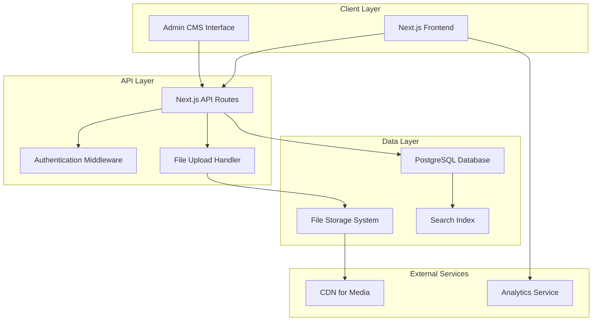

# Design Document

## Overview

The portfolio website will be built as a modern, performant web application using Next.js 14 with App Router, providing comprehensive server-side rendering (SSR) for optimal SEO and fast initial page loads. The system follows a modular, component-based architecture with a PostgreSQL database, RESTful API, and a React-based admin CMS. The frontend utilizes shadcn/ui components for consistent, accessible design and Framer Motion for smooth animations.

The application features a flexible homepage with multiple sections (hero, about, featured projects, contact) and a dedicated projects page with full functionality. The projects functionality is built as a reusable, configurable module that works across different contexts while maintaining consistent behavior and appearance.

The application prioritizes SEO optimization through server-side rendering of all public content, ensuring search engines can fully index the homepage, projects pages, and individual project details. After the initial server-rendered load, client-side JavaScript enhances the experience with real-time filtering, search, and interactive features.

The application will be deployed on a separate subdomain and designed mobile-first with responsive layouts. The modular architecture supports easy customization, A/B testing, and iterative design improvements while maintaining code reusability and consistency.

## Architecture

### System Architecture



### Technology Stack

**Frontend:**
- Next.js 14 (App Router with SSR/SSG)
- React 18 (with Server Components)
- TypeScript
- Tailwind CSS
- shadcn/ui components
- Framer Motion (animations)
- React Hook Form (forms)
- Zustand (state management)
- next-seo (SEO optimization)
- next-sitemap (automated sitemap generation)

**Backend:**
- Next.js API Routes
- PostgreSQL with Prisma ORM
- NextAuth.js (authentication)
- Multer (file uploads)
- Sharp (image processing)
- AI Integration: Anthropic Claude API, OpenAI API
- Encryption: Node.js crypto module (API key security)
- Rate Limiting: upstash/ratelimit or built-in middleware

**Infrastructure:**
- Hosting: Vercel (free tier for development, Pro for production if needed)
- Database: Configurable - Supabase (default) or Vercel Postgres
- Media Storage: Configurable - Cloudinary (default), AWS S3, Vercel Blob, or Supabase Storage
- Video Hosting: YouTube/Vimeo embeds or media provider video support
- Analytics: Vercel Analytics or Google Analytics

## Modular Section Architecture

### Page Structure

**Homepage (`/`):**
- HeroSection: Introduction and call-to-action
- AboutSection: Professional background and skills
- ProjectsSection: Featured projects (configurable subset)
- ContactSection: Contact information and links

**Projects Page (`/projects`):**
- ProjectsSection: Full projects list with search and filtering
- Same component as homepage, different configuration

**Individual Project Pages (`/projects/[slug]`):**
- ProjectModal: Detailed project view (can also be modal overlay)

### Modular Components Design

**ProjectsSection (Core Reusable Component)**
```typescript
interface ProjectsSectionProps {
  variant: 'homepage' | 'full-page' | 'featured';
  config: ProjectsSectionConfig;
  className?: string;
}

interface ProjectsSectionConfig {
  // Display options
  maxItems?: number; // undefined = show all
  layout: 'grid' | 'timeline' | 'carousel';
  columns?: 2 | 3 | 4; // for grid layout
  
  // Features
  showSearch: boolean;
  showFilters: boolean;
  showSorting: boolean;
  showViewToggle: boolean; // grid/timeline toggle
  
  // Styling
  theme?: 'default' | 'dark' | 'minimal' | 'colorful';
  spacing: 'compact' | 'normal' | 'spacious';
  
  // Behavior
  openMode: 'modal' | 'page'; // how projects open
  filterTags?: string[]; // pre-filter to specific tags
  sortBy?: 'date' | 'title' | 'popularity';
}

// Usage examples:
// Homepage: Limited projects, no advanced features
<ProjectsSection 
  variant="homepage"
  config={{
    maxItems: 6,
    layout: 'grid',
    showSearch: false,
    showFilters: false,
    theme: 'default',
    openMode: 'modal'
  }}
/>

// Full projects page: All features enabled
<ProjectsSection 
  variant="full-page"
  config={{
    layout: 'grid',
    showSearch: true,
    showFilters: true,
    showSorting: true,
    showViewToggle: true,
    openMode: 'modal'
  }}
/>
```

**Section Management System**
```typescript
interface SectionConfig {
  id: string;
  type: 'hero' | 'about' | 'projects' | 'contact' | 'custom';
  enabled: boolean;
  order: number;
  config: Record<string, any>; // Section-specific configuration
}

interface HomepageConfig {
  sections: SectionConfig[];
  globalTheme: string;
  layout: 'standard' | 'single-page' | 'multi-page';
}

// Admin can configure each section independently
const homepageConfig: HomepageConfig = {
  sections: [
    {
      id: 'hero',
      type: 'hero',
      enabled: true,
      order: 1,
      config: {
        title: 'John Doe',
        subtitle: 'Full Stack Developer',
        backgroundImage: '/hero-bg.jpg',
        ctaText: 'View My Work',
        ctaLink: '/projects'
      }
    },
    {
      id: 'projects',
      type: 'projects',
      enabled: true,
      order: 3,
      config: {
        maxItems: 6,
        layout: 'grid',
        showFilters: false,
        theme: 'default',
        title: 'Featured Projects'
      }
    }
  ]
};
```

## Admin Design Language and Navigation System

### Admin Layout Architecture

The admin interface uses a consistent, professional design language based on shadcn/ui dashboard and sidebar components. All admin functionality across all specs (portfolio-projects, ai-system, media-management, ui-system) follows this unified design system.

**Core Admin Layout Structure:**
```typescript
interface AdminLayoutProps {
  children: React.ReactNode;
  currentSection: AdminSection;
  currentPage: string;
}

// Based on shadcn dashboard-01 and sidebar-07 components
const AdminLayout = ({ children, currentSection, currentPage }: AdminLayoutProps) => (
  <div className="admin-layout">
    <AdminSidebar currentSection={currentSection} currentPage={currentPage} />
    <AdminMainContent>
      <AdminHeader currentPage={currentPage} />
      <AdminContentArea>{children}</AdminContentArea>
    </AdminMainContent>
  </div>
);
```

### Admin Sidebar Structure

**Collapsible Sidebar with Expandable Drawers:**
```typescript
interface AdminSidebarStructure {
  sections: AdminSection[];
}

interface AdminSection {
  id: string;
  title: string;
  icon: React.ComponentType;
  items: AdminSectionItem[];
  defaultExpanded?: boolean;
}

interface AdminSectionItem {
  id: string;
  title: string;
  href: string;
  icon?: React.ComponentType;
  badge?: string | number;
}

// Complete admin navigation structure
const ADMIN_NAVIGATION: AdminSidebarStructure = {
  sections: [
    {
      id: 'overview',
      title: 'Overview',
      icon: LayoutDashboard,
      items: [
        { id: 'dashboard', title: 'Dashboard', href: '/admin', icon: Home },
        { id: 'analytics', title: 'Analytics', href: '/admin/analytics', icon: BarChart3 }
      ]
    },
    {
      id: 'homepage',
      title: 'Homepage',
      icon: Globe,
      defaultExpanded: true,
      items: [
        { id: 'sections', title: 'Sections', href: '/admin/homepage/sections', icon: Layout },
        { id: 'global-settings', title: 'Global Settings', href: '/admin/homepage/settings', icon: Settings }
      ]
    },
    {
      id: 'projects',
      title: 'Projects',
      icon: FolderOpen,
      items: [
        { id: 'all-projects', title: 'All Projects', href: '/admin/projects', icon: FileText },
        { id: 'new-project', title: 'New Project', href: '/admin/projects/editor', icon: Plus },
        { id: 'categories', title: 'Categories', href: '/admin/projects/categories', icon: Tag },
        { id: 'tags', title: 'Tags', href: '/admin/projects/tags', icon: Hash }
      ]
    },
    {
      id: 'ai-assistant',
      title: 'AI Assistant',
      icon: Bot,
      items: [
        { id: 'ai-settings', title: 'AI Settings', href: '/admin/ai/settings', icon: Settings },
        { id: 'ai-usage', title: 'Usage & Costs', href: '/admin/ai/usage', icon: DollarSign },
        { id: 'ai-prompts', title: 'Custom Prompts', href: '/admin/ai/prompts', icon: MessageSquare }
      ]
    },
    {
      id: 'media',
      title: 'Media Library',
      icon: Image,
      items: [
        { id: 'all-media', title: 'All Media', href: '/admin/media', icon: Grid3X3 },
        { id: 'upload', title: 'Upload', href: '/admin/media/upload', icon: Upload },
        { id: 'unused', title: 'Unused Media', href: '/admin/media/unused', icon: Trash2, badge: 'cleanup' }
      ]
    },
    {
      id: 'settings',
      title: 'Settings',
      icon: Settings,
      items: [
        { id: 'general', title: 'General', href: '/admin/settings/general', icon: Sliders },
        { id: 'seo', title: 'SEO & Meta', href: '/admin/settings/seo', icon: Search },
        { id: 'theme', title: 'Theme & UI', href: '/admin/settings/theme', icon: Palette },
        { id: 'advanced', title: 'Advanced', href: '/admin/settings/advanced', icon: Terminal }
      ]
    }
  ]
};
```

### Admin Page Layout Standards

**Consistent Page Structure:**
```typescript
interface AdminPageLayoutProps {
  title: string;
  description?: string;
  actions?: React.ReactNode;
  children: React.ReactNode;
  breadcrumbs?: BreadcrumbItem[];
}

interface BreadcrumbItem {
  title: string;
  href?: string;
}

// Standard admin page wrapper
const AdminPageLayout = ({ title, description, actions, children, breadcrumbs }: AdminPageLayoutProps) => (
  <div className="admin-page">
    <AdminPageHeader 
      title={title} 
      description={description} 
      actions={actions}
      breadcrumbs={breadcrumbs}
    />
    <AdminPageContent>{children}</AdminPageContent>
  </div>
);
```

### Admin Component Standards

**Form Layout Standards:**
```typescript
// Consistent form styling across all admin pages
interface AdminFormProps {
  title?: string;
  description?: string;
  children: React.ReactNode;
  actions?: React.ReactNode;
  maxWidth?: 'sm' | 'md' | 'lg' | 'xl' | 'full';
}

// Standard form patterns
const AdminForm = ({ title, description, children, actions, maxWidth = 'lg' }: AdminFormProps) => (
  <Card className={`admin-form max-w-${maxWidth}`}>
    {(title || description) && (
      <CardHeader>
        {title && <CardTitle>{title}</CardTitle>}
        {description && <CardDescription>{description}</CardDescription>}
      </CardHeader>
    )}
    <CardContent>{children}</CardContent>
    {actions && <CardFooter>{actions}</CardFooter>}
  </Card>
);
```

**Table Layout Standards:**
```typescript
// Consistent table styling with actions
interface AdminTableProps<T> {
  data: T[];
  columns: AdminTableColumn<T>[];
  actions?: AdminTableAction<T>[];
  searchable?: boolean;
  filterable?: boolean;
  pagination?: boolean;
}

interface AdminTableColumn<T> {
  key: keyof T;
  title: string;
  render?: (value: T[keyof T], row: T) => React.ReactNode;
  sortable?: boolean;
  width?: string;
}

interface AdminTableAction<T> {
  label: string;
  icon?: React.ComponentType;
  onClick: (row: T) => void;
  variant?: 'default' | 'destructive' | 'outline';
  disabled?: (row: T) => boolean;
}
```

**Action Button Standards:**
```typescript
// Consistent action button patterns
interface AdminActionsProps {
  primary?: AdminAction;
  secondary?: AdminAction[];
  destructive?: AdminAction;
  alignment?: 'left' | 'right' | 'between';
}

interface AdminAction {
  label: string;
  onClick: () => void;
  icon?: React.ComponentType;
  loading?: boolean;
  disabled?: boolean;
  variant?: 'default' | 'destructive' | 'outline' | 'secondary';
}

// Standard action bar
const AdminActions = ({ primary, secondary, destructive, alignment = 'right' }: AdminActionsProps) => (
  <div className={`admin-actions flex items-center gap-2 justify-${alignment}`}>
    {destructive && (
      <Button variant="destructive" onClick={destructive.onClick} disabled={destructive.disabled}>
        {destructive.icon && <destructive.icon className="w-4 h-4 mr-2" />}
        {destructive.label}
      </Button>
    )}
    <div className="flex items-center gap-2">
      {secondary?.map((action, index) => (
        <Button key={index} variant={action.variant || 'outline'} onClick={action.onClick}>
          {action.icon && <action.icon className="w-4 h-4 mr-2" />}
          {action.label}
        </Button>
      ))}
      {primary && (
        <Button onClick={primary.onClick} disabled={primary.disabled}>
          {primary.loading && <Loader2 className="w-4 h-4 mr-2 animate-spin" />}
          {!primary.loading && primary.icon && <primary.icon className="w-4 h-4 mr-2" />}
          {primary.label}
        </Button>
      )}
    </div>
  </div>
);
```

### Responsive Behavior

**Mobile/Tablet Adaptations:**
- Sidebar collapses to hamburger menu on screens < 1024px
- Desktop sidebar can be toggled for more workspace
- Touch-friendly navigation and form controls
- Responsive table layouts with horizontal scrolling
- Mobile-optimized form layouts with full-width inputs

### Integration with Existing Functionality

**Project Editor Integration:**
- Project editor opens within the admin layout
- Maintains sidebar navigation for easy switching
- Breadcrumb navigation shows: Projects > Edit > [Project Name]
- All existing functionality preserved within new layout

**Cross-Spec Consistency:**
- All admin pages across specs use the same layout wrapper
- Consistent navigation patterns and visual hierarchy
- Shared component library for forms, tables, and actions
- Unified theming and responsive behavior

### Component Reusability Strategy

**1. Single Source of Truth**
- ProjectsSection component handles all project display logic
- Same filtering, search, and modal functionality everywhere
- Consistent behavior across homepage and projects page

**2. Configuration-Driven Behavior**
- Props control what features are enabled/disabled
- Same component, different capabilities based on context
- Easy to A/B test different configurations

**3. Theme and Layout Flexibility**
- Each section can have independent theming
- Layout options (grid, timeline, carousel) per section
- Responsive behavior consistent across all uses

**4. Admin Control**
- Centralized section management in admin interface
- Drag-and-drop section reordering
- Live preview of configuration changes

## Server-Side Rendering (SSR) Architecture

### SSR Strategy

The portfolio system implements a hybrid rendering approach:

**Server-Side Rendered Pages:**
- Homepage (`/`) - Hero, about, featured projects, contact sections
- Projects page (`/projects`) - Full project list with filtering
- Project detail pages (`/projects/[slug]`) - Complete project content
- Sitemap (`/sitemap.xml`) - Auto-generated page and project index

**Client-Side Enhanced Features:**
- Real-time search and filtering
- Project modal navigation
- Interactive animations
- Admin interface (CSR only)
- AI interactive features (from client-side-ai spec)
- Floating AI assistant for visitors
- AI-powered project recommendations
- Interactive AI chat overlays

### SEO Optimization Components

**MetaDataGenerator**
```typescript
interface ProjectMetadata {
  title: string;
  description: string;
  keywords: string[];
  ogImage: string;
  canonicalUrl: string;
  structuredData: StructuredData;
}

interface StructuredData {
  "@context": "https://schema.org";
  "@type": "CreativeWork" | "SoftwareApplication" | "WebSite";
  name: string;
  description: string;
  author: Person;
  dateCreated: string;
  keywords: string[];
  image?: string;
  url: string;
}
```

**SitemapGenerator**
```typescript
interface SitemapEntry {
  url: string;
  lastModified: Date;
  changeFrequency: 'always' | 'hourly' | 'daily' | 'weekly' | 'monthly' | 'yearly' | 'never';
  priority: number;
}

// Auto-generated sitemap structure
const sitemapConfig = {
  homepage: { priority: 1.0, changeFreq: 'weekly' },
  projectPages: { priority: 0.8, changeFreq: 'monthly' },
  staticPages: { priority: 0.6, changeFreq: 'yearly' }
};
```

### Server Component Architecture

**ProjectListServer** (Server Component)
```typescript
// Renders initial project list on server
async function ProjectListServer({ 
  initialProjects, 
  totalCount 
}: {
  initialProjects: Project[];
  totalCount: number;
}) {
  // Server-rendered project grid
  return (
    <div className="project-grid">
      {initialProjects.map(project => (
        <ProjectCardServer key={project.id} project={project} />
      ))}
      <ProjectListClient initialData={{ initialProjects, totalCount }} />
    </div>
  );
}
```

**ProjectDetailServer** (Server Component)
```typescript
// Renders complete project on server
async function ProjectDetailServer({ slug }: { slug: string }) {
  const project = await getProjectBySlug(slug);
  
  if (!project) {
    notFound();
  }
  
  return (
    <>
      <ProjectMetaTags project={project} />
      <ProjectContent project={project} />
      <ProjectDetailClient project={project} />
    </>
  );
}
```

### Hydration Strategy

**Progressive Enhancement Pattern:**
1. Server renders complete HTML with all content visible
2. Client JavaScript loads and hydrates interactive features
3. Enhanced features (search, filtering) become available
4. AI interactive features initialize after hydration (from client-side-ai spec)
5. Floating AI assistant becomes available for visitor interactions
6. No content shift or loading states for initial view

**AI Integration with SSR:**
- Server-rendered content provides full context for AI features
- AI assistant can reference all visible project content immediately
- AI recommendations work with both server-rendered and client-filtered content
- AI chat overlays enhance the server-rendered experience without blocking it

**HydrationBoundary**
```typescript
interface HydrationBoundaryProps {
  children: React.ReactNode;
  fallback?: React.ReactNode;
  suppressHydrationWarning?: boolean;
}

// Prevents hydration mismatches for client-only features
function HydrationBoundary({ children, fallback }: HydrationBoundaryProps) {
  const [isClient, setIsClient] = useState(false);
  
  useEffect(() => {
    setIsClient(true);
  }, []);
  
  if (!isClient) {
    return fallback || null;
  }
  
  return <>{children}</>;
}
```

### Performance Optimization

**Static Generation for Public Content:**
```typescript
// Generate static pages for all public projects
export async function generateStaticParams() {
  const projects = await getPublicProjects();
  
  return projects.map((project) => ({
    slug: project.slug,
  }));
}

// Revalidate static content when projects change
export const revalidate = 3600; // 1 hour
```

**Streaming for Large Content:**
```typescript
// Stream project content for faster perceived performance
export default async function ProjectPage({ params }: { params: { slug: string } }) {
  return (
    <Suspense fallback={<ProjectSkeleton />}>
      <ProjectDetailServer slug={params.slug} />
    </Suspense>
  );
}
```

## Components and Interfaces

### Frontend Components

#### Core Layout Components

**Homepage**
```typescript
interface HomepageProps {
  config: HomepageConfig;
  sections: SectionConfig[];
}
```

**SectionRenderer**
```typescript
interface SectionRendererProps {
  section: SectionConfig;
  isEditing?: boolean;
  onConfigChange?: (config: Record<string, any>) => void;
}
```

**ProjectsLayout**
```typescript
interface ProjectsLayoutProps {
  children: React.ReactNode;
  showFilters?: boolean;
  viewMode: 'grid' | 'timeline';
}
```

**NavigationBar**
```typescript
interface NavigationBarProps {
  tags: Tag[];
  selectedTags: string[];
  onTagSelect: (tags: string[]) => void;
  searchQuery: string;
  onSearchChange: (query: string) => void;
  sortBy: SortOption;
  onSortChange: (sort: SortOption) => void;
  viewMode: 'grid' | 'timeline';
  onViewModeChange: (mode: 'grid' | 'timeline') => void;
}
```

#### Homepage Section Components

**HeroSection**
```typescript
interface HeroSectionProps {
  title: string;
  subtitle: string;
  description?: string;
  backgroundImage?: string;
  ctaText?: string;
  ctaLink?: string;
  theme?: string;
}
```

**AboutSection**
```typescript
interface AboutSectionProps {
  content: string;
  skills?: string[];
  showSkills: boolean;
  profileImage?: string;
  theme?: string;
}
```

**ContactSection**
```typescript
interface ContactSectionProps {
  email?: string;
  socialLinks: SocialLink[];
  showContactForm: boolean;
  theme?: string;
}

interface SocialLink {
  platform: string;
  url: string;
  icon: string;
}
```

#### Project Display Components

**ProjectsSection** (Modular, Reusable)
```typescript
interface ProjectsSectionProps {
  variant: 'homepage' | 'full-page' | 'featured';
  config: ProjectsSectionConfig;
  projects?: Project[]; // For SSR
  className?: string;
}
```

**ProjectGrid**
```typescript
interface ProjectGridProps {
  projects: Project[];
  loading: boolean;
  onProjectClick: (projectId: string) => void;
}
```

**ProjectCard**
```typescript
interface ProjectCardProps {
  project: Project;
  onClick: () => void;
  showViewCount?: boolean;
}
```

**ProjectTimeline**
```typescript
interface ProjectTimelineProps {
  projects: Project[];
  groupBy: 'year' | 'month';
  onProjectClick: (projectId: string) => void;
}
```

#### Project Detail Components

**ProjectModal**
```typescript
interface ProjectModalProps {
  project: Project | null;
  isOpen: boolean;
  onClose: () => void;
}
```

**ProjectMetadata**
```typescript
interface ProjectMetadataProps {
  project: Project;
  relatedProjects: Project[];
}
```

**ProjectArticle**
```typescript
interface ProjectArticleProps {
  content: ArticleContent;
  media: MediaItem[];
  interactiveExamples: InteractiveExample[];
}
```

**MediaCarousel**
```typescript
interface MediaCarouselProps {
  images: CarouselImage[];
  autoPlay?: boolean;
  showThumbnails?: boolean;
}
```

#### Admin Components

**HomepageEditor**
```typescript
interface HomepageEditorProps {
  config: HomepageConfig;
  onConfigChange: (config: HomepageConfig) => void;
  onPreview: () => void;
  onSave: () => void;
}
```

**SectionConfigEditor**
```typescript
interface SectionConfigEditorProps {
  section: SectionConfig;
  onConfigChange: (config: Record<string, any>) => void;
  availableThemes: string[];
  isEditing: boolean;
}
```

**SectionOrderManager**
```typescript
interface SectionOrderManagerProps {
  sections: SectionConfig[];
  onReorder: (sections: SectionConfig[]) => void;
  onToggleSection: (sectionId: string, enabled: boolean) => void;
}
```

**AdminDashboard**
```typescript
interface AdminDashboardProps {
  projects: Project[];
  stats: DashboardStats;
}
```

**AISettingsPage**
```typescript
interface AISettingsPageProps {
  currentSettings: AISettings;
  onUpdateSettings: (settings: AISettings) => Promise<void>;
  onTestConnection: (provider: AIProvider) => Promise<boolean>;
}

interface AISettings {
  // Provider configurations
  providers: {
    openai: {
      apiKey: string; // Encrypted in storage
      models: AIModel[];
      defaultModel: string;
      enabled: boolean;
    };
    anthropic: {
      apiKey: string; // Encrypted in storage
      models: AIModel[];
      defaultModel: string;
      enabled: boolean;
    };
  };
  
  // Default parameters
  defaultParams: {
    temperature: number; // 0-1
    maxTokens: number;
    systemPrompt: string;
  };
  
  // UI preferences
  preferences: {
    defaultProvider: 'openai' | 'anthropic';
    showAdvancedOptions: boolean;
    enableQuickActions: boolean;
  };
}

interface AIModel {
  id: string;
  name: string;
  description: string;
  maxTokens: number;
  costPer1kTokens: number;
}

**AISettings** (Simplified Environment-Based)
```typescript
interface AISettings {
  // Environment-based API keys (read-only display)
  apiKeyStatus: {
    openai: {
      present: boolean;
      masked: string; // e.g., "sk-...xyz123"
      valid: boolean;
      lastTested: Date;
    };
    anthropic: {
      present: boolean;
      masked: string; // e.g., "sk-ant-...abc456"
      valid: boolean;
      lastTested: Date;
    };
  };
  
  // Simple model configuration
  modelConfig: {
    openai: {
      models: string; // Comma-separated: "gpt-4o, gpt-4o-mini, gpt-3.5-turbo"
      enabled: boolean;
    };
    anthropic: {
      models: string; // Comma-separated: "claude-3-5-sonnet-20241022, claude-3-5-haiku-20241022"
      enabled: boolean;
    };
  };
  
  // Default parameters
  defaultParams: {
    temperature: number; // 0-1
    maxTokens: number;
    systemPrompt: string;
  };
}

**AIProvider** (Abstraction Layer)
```typescript
interface AIProvider {
  name: 'openai' | 'anthropic';
  testConnection(): Promise<boolean>;
  listModels(): Promise<AIModel[]>;
  chat(request: ProviderChatRequest): Promise<ProviderChatResponse>;
  estimateTokens(text: string): number;
  calculateCost(tokens: number, model: string): number;
}

interface ProviderChatRequest {
  model: string;
  messages: ChatMessage[];
  temperature?: number;
  maxTokens?: number;
  systemPrompt?: string;
}

interface ProviderChatResponse {
  content: string;
  tokensUsed: number;
  cost: number;
  model: string;
  provider: string;
}
```

**UnifiedProjectEditor** (Replaces separate edit/new pages)
```typescript
interface UnifiedProjectEditorProps {
  projectId?: string; // undefined for new projects
  mode: 'create' | 'edit';
}

interface ProjectEditorState {
  // Project data
  project: ProjectFormData;
  
  // UI state
  isLoading: boolean;
  isSaving: boolean;
  hasUnsavedChanges: boolean;
  
  // AI state
  aiAssistant: {
    isEnabled: boolean;
    selectedText?: TextSelection;
    conversationHistory: AIMessage[];
    isProcessing: boolean;
  };
  
  // Validation
  errors: Record<string, string>;
  warnings: string[];
}
```

**ProjectPreviewEditor** (WYSIWYG-style editing)
```typescript
interface ProjectPreviewEditorProps {
  project: ProjectFormData;
  onChange: (updates: Partial<ProjectFormData>) => void;
  onTextSelection: (selection: TextSelection) => void;
  errors: Record<string, string>;
  className?: string;
}

// Inline editing components
interface InlineEditableProps {
  value: string;
  onChange: (value: string) => void;
  placeholder?: string;
  multiline?: boolean;
  maxLength?: number;
  error?: string;
}
```

**SmartTagInput** (Modular, reusable component)
```typescript
interface SmartTagInputProps {
  // Current tags (display only, not saved to DB until parent saves)
  value: string[];
  onChange: (tags: string[]) => void;
  
  // Existing tags for autocomplete
  existingTags: Tag[];
  
  // Configuration
  placeholder?: string;
  separators?: string[]; // [',', ';'] - default
  maxTags?: number;
  caseSensitive?: boolean; // default: false
  
  // Styling
  className?: string;
  error?: string;
  
  // Callbacks
  onTagCreate?: (tagName: string) => void; // Called when new tag is visually created
  onDuplicateAttempt?: (tagName: string) => void; // Called when duplicate is attempted
}

interface TagInputState {
  inputValue: string;
  suggestions: Tag[];
  showSuggestions: boolean;
  selectedSuggestionIndex: number;
  pendingTags: string[]; // Visual tags not yet saved to DB
}

// Modular tag behavior
interface TagInputBehavior {
  // Visual feedback for duplicates
  highlightDuplicate: (tagName: string) => void;
  
  // Autocomplete with TAB
  handleTabCompletion: (suggestions: Tag[]) => void;
  
  // Case-insensitive matching
  findExistingTag: (tagName: string, existingTags: Tag[]) => Tag | null;
  
  // Separator handling
  processSeparators: (input: string, separators: string[]) => string[];
}
```

**NovelEditorWithAI** (Novel + AI integration)
```typescript
interface NovelEditorWithAIProps {
  // Content
  initialContent: NovelContent;
  onChange: (content: NovelContent) => void;
  
  // AI integration
  aiAssistant: AIAssistantService;
  onTextSelection: (selection: TextSelection) => void;
  
  // Custom extensions
  portfolioExtensions: Extension[];
  
  // Display
  placeholder?: string;
  className?: string;
  editable?: boolean; // false for public display
}

**NovelDisplayRenderer** (Read-only display for public pages)
```typescript
interface NovelDisplayRendererProps {
  content: NovelContent;
  className?: string;
  
  // Portfolio-specific rendering
  mediaRenderer: (mediaItems: MediaItem[]) => React.ReactNode;
  interactiveRenderer: (url: string) => React.ReactNode;
  downloadRenderer: (files: DownloadableFile[]) => React.ReactNode;
}

**AIAssistantPanel** (Integrated with Novel + Status Indicator)
```typescript
interface AIAssistantPanelProps {
  // Novel editor integration
  novelEditor: Editor | null;
  selectedContent?: NovelBlock | NovelInlineContent;
  
  // Project context
  project: ProjectFormData;
  
  // AI configuration
  aiSettings: AISettings;
  aiStatus: AIConnectionStatus;
  
  // Callbacks
  onApplyChanges: (changes: NovelAIChanges) => void;
  onRefreshStatus: () => void;
  
  // Display
  isEnabled: boolean;
  height?: number; // Fixed height, default: 600px
  className?: string;
}

**AIStatusIndicator**
```typescript
interface AIStatusIndicatorProps {
  status: AIConnectionStatus;
  provider: 'openai' | 'anthropic';
  onRefresh: () => void;
  onOpenSettings: () => void;
  className?: string;
}

interface AIConnectionStatus {
  state: 'online' | 'offline' | 'error' | 'no-api-key' | 'testing' | 'rate-limited';
  message: string;
  lastChecked: Date;
  provider: 'openai' | 'anthropic';
  
  // Error details
  error?: {
    code: string;
    details: string;
    actionable: boolean;
    settingsLink?: boolean;
  };
  
  // Rate limiting info
  rateLimitInfo?: {
    resetTime: Date;
    remainingRequests: number;
  };
}

// Status indicator variants
const AI_STATUS_VARIANTS = {
  online: {
    color: 'green',
    icon: 'CheckCircle',
    message: 'AI Assistant Ready'
  },
  offline: {
    color: 'red',
    icon: 'XCircle',
    message: 'Connection Failed'
  },
  error: {
    color: 'red',
    icon: 'AlertCircle',
    message: 'Configuration Error'
  },
  'no-api-key': {
    color: 'yellow',
    icon: 'Key',
    message: 'API Key Required'
  },
  testing: {
    color: 'blue',
    icon: 'Loader',
    message: 'Testing Connection...'
  },
  'rate-limited': {
    color: 'orange',
    icon: 'Clock',
    message: 'Rate Limited'
  }
} as const;

interface AIAssistantState {
  // Conversation
  messages: AIMessage[];
  isProcessing: boolean;
  
  // Settings (inline, not separate page)
  selectedModel: AIModel;
  temperature: number;
  
  // Quick actions
  quickActions: AIQuickAction[];
  
  // User-centric principles
  preserveUserContent: boolean; // Never hallucinate
  contextAware: boolean; // Use selection context
}

// Quick action buttons
interface AIQuickAction {
  id: string;
  label: string;
  prompt: string;
  icon: React.ComponentType;
  requiresSelection: boolean;
}

// Example quick actions
const DEFAULT_QUICK_ACTIONS: AIQuickAction[] = [
  {
    id: 'improve-professional',
    label: 'Make Professional',
    prompt: 'Rewrite this text in a professional tone while preserving all original content and meaning',
    icon: Briefcase,
    requiresSelection: true
  },
  {
    id: 'improve-casual',
    label: 'Make Casual',
    prompt: 'Rewrite this text in a casual, friendly tone while preserving all original content',
    icon: Smile,
    requiresSelection: true
  },
  {
    id: 'add-tags',
    label: 'Suggest Tags',
    prompt: 'Based on this project content, suggest relevant tags that accurately describe the technologies, skills, and project type',
    icon: Tag,
    requiresSelection: false
  }
];
```

**ClickableMediaUpload** (Integrated with existing media modal)
```typescript
interface ClickableMediaUploadProps {
  // Current media
  currentMedia?: MediaItem;
  projectId?: string; // For accessing project media library
  
  // Upload handling
  onMediaSelect: (media: MediaItem) => void;
  onMediaRemove: () => void;
  
  // Drag & drop bypass
  onDirectUpload?: (file: File) => Promise<MediaItem>;
  
  // Display
  aspectRatio?: 'square' | '16:9' | '4:3' | 'auto';
  placeholder?: React.ReactNode;
  className?: string;
  
  // Validation
  maxSize?: number;
  acceptedTypes?: string[];
  error?: string;
}

// Integration with existing media modal
interface MediaModalIntegration {
  openMediaModal: (projectId: string, onSelect: (media: MediaItem) => void) => void;
  handleDragDrop: (files: FileList, onUpload: (file: File) => Promise<MediaItem>) => void;
  validateFile: (file: File, constraints: FileConstraints) => ValidationResult;
}
```

**AIResponseParser**
```typescript
interface AIResponseParserProps {
  response: string;
  originalContent: string;
  onApplyChanges: (changes: ParsedChanges) => void;
  onPreviewChanges: (changes: ParsedChanges) => void;
}
```

**VersionManagementPanel**
```typescript
interface VersionManagementPanelProps {
  projectId: string;
  versions: VersionListItem[];
  settings: VersionManagementSettings;
  onUpdateSettings: (settings: VersionManagementSettings) => void;
  onDeleteVersion: (versionId: string, reason?: string) => void;
  onBulkAction: (action: BulkVersionAction) => void;
  onClearHistory: (keepLatest?: number) => void;
  onRestoreVersion: (versionId: string) => void;
}
```

**AutoSaveSettings**
```typescript
interface AutoSaveSettingsProps {
  currentInterval: number; // seconds
  onIntervalChange: (seconds: number) => void;
  isActive: boolean;
  lastSaveTime?: Date;
  hasUnsavedChanges: boolean;
}

const AUTO_SAVE_OPTIONS = [
  { label: 'Disabled', value: 0 },
  { label: 'Every 30 seconds', value: 30 },
  { label: 'Every 1 minute', value: 60 },
  { label: 'Every 2 minutes', value: 120 },
  { label: 'Every 5 minutes', value: 300 },
  { label: 'Every 10 minutes', value: 600 }
];
```

**VersionHistoryDialog**
```typescript
interface VersionHistoryDialogProps {
  isOpen: boolean;
  onClose: () => void;
  projectId: string;
  currentProject: Project;
  onRestoreVersion: (versionId: string) => void;
  showDiff?: boolean; // Show diff between versions
}
```

## AI Integration Architecture

### AI Service Abstraction

**AI Provider Interface**
```typescript
interface AIServiceProvider {
  name: 'anthropic' | 'openai';
  chat(request: AIRequest): Promise<AIResponse>;
  validateApiKey(apiKey: string): Promise<boolean>;
  getModels(): Promise<AIModel[]>;
  estimateTokens(text: string): number;
  calculateCost(tokens: number, model: string): number;
}
```

**Anthropic Provider Implementation**
```typescript
class AnthropicProvider implements AIServiceProvider {
  private client: Anthropic;
  
  async chat(request: AIRequest): Promise<AIResponse> {
    const message = await this.client.messages.create({
      model: request.model,
      max_tokens: request.maxTokens || 4000,
      temperature: request.temperature || 0.7,
      system: request.systemPrompt,
      messages: [
        { role: 'user', content: this.buildPrompt(request) }
      ]
    });
    
    return this.parseResponse(message);
  }
  
  private buildPrompt(request: AIRequest): string {
    const context = this.formatContext(request.context);
    return `${request.prompt}\n\n**Context:**\n${context}`;
  }
}
```

**OpenAI Provider Implementation**
```typescript
class OpenAIProvider implements AIServiceProvider {
  private client: OpenAI;
  
  async chat(request: AIRequest): Promise<AIResponse> {
    const completion = await this.client.chat.completions.create({
      model: request.model,
      temperature: request.temperature || 0.7,
      max_tokens: request.maxTokens || 4000,
      messages: [
        { role: 'system', content: request.systemPrompt },
        { role: 'user', content: this.buildPrompt(request) }
      ]
    });
    
    return this.parseResponse(completion);
  }
}
```

### AI Response Parsing Strategy

**Enhanced Structured Response Format (JSON)**
```typescript
interface StructuredAIResponse {
  reasoning: string;
  changes: {
    // Full content replacement
    articleContent?: string;
    
    // Partial text replacement (for selections)
    partialUpdate?: {
      start: number;
      end: number;
      content: string;
      reasoning: string;
      preserveFormatting: boolean;
    };
    
    // Metadata changes
    metadata?: {
      title?: string;
      description?: string;
      briefOverview?: string;
      tags?: {
        add: string[];
        remove: string[];
        reasoning: string;
      };
      externalLinks?: {
        add: ExternalLink[];
        remove: string[]; // URLs to remove
        reasoning: string;
      };
    };
    
    // Media suggestions (AI can suggest media changes)
    media?: {
      suggestions: MediaSuggestion[];
      reorder?: { id: string; newOrder: number }[];
      reasoning: string;
    };
  };
  confidence: number;
  warnings: string[];
  modelUsed: string;
  tokensUsed: number;
}

interface MediaSuggestion {
  type: 'add' | 'remove' | 'replace';
  targetId?: string; // For remove/replace
  suggestion: string; // Description of what media to add
  placement: 'inline' | 'gallery' | 'header';
  reasoning: string;
}

// System prompt template for JSON responses
const SYSTEM_PROMPT_TEMPLATE = `
You are an expert content editor for portfolio projects. Respond ONLY with valid JSON in this exact format:

{
  "reasoning": "Brief explanation of your analysis and changes",
  "changes": {
    "articleContent": "Full replacement content (only if replacing entire article)",
    "partialUpdate": {
      "start": 123,
      "end": 456,
      "content": "replacement text",
      "reasoning": "why this specific change",
      "preserveFormatting": true
    },
    "metadata": {
      "tags": {
        "add": ["new-tag"],
        "remove": ["old-tag"],
        "reasoning": "why these tag changes"
      }
    }
  },
  "confidence": 0.95,
  "warnings": ["any concerns about the changes"],
  "modelUsed": "${modelName}",
  "tokensUsed": 0
}

Use the custom system prompt from settings for style and tone preferences.
`;
```

**AI Model Configuration**
```typescript
const AI_MODELS = {
  anthropic: [
    {
      id: 'claude-3-5-sonnet-20241022',
      name: 'Claude 3.5 Sonnet',
      maxTokens: 200000,
      costPer1kTokens: 0.015,
      capabilities: ['json-mode', 'long-context', 'complex-reasoning']
    },
    {
      id: 'claude-3-5-haiku-20241022',
      name: 'Claude 3.5 Haiku',
      maxTokens: 200000,
      costPer1kTokens: 0.0025,
      capabilities: ['json-mode', 'fast-response']
    }
  ],
  openai: [
    {
      id: 'gpt-4o',
      name: 'GPT-4o',
      maxTokens: 128000,
      costPer1kTokens: 0.03,
      capabilities: ['json-mode', 'function-calling', 'vision']
    },
    {
      id: 'gpt-4o-mini',
      name: 'GPT-4o Mini',
      maxTokens: 128000,
      costPer1kTokens: 0.0015,
      capabilities: ['json-mode', 'fast-response']
    },
    {
      id: 'gpt-3.5-turbo',
      name: 'GPT-3.5 Turbo',
      maxTokens: 16000,
      costPer1kTokens: 0.002,
      capabilities: ['json-mode']
    }
  ]
};
```

**Response Parser**
```typescript
class AIResponseParser {
  static parse(response: string, originalProject: Project): ParsedChanges {
    try {
      // Try to parse as JSON first
      const structured = JSON.parse(response) as StructuredAIResponse;
      return this.parseStructured(structured, originalProject);
    } catch {
      // Fallback to text parsing with regex patterns
      return this.parseTextResponse(response, originalProject);
    }
  }
  
  private static parseStructured(
    response: StructuredAIResponse, 
    original: Project
  ): ParsedChanges {
    return {
      articleContent: response.changes.articleContent,
      partialUpdate: response.changes.partialUpdate,
      tagsToAdd: response.changes.metadata?.tags?.add || [],
      tagsToRemove: response.changes.metadata?.tags?.remove || [],
      metadataChanges: response.changes.metadata,
      // ... other mappings
    };
  }
}
```

### Security and API Key Management

**Encryption Service**
```typescript
class EncryptionService {
  private static algorithm = 'aes-256-gcm';
  private static key = process.env.ENCRYPTION_KEY!;
  
  static encrypt(text: string): string {
    const iv = crypto.randomBytes(16);
    const cipher = crypto.createCipher(this.algorithm, this.key);
    cipher.setAAD(Buffer.from('ai-api-key'));
    
    let encrypted = cipher.update(text, 'utf8', 'hex');
    encrypted += cipher.final('hex');
    
    const authTag = cipher.getAuthTag();
    return iv.toString('hex') + ':' + authTag.toString('hex') + ':' + encrypted;
  }
  
  static decrypt(encryptedText: string): string {
    const parts = encryptedText.split(':');
    const iv = Buffer.from(parts[0], 'hex');
    const authTag = Buffer.from(parts[1], 'hex');
    const encrypted = parts[2];
    
    const decipher = crypto.createDecipher(this.algorithm, this.key);
    decipher.setAAD(Buffer.from('ai-api-key'));
    decipher.setAuthTag(authTag);
    
    let decrypted = decipher.update(encrypted, 'hex', 'utf8');
    decrypted += decipher.final('utf8');
    
    return decrypted;
  }
}
```

### Cost Control and Usage Tracking

**Simplified Cost Control (Single Admin User)**
```typescript
interface CostControlConfig {
  dailyCostLimit: number;
  monthlyTokenLimit: number;
  alertThreshold: number; // Percentage of limit to trigger warning
}

class AICostTracker {
  static async checkLimits(request: AIRequest): Promise<boolean> {
    const usage = await this.getTodaysUsage();
    const config = await this.getCostLimits();
    
    // Check daily cost limit
    const estimatedCost = this.estimateRequestCost(request);
    if (usage.dailyCost + estimatedCost > config.dailyCostLimit) {
      throw new CostLimitError(`Daily cost limit of $${config.dailyCostLimit} would be exceeded`);
    }
    
    // Check monthly token limit
    const monthlyUsage = await this.getMonthlyUsage();
    const estimatedTokens = this.estimateRequestTokens(request);
    if (monthlyUsage.tokens + estimatedTokens > config.monthlyTokenLimit) {
      throw new CostLimitError(`Monthly token limit of ${config.monthlyTokenLimit} would be exceeded`);
    }
    
    // Warning if approaching limits
    if (usage.dailyCost + estimatedCost > config.dailyCostLimit * config.alertThreshold) {
      console.warn(`Approaching daily cost limit: $${usage.dailyCost + estimatedCost}/$${config.dailyCostLimit}`);
    }
    
    return true;
  }
  
  static async trackUsage(request: AIRequest, response: AIResponse): Promise<void> {
    await this.logUsage({
      provider: request.provider,
      model: request.model,
      tokensUsed: response.metadata.tokens,
      estimatedCost: response.metadata.cost,
      requestType: 'chat',
      projectId: request.context.metadata.title,
      timestamp: new Date()
    });
  }
}
```

### Context Building Strategy

**Simplified Project Context Builder**
```typescript
class ProjectContextBuilder {
  static buildContext(
    project: Project, 
    selectedText?: TextSelection
  ): ProjectContext {
    const context: ProjectContext = {
      currentContent: project.articleContent?.content || '',
      tags: project.tags.map(t => t.name),
      externalLinks: project.externalLinks,
      mediaItems: project.mediaItems,
      metadata: {
        title: project.title,
        description: project.description,
        workDate: project.workDate,
        status: project.status
      }
    };
    
    if (selectedText) {
      context.selectedText = {
        ...selectedText,
        context: this.getTextContext(selectedText, project.articleContent?.content || '')
      };
    }
    
    return context;
  }
  
  private static getTextContext(selection: TextSelection, fullText: string): string {
    const contextLength = 300; // Provide surrounding context for AI
    const start = Math.max(0, selection.start - contextLength);
    const end = Math.min(fullText.length, selection.end + contextLength);
    
    return fullText.substring(start, end);
  }
  
  // Future enhancement: Pattern analysis for task 9.5
  static async buildContextWithPatterns(
    project: Project,
    selectedText?: TextSelection
  ): Promise<ProjectContext & { userPatterns?: any }> {
    const baseContext = this.buildContext(project, selectedText);
    
    // TODO: Implement user pattern analysis in task 9.5
    // const userPatterns = await this.analyzeUserPatterns();
    
    return baseContext;
  }
}
```

### AI Chat UI Components

**Chat Message Component**
```typescript
interface ChatMessageProps {
  message: AIMessage;
  isLoading?: boolean;
  onApplyChanges?: (changes: ParsedChanges) => void;
  onPreviewChanges?: (changes: ParsedChanges) => void;
}

const ChatMessage: React.FC<ChatMessageProps> = ({ 
  message, 
  isLoading, 
  onApplyChanges,
  onPreviewChanges 
}) => {
  const [parsedChanges, setParsedChanges] = useState<ParsedChanges | null>(null);
  
  useEffect(() => {
    if (message.role === 'assistant' && message.content) {
      const changes = AIResponseParser.parse(message.content, project);
      setParsedChanges(changes);
    }
  }, [message]);
  
  return (
    <div className="chat-message">
      {/* Message content */}
      {parsedChanges && (
        <div className="ai-changes-preview">
          <ChangesPreview changes={parsedChanges} />
          <div className="actions">
            <Button onClick={() => onPreviewChanges?.(parsedChanges)}>
              Preview Changes
            </Button>
            <Button onClick={() => onApplyChanges?.(parsedChanges)}>
              Apply Changes
            </Button>
          </div>
        </div>
      )}
    </div>
  );
};
```

### Error Handling and Fallbacks

**AI Error Handling**
```typescript
class AIErrorHandler {
  static handleProviderError(error: any, provider: 'anthropic' | 'openai'): AIResponse {
    if (error.status === 429) {
      return {
        content: '',
        error: 'Rate limit exceeded. Please try again later.',
        metadata: { model: '', tokens: 0, cost: 0, duration: 0 }
      };
    }
    
    if (error.status === 401) {
      return {
        content: '',
        error: `Invalid API key for ${provider}. Please check your settings.`,
        metadata: { model: '', tokens: 0, cost: 0, duration: 0 }
      };
    }
    
    return {
      content: '',
      error: `AI service error: ${error.message}`,
      metadata: { model: '', tokens: 0, cost: 0, duration: 0 }
    };
  }
}
```

### Version Control & Undo Strategy Analysis

#### Option 1: Git-Based Version Control (Not Recommended)
**Pros:**
- Full version history and branching capabilities
- Industry-standard tool developers understand
- Could sync with existing GitHub repo

**Cons:**
- **Privacy Concern**: With public GitHub, all content edits become public
- **Complexity**: Non-technical users don't need git concepts
- **Overhead**: Git commits for every content edit is overkill
- **Performance**: Git operations add latency to edit workflow
- **File management**: Would require file-based storage instead of database

**Verdict**: Not suitable for content editing in a portfolio CMS

#### Option 2: Database-Based Versioning (Recommended)
**Implementation:**
```typescript
// Content version tracking
CREATE TABLE content_versions (
  id UUID PRIMARY KEY DEFAULT gen_random_uuid(),
  project_id UUID REFERENCES projects(id) ON DELETE CASCADE,
  version_number INTEGER NOT NULL,
  content_snapshot JSONB NOT NULL, -- Full project state
  change_summary TEXT,
  changed_by VARCHAR(20) DEFAULT 'user', -- 'user' | 'ai'
  ai_conversation_id UUID REFERENCES ai_conversations(id) ON DELETE SET NULL,
  created_at TIMESTAMP DEFAULT NOW(),
  
  UNIQUE(project_id, version_number)
);

interface ContentVersion {
  id: string;
  projectId: string;
  versionNumber: number;
  contentSnapshot: ProjectSnapshot;
  changeSummary: string;
  changedBy: 'user' | 'ai';
  aiConversationId?: string;
  createdAt: Date;
}

interface ProjectSnapshot {
  title: string;
  description: string;
  briefOverview: string;
  articleContent: string;
  tags: string[];
  externalLinks: ExternalLink[];
  metadata: Record<string, any>;
}
```

**Features:**
- Automatic versioning on AI changes
- Manual snapshots on significant user edits
- Quick rollback to any version
- Compare versions side-by-side
- Keep last 10-20 versions per project

#### Option 3: Simple Undo Stack (Alternative)
**For Lighter Implementation:**
```typescript
interface UndoState {
  projectId: string;
  undoStack: ProjectSnapshot[];
  redoStack: ProjectSnapshot[];
  maxStackSize: number; // e.g., 10
}

class UndoManager {
  static pushState(projectId: string, snapshot: ProjectSnapshot) {
    // Add to undo stack, clear redo stack
  }
  
  static undo(projectId: string): ProjectSnapshot | null {
    // Move current to redo, return previous from undo
  }
  
  static redo(projectId: string): ProjectSnapshot | null {
    // Move current to undo, return next from redo
  }
}
```

#### Recommended Approach: Hybrid Strategy with Configurable Auto-Save
1. **Database versions** for permanent history (AI changes, major edits)
2. **Session-based undo stack** for immediate undo/redo during editing
3. **Configurable auto-save** based on user settings (30s, 1min, 2min, 5min, or disabled)
4. **Manual checkpoints** user can create before major changes
5. **Version management** with cleanup and deletion capabilities

```typescript
interface VersioningStrategy {
  // Permanent versions (stored in DB)
  createVersion(project: Project, summary: string, source: 'user' | 'ai'): Promise<void>;
  getVersionHistory(projectId: string): Promise<ContentVersion[]>;
  restoreVersion(projectId: string, versionId: string): Promise<Project>;
  
  // Session-based undo/redo (in memory)
  pushUndoState(projectId: string, snapshot: ProjectSnapshot): void;
  undo(projectId: string): ProjectSnapshot | null;
  redo(projectId: string): ProjectSnapshot | null;
  
  // Configurable auto-save
  startAutoSave(projectId: string, intervalSeconds: number): void;
  stopAutoSave(projectId: string): void;
  autoSave(project: Project): Promise<void>;
  restoreDraft(projectId: string): Promise<Project | null>;
  
  // Version management
  deleteVersion(versionId: string, reason?: string): Promise<void>;
  bulkDeleteVersions(versionIds: string[]): Promise<number>;
  clearProjectHistory(projectId: string, keepLatest?: number): Promise<number>;
  cleanupOldVersions(retentionDays: number): Promise<VersionCleanupResponse>;
}
```

**Auto-Save Implementation:**
```typescript
class AutoSaveManager {
  private static intervals = new Map<string, NodeJS.Timer>();
  
  static start(projectId: string, settings: VersionManagementSettings) {
    this.stop(projectId); // Clear existing interval
    
    if (settings.autoSaveInterval > 0) {
      const interval = setInterval(async () => {
        const project = await this.getCurrentProject(projectId);
        if (project && this.hasUnsavedChanges(project)) {
          await this.createAutoSaveVersion(project);
        }
      }, settings.autoSaveInterval * 1000);
      
      this.intervals.set(projectId, interval);
    }
  }
  
  static stop(projectId: string) {
    const interval = this.intervals.get(projectId);
    if (interval) {
      clearInterval(interval);
      this.intervals.delete(projectId);
    }
  }
  
  private static async createAutoSaveVersion(project: Project) {
    await VersioningStrategy.createVersion(
      project, 
      'Auto-save checkpoint', 
      'user'
    );
  }
}
```

**Version Cleanup Strategy:**
```typescript
class VersionCleanupService {
  static async performCleanup(settings: VersionManagementSettings): Promise<VersionCleanupResponse> {
    const results = { deletedVersions: 0, freedStorageKB: 0, affectedProjects: 0, details: [] };
    
    // 1. Remove versions older than retention period
    if (settings.autoDeleteOldVersions) {
      const oldVersions = await this.findOldVersions(settings.versionRetentionDays);
      results.deletedVersions += await this.deleteVersions(oldVersions);
    }
    
    // 2. Enforce max versions per project
    const projectsOverLimit = await this.findProjectsOverVersionLimit(settings.maxVersionsPerProject);
    for (const project of projectsOverLimit) {
      const excess = await this.trimProjectVersions(project.id, settings.maxVersionsPerProject);
      results.deletedVersions += excess;
      results.details.push({ projectId: project.id, deletedVersions: excess });
    }
    
    return results;
  }
}
```

**Benefits:**
- Configurable auto-save intervals (or disabled completely)
- Full version history management and cleanup
- Storage optimization with automatic cleanup
- No privacy concerns (everything stays in your database)
- Optimized for content editing workflow
- Works perfectly with Vercel + Supabase/Postgres
- Can track which changes came from AI vs manual edits
```

### Data Models

#### Core Models

**Project**
```typescript
interface Project {
  id: string;
  title: string;
  slug: string;
  description: string;
  briefOverview: string;
  tags: Tag[];
  workDate: Date;
  status: 'draft' | 'published';
  visibility: 'public' | 'private';
  viewCount: number;
  createdAt: Date;
  updatedAt: Date;
  
  // Media
  thumbnailImage: MediaItem;
  metadataImage: MediaItem;
  mediaItems: MediaItem[];
  
  // Content
  articleContent: ArticleContent;
  interactiveExamples: InteractiveExample[];
  
  // Links and Downloads
  externalLinks: ExternalLink[];
  downloadableFiles: DownloadableFile[];
}

**ProjectFormData** (For editing with Novel)
```typescript
interface ProjectFormData {
  // Basic info (inline editable)
  title: string;
  description: string;
  briefOverview: string;
  
  // Metadata (inline editable)
  tags: string[]; // Tag names, not full objects
  workDate: string; // ISO date string
  
  // Publication settings (integrated into project view)
  status: 'DRAFT' | 'PUBLISHED';
  visibility: 'PUBLIC' | 'PRIVATE';
  
  // Media (click to upload)
  thumbnailImage?: MediaItem;
  metadataImage?: MediaItem;
  
  // Rich content (Novel editor with AI)
  articleContent: NovelContent; // JSON from Novel/Tiptap
  
  // Links and downloads (inline management)
  externalLinks: ExternalLinkFormData[];
  downloadableFiles: DownloadableFileFormData[];
  
  // AI-specific
  aiContext?: {
    lastModified: Date;
    modificationReason?: string;
    confidence?: number;
  };
}

**NovelContent** (Structured content from Novel)
```typescript
interface NovelContent {
  type: 'doc';
  content: NovelBlock[];
  version?: number;
}

interface NovelBlock {
  type: 'paragraph' | 'heading' | 'image' | 'imageCarousel' | 'interactiveEmbed' | 'downloadButton';
  attrs?: Record<string, any>;
  content?: NovelInlineContent[];
  // Custom portfolio blocks
  portfolioData?: {
    mediaItems?: MediaItem[];
    interactiveUrl?: string;
    downloadFiles?: DownloadableFile[];
  };
}

interface NovelInlineContent {
  type: 'text' | 'hardBreak';
  text?: string;
  marks?: NovelMark[];
}

interface NovelMark {
  type: 'bold' | 'italic' | 'link' | 'code' | 'projectReference';
  attrs?: {
    href?: string;
    projectSlug?: string; // For internal project links
  };
}

**TextSelection** (For AI editing)
```typescript
interface TextSelection {
  text: string;
  start: number;
  end: number;
  context: {
    before: string; // 100 chars before
    after: string;  // 100 chars after
  };
  field: 'title' | 'description' | 'briefOverview' | 'articleContent';
}

**NovelAIChanges** (AI changes for Novel content)
```typescript
interface NovelAIChanges {
  reasoning: string;
  confidence: number;
  
  changes: {
    // Novel content changes
    contentUpdates?: {
      type: 'replaceBlock' | 'insertBlock' | 'updateBlock' | 'replaceSelection';
      blockIndex?: number;
      newContent: NovelBlock | NovelBlock[];
      selection?: { from: number; to: number };
    }[];
    
    // Metadata changes
    metadataUpdates?: {
      tags?: { add: string[]; remove: string[] };
      title?: string;
      description?: string;
      briefOverview?: string;
    };
    
    // Portfolio-specific suggestions
    portfolioSuggestions?: {
      mediaBlocks?: {
        type: 'imageCarousel' | 'singleImage';
        position: number; // Block index to insert
        mediaItems: MediaItem[];
        caption?: string;
      }[];
      
      interactiveBlocks?: {
        type: 'interactiveEmbed';
        position: number;
        url: string;
        description: string;
      }[];
      
      downloadBlocks?: {
        type: 'downloadButton';
        position: number;
        files: DownloadableFile[];
        description: string;
      }[];
    };
  };
  
  warnings: string[];
  tokensUsed: number;
}

**AINovelIntegration** (Service for AI + Novel)
```typescript
interface AINovelIntegration {
  // Context building from Novel content
  buildContext: (content: NovelContent, selection?: TextSelection) => string;
  
  // AI processing
  processWithAI: (prompt: string, context: string, model: AIModel) => Promise<NovelAIChanges>;
  
  // Content application
  applyChangesToEditor: (editor: Editor, changes: NovelAIChanges) => void;
  
  // Quick actions for Novel
  quickActions: {
    improveWriting: (selection: TextSelection) => Promise<NovelAIChanges>;
    addMediaSuggestion: (position: number) => Promise<NovelAIChanges>;
    generateTags: (content: NovelContent) => Promise<string[]>;
    createSummary: (content: NovelContent) => Promise<string>;
  };
}
```

**MediaItem**
```typescript
interface MediaItem {
  id: string;
  type: 'image' | 'video' | 'gif' | 'webm';
  url: string;
  thumbnailUrl?: string;
  alt: string;
  description?: string;
  width: number;
  height: number;
  fileSize: number;
  order: number;
}
```

**CarouselImage**
```typescript
interface CarouselImage extends MediaItem {
  carouselId: string;
  description: string;
}
```

**ArticleContent**
```typescript
interface ArticleContent {
  id: string;
  content: string; // Rich text/markdown
  embeddedMedia: EmbeddedMedia[];
  projectReferences: ProjectReference[];
}
```

**InteractiveExample**
```typescript
interface InteractiveExample {
  id: string;
  type: 'canvas' | 'iframe' | 'webxr';
  title: string;
  description: string;
  url?: string;
  embedCode?: string;
  fallbackContent: string;
  securitySettings: SecuritySettings;
}
```

**DownloadableFile**
```typescript
interface DownloadableFile {
  id: string;
  filename: string;
  originalName: string;
  fileType: string;
  fileSize: number;
  downloadUrl: string;
  description?: string;
  uploadDate: Date;
}
```

#### AI-Related Models

**AISettings**
```typescript
interface AISettings {
  id: string;
  anthropicApiKey?: string; // Encrypted
  openaiApiKey?: string; // Encrypted
  systemPrompt: string;
  preferredProvider: 'anthropic' | 'openai';
  preferredModel: string;
  temperature: number;
  maxTokens: number;
  dailyCostLimit: number;
  monthlyTokenLimit: number;
  conversationHistory: boolean;
  // Snapshot and versioning settings
  autoSaveInterval: number; // seconds (30, 60, 120, 300, etc.)
  maxVersionsPerProject: number; // e.g., 20
  autoDeleteOldVersions: boolean;
  versionRetentionDays: number; // e.g., 30 days
  createdAt: Date;
  updatedAt: Date;
}
```

**AIProvider**
```typescript
interface AIProvider {
  name: 'anthropic' | 'openai';
  models: AIModel[];
  isConfigured: boolean;
  rateLimit: {
    requestsPerMinute: number;
    tokensPerMinute: number;
  };
}

interface AIModel {
  id: string;
  name: string;
  maxTokens: number;
  costPer1kTokens: number;
  capabilities: string[];
}
```

**AIConversation**
```typescript
interface AIConversation {
  id: string;
  projectId: string;
  title?: string;
  messages: AIMessage[];
  createdAt: Date;
  lastActiveAt: Date;
}

interface AIMessage {
  id: string;
  role: 'user' | 'assistant' | 'system';
  content: string;
  timestamp: Date;
  metadata?: {
    model: string;
    tokens: number;
    context: ProjectContext;
  };
}
```

**ProjectContext**
```typescript
interface ProjectContext {
  currentContent: string;
  tags: string[];
  externalLinks: ExternalLink[];
  mediaItems: MediaItem[];
  selectedText?: TextSelection;
  metadata: {
    title: string;
    description: string;
    workDate: Date;
    status: string;
  };
}
```

**TextSelection**
```typescript
interface TextSelection {
  start: number;
  end: number;
  text: string;
  context: string; // Surrounding text for context
}
```

**AIRequest**
```typescript
interface AIRequest {
  prompt: string;
  context: ProjectContext;
  systemPrompt?: string;
  model: string;
  provider: 'anthropic' | 'openai';
  temperature?: number;
  maxTokens?: number;
  stream?: boolean;
}
```

**AIResponse**
```typescript
interface AIResponse {
  content: string;
  structuredChanges?: ParsedChanges;
  metadata: {
    model: string;
    tokens: number;
    cost: number;
    duration: number;
  };
  error?: string;
}
```

**ParsedChanges**
```typescript
interface ParsedChanges {
  articleContent?: string;
  partialUpdate?: {
    start: number;
    end: number;
    newContent: string;
  };
  tagsToAdd?: string[];
  tagsToRemove?: string[];
  externalLinksToAdd?: ExternalLink[];
  externalLinksToRemove?: string[];
  metadataChanges?: {
    title?: string;
    description?: string;
    briefOverview?: string;
  };
  mediaChanges?: {
    toAdd?: MediaItem[];
    toRemove?: string[];
    reorder?: { id: string; newOrder: number }[];
  };
}
```

**ProjectUpdates**
```typescript
interface ProjectUpdates {
  changes: ParsedChanges;
  preview: boolean;
  source: 'ai' | 'manual';
  confidence: number;
  explanation: string;
}
```

**VersionManagement**
```typescript
interface VersionManagementSettings {
  autoSaveInterval: number; // seconds
  maxVersionsPerProject: number;
  autoDeleteOldVersions: boolean;
  versionRetentionDays: number;
}

interface VersionListItem {
  id: string;
  versionNumber: number;
  changeSummary: string;
  changedBy: 'user' | 'ai';
  createdAt: Date;
  canDelete: boolean; // Based on settings and age
  sizeKB: number; // Estimated storage size
}

interface VersionManagementResponse {
  versions: VersionListItem[];
  totalVersions: number;
  totalStorageKB: number;
  settings: VersionManagementSettings;
  recommendations: string[]; // e.g., "Consider deleting versions older than 60 days"
}

interface BulkVersionAction {
  action: 'delete' | 'preserve';
  versionIds: string[];
  reason?: string;
}
```

### API Interfaces

#### REST Endpoints

**Projects API**
```typescript
// GET /api/projects
interface GetProjectsResponse {
  projects: Project[];
  totalCount: number;
  hasMore: boolean;
}

// GET /api/projects/[slug]
interface GetProjectResponse {
  project: Project;
  relatedProjects: Project[];
}

// POST /api/projects (Admin only)
interface CreateProjectRequest {
  title: string;
  description: string;
  briefOverview: string;
  tags: string[];
  workDate: string;
  status: 'draft' | 'published';
  visibility: 'public' | 'private';
}

// PUT /api/projects/[id] (Admin only)
interface UpdateProjectRequest extends Partial<CreateProjectRequest> {
  articleContent?: string;
  externalLinks?: ExternalLink[];
}
```

**Search and Filter API**
```typescript
// GET /api/projects/search
interface SearchProjectsParams {
  query?: string;
  tags?: string[];
  sortBy?: 'date' | 'title' | 'popularity';
  sortOrder?: 'asc' | 'desc';
  page?: number;
  limit?: number;
  status?: 'published' | 'draft' | 'all'; // Admin only
}
```

**Media API**
```typescript
// POST /api/media/upload (Admin only)
interface UploadMediaRequest {
  file: File;
  type: 'image' | 'video' | 'attachment';
  projectId?: string;
}

interface UploadMediaResponse {
  mediaItem: MediaItem;
  url: string;
}
```

**Analytics API**
```typescript
// POST /api/analytics/view
interface TrackViewRequest {
  projectId: string;
  timestamp: Date;
  userAgent?: string;
}

// GET /api/analytics/stats (Admin only)
interface AnalyticsStatsResponse {
  totalViews: number;
  popularProjects: Project[];
  viewsByDate: ViewsByDate[];
}
```

**AI API**
```typescript
// GET /api/ai/settings (Admin only)
interface GetAISettingsResponse {
  settings: Omit<AISettings, 'anthropicApiKey' | 'openaiApiKey'> & {
    hasAnthropicKey: boolean;
    hasOpenaiKey: boolean;
  };
  providers: AIProvider[];
}

// PUT /api/ai/settings (Admin only)
interface UpdateAISettingsRequest {
  anthropicApiKey?: string;
  openaiApiKey?: string;
  systemPrompt?: string;
  preferredProvider?: 'anthropic' | 'openai';
  preferredModel?: string;
  temperature?: number;
  maxTokens?: number;
  conversationHistory?: boolean;
  // Version management settings
  autoSaveInterval?: number;
  maxVersionsPerProject?: number;
  autoDeleteOldVersions?: boolean;
  versionRetentionDays?: number;
}

// POST /api/ai/chat (Admin only)
interface AIRequestPayload {
  prompt: string;
  projectId: string;
  selectedText?: TextSelection;
  provider?: 'anthropic' | 'openai';
  model?: string;
  includeHistory?: boolean;
}

interface AIChatResponse {
  response: AIResponse;
  conversationId: string;
  usage: {
    tokens: number;
    cost: number;
  };
}

// GET /api/ai/conversations/[projectId] (Admin only)
interface GetConversationResponse {
  conversation: AIConversation;
  totalMessages: number;
}

// POST /api/ai/parse-response (Admin only)
interface ParseAIResponseRequest {
  response: string;
  originalProject: Project;
  selectedText?: TextSelection;
}

interface ParseAIResponseResponse {
  changes: ParsedChanges;
  preview: string;
  confidence: number;
  warnings: string[];
}

// POST /api/ai/apply-changes (Admin only)
interface ApplyChangesRequest {
  projectId: string;
  changes: ParsedChanges;
  conversationId: string;
}

interface ApplyChangesResponse {
  success: boolean;
  updatedProject: Project;
  appliedChanges: ParsedChanges;
}

// Version Management API
// GET /api/versions/[projectId] (Admin only)
interface GetVersionsResponse {
  success: boolean;
  data: VersionManagementResponse;
}

// DELETE /api/versions/[versionId] (Admin only)
interface DeleteVersionRequest {
  reason?: string;
  confirm: boolean;
}

interface DeleteVersionResponse {
  success: boolean;
  message: string;
  deletedVersion: {
    id: string;
    versionNumber: number;
    createdAt: Date;
  };
}

// POST /api/versions/bulk-action (Admin only)
interface BulkVersionActionRequest {
  projectId: string;
  action: BulkVersionAction;
}

interface BulkVersionActionResponse {
  success: boolean;
  affectedVersions: number;
  message: string;
  remainingVersions: number;
}

// DELETE /api/versions/project/[projectId]/clear (Admin only)
interface ClearProjectVersionsRequest {
  keepLatest?: number; // Number of latest versions to keep, default 1
  confirm: boolean;
}

interface ClearProjectVersionsResponse {
  success: boolean;
  deletedVersions: number;
  keptVersions: number;
  message: string;
}

// POST /api/versions/cleanup (Admin only)
interface VersionCleanupRequest {
  dryRun?: boolean; // Preview what would be deleted
}

interface VersionCleanupResponse {
  success: boolean;
  deletedVersions: number;
  freedStorageKB: number;
  affectedProjects: number;
  details: {
    projectId: string;
    deletedVersions: number;
  }[];
}
```

## Client-Side AI Integration (Reflink System)

### Reflink Detection and Session Management

The portfolio-projects system provides the foundation for reflink-based AI access control by detecting reflink parameters and managing session context.

**Reflink Detection Service**
```typescript
interface ReflinkDetectionService {
  // URL parameter detection
  detectReflinkFromURL(searchParams: URLSearchParams): string | null;
  
  // Session management
  initializeReflinkSession(reflinkCode: string): Promise<ReflinkSessionContext>;
  getActiveReflinkSession(): ReflinkSessionContext | null;
  clearReflinkSession(): void;
  
  // Public access control
  getPublicAccessLevel(): PublicAccessLevel;
  shouldShowAIInterface(hasValidReflink: boolean): boolean;
}

interface ReflinkSessionContext {
  reflinkCode: string;
  recipientName?: string;
  customContext?: string;
  accessLevel: 'premium' | 'basic' | 'limited' | 'none';
  budgetStatus: {
    hasActiveBudget: boolean;
    isExhausted: boolean;
    estimatedRequestsRemaining: number;
  };
  welcomeMessage: string;
  sessionStartTime: Date;
}

type PublicAccessLevel = 'disabled' | 'basic_only' | 'limited_features';
```

**Layout Integration**
```typescript
// Root layout integration for reflink detection
export default function RootLayout({ children }: { children: React.ReactNode }) {
  return (
    <html lang="en">
      <body>
        <ReflinkProvider>
          <ThemeProvider>
            <ReflinkDetector />
            <NavigationBar />
            {children}
            <ConditionalAIInterface />
          </ThemeProvider>
        </ReflinkProvider>
      </body>
    </html>
  );
}

// Conditional AI interface rendering
function ConditionalAIInterface() {
  const { reflinkSession, publicAccessLevel } = useReflink();
  
  if (!reflinkSession && publicAccessLevel === 'disabled') {
    return null; // Hide AI interface completely
  }
  
  return (
    <FloatingAIInterface
      accessLevel={reflinkSession?.accessLevel || 'basic'}
      welcomeMessage={reflinkSession?.welcomeMessage}
      budgetStatus={reflinkSession?.budgetStatus}
    />
  );
}
```

### Public API Endpoints for Reflink Validation

**Reflink Validation API**
```typescript
// GET /api/public/reflink/validate?code=abc123
interface ReflinkValidationResponse {
  valid: boolean;
  accessLevel: 'premium' | 'basic' | 'limited' | 'none';
  recipientName?: string;
  customContext?: string;
  welcomeMessage: string;
  budgetStatus: {
    hasActiveBudget: boolean;
    isExhausted: boolean;
    estimatedRequestsRemaining: number;
  };
  expiresAt?: string;
}

// GET /api/public/ai/access-settings
interface PublicAccessSettingsResponse {
  publicAIAccess: 'disabled' | 'basic_only' | 'limited_features';
  basicAccessMessage: string;
  limitedAccessMessage: string;
  disabledMessage: string;
  upgradePromptMessage: string;
}
```

### Session Storage Strategy

**Browser Storage for Reflink Context**
```typescript
interface ReflinkStorageManager {
  // Persistent storage across page refreshes
  saveReflinkSession(session: ReflinkSessionContext): void;
  loadReflinkSession(): ReflinkSessionContext | null;
  
  // Session validation
  isSessionValid(session: ReflinkSessionContext): boolean;
  refreshSessionIfNeeded(session: ReflinkSessionContext): Promise<ReflinkSessionContext>;
  
  // Cleanup
  clearExpiredSessions(): void;
}

// Implementation using sessionStorage for security
const reflinkStorage = {
  key: 'portfolio_reflink_session',
  
  save: (session: ReflinkSessionContext) => {
    sessionStorage.setItem(this.key, JSON.stringify({
      ...session,
      timestamp: Date.now()
    }));
  },
  
  load: (): ReflinkSessionContext | null => {
    const stored = sessionStorage.getItem(this.key);
    if (!stored) return null;
    
    const session = JSON.parse(stored);
    const maxAge = 24 * 60 * 60 * 1000; // 24 hours
    
    if (Date.now() - session.timestamp > maxAge) {
      sessionStorage.removeItem(this.key);
      return null;
    }
    
    return session;
  }
};
```

### Integration with Client-Side AI System

**Provided APIs for Client-Side AI**
```typescript
interface ProvidedReflinkAPIs {
  // Session context
  "useReflinkSession": {
    provider: "portfolio-projects";
    version: "1.0.0";
    purpose: "Access current reflink session context";
    returns: "ReflinkSessionContext | null";
    usage: "Client-side AI uses this to determine access level and personalization";
  };
  
  // Public access settings
  "usePublicAccessSettings": {
    provider: "portfolio-projects";
    version: "1.0.0";
    purpose: "Get current public AI access configuration";
    returns: "PublicAccessSettings";
    usage: "Client-side AI uses this to determine what features to show public users";
  };
  
  // Reflink validation
  "POST /api/public/reflink/validate": {
    provider: "portfolio-projects";
    version: "1.0.0";
    purpose: "Validate reflink codes and get session context";
    requiredFields: ["code"];
    usage: "Client-side AI validates reflinks and initializes personalized sessions";
  };
}
```

**Required from Client-Side AI System**
```typescript
interface RequiredClientSideAIAPIs {
  // AI interface component
  FloatingAIInterface: {
    provider: "client-side-ai";
    version: "1.0.0";
    purpose: "Floating AI chat interface with access level support";
    props: ["accessLevel", "welcomeMessage", "budgetStatus", "onBudgetExhausted"];
    usage: "Portfolio renders this component conditionally based on reflink status";
  };
  
  // Access level detection
  AIAccessGate: {
    provider: "client-side-ai";
    version: "1.0.0";
    purpose: "Wrapper component that shows/hides AI features based on access level";
    props: ["accessLevel", "requiredLevel", "fallbackMessage"];
    usage: "Portfolio uses this to conditionally render AI-powered features";
  };
}
```

## Data Models

### Database Schema

#### Projects Table
```sql
CREATE TABLE projects (
  id UUID PRIMARY KEY DEFAULT gen_random_uuid(),
  title VARCHAR(255) NOT NULL,
  slug VARCHAR(255) UNIQUE NOT NULL,
  description TEXT,
  brief_overview TEXT,
  work_date DATE,
  status VARCHAR(20) DEFAULT 'draft',
  visibility VARCHAR(20) DEFAULT 'public',
  view_count INTEGER DEFAULT 0,
  created_at TIMESTAMP DEFAULT NOW(),
  updated_at TIMESTAMP DEFAULT NOW(),
  
  -- Media references
  thumbnail_image_id UUID REFERENCES media_items(id),
  metadata_image_id UUID REFERENCES media_items(id)
);
```

#### Tags and Relationships
```sql
CREATE TABLE tags (
  id UUID PRIMARY KEY DEFAULT gen_random_uuid(),
  name VARCHAR(100) UNIQUE NOT NULL,
  color VARCHAR(7), -- Hex color
  created_at TIMESTAMP DEFAULT NOW()
);

CREATE TABLE project_tags (
  project_id UUID REFERENCES projects(id) ON DELETE CASCADE,
  tag_id UUID REFERENCES tags(id) ON DELETE CASCADE,
  PRIMARY KEY (project_id, tag_id)
);
```

#### Media and Content
```sql
CREATE TABLE media_items (
  id UUID PRIMARY KEY DEFAULT gen_random_uuid(),
  project_id UUID REFERENCES projects(id) ON DELETE CASCADE,
  type VARCHAR(20) NOT NULL,
  url VARCHAR(500) NOT NULL,
  thumbnail_url VARCHAR(500),
  alt_text VARCHAR(255),
  description TEXT,
  width INTEGER,
  height INTEGER,
  file_size BIGINT,
  display_order INTEGER DEFAULT 0,
  created_at TIMESTAMP DEFAULT NOW()
);

CREATE TABLE article_content (
  id UUID PRIMARY KEY DEFAULT gen_random_uuid(),
  project_id UUID REFERENCES projects(id) ON DELETE CASCADE,
  content TEXT NOT NULL,
  created_at TIMESTAMP DEFAULT NOW(),
  updated_at TIMESTAMP DEFAULT NOW()
);
```

#### Interactive and Download Content
```sql
CREATE TABLE interactive_examples (
  id UUID PRIMARY KEY DEFAULT gen_random_uuid(),
  project_id UUID REFERENCES projects(id) ON DELETE CASCADE,
  type VARCHAR(20) NOT NULL,
  title VARCHAR(255) NOT NULL,
  description TEXT,
  url VARCHAR(500),
  embed_code TEXT,
  fallback_content TEXT,
  security_settings JSONB,
  display_order INTEGER DEFAULT 0
);

CREATE TABLE downloadable_files (
  id UUID PRIMARY KEY DEFAULT gen_random_uuid(),
  project_id UUID REFERENCES projects(id) ON DELETE CASCADE,
  filename VARCHAR(255) NOT NULL,
  original_name VARCHAR(255) NOT NULL,
  file_type VARCHAR(100) NOT NULL,
  file_size BIGINT NOT NULL,
  download_url VARCHAR(500) NOT NULL,
  description TEXT,
  upload_date TIMESTAMP DEFAULT NOW()
);
```

#### AI and Content Assistance
```sql
-- AI Settings and Configuration (Single Admin User)
CREATE TABLE ai_settings (
  id UUID PRIMARY KEY DEFAULT gen_random_uuid(),
  anthropic_api_key_encrypted TEXT,
  openai_api_key_encrypted TEXT,
  system_prompt TEXT DEFAULT 'You are a helpful assistant for editing portfolio project content. Write clearly, maintain consistency with the existing content style, and respond with structured JSON data when making changes.',
  preferred_provider VARCHAR(20) DEFAULT 'anthropic',
  preferred_model VARCHAR(50) DEFAULT 'claude-3-5-sonnet-20241022',
  temperature DECIMAL(3,2) DEFAULT 0.7,
  max_tokens INTEGER DEFAULT 4000,
  daily_cost_limit DECIMAL(6,2) DEFAULT 5.00,
  monthly_token_limit INTEGER DEFAULT 1000000,
  conversation_history BOOLEAN DEFAULT true,
  -- Snapshot and versioning settings
  auto_save_interval INTEGER DEFAULT 30, -- seconds
  max_versions_per_project INTEGER DEFAULT 20,
  auto_delete_old_versions BOOLEAN DEFAULT true,
  version_retention_days INTEGER DEFAULT 30,
  created_at TIMESTAMP DEFAULT NOW(),
  updated_at TIMESTAMP DEFAULT NOW()
);

-- AI Conversations and Chat History (Single Admin)
CREATE TABLE ai_conversations (
  id UUID PRIMARY KEY DEFAULT gen_random_uuid(),
  project_id UUID REFERENCES projects(id) ON DELETE CASCADE,
  title VARCHAR(255),
  created_at TIMESTAMP DEFAULT NOW(),
  last_active_at TIMESTAMP DEFAULT NOW()
);

CREATE TABLE ai_messages (
  id UUID PRIMARY KEY DEFAULT gen_random_uuid(),
  conversation_id UUID REFERENCES ai_conversations(id) ON DELETE CASCADE,
  role VARCHAR(20) NOT NULL CHECK (role IN ('user', 'assistant', 'system')),
  content TEXT NOT NULL,
  metadata JSONB, -- Store model, tokens, context, etc.
  timestamp TIMESTAMP DEFAULT NOW()
);

-- AI Usage and Cost Tracking (Single Admin)
CREATE TABLE ai_usage_logs (
  id UUID PRIMARY KEY DEFAULT gen_random_uuid(),
  provider VARCHAR(20) NOT NULL,
  model VARCHAR(50) NOT NULL,
  tokens_used INTEGER NOT NULL,
  estimated_cost DECIMAL(10,6),
  request_type VARCHAR(50), -- 'chat', 'parse', 'analyze', etc.
  project_id UUID REFERENCES projects(id) ON DELETE SET NULL,
  created_at TIMESTAMP DEFAULT NOW()
);

-- Content versioning for undo/redo functionality
CREATE TABLE content_versions (
  id UUID PRIMARY KEY DEFAULT gen_random_uuid(),
  project_id UUID REFERENCES projects(id) ON DELETE CASCADE,
  version_number INTEGER NOT NULL,
  content_snapshot JSONB NOT NULL, -- Full project state
  change_summary TEXT,
  changed_by VARCHAR(20) DEFAULT 'user', -- 'user' | 'ai'
  ai_conversation_id UUID REFERENCES ai_conversations(id) ON DELETE SET NULL,
  created_at TIMESTAMP DEFAULT NOW(),
  
  UNIQUE(project_id, version_number)
);

-- Indexes for AI and versioning tables
CREATE INDEX ai_conversations_project_idx ON ai_conversations(project_id);
CREATE INDEX ai_messages_conversation_timestamp_idx ON ai_messages(conversation_id, timestamp);
CREATE INDEX ai_usage_logs_date_idx ON ai_usage_logs(created_at);
CREATE INDEX content_versions_project_version_idx ON content_versions(project_id, version_number DESC);
CREATE INDEX content_versions_created_at_idx ON content_versions(created_at DESC);
```

## Unified Project Editor Layout Strategy

### Layout Architecture

**Three-Island Layout**
```typescript
interface EditorLayoutConfig {
  // Main container
  maxWidth: '1400px'; // Industry standard for wide content
  margin: 'auto';
  padding: '2rem';
  
  // Islands
  islands: {
    // Floating save controls (always visible)
    saveControls: {
      position: 'fixed';
      top: '1rem';
      right: '1rem';
      zIndex: 50;
      width: 'auto';
    };
    
    // Project edit view (larger, left)
    projectEdit: {
      width: '60%'; // Larger area, matches project view proportions
      minHeight: '600px';
      position: 'relative';
    };
    
    // AI assistant panel (smaller, right)
    aiAssistant: {
      width: '35%'; // Smaller, focused area
      height: '600px'; // Fixed height
      position: 'sticky'; // Floats while scrolling
      top: '2rem';
    };
  };
  
  // Spacing (from existing "new" page)
  gap: '2rem'; // Between islands
  cardPadding: '1.5rem'; // Inside each island
}
```

**Responsive Behavior**
```typescript
interface ResponsiveLayout {
  desktop: {
    display: 'flex';
    flexDirection: 'row';
    gap: '2rem';
  };
  
  tablet: {
    display: 'flex';
    flexDirection: 'column';
    aiPanel: { position: 'relative', height: 'auto' };
  };
  
  mobile: {
    display: 'block';
    aiPanel: { display: 'none' }; // Hide on mobile, focus on content
  };
}
```

### Save Controls Island

**Floating Save Bar**
```typescript
interface SaveControlsProps {
  // State
  hasUnsavedChanges: boolean;
  lastSavedTime?: Date;
  isSaving: boolean;
  
  // Project status (simplified - just visibility)
  visibility: 'PUBLIC' | 'PRIVATE';
  onVisibilityChange: (visibility: 'PUBLIC' | 'PRIVATE') => void;
  
  // Actions
  onSave: () => void;
  onCancel: () => void;
}

// Save status display
interface SaveStatusDisplay {
  // States
  saved: "Saved"; // Just saved
  unsaved: "Last saved 2 minutes ago"; // Time since last save
  saving: "Saving..."; // Currently saving
  never: "Not saved yet"; // New project
}
```

### Project Edit View Integration

**Shared Component Architecture**
```typescript
// Reusable between edit and view modes
interface ProjectDisplayProps {
  project: ProjectFormData | Project;
  mode: 'view' | 'edit';
  
  // Edit mode specific
  onFieldChange?: (field: keyof ProjectFormData, value: any) => void;
  onTextSelection?: (selection: TextSelection) => void;
  errors?: Record<string, string>;
  
  // Shared styling
  className?: string;
  showMetadata?: boolean;
}

// This ensures edit view matches public view
const ProjectDisplay = ({ project, mode, ...props }: ProjectDisplayProps) => {
  // Same layout, different interaction based on mode
  return (
    <div className="project-display">
      {mode === 'edit' ? (
        <EditableProjectContent {...props} />
      ) : (
        <ReadOnlyProjectContent {...props} />
      )}
    </div>
  );
};
```

## Progressive Loading and Performance Strategy

### Loading State Management

**Progressive Loading Principles**
1. **Functionality First**: Never break working features for performance gains
2. **Incremental Display**: Show content as it becomes available
3. **Visual Feedback**: Always indicate loading states and progress
4. **Graceful Degradation**: Disable features temporarily rather than showing errors

**Loading State Types**
```typescript
interface LoadingState {
  projects: 'idle' | 'loading' | 'success' | 'error';
  tags: 'idle' | 'loading' | 'success' | 'error';
  search: 'idle' | 'loading' | 'success' | 'error';
  media: 'idle' | 'loading' | 'success' | 'error';
}

interface ProgressiveLoadingState {
  initialLoad: boolean;
  hasProjects: boolean;
  hasTags: boolean;
  canFilter: boolean;
  canSearch: boolean;
}
```

### Search Implementation

**Full-Text Search Setup**
```sql
-- Add search vector column
ALTER TABLE projects ADD COLUMN search_vector tsvector;

-- Create search index
CREATE INDEX projects_search_idx ON projects USING GIN(search_vector);

-- Update search vector trigger
CREATE OR REPLACE FUNCTION update_projects_search_vector()
RETURNS TRIGGER AS $$
BEGIN
  NEW.search_vector := 
    setweight(to_tsvector('english', COALESCE(NEW.title, '')), 'A') ||
    setweight(to_tsvector('english', COALESCE(NEW.description, '')), 'B') ||
    setweight(to_tsvector('english', COALESCE(NEW.brief_overview, '')), 'C');
  RETURN NEW;
END;
$$ LANGUAGE plpgsql;

CREATE TRIGGER projects_search_vector_update
  BEFORE INSERT OR UPDATE ON projects
  FOR EACH ROW EXECUTE FUNCTION update_projects_search_vector();
```

## Error Handling

### Frontend Error Boundaries

**Global Error Boundary**
```typescript
interface ErrorBoundaryState {
  hasError: boolean;
  error?: Error;
  errorInfo?: ErrorInfo;
}

class GlobalErrorBoundary extends Component<PropsWithChildren, ErrorBoundaryState> {
  // Handle React errors gracefully
  // Show fallback UI
  // Log errors to analytics service
}
```

**API Error Handling**
```typescript
interface ApiError {
  status: number;
  message: string;
  code: string;
  details?: any;
}

const handleApiError = (error: ApiError) => {
  switch (error.status) {
    case 404:
      return "Project not found";
    case 403:
      return "Access denied";
    case 500:
      return "Server error. Please try again later.";
    default:
      return error.message || "An unexpected error occurred";
  }
};
```

### Backend Error Handling

**API Error Responses**
```typescript
interface ErrorResponse {
  success: false;
  error: {
    code: string;
    message: string;
    details?: any;
  };
  timestamp: string;
  path: string;
}

// Centralized error handler
export const handleApiError = (error: unknown, req: NextRequest) => {
  if (error instanceof ValidationError) {
    return NextResponse.json({
      success: false,
      error: {
        code: 'VALIDATION_ERROR',
        message: 'Invalid input data',
        details: error.details
      },
      timestamp: new Date().toISOString(),
      path: req.url
    }, { status: 400 });
  }
  
  // Handle other error types...
};
```

### File Upload Error Handling

```typescript
const validateFileUpload = (file: File): ValidationResult => {
  const maxSize = 50 * 1024 * 1024; // 50MB
  const allowedTypes = {
    image: ['image/jpeg', 'image/png', 'image/gif', 'image/webp'],
    video: ['video/mp4', 'video/webm'],
    attachment: ['application/zip', 'application/pdf', 'application/vnd.android.package-archive']
  };
  
  if (file.size > maxSize) {
    return { valid: false, error: 'File size exceeds 50MB limit' };
  }
  
  // Additional validation logic...
};
```

## Testing Strategy

### Unit Testing

**Component Testing with Jest and React Testing Library**
```typescript
// ProjectCard.test.tsx
describe('ProjectCard', () => {
  it('displays project information correctly', () => {
    const mockProject = createMockProject();
    render(<ProjectCard project={mockProject} onClick={jest.fn()} />);
    
    expect(screen.getByText(mockProject.title)).toBeInTheDocument();
    expect(screen.getByText(mockProject.description)).toBeInTheDocument();
  });
  
  it('handles click events', () => {
    const handleClick = jest.fn();
    const mockProject = createMockProject();
    render(<ProjectCard project={mockProject} onClick={handleClick} />);
    
    fireEvent.click(screen.getByRole('button'));
    expect(handleClick).toHaveBeenCalledTimes(1);
  });
});
```

**API Route Testing**
```typescript
// projects.api.test.ts
describe('/api/projects', () => {
  it('returns paginated projects', async () => {
    const req = createMockRequest({ method: 'GET' });
    const res = await GET(req);
    const data = await res.json();
    
    expect(res.status).toBe(200);
    expect(data.projects).toHaveLength(10);
    expect(data.totalCount).toBeGreaterThan(0);
  });
  
  it('filters projects by tags', async () => {
    const req = createMockRequest({ 
      method: 'GET',
      url: '/api/projects?tags=React,TypeScript'
    });
    const res = await GET(req);
    const data = await res.json();
    
    expect(data.projects.every(p => 
      p.tags.some(t => ['React', 'TypeScript'].includes(t.name))
    )).toBe(true);
  });
});
```

### Integration Testing

**End-to-End Testing with Playwright**
```typescript
// projects.e2e.test.ts
test.describe('Projects Page', () => {
  test('filters projects by tag', async ({ page }) => {
    await page.goto('/projects');
    
    // Click on React tag
    await page.click('[data-testid="tag-react"]');
    
    // Verify filtered results
    const projectCards = page.locator('[data-testid="project-card"]');
    await expect(projectCards).toHaveCount(5);
    
    // Verify all visible projects have React tag
    const reactTags = page.locator('[data-testid="project-tag"]:has-text("React")');
    await expect(reactTags).toHaveCount(5);
  });
  
  test('opens project modal on click', async ({ page }) => {
    await page.goto('/projects');
    
    // Click first project
    await page.click('[data-testid="project-card"]:first-child');
    
    // Verify modal opens
    await expect(page.locator('[data-testid="project-modal"]')).toBeVisible();
    
    // Verify URL updates
    expect(page.url()).toContain('/projects/');
  });
});
```

### Performance Testing

**Core Web Vitals Monitoring**
```typescript
// performance.test.ts
describe('Performance Metrics', () => {
  it('meets Core Web Vitals thresholds', async () => {
    const metrics = await measurePagePerformance('/projects');
    
    expect(metrics.LCP).toBeLessThan(2500); // Largest Contentful Paint
    expect(metrics.FID).toBeLessThan(100);  // First Input Delay
    expect(metrics.CLS).toBeLessThan(0.1);  // Cumulative Layout Shift
  });
  
  it('loads images efficiently', async () => {
    const imageLoadTimes = await measureImageLoading('/projects');
    
    expect(imageLoadTimes.average).toBeLessThan(1000);
    expect(imageLoadTimes.p95).toBeLessThan(2000);
  });
});
```

### Security Testing

**Authentication and Authorization Tests**
```typescript
describe('Admin Security', () => {
  it('requires authentication for admin routes', async () => {
    const req = createMockRequest({ 
      method: 'POST',
      url: '/api/projects'
    });
    const res = await POST(req);
    
    expect(res.status).toBe(401);
  });
  
  it('validates file uploads', async () => {
    const maliciousFile = createMockFile('script.js', 'text/javascript');
    const req = createMockRequest({
      method: 'POST',
      url: '/api/media/upload',
      body: { file: maliciousFile }
    });
    
    const res = await POST(req);
    expect(res.status).toBe(400);
  });
});
```

## Deployment Strategy

### Development Environment
- **Hosting**: Vercel free tier for seamless GitHub integration and automatic deployments
- **Database**: Supabase free tier (500MB, perfect for development)
- **Media Storage**: Cloudinary free tier (25GB bandwidth/month)
- **Benefits**: Zero-config deployments, preview deployments for PRs, excellent DX

### Production Environment (Bluehost)

**Self-Hosted Approach**
- Use existing Bluehost shared/VPS hosting
- PostgreSQL database (available in your Bluehost plan)
- Local file storage for media (no additional costs)
- Manual deployment or simple CI/CD with GitHub Actions
- Subdomain setup through Bluehost cPanel

### Production Environment (Vercel)

**Modern Vercel-First Approach**
- Seamless deployment from GitHub with automatic CI/CD
- Built-in Next.js optimization and global CDN
- Serverless functions for API routes
- Custom domain support with SSL included
- Preview deployments for every pull request

**Flexible Database Configuration**
- **Default: Supabase** (free tier: 500MB, excellent DX, built-in auth)
- **Alternative: Vercel Postgres** (integrated, scales with usage)
- **Configuration**: Environment variable switches between providers
- Both support full PostgreSQL features and migrations

**Media Strategy**
- **Images/GIFs**: Cloudinary free tier (25GB bandwidth, automatic optimization)
- **Videos**: YouTube/Vimeo embeds (unlimited, professional hosting)
- **Downloads**: GitHub Releases or Cloudinary for file attachments
- **Interactive content**: Host on Vercel, embed in project pages

**Cost Benefits**
- Vercel free tier covers most personal portfolio needs
- Supabase free tier handles typical portfolio database requirements
- Cloudinary free tier for media optimization
- YouTube/Vimeo free for video hosting
- Only pay for what you use as you scale

**Technical Advantages**
- Server-side rendering for optimal SEO
- Automatic image optimization with Next.js
- Edge functions for global performance
- Built-in analytics and monitoring
- Zero-config deployments

### Configurable Media Management

**Media Provider Abstraction**
```typescript
// Media provider interface
interface MediaProvider {
  upload(file: File, options: UploadOptions): Promise<MediaResult>;
  delete(publicId: string): Promise<void>;
  transform(url: string, transformations: Transformation[]): string;
  getUrl(publicId: string, options?: UrlOptions): string;
}

// Provider implementations
const mediaProviders = {
  cloudinary: new CloudinaryProvider(),
  s3: new S3Provider(),
  vercel: new VercelBlobProvider(),
  supabase: new SupabaseStorageProvider(),
  github: new GitHubProvider()
};

const provider = mediaProviders[process.env.MEDIA_PROVIDER || 'cloudinary'];
```

**Provider-Specific Configurations**

**Cloudinary (Default)**
```typescript
const cloudinaryConfig = {
  cloud_name: process.env.CLOUDINARY_CLOUD_NAME,
  api_key: process.env.CLOUDINARY_API_KEY,
  api_secret: process.env.CLOUDINARY_API_SECRET,
  features: {
    autoOptimization: true,
    transformations: true,
    cdn: true,
    videoSupport: true
  }
};
```

**AWS S3 + CloudFront**
```typescript
const s3Config = {
  bucket: process.env.AWS_S3_BUCKET,
  region: process.env.AWS_REGION,
  accessKeyId: process.env.AWS_ACCESS_KEY_ID,
  secretAccessKey: process.env.AWS_SECRET_ACCESS_KEY,
  cloudFrontUrl: process.env.AWS_CLOUDFRONT_URL,
  features: {
    costEffective: true,
    scalable: true,
    manualOptimization: true
  }
};
```

**Vercel Blob Storage**
```typescript
const vercelBlobConfig = {
  token: process.env.BLOB_READ_WRITE_TOKEN,
  features: {
    vercelIntegration: true,
    simplicity: true,
    cdn: true
  }
};
```

**Media Storage Strategy by Provider**
- **Cloudinary**: Automatic optimization, transformations, video support
- **AWS S3**: Cost-effective storage with CloudFront CDN
- **Vercel Blob**: Seamless Vercel integration
- **Supabase Storage**: Database-integrated storage
- **GitHub + jsDelivr**: Free static asset hosting for open source

**Provider Selection Matrix**

| Feature | Cloudinary | AWS S3 | Vercel Blob | Supabase | GitHub |
|---------|------------|--------|-------------|----------|---------|
| **Free Tier** | 25GB/month | 5GB storage | 1GB | 1GB | Unlimited* |
| **Auto Optimization** | ✅ | ❌ | ❌ | ❌ | ❌ |
| **Transformations** | ✅ | Manual | ❌ | ❌ | ❌ |
| **CDN** | ✅ | ✅ | ✅ | ✅ | ✅ |
| **Video Support** | ✅ | ✅ | ✅ | ✅ | ❌ |
| **Cost at Scale** | High | Low | Medium | Medium | Free |
| **Setup Complexity** | Low | High | Low | Medium | Low |

*GitHub: Free for public repos, file size limits apply

**Database Configuration Flexibility**
```typescript
// Configurable database providers
const dbConfig = {
  supabase: {
    url: process.env.SUPABASE_URL,
    key: process.env.SUPABASE_ANON_KEY
  },
  vercel: {
    url: process.env.POSTGRES_URL
  }
};

// Switch provider via environment variable
const dbProvider = process.env.DATABASE_PROVIDER || 'supabase';
const mediaProvider = process.env.MEDIA_PROVIDER || 'cloudinary';
```

**Benefits**
- Automatic image optimization and responsive delivery
- Global CDN for fast loading worldwide
- No storage limits on your Vercel deployment
- Professional video hosting with YouTube/Vimeo
- Flexible database options for different use cases

## CI/CD and Development Workflow

### Vercel Deployment
```yaml
# .github/workflows/test.yml (Optional - Vercel handles deployment)
name: Run Tests
on: [push, pull_request]
jobs:
  test:
    runs-on: ubuntu-latest
    steps:
      - uses: actions/checkout@v3
      - name: Setup Node.js
        uses: actions/setup-node@v3
      - name: Install and test
        run: npm ci && npm run test
```

**Vercel handles deployment automatically:**
- **Push to main**: Automatic production deployment
- **Pull requests**: Preview deployments for testing
- **Branches**: Branch deployments for feature testing

### Development Environments
- **Local**: Full development environment with hot reload
- **Vercel Preview**: Automatic preview deployments for PRs
- **Vercel Production**: Production environment with custom domain

### Database Provider Configuration
```bash
# For Supabase (default)
DATABASE_PROVIDER=supabase
SUPABASE_URL=your_supabase_url
SUPABASE_ANON_KEY=your_supabase_key

# For Vercel Postgres
DATABASE_PROVIDER=vercel
POSTGRES_URL=your_vercel_postgres_url
```

### Open Source Considerations
- Environment variables template (`.env.example`)
- Sample data seeds for development
- Clear setup documentation in README
- **MIT License**: Allows commercial use while requiring attribution
- Contribution guidelines for community input
- License ensures credit while maximizing adoption potential

## Documentation Strategy

### Essential Documentation
- **README.md**: Setup, installation, and deployment guide
- **API.md**: Endpoint documentation with examples
- **CONTRIBUTING.md**: Development workflow and standards
- **DEPLOYMENT.md**: Production deployment instructions

### Code Documentation
- TypeScript interfaces for self-documenting APIs
- Component props documentation with JSDoc
- Database schema documentation
- Environment configuration guide

## Reflink Integration Architecture

### Reflink Detection and Session Management

The portfolio system integrates with the client-side-ai reflink system to provide personalized AI experiences for visitors with valid reflinks.

**Reflink URL Detection:**
```typescript
interface ReflinkDetection {
  // URL parameter detection
  detectReflinkFromURL(url: string): string | null;
  
  // Session initialization
  initializeReflinkSession(reflinkCode: string): Promise<ReflinkSessionResult>;
  
  // Session persistence
  storeReflinkSession(session: ReflinkSession): void;
  getStoredReflinkSession(): ReflinkSession | null;
}

interface ReflinkSessionResult {
  success: boolean;
  session?: ReflinkSession;
  accessLevel: 'none' | 'basic' | 'limited' | 'premium';
  welcomeMessage?: string;
  error?: string;
}

interface ReflinkSession {
  reflink: PersonalizedReflink;
  accessLevel: AccessLevel;
  personalizedContext: PersonalizedContext;
  budgetStatus: BudgetStatus;
  sessionStartTime: Date;
}
```

**Frontend Integration Points:**
```typescript
interface ReflinkFrontendIntegration {
  // Layout integration
  RootLayout: {
    detectReflink: "Check URL parameters on page load";
    initializeSession: "Establish reflink context before AI interface loads";
    conditionalRendering: "Show/hide AI interface based on access level";
  };
  
  // Session management
  SessionProvider: {
    reflinkContext: "Provide reflink session to all components";
    accessLevelContext: "Manage access level state";
    budgetTracking: "Monitor usage for premium reflinks";
  };
  
  // Public access control
  PublicAccessGate: {
    checkPublicSettings: "Determine if public AI access is enabled";
    renderAccessMessage: "Show appropriate message for access level";
    upgradePrompts: "Display upgrade messages when needed";
  };
}
```

**API Endpoints for Reflink Support:**
```typescript
interface ReflinkAPIEndpoints {
  "GET /api/reflinks/validate/[code]": {
    purpose: "Validate reflink code and return session data";
    response: "ReflinkValidationResult";
    publicAccess: true;
  };
  
  "GET /api/public-access/settings": {
    purpose: "Get current public access configuration";
    response: "PublicAccessSettings";
    publicAccess: true;
  };
  
  "POST /api/reflinks/track-usage": {
    purpose: "Track usage for budget monitoring";
    requestBody: "UsageEvent";
    authentication: "reflink-session";
  };
}
```

**Session Storage Strategy:**
- **Client-side Storage**: Use sessionStorage for reflink session data
- **Security**: Store only non-sensitive session identifiers
- **Persistence**: Session persists across page navigation within same browser session
- **Cleanup**: Clear session data when browser session ends

### Integration with AI Interface

**Conditional AI Interface Rendering:**
```typescript
interface AIInterfaceIntegration {
  // Access level determination
  shouldRenderAI(reflinkSession?: ReflinkSession, publicSettings: PublicAccessSettings): boolean;
  
  // Personalization
  getWelcomeMessage(reflinkSession?: ReflinkSession): string;
  getPersonalizedContext(reflinkSession?: ReflinkSession): PersonalizedContext;
  
  // Budget monitoring
  getBudgetStatus(reflinkSession?: ReflinkSession): BudgetStatus | null;
  onBudgetWarning(callback: (status: BudgetStatus) => void): void;
  onBudgetExhausted(callback: () => void): void;
}
```

**Layout Component Integration:**
- **Root Layout**: Detect reflink parameters and initialize session
- **AI Interface**: Conditionally render based on access level
- **Navigation**: Preserve reflink context across page navigation
- **Error Handling**: Graceful fallback for invalid or expired reflinks

The architecture is designed to showcase modern development practices while remaining cost-effective and flexible. By using Vercel + Supabase/Vercel Postgres, this portfolio demonstrates proficiency with current industry-standard tools and deployment practices, making it an impressive showcase of full-stack development skills that stays current with modern web development trends.