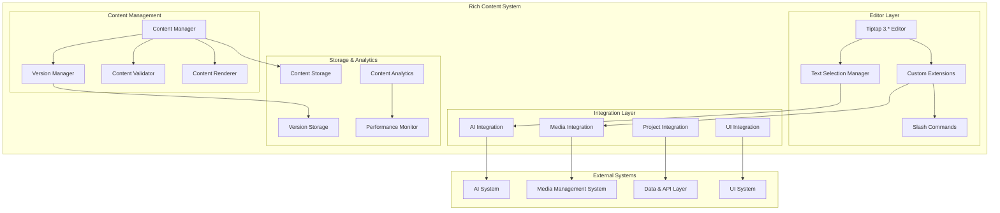

# Rich Content System - Design Document

## Overview

The Rich Content System provides a comprehensive content creation and editing platform built around Tiptap 3.* with extensive AI integration, custom portfolio-specific content blocks, and seamless integration with other system domains. The system emphasizes structured content storage, real-time collaboration, and intelligent content enhancement while maintaining performance and accessibility.

## Architecture

### System Architecture



## External API Dependencies

### Required from AI System

```typescript
interface RequiredAISystemAPIs {
  // AI content processing
  "POST /api/admin/ai/process-content": {
    provider: "ai-system";
    version: "1.0.0";
    purpose: "Process content with AI for editing and enhancement";
    usage: "Rich text editor integrates AI assistance for content improvement";
  };
  
  // AI quick actions
  "POST /api/admin/ai/quick-action": {
    provider: "ai-system";
    version: "1.0.0";
    purpose: "Execute predefined AI quick actions";
    usage: "Quick action buttons in editor for common AI tasks";
  };
  
  // AI configuration
  "GET /api/admin/ai/config": {
    provider: "ai-system";
    version: "1.0.0";
    purpose: "Get current AI configuration and available models";
    usage: "Editor needs to know available AI capabilities";
  };
  
  // Components from AI System
  AIAssistantPanel: {
    provider: "ai-system";
    version: "1.0.0";
    purpose: "AI assistance interface for content editing";
    usage: "Integrated into rich text editor interface";
  };
  
  AIModelSelector: {
    provider: "ai-system";
    version: "1.0.0";
    purpose: "Unified model selection dropdown";
    usage: "Allow users to choose AI model for content assistance";
  };
  
  AIStatusIndicator: {
    provider: "ai-system";
    version: "1.0.0";
    purpose: "AI provider connection status display";
    usage: "Show AI availability status in editor";
  };
  
  // Hooks from AI System
  useAIConfig: {
    provider: "ai-system";
    version: "1.0.0";
    purpose: "AI configuration and provider status management";
    usage: "Manage AI settings within rich content editor";
  };
  
  useAIContentProcessor: {
    provider: "ai-system";
    version: "1.0.0";
    purpose: "AI content processing and quick actions";
    usage: "Process content with AI assistance";
  };
}
```

### Required from Media Management System

```typescript
interface RequiredMediaSystemAPIs {
  // Media picker integration
  MediaPickerModal: {
    provider: "media-management-system";
    version: "1.0.0";
    purpose: "Context-aware media selection interface";
    usage: "Integrated into custom content blocks for media selection";
  };
  
  // Media upload functionality
  useMediaUpload: {
    provider: "media-management-system";
    version: "1.0.0";
    purpose: "File upload with progress tracking";
    usage: "Upload media directly from content editor";
  };
  
  // Project media management
  useProjectMedia: {
    provider: "media-management-system";
    version: "1.0.0";
    purpose: "Project media management with filtering";
    usage: "Access and manage project media within editor";
  };
  
  // Media usage tracking
  "POST /api/media/[id]/track-usage": {
    provider: "media-management-system";
    version: "1.0.0";
    purpose: "Track media usage in content blocks";
    usage: "Track when media is used in content for dependency management";
  };
  
  // Media retrieval
  "GET /api/media/[id]": {
    provider: "media-management-system";
    version: "1.0.0";
    purpose: "Get media item with optimized URLs";
    usage: "Display media in content blocks and editor";
  };
}
```

### Required from Portfolio-Projects System

```typescript
interface RequiredPortfolioAPIs {
  "GET /api/projects/[id]": {
    provider: "portfolio-projects";
    version: "1.0.0";
    purpose: "Get project context for content editing";
    requiredFields: ["id", "title", "description", "tags", "content"];
    usage: "Load project data for content editing";
  };
  
  "PUT /api/projects/[id]": {
    provider: "portfolio-projects";
    version: "1.0.0";
    purpose: "Update project content and metadata";
    usage: "Save content changes and metadata updates";
  };
  
  "GET /api/projects": {
    provider: "portfolio-projects";
    version: "1.0.0";
    purpose: "List projects for internal linking";
    usage: "Project reference extension needs project list";
  };
  
  auth: {
    provider: "portfolio-projects";
    version: "1.0.0";
    purpose: "Verify user permissions for content editing";
    implementation: "NextAuth session validation middleware";
    usage: "Applied to all content editing endpoints";
  };
  
  "GET /api/tags": {
    provider: "portfolio-projects";
    version: "1.0.0";
    purpose: "Get available tags for content tagging";
    usage: "AI tag suggestions and manual tag selection";
  };
}
```

### Required from UI System

```typescript
interface RequiredUISystemAPIs {
  // Base components
  components: {
    Button: "Consistent button styling for editor actions";
    Card: "Container component for editor panels";
    Input: "Form inputs for content metadata";
    Select: "Dropdown components for editor options";
    Badge: "Status indicators and tags";
    Progress: "Progress indicators for operations";
    Alert: "Error and warning messages";
    Modal: "Modal components for dialogs";
    Tooltip: "Tooltips for editor features";
    Tabs: "Tab components for editor sections";
  };
  
  // Design tokens
  designSystem: {
    colors: "Color palette for editor UI";
    spacing: "Consistent spacing values";
    typography: "Text styles for content";
    animations: "Transition animations";
    shadows: "Drop shadows for panels";
    borderRadius: "Consistent border radius values";
  };
  
  // Layout patterns
  patterns: {
    editorLayout: "Editor layout structure and patterns";
    panelLayout: "Side panel structure";
    modalLayout: "Modal patterns for dialogs";
    formLayout: "Form patterns for content metadata";
    toolbarLayout: "Toolbar patterns for editor actions";
  };
  
  // Theme integration
  theme: {
    currentTheme: "Current theme (light/dark) for editor";
    themeVariables: "CSS variables for theme-aware styling";
    adaptToTheme: "(component: React.Component) => React.Component";
  };
  
  // Navigation integration
  navigation: {
    navigateToProject: "(projectSlug: string) => void";
    openProjectModal: "(projectId: string) => void";
    updateBrowserHistory: "(url: string) => void";
  };
}
```

## Provided APIs

### Rich Content APIs

```typescript
interface ProvidedAPIs {
  // Content management endpoints
  "GET /api/content/[projectId]": {
    version: "1.0.0";
    consumers: ["data-api-layer", "client-side-ai"];
    purpose: "Get structured content for a project";
    response: "StructuredContent";
    changelog: {
      "1.0.0": "Initial content retrieval API";
    };
  };
  
  "PUT /api/content/[projectId]": {
    version: "1.0.0";
    consumers: ["data-api-layer"];
    purpose: "Update project content with validation";
    requestBody: {
      content: "TiptapContent";
      metadata: "ContentMetadata";
      versionNote?: "string";
    };
    response: "ContentUpdateResult";
  };
  
  // Version management endpoints
  "GET /api/content/[projectId]/versions": {
    version: "1.0.0";
    consumers: ["data-api-layer"];
    purpose: "Get content version history";
    response: "ContentVersionList";
  };
  
  "POST /api/content/[projectId]/versions": {
    version: "1.0.0";
    consumers: ["data-api-layer"];
    purpose: "Create content version snapshot";
    requestBody: {
      content: "TiptapContent";
      note?: "string";
      automatic: "boolean";
    };
    response: "ContentVersion";
  };
  
  "PUT /api/content/[projectId]/versions/[versionId]/restore": {
    version: "1.0.0";
    consumers: ["data-api-layer"];
    purpose: "Restore content from version";
    response: "ContentRestoreResult";
  };
  
  // Content validation endpoint
  "POST /api/content/validate": {
    version: "1.0.0";
    consumers: ["data-api-layer"];
    purpose: "Validate content structure and dependencies";
    requestBody: {
      content: "TiptapContent";
      projectId: "string";
    };
    response: "ContentValidationResult";
  };
  
  // Content analytics endpoint
  "GET /api/content/[projectId]/analytics": {
    version: "1.0.0";
    consumers: ["data-api-layer"];
    purpose: "Get content performance analytics";
    response: "ContentAnalytics";
  };
}
```

## Provided Components

### React Components

```typescript
interface ProvidedComponents {
  // Main rich text editor
  TiptapEditorWithAI: {
    version: "1.0.0";
    consumers: ["data-api-layer"];
    location: "src/components/rich-content/tiptap-editor-with-ai.tsx";
    purpose: "Main rich text editor with AI integration";
    props: {
      content: "TiptapContent";
      onChange: "(content: TiptapContent) => void";
      onSelectionChange: "(selection: TextSelection) => void";
      projectContext: "ProjectContext";
      aiEnabled?: "boolean";
      readOnly?: "boolean";
      className?: "string";
    };
    dependencies: ["AI System AIAssistantPanel", "Media Management MediaPickerModal"];
  };
  
  // Read-only content renderer
  TiptapDisplayRenderer: {
    version: "1.0.0";
    consumers: ["data-api-layer", "client-side-ai"];
    location: "src/components/rich-content/tiptap-display-renderer.tsx";
    purpose: "Read-only content renderer for public display";
    props: {
      content: "TiptapContent";
      projectId: "string";
      highlightSections?: "string[]";
      className?: "string";
    };
    dependencies: ["Media Management components", "UI System components"];
  };
  
  // Text selection manager
  TextSelectionManager: {
    version: "1.0.0";
    consumers: ["ai-system"];
    location: "src/components/rich-content/text-selection-manager.tsx";
    purpose: "Manage text selections for AI integration";
    props: {
      editor: "Editor";
      onSelectionChange: "(selection: TextSelection) => void";
      onContextChange: "(context: SelectionContext) => void";
    };
  };
  
  // Content version manager
  ContentVersionManager: {
    version: "1.0.0";
    consumers: ["data-api-layer"];
    location: "src/components/rich-content/version-manager.tsx";
    purpose: "Content version history and management interface";
    props: {
      projectId: "string";
      currentContent: "TiptapContent";
      onRestore: "(versionId: string) => void";
      onDelete: "(versionId: string) => void";
    };
  };
  
  // Content validator
  ContentValidator: {
    version: "1.0.0";
    consumers: ["data-api-layer"];
    location: "src/components/rich-content/content-validator.tsx";
    purpose: "Content validation and quality assurance interface";
    props: {
      content: "TiptapContent";
      projectId: "string";
      onValidationComplete: "(result: ValidationResult) => void";
    };
  };
}
```

### Tiptap Extensions

```typescript
interface ProvidedExtensions {
  // Image carousel extension
  ImageCarouselExtension: {
    version: "1.0.0";
    consumers: ["data-api-layer"];
    location: "src/components/rich-content/extensions/image-carousel.tsx";
    purpose: "Multi-image carousel content block";
    integration: "Media Management System for image selection";
    slashCommand: "/carousel";
  };
  
  // Download button extension
  DownloadButtonExtension: {
    version: "1.0.0";
    consumers: ["data-api-layer"];
    location: "src/components/rich-content/extensions/download-button.tsx";
    purpose: "File download content block";
    integration: "Media Management System for file selection";
    slashCommand: "/download";
  };
  
  // Interactive embed extension
  InteractiveEmbedExtension: {
    version: "1.0.0";
    consumers: ["data-api-layer"];
    location: "src/components/rich-content/extensions/interactive-embed.tsx";
    purpose: "Interactive content embedding with sandboxing";
    slashCommand: "/interactive";
  };
  
  // Project reference extension
  ProjectReferenceExtension: {
    version: "1.0.0";
    consumers: ["data-api-layer"];
    location: "src/components/rich-content/extensions/project-reference.tsx";
    purpose: "Internal project linking with validation";
    integration: "Data & API Layer for project validation";
    slashCommand: "/project-link";
  };
  
  // AI integration extension
  AIIntegrationExtension: {
    version: "1.0.0";
    consumers: ["ai-system"];
    location: "src/components/rich-content/extensions/ai-integration.tsx";
    purpose: "AI assistance integration for content editing";
    integration: "AI System for content processing";
  };
}
```

### React Hooks

```typescript
interface ProvidedHooks {
  // Content management
  useRichContent: {
    version: "1.0.0";
    consumers: ["data-api-layer"];
    location: "src/hooks/use-rich-content.ts";
    purpose: "Manage rich content editing and persistence";
    returns: {
      content: "TiptapContent";
      updateContent: "(content: TiptapContent) => void";
      saveContent: "() => Promise<void>";
      isLoading: "boolean";
      isDirty: "boolean";
      error: "string | null";
    };
  };
  
  // Text selection management
  useTextSelection: {
    version: "1.0.0";
    consumers: ["ai-system"];
    location: "src/hooks/use-text-selection.ts";
    purpose: "Manage text selections for AI integration";
    returns: {
      selection: "TextSelection | null";
      setSelection: "(selection: TextSelection) => void";
      clearSelection: "() => void";
      getSelectionContext: "() => SelectionContext";
    };
  };
  
  // Content versioning
  useContentVersions: {
    version: "1.0.0";
    consumers: ["data-api-layer"];
    location: "src/hooks/use-content-versions.ts";
    purpose: "Manage content version history";
    returns: {
      versions: "ContentVersion[]";
      createVersion: "(note?: string) => Promise<ContentVersion>";
      restoreVersion: "(versionId: string) => Promise<void>";
      deleteVersion: "(versionId: string) => Promise<void>";
      isLoading: "boolean";
    };
  };
  
  // Content validation
  useContentValidation: {
    version: "1.0.0";
    consumers: ["data-api-layer"];
    location: "src/hooks/use-content-validation.ts";
    purpose: "Validate content structure and dependencies";
    returns: {
      validate: "(content: TiptapContent) => Promise<ValidationResult>";
      validationResult: "ValidationResult | null";
      isValidating: "boolean";
      errors: "ValidationError[]";
      warnings: "ValidationWarning[]";
    };
  };
  
  // Content analytics
  useContentAnalytics: {
    version: "1.0.0";
    consumers: ["data-api-layer"];
    location: "src/hooks/use-content-analytics.ts";
    purpose: "Track and analyze content performance";
    returns: {
      analytics: "ContentAnalytics";
      trackView: "(projectId: string) => void";
      trackInteraction: "(projectId: string, type: string) => void";
      getInsights: "() => ContentInsights";
    };
  };
}
```

## Data Models

### Core Content Models

```typescript
interface TiptapContent {
  type: 'doc';
  content: ContentNode[];
  metadata?: ContentMetadata;
}

interface ContentNode {
  type: string;
  attrs?: Record<string, any>;
  content?: ContentNode[];
  marks?: ContentMark[];
  text?: string;
}

interface ContentMark {
  type: string;
  attrs?: Record<string, any>;
}

interface ContentMetadata {
  version: string;
  lastModified: Date;
  wordCount: number;
  readingTime: number;
  aiAssisted: boolean;
  mediaReferences: string[];
  projectReferences: string[];
  customBlocks: CustomBlockSummary[];
}

interface CustomBlockSummary {
  type: 'carousel' | 'download' | 'interactive' | 'project-reference';
  id: string;
  title?: string;
  mediaCount?: number;
  fileCount?: number;
}
```

### Text Selection Models

```typescript
interface TextSelection {
  from: number;
  to: number;
  text: string;
  context: SelectionContext;
  nodeType?: string;
  marks?: ContentMark[];
}

interface SelectionContext {
  beforeText: string;
  afterText: string;
  parentNode?: ContentNode;
  documentContext: DocumentContext;
}

interface DocumentContext {
  projectId: string;
  title: string;
  tags: string[];
  totalLength: number;
  currentPosition: number;
}
```

### Version Management Models

```typescript
interface ContentVersion {
  id: string;
  projectId: string;
  content: TiptapContent;
  versionNumber: number;
  createdAt: Date;
  createdBy: string;
  note?: string;
  automatic: boolean;
  size: number;
  changes?: ContentChangeSummary;
}

interface ContentChangeSummary {
  wordsAdded: number;
  wordsRemoved: number;
  blocksAdded: string[];
  blocksRemoved: string[];
  mediaChanged: boolean;
  aiAssisted: boolean;
}

interface ContentVersionList {
  versions: ContentVersion[];
  totalCount: number;
  storageUsed: number;
  retentionPolicy: RetentionPolicy;
}

interface RetentionPolicy {
  maxVersions: number;
  maxAge: number; // days
  autoCleanup: boolean;
  keepMilestones: boolean;
}
```

### Validation Models

```typescript
interface ValidationResult {
  valid: boolean;
  errors: ValidationError[];
  warnings: ValidationWarning[];
  suggestions: ValidationSuggestion[];
  performance: PerformanceMetrics;
}

interface ValidationError {
  type: 'structure' | 'dependency' | 'security' | 'accessibility';
  message: string;
  location?: NodeLocation;
  severity: 'error' | 'warning' | 'info';
  fixable: boolean;
  suggestion?: string;
}

interface ValidationWarning {
  type: 'performance' | 'seo' | 'accessibility' | 'best-practice';
  message: string;
  location?: NodeLocation;
  impact: 'high' | 'medium' | 'low';
  recommendation: string;
}

interface ValidationSuggestion {
  type: 'optimization' | 'enhancement' | 'accessibility';
  message: string;
  benefit: string;
  effort: 'low' | 'medium' | 'high';
}

interface NodeLocation {
  nodeType: string;
  position: number;
  path: number[];
}

interface PerformanceMetrics {
  renderTime: number;
  bundleSize: number;
  mediaSize: number;
  accessibilityScore: number;
  seoScore: number;
}
```

### Analytics Models

```typescript
interface ContentAnalytics {
  projectId: string;
  timeRange: TimeRange;
  views: ViewMetrics;
  engagement: EngagementMetrics;
  performance: PerformanceMetrics;
  content: ContentMetrics;
}

interface ViewMetrics {
  totalViews: number;
  uniqueViews: number;
  averageTimeOnPage: number;
  bounceRate: number;
  viewsByDevice: Record<string, number>;
  viewsBySource: Record<string, number>;
}

interface EngagementMetrics {
  scrollDepth: number;
  interactionRate: number;
  shareCount: number;
  downloadCount: number;
  mediaInteractions: MediaInteractionMetrics[];
}

interface MediaInteractionMetrics {
  mediaId: string;
  type: 'image' | 'carousel' | 'download' | 'interactive';
  views: number;
  interactions: number;
  averageEngagementTime: number;
}

interface ContentMetrics {
  wordCount: number;
  readingTime: number;
  mediaCount: number;
  blockCount: Record<string, number>;
  aiAssistedPercentage: number;
  lastUpdated: Date;
}
```

## Performance Considerations

### Editor Performance

```typescript
interface EditorPerformanceConfig {
  // Lazy loading for large documents
  lazyLoading: {
    enabled: boolean;
    chunkSize: number; // nodes per chunk
    preloadDistance: number; // chunks to preload
  };
  
  // Debounced operations
  debouncing: {
    autoSave: number; // ms
    validation: number; // ms
    analytics: number; // ms
  };
  
  // Caching strategies
  caching: {
    contentCache: {
      maxSize: number; // MB
      ttl: number; // seconds
    };
    mediaCache: {
      maxSize: number; // MB
      ttl: number; // seconds
    };
  };
  
  // Performance monitoring
  monitoring: {
    renderTimeThreshold: number; // ms
    memoryUsageThreshold: number; // MB
    enableProfiling: boolean;
  };
}
```

### Content Optimization

```typescript
interface ContentOptimizationConfig {
  // Image optimization
  images: {
    autoOptimize: boolean;
    maxWidth: number;
    quality: number;
    format: 'webp' | 'jpeg' | 'auto';
  };
  
  // Content compression
  compression: {
    enabled: boolean;
    algorithm: 'gzip' | 'brotli';
    level: number;
  };
  
  // Bundle optimization
  bundling: {
    codesplitting: boolean;
    treeshaking: boolean;
    minification: boolean;
  };
}
```

This design provides a comprehensive foundation for the Rich Content System while maintaining clear integration points with all other system domains and ensuring optimal performance and user experience.