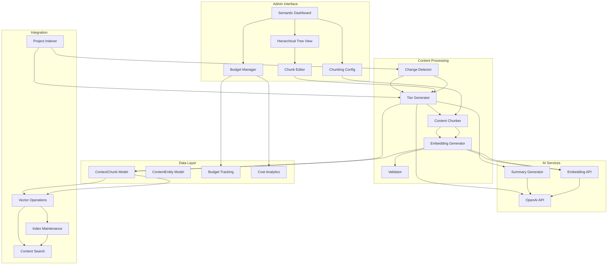

# Semantic Content Management System - Design Document

## Overview

The Semantic Content Management System provides a comprehensive admin interface for managing hierarchical content decomposition, vector embeddings, and semantic search indexes. Built on a simplified 4-tier structure (T0-T3), the system enables intelligent content organization with AI-assisted generation, manual editing capabilities, cost-aware operations, and real-time health monitoring.

## Architecture

### Content Generation Pipeline

The semantic content generation follows a multi-stage pipeline with granular control and persistent progress tracking:

#### Stage-Based Processing Architecture

1. **Stage 1: Content Analysis & Chunking**
   - Parse project content and detect structural elements (headings, sections)
   - Generate T0 metadata and T1 project summary
   - Create heading-bounded T2/T3 chunks without AI summaries
   - Store basic chunk structure in database
   - **Checkpoint**: User can review chunk structure before proceeding

2. **Stage 2: AI Summary Generation (Optional)**
   - Generate AI summaries for T1/T2 tiers using SummaryGenerationService
   - Apply anti-hallucination measures and quality scoring
   - Update existing chunks with generated summaries
   - **Checkpoint**: User can review and edit summaries before proceeding

3. **Stage 3: Embedding Generation (Optional)**
   - Generate vector embeddings for all chunks
   - Support both immediate and batch processing modes
   - Update chunks with embedding vectors
   - **Checkpoint**: User can verify embedding coverage

4. **Stage 4: Quality Validation & Indexing**
   - Validate hierarchical relationships and importance scores
   - Update search indexes and cache
   - Generate health metrics and completion report

#### Progress Tracking & Persistence

- **Persistent Progress Panel**: Non-modal progress tracking in semantic dashboard
- **Stage-Level Checkpoints**: Each stage can be executed independently
- **Resume Capability**: Failed operations can be resumed from last checkpoint
- **Granular Control**: Admin can choose which stages to execute
- **Real-Time Updates**: Progress updates via Server-Sent Events (SSE)
- **Background Processing**: Long operations don't block UI navigation

#### Admin Control Interface

- **Step Selection**: Choose which stages to execute (chunking, summaries, embeddings)
- **Batch vs Immediate**: Select processing mode for each stage
- **Quality Thresholds**: Set minimum confidence scores for AI-generated content
- **Cost Controls**: Budget limits and cost estimation before execution
- **Progress Monitoring**: Real-time progress with ability to cancel operations

### System Architecture



## Simplified Tier Structure

### Tier Hierarchy

```
T0 (Project Metadata)
└── T1 (Project Summary)
    ├── T2 (H1: Introduction)
    │   ├── T2 (H2: Background)
    │   │   └── T3 (Raw chunks)
    │   ├── T2 (H2: Motivation)
    │   │   └── T3 (Raw chunks)
    │   └── T3 (Raw chunks)
    ├── T2 (H1: Technical Implementation)
    │   ├── T2 (H2: Architecture)
    │   │   ├── T2 (H3: Database Layer)
    │   │   │   └── T3 (Raw chunks)
    │   │   └── T3 (Raw chunks)
    │   └── T3 (Raw chunks)
    └── T2 (H1: Results)
        └── T3 (Raw chunks)
```

### Tier Definitions

```typescript
interface TierStructure {
  T0: {
    count: 1;                           // Exactly one per project
    content: ProjectMetadata;           // Auto-generated JSON
    generation: 'system';               // No AI, no manual edit
    parent: null;                       // Root node
    children: ['T1'];                   // Exactly one T1
    editable: false;
  };
  
  T1: {
    count: 1;                           // Exactly one per project
    content: string;                    // Project summary
    generation: 'ai' | 'manual';        // AI or user-pasted
    parent: 'T0';                       // Always child of T0
    children: ['T2'];                   // Multiple T2 (one per H1)
    editable: true;
  };
  
  T2: {
    count: 'multiple';                  // One per H1/H2/H3
    content: string;                    // Section summary
    generation: 'ai';                   // AI-generated
    parent: 'T1' | 'T2';                // T1 for H1, parent T2 for H2/H3
    children: ['T2', 'T3'];             // Child headings and raw chunks
    editable: true;
    metadata: {
      headingLevel: 1 | 2 | 3;
      headingText: string;
      sectionGroup: string;
    };
  };
  
  T3: {
    count: 'multiple';                  // Multiple per section (heading-bounded)
    content: string;                    // Raw article chunks
    generation: 'automatic';            // Heading-bounded chunking algorithm
    parent: 'T2';                       // Parent heading's T2 chunk
    children: [];                       // Terminal tier
    editable: true;
    metadata: {
      chunkIndex: number;               // Index within parent section
      sectionId: string;                // Parent heading ID
      startLine: number;                // Relative to section start
      endLine: number;                  // Relative to section end
      sectionBounded: true;             // Never crosses heading boundaries
    };
  };
}
```

## Data Models

### Enhanced ContextChunk Model

```typescript
interface ContextChunk {
  // Core identification
  id: string;
  entityId: string;
  projectIndexId: string;
  chunkId: string;
  
  // Tier information
  tier: 0 | 1 | 2 | 3;
  title?: string;
  content: string;
  tokenCount: number;
  
  // Hierarchical relationships
  parentChunkId?: string;             // Parent chunk (T2 for T3 chunks)
  rootChunkId: string;                // T0 root
  sectionGroup?: string;              // Logical grouping (heading ID for T3)
  derivationPath: string;             // e.g., "T0→T1→T2.1→T3.5" - NOTE: moved to metadata
  
  // Section-relative positioning (NEVER absolute!)
  sectionStartLine?: number;          // Line within section (0 = heading line)
  sectionEndLine?: number;            // Line within section (relative to section start)
  
  // Heading-bounded chunking (T3 specific)
  sectionBounded: boolean;            // True for T3 chunks (never cross headings)
  chunkIndexInSection?: number;       // Index within parent section (0, 1, 2...)
  
  // Section context for line number calculations
  sectionTotalLines?: number;         // Total lines in parent section (for validation)
  
  // Vector embedding
  embedding?: number[];               // pgvector
  embeddingModel?: string;            // Model version
  embeddingGeneratedAt?: Date;
  
  // Importance and ranking
  importance: number;                 // Separate field for query performance
  importanceSource: 'ai' | 'manual';  // Track if user-defined
  
  // Generation metadata
  generationMode: 'system' | 'ai' | 'manual' | 'hybrid';
  lastModified: Date;
  modifiedBy: 'system' | 'ai' | 'user';
  manuallyEdited: boolean;            // Preserve during regeneration
  
  // Content hash for change detection
  contentHash: string;
  sectionContentHash?: string;        // Hash of entire section (for T3 chunks)
  
  // Tier-specific metadata
  metadata: Record<string, any>;      // Flexible tier-specific data
  
  // Timestamps
  createdAt: Date;
  updatedAt: Date;
}
```

### Summary Generation Configuration Model

```typescript
interface SummaryGenerationConfig {
  id: string;
  
  // Model selection
  model: string;                        // 'gpt-4o', 'gpt-4o-mini', 'claude-3-5-sonnet'
  temperature: number;                  // Default: 0.3
  
  // Configurable prompts
  t1SystemPrompt: string;               // Project summary generation prompt
  t2SystemPrompt: string;               // Section summary generation prompt
  
  // Length constraints
  t1MaxLength: number;                  // Default: 200 tokens
  t2MaxLength: number;                  // Default: 150 tokens
  
  // Quality controls
  preventHallucination: boolean;        // Default: true
  preserveKeywords: boolean;            // Default: true
  requireFactualAccuracy: boolean;      // Default: true
  
  // Metadata
  name: string;                         // User-defined config name
  isDefault: boolean;                   // Default configuration
  createdAt: Date;
  updatedAt: Date;
}

interface SummaryGenerationLog {
  id: string;
  configId: string;
  chunkId: string;
  
  // Input
  originalContent: string;
  promptUsed: string;
  modelUsed: string;
  
  // Output
  generatedSummary: string;
  tokensUsed: number;
  cost: number;
  
  // Quality metrics
  confidenceScore?: number;             // AI-generated confidence
  manualReviewFlag: boolean;            // Flagged for human review
  qualityRating?: number;               // Human quality rating (1-5)
  
  // Metadata
  generatedAt: Date;
  reviewedAt?: Date;
  reviewedBy?: string;
}
```

### Budget Tracking Model

```typescript
interface SemanticBudget {
  id: string;
  allocatedFunds: number;             // Total budget in USD
  remainingFunds: number;             // Current balance
  totalSpent: number;                 // Cumulative spending
  
  // Spending breakdown
  embeddingCosts: number;
  summarizationCosts: number;
  
  // Thresholds
  warningThreshold: number;           // 80% default
  criticalThreshold: number;          // 90% default
  
  // Status
  isActive: boolean;
  lastAllocatedAt: Date;
  depletedAt?: Date;
  
  createdAt: Date;
  updatedAt: Date;
}

interface SemanticOperation {
  id: string;
  budgetId: string;
  projectId: string;
  operationType: 'embedding' | 'summarization' | 'regeneration';
  
  // Cost details
  tokensUsed: number;
  cost: number;
  model: string;
  
  // Operation details
  chunksProcessed: number;
  tiersAffected: number[];
  success: boolean;
  error?: string;
  
  // Timestamps
  startedAt: Date;
  completedAt?: Date;
  duration?: number;
}
```

### Change Detection Model

```typescript
interface ContentChangeDetection {
  projectId: string;
  previousHash: string;
  currentHash: string;
  changeScope: 'minor' | 'moderate' | 'major' | 'new';
  
  // Affected sections
  affectedSections: Array<{
    headingLevel: number;
    headingText: string;
    changeType: 'added' | 'modified' | 'removed';
    chunkIds: string[];
  }>;
  
  // Regeneration recommendation
  recommendedAction: 'skip' | 'selective' | 'full';
  estimatedCost: number;
  estimatedTokens: number;
  
  // Thresholds
  characterChangePercentage: number;
  sectionModificationCount: number;
  
  detectedAt: Date;
}
```

## Components

### 1. Semantic Dashboard

**Location**: `src/components/admin/semantic-dashboard.tsx`

**Features**:
- Real-time vector index health metrics
- Project list with chunk status
- Global budget display
- Quick action buttons
- Cost analytics overview

**Key Metrics**:
```typescript
interface DashboardMetrics {
  vectorIndexHealth: {
    totalProjects: number;
    indexedProjects: number;
    totalChunks: number;
    totalEmbeddings: number;
    averageQueryTime: number;
    indexSize: string;
  };
  
  budgetStatus: {
    allocated: number;
    remaining: number;
    percentUsed: number;
    warningLevel: 'ok' | 'warning' | 'critical' | 'depleted';
  };
  
  projectStatus: Array<{
    projectId: string;
    title: string;
    chunkCount: number;
    tierDistribution: Record<number, number>;
    lastRegenerated: Date;
    totalCost: number;
    healthStatus: 'healthy' | 'outdated' | 'incomplete' | 'error';
  }>;
}
```

### 2. Hierarchical Tree View

**Location**: `src/components/admin/semantic-tree-view.tsx`

**Features**:
- Expandable/collapsible tree structure
- Visual parent-child relationships
- Chunk preview on hover
- Inline editing trigger
- Drag-and-drop reorganization
- Tier-specific icons and colors

**Tree Node Structure**:
```typescript
interface TreeNode {
  chunkId: string;
  tier: number;
  title: string;
  contentPreview: string;
  tokenCount: number;
  importance: number;
  hasEmbedding: boolean;
  manuallyEdited: boolean;
  children: TreeNode[];
  
  // Visual properties
  expanded: boolean;
  selected: boolean;
  highlighted: boolean;
}
```

### 3. Chunk Editor

**Location**: `src/components/admin/semantic-chunk-editor.tsx`

**Features**:
- Inline text editing
- AI-assisted editing with prompts
- Importance score adjustment
- Metadata display and editing
- Save/cancel with validation
- Preserve manual edits flag

**Editor Interface**:
```typescript
interface ChunkEditorProps {
  chunk: ContextChunk;
  onSave: (updated: Partial<ContextChunk>) => Promise<void>;
  onCancel: () => void;
  aiAssistEnabled: boolean;
}

interface AIAssistOptions {
  prompt: string;
  tone?: 'technical' | 'casual' | 'professional';
  maxLength?: number;
  preserveStructure: boolean;
}
```

### 4. Chunking Configuration

**Location**: `src/components/admin/chunking-config.tsx`

**Features**:
- Chunk size configuration with live examples
- Overlap configuration with explanations
- Embedding model selection
- Summary max length settings
- Cost impact calculator
- Save configuration with validation

**Configuration Interface**:
```typescript
interface ChunkingConfig {
  // Heading-bounded chunking strategy
  respectHeadingBoundaries: true;     // Always true - never cross headings
  
  // Chunk sizing
  targetChunkSize: number;            // Ideal tokens per T3 chunk (default: 300)
  maxSectionSize: number;             // Max tokens before splitting section (default: 500)
  minSectionSize: number;             // Min tokens to avoid tiny chunks (default: 50)
  
  // Context continuity
  sectionBoundaryOverlap: number;     // Overlap tokens within sections (default: 25)
  
  // Splitting strategy
  splitStrategy: 'paragraph' | 'sentence' | 'token';  // Prefer natural boundaries
  
  // Embedding model
  embeddingModel: 'text-embedding-3-small' | 'text-embedding-3-large';
  
  // Summary generation
  summaryMaxLength: {
    T1: number;                       // Project summary max tokens (default: 200)
    T2: number;                       // Section summary max tokens (default: 150)
  };
  
  // Change detection
  changeDetectionThreshold: {
    sectionChangePercent: number;     // % sections changed to trigger full regen
    minorChangeThreshold: number;     // Max sections for "minor" classification
  };
  
  // Behavior
  defaultBehavior: 'auto' | 'manual' | 'prompt';
  draftModeSkipIndexing: boolean;
}
```

### 5. Budget Manager

**Location**: `src/components/admin/semantic-budget-manager.tsx`

**Features**:
- Current budget display
- Allocation interface
- Spending history
- Cost analytics
- Warning thresholds configuration
- Budget depletion alerts

**Budget Interface**:
```typescript
interface BudgetManagerProps {
  currentBudget: SemanticBudget;
  operations: SemanticOperation[];
  onAllocate: (amount: number) => Promise<void>;
  onUpdateThresholds: (thresholds: { warning: number; critical: number }) => Promise<void>;
}
```

### 6. Summary Generation Configuration Interface

**Location**: `src/components/admin/summary-generation-config.tsx`

**Features**:
- Configurable system prompts with syntax highlighting
- Model selection with cost comparison
- Live prompt testing with sample content
- Quality metrics and confidence scoring
- A/B testing interface for prompt comparison
- Summary generation logs and analytics

**Configuration Interface**:
```typescript
interface SummaryConfigProps {
  configs: SummaryGenerationConfig[];
  onSave: (config: SummaryGenerationConfig) => Promise<void>;
  onTest: (testParams: PromptTestParams) => Promise<TestResult>;
}

interface PromptTestParams {
  content: string;
  prompt: string;
  model: string;
  maxLength: number;
}

interface TestResult {
  summary: string;
  tokensUsed: number;
  cost: number;
  confidenceScore: number;
  qualityMetrics: {
    factualAccuracy: number;
    keywordPreservation: number;
    lengthCompliance: boolean;
  };
}
```

**Key Features**:
- **Prompt Editor**: Syntax-highlighted textarea with variables (`{content}`, `{maxLength}`)
- **Model Selector**: Dropdown with cost per 1K tokens and quality ratings
- **Live Testing**: Test prompts with sample content and see results immediately
- **Quality Metrics**: Track factual accuracy, keyword preservation, length compliance
- **Version Control**: Save different prompt versions and compare performance
- **Batch Preview**: See how prompt changes affect existing summaries

## API Endpoints

### Dashboard and Status

```typescript
// Get dashboard metrics
"GET /api/admin/semantic/dashboard": {
  response: DashboardMetrics;
};

// Get project semantic status
"GET /api/admin/semantic/projects": {
  response: ProjectSemanticStatus[];
};

// Get project tree view
"GET /api/admin/semantic/projects/[id]/tree": {
  response: TreeNode;
};
```

### Chunk Management

```typescript
// Get chunk details
"GET /api/admin/semantic/chunks/[id]": {
  response: ContextChunk;
};

// Update chunk
"PUT /api/admin/semantic/chunks/[id]": {
  body: {
    content?: string;
    importance?: number;
    metadata?: Record<string, any>;
    manuallyEdited: boolean;
  };
  response: ContextChunk;
};

// AI-assisted chunk editing
"POST /api/admin/semantic/chunks/[id]/ai-edit": {
  body: AIAssistOptions;
  response: {
    originalContent: string;
    suggestedContent: string;
    tokensUsed: number;
    cost: number;
  };
};
```

### Regeneration

```typescript
// Estimate regeneration cost
"POST /api/admin/semantic/regenerate/estimate": {
  body: {
    scope: 'all' | 'project' | 'section';
    projectId?: string;
    sectionId?: string;
  };
  response: {
    estimatedTokens: number;
    estimatedCost: number;
    chunksAffected: number;
    tiersAffected: number[];
  };
};

// Trigger regeneration
"POST /api/admin/semantic/regenerate": {
  body: {
    scope: 'all' | 'project' | 'section';
    projectId?: string;
    sectionId?: string;
    preserveManualEdits: boolean;
  };
  response: {
    operationId: string;
    status: 'started' | 'in_progress' | 'completed' | 'failed';
  };
};

// Get regeneration progress
"GET /api/admin/semantic/regenerate/[operationId]": {
  response: {
    status: 'in_progress' | 'completed' | 'failed';
    progress: {
      chunksProcessed: number;
      totalChunks: number;
      tokensUsed: number;
      cost: number;
      estimatedTimeRemaining: number;
    };
  };
};
```

### Configuration

```typescript
// Get chunking configuration
"GET /api/admin/semantic/config": {
  response: ChunkingConfig;
};

// Update chunking configuration
"PUT /api/admin/semantic/config": {
  body: Partial<ChunkingConfig>;
  response: ChunkingConfig;
};

// Get summary generation configurations
"GET /api/admin/semantic/summary-config": {
  response: SummaryGenerationConfig[];
};

// Get specific summary configuration
"GET /api/admin/semantic/summary-config/[id]": {
  response: SummaryGenerationConfig;
};

// Create/update summary configuration
"POST /api/admin/semantic/summary-config": {
  body: Partial<SummaryGenerationConfig>;
  response: SummaryGenerationConfig;
};

// Test summary generation with custom prompt
"POST /api/admin/semantic/summary-config/test": {
  body: {
    content: string;
    prompt: string;
    model: string;
    maxLength: number;
  };
  response: {
    summary: string;
    tokensUsed: number;
    cost: number;
    confidenceScore: number;
  };
};

// Get summary generation logs
"GET /api/admin/semantic/summary-logs": {
  query: {
    configId?: string;
    startDate?: string;
    endDate?: string;
  };
  response: SummaryGenerationLog[];
};
```

### Budget Management

```typescript
// Get budget status
"GET /api/admin/semantic/budget": {
  response: SemanticBudget;
};

// Allocate funds
"POST /api/admin/semantic/budget/allocate": {
  body: {
    amount: number;
  };
  response: SemanticBudget;
};

// Get spending history
"GET /api/admin/semantic/budget/operations": {
  query: {
    projectId?: string;
    startDate?: string;
    endDate?: string;
  };
  response: SemanticOperation[];
};
```

### Bulk Operations

```typescript
// Cleanup orphaned chunks
"POST /api/admin/semantic/bulk/cleanup": {
  response: {
    chunksRemoved: number;
    spaceFreed: string;
  };
};

// Export semantic indexes
"POST /api/admin/semantic/bulk/export": {
  body: {
    projectIds?: string[];
  };
  response: {
    downloadUrl: string;
    expiresAt: Date;
  };
};

// Import semantic indexes
"POST /api/admin/semantic/bulk/import": {
  body: FormData;
  response: {
    projectsImported: number;
    chunksImported: number;
    conflicts: Array<{
      chunkId: string;
      reason: string;
    }>;
  };
};
```

## Integration Points

## External Dependencies

### Required from Client-Side AI System

```typescript
interface RequiredClientSideAIAPIs {
  // Content search service
  "ContentSearchService": {
    provider: "client-side-ai";
    version: "1.0.0";
    purpose: "Semantic search using generated embeddings";
    methods: ["searchContent", "findSimilarChunks"];
  };
  
  // Vector operations
  "VectorOperations": {
    provider: "client-side-ai";
    version: "1.0.0";
    purpose: "pgvector database operations";
    methods: ["upsertContextChunkWithVector", "findSimilarContent"];
  };
  
  // Passive F-I-D Manager
  "PassiveFIDManager": {
    provider: "client-side-ai";
    version: "1.0.0";
    purpose: "Client-side context caching";
    integration: "Consumes semantic chunks for F-I-D context";
  };
}
```

### Required from AI System

```typescript
interface RequiredAISystemAPIs {
  // AI providers
  "OpenAIProvider": {
    provider: "ai-system";
    version: "1.0.0";
    purpose: "Generate summaries and embeddings";
    methods: ["generateCompletion", "generateEmbedding"];
  };
  
  // AI assistant
  "AIAssistantPanel": {
    provider: "ai-system";
    version: "1.0.0";
    purpose: "AI-assisted chunk editing";
    integration: "Reuse existing prompt interface";
  };
}
```

### Provided APIs

```typescript
interface ProvidedAPIs {
  // For client-side AI consumption
  "GET /api/semantic/chunks/[projectId]": {
    consumers: ["client-side-ai"];
    purpose: "Retrieve semantic chunks for F-I-D context";
  };
  
  // For project editor integration
  "POST /api/semantic/detect-changes": {
    consumers: ["rich-content-system"];
    purpose: "Detect content changes on save";
  };
  
  // For admin dashboard
  "SemanticDashboard": {
    consumers: ["admin-dashboard"];
    purpose: "Semantic content health monitoring";
  };
}
```

## Simplified Change Detection

### Overview

Instead of complex invisible IDs, we use a simple diff-based approach during content saves. Since we have both old and new versions, we can directly compare them to identify changed sections.

### Change Detection Strategy

**Heading Matching Algorithm**:
```typescript
interface HeadingMatch {
  oldHeading?: ParsedHeading;
  newHeading?: ParsedHeading;
  matchType: 'unchanged' | 'modified' | 'added' | 'removed' | 'moved';
  confidence: number; // 0-1 matching confidence
}

class SimpleChangeDetector {
  detectChanges(oldContent: string, newContent: string): SectionChanges {
    // 1. Parse headings from both versions
    const oldHeadings = this.parseHeadings(oldContent);
    const newHeadings = this.parseHeadings(newContent);
    
    // 2. Match headings using text similarity + position
    const matches = this.matchHeadings(oldHeadings, newHeadings);
    
    // 3. Compare section content for matched headings
    const changes = matches.map(match => this.analyzeSectionChange(match, oldContent, newContent));
    
    return { changes, summary: this.summarizeChanges(changes) };
  }
  
  private matchHeadings(oldHeadings: ParsedHeading[], newHeadings: ParsedHeading[]): HeadingMatch[] {
    // Use fuzzy text matching + position proximity to match headings
    // No need for stable IDs - just good heuristics
  }
}
```

**Section Content Comparison**:
- Extract content between matched headings
- Hash section content to detect changes
- Only regenerate chunks for sections with content changes
- Handle added/removed headings appropriately

### Benefits of Simple Approach

- **No cross-spec dependencies** - everything stays within semantic content management
- **No TipTap modifications** - works with existing editor
- **Robust matching** - handles heading text changes, reordering, additions/removals
- **Surgical updates** - only regenerate chunks for actually changed sections

## Change Detection Algorithm

### Heading-Bounded Change Detection

The change detection system leverages heading-bounded chunking to provide **surgical precision** in identifying which sections need regeneration:

**Key Insight**: Since T3 chunks are bounded by headings, we can detect changes at the section level and only regenerate affected sections' T3 chunks.

```typescript
interface SectionChangeDetection {
  sectionId: string;
  headingText: string;
  headingLevel: number;
  changeType: 'unchanged' | 'content-modified' | 'heading-added' | 'heading-removed' | 'heading-moved';
  previousHash?: string;
  currentHash?: string;
  affectedT2ChunkId?: string;
  affectedT3ChunkIds: string[];
  regenerationRequired: boolean;
}

class ContentChangeDetector {
  /**
   * Heading-Bounded Change Detection
   * 
   * Strategy:
   * 1. Parse heading structure (old vs new)
   * 2. Match headings between versions
   * 3. Hash section content for each heading
   * 4. Compare hashes to detect changes
   * 5. Only regenerate changed sections
   */
  async detectChanges(
    projectId: string,
    newContent: string,
    previousHash: string
  ): Promise<ContentChangeDetection> {
    // 1. Quick check: if overall hash matches, no changes
    const currentHash = this.generateHash(newContent);
    if (currentHash === previousHash) {
      return {
        changeScope: 'none',
        recommendedAction: 'skip',
        affectedSections: [],
        estimatedCost: 0
      };
    }
    
    // 2. Parse heading structures
    const newHeadings = this.parseHeadings(newContent);
    const oldHeadings = await this.getStoredHeadings(projectId);
    
    // 3. Detect section-level changes
    const sectionChanges = this.detectSectionChanges(
      oldHeadings,
      newHeadings,
      newContent
    );
    
    // 4. Calculate change metrics
    const metrics = {
      totalSections: newHeadings.length,
      unchangedSections: sectionChanges.filter(s => s.changeType === 'unchanged').length,
      modifiedSections: sectionChanges.filter(s => s.changeType === 'content-modified').length,
      addedSections: sectionChanges.filter(s => s.changeType === 'heading-added').length,
      removedSections: sectionChanges.filter(s => s.changeType === 'heading-removed').length,
      movedSections: sectionChanges.filter(s => s.changeType === 'heading-moved').length,
      structuralChanges: this.hasStructuralChanges(oldHeadings, newHeadings)
    };
    
    // 5. Determine change scope
    const changeScope = this.determineChangeScope(metrics);
    
    // 6. Recommend action
    const recommendedAction = this.recommendAction(changeScope, sectionChanges);
    
    // 7. Estimate cost (only for affected sections)
    const estimatedCost = await this.estimateRegenerationCost(sectionChanges);
    
    // 8. Identify affected chunks
    const affectedChunks = await this.identifyAffectedChunks(projectId, sectionChanges);
    
    return {
      projectId,
      previousHash,
      currentHash,
      changeScope,
      sectionChanges,
      affectedSections: sectionChanges.filter(s => s.regenerationRequired),
      affectedChunks,
      recommendedAction,
      estimatedCost,
      metrics
    };
  }
  
  /**
   * Detect changes at section level using heading-bounded approach
   */
  private detectSectionChanges(
    oldHeadings: Heading[],
    newHeadings: Heading[],
    newContent: string
  ): SectionChangeDetection[] {
    const changes: SectionChangeDetection[] = [];
    
    // Create heading ID map for matching
    const oldHeadingMap = new Map(oldHeadings.map(h => [h.id, h]));
    const newHeadingMap = new Map(newHeadings.map(h => [h.id, h]));
    
    // Check each new heading
    for (const newHeading of newHeadings) {
      const oldHeading = oldHeadingMap.get(newHeading.id);
      
      if (!oldHeading) {
        // New heading added
        changes.push({
          sectionId: newHeading.id,
          headingText: newHeading.text,
          headingLevel: newHeading.level,
          changeType: 'heading-added',
          currentHash: this.hashSectionContent(newHeading, newContent),
          affectedT3ChunkIds: [],
          regenerationRequired: true
        });
        continue;
      }
      
      // Extract section content for both versions
      const oldSectionContent = oldHeading.sectionContent;
      const newSectionContent = this.extractSectionContent(newHeading, newContent);
      
      // Hash section content
      const oldHash = this.hashContent(oldSectionContent);
      const newHash = this.hashContent(newSectionContent);
      
      if (oldHash === newHash) {
        // Section unchanged - preserve existing T3 chunks
        changes.push({
          sectionId: newHeading.id,
          headingText: newHeading.text,
          headingLevel: newHeading.level,
          changeType: 'unchanged',
          previousHash: oldHash,
          currentHash: newHash,
          affectedT2ChunkId: oldHeading.t2ChunkId,
          affectedT3ChunkIds: oldHeading.t3ChunkIds,
          regenerationRequired: false
        });
      } else {
        // Section content modified - regenerate T3 chunks for this section only
        changes.push({
          sectionId: newHeading.id,
          headingText: newHeading.text,
          headingLevel: newHeading.level,
          changeType: 'content-modified',
          previousHash: oldHash,
          currentHash: newHash,
          affectedT2ChunkId: oldHeading.t2ChunkId,
          affectedT3ChunkIds: oldHeading.t3ChunkIds,
          regenerationRequired: true
        });
      }
    }
    
    // Check for removed headings
    for (const oldHeading of oldHeadings) {
      if (!newHeadingMap.has(oldHeading.id)) {
        changes.push({
          sectionId: oldHeading.id,
          headingText: oldHeading.text,
          headingLevel: oldHeading.level,
          changeType: 'heading-removed',
          previousHash: this.hashContent(oldHeading.sectionContent),
          affectedT2ChunkId: oldHeading.t2ChunkId,
          affectedT3ChunkIds: oldHeading.t3ChunkIds,
          regenerationRequired: true // Mark for deletion
        });
      }
    }
    
    return changes;
  }
  
  /**
   * Determine change scope based on section-level metrics
   */
  private determineChangeScope(metrics: SectionChangeMetrics): ChangeScope {
    const changePercent = (metrics.modifiedSections / metrics.totalSections) * 100;
    
    // No changes
    if (metrics.modifiedSections === 0 && metrics.addedSections === 0 && metrics.removedSections === 0) {
      return 'none';
    }
    
    // Minor: 1-2 sections changed, no structural changes
    if (metrics.modifiedSections <= 2 && !metrics.structuralChanges) {
      return 'minor';
    }
    
    // Moderate: 3-5 sections changed or minor structural changes
    if (metrics.modifiedSections <= 5 || (metrics.addedSections + metrics.removedSections) <= 2) {
      return 'moderate';
    }
    
    // Major: >5 sections changed or significant structural changes
    if (metrics.modifiedSections > 5 || metrics.structuralChanges) {
      return 'major';
    }
    
    // New: Most sections changed
    if (changePercent > 70) {
      return 'new';
    }
    
    return 'moderate';
  }
  
  /**
   * Recommend action based on change scope and affected sections
   */
  private recommendAction(
    changeScope: ChangeScope,
    sectionChanges: SectionChangeDetection[]
  ): RecommendedAction {
    const sectionsToRegenerate = sectionChanges.filter(s => s.regenerationRequired);
    
    if (sectionsToRegenerate.length === 0) {
      return {
        action: 'skip',
        reason: 'No sections changed',
        affectedSections: []
      };
    }
    
    if (sectionsToRegenerate.length <= 2) {
      return {
        action: 'selective',
        reason: `Only ${sectionsToRegenerate.length} section(s) changed`,
        affectedSections: sectionsToRegenerate.map(s => s.sectionId)
      };
    }
    
    if (changeScope === 'major' || changeScope === 'new') {
      return {
        action: 'full',
        reason: 'Major changes detected across multiple sections',
        affectedSections: sectionsToRegenerate.map(s => s.sectionId)
      };
    }
    
    return {
      action: 'selective',
      reason: `${sectionsToRegenerate.length} sections changed`,
      affectedSections: sectionsToRegenerate.map(s => s.sectionId)
    };
  }
  
  /**
   * Estimate cost for regenerating only affected sections
   */
  private async estimateRegenerationCost(
    sectionChanges: SectionChangeDetection[]
  ): Promise<CostEstimate> {
    const sectionsToRegenerate = sectionChanges.filter(s => s.regenerationRequired);
    
    let totalTokens = 0;
    let embeddingTokens = 0;
    let summarizationTokens = 0;
    
    for (const section of sectionsToRegenerate) {
      // Estimate T2 summary regeneration (if needed)
      if (section.changeType !== 'heading-removed') {
        summarizationTokens += 200; // Average T2 summary
      }
      
      // Estimate T3 chunk regeneration
      const sectionSize = section.estimatedTokens || 300;
      embeddingTokens += sectionSize;
      totalTokens += sectionSize;
    }
    
    const embeddingCost = (embeddingTokens / 1000) * 0.00002; // text-embedding-3-small
    const summarizationCost = (summarizationTokens / 1000) * 0.00015; // gpt-4o-mini
    
    return {
      totalTokens,
      embeddingTokens,
      summarizationTokens,
      embeddingCost,
      summarizationCost,
      totalCost: embeddingCost + summarizationCost,
      sectionsAffected: sectionsToRegenerate.length
    };
  }
}
```

### Benefits of Heading-Bounded Change Detection

1. **Surgical Precision**: Only regenerate sections that actually changed
2. **Cost Efficiency**: Dramatically reduced API costs for partial updates
3. **Stable Embeddings**: Unchanged sections keep their embeddings
4. **Fast Updates**: Small edits don't trigger full regeneration
5. **Predictable Costs**: Easy to estimate cost per section

## Regeneration Workflow with Heading-Bounded Chunking

### Selective Section Regeneration

The heading-bounded approach enables **section-level regeneration** that preserves unchanged content:

```typescript
class SelectiveRegenerationEngine {
  /**
   * Regenerate only affected sections while preserving unchanged ones
   */
  async regenerateAffectedSections(
    projectId: string,
    sectionChanges: SectionChangeDetection[],
    config: ChunkingConfig
  ): Promise<RegenerationResult> {
    const sectionsToRegenerate = sectionChanges.filter(s => s.regenerationRequired);
    const sectionsToPreserve = sectionChanges.filter(s => !s.regenerationRequired);
    
    const results: RegenerationResult = {
      preserved: {
        t2Chunks: [],
        t3Chunks: [],
        embeddings: []
      },
      regenerated: {
        t2Chunks: [],
        t3Chunks: [],
        embeddings: []
      },
      deleted: {
        t2ChunkIds: [],
        t3ChunkIds: []
      }
    };
    
    // Step 1: Preserve unchanged sections (no API calls needed!)
    for (const section of sectionsToPreserve) {
      const existingChunks = await this.getExistingChunks(
        projectId,
        section.sectionId
      );
      
      results.preserved.t2Chunks.push(existingChunks.t2);
      results.preserved.t3Chunks.push(...existingChunks.t3);
      results.preserved.embeddings.push(...existingChunks.embeddings);
    }
    
    // Step 2: Delete removed sections
    for (const section of sectionsToRegenerate) {
      if (section.changeType === 'heading-removed') {
        results.deleted.t2ChunkIds.push(section.affectedT2ChunkId);
        results.deleted.t3ChunkIds.push(...section.affectedT3ChunkIds);
        
        await this.deleteChunks(section.affectedT2ChunkId, section.affectedT3ChunkIds);
      }
    }
    
    // Step 3: Regenerate modified/added sections
    for (const section of sectionsToRegenerate) {
      if (section.changeType === 'content-modified' || section.changeType === 'heading-added') {
        // Get section content
        const sectionContent = await this.getSectionContent(projectId, section.sectionId);
        
        // Regenerate T2 summary
        const t2Chunk = await this.generateT2Summary(
          section,
          sectionContent,
          config
        );
        results.regenerated.t2Chunks.push(t2Chunk);
        
        // Regenerate T3 chunks (heading-bounded)
        const t3Chunks = await this.generateHeadingBoundedT3Chunks(
          section,
          sectionContent,
          t2Chunk,
          config
        );
        results.regenerated.t3Chunks.push(...t3Chunks);
        
        // Generate embeddings for new chunks
        const embeddings = await this.generateEmbeddings(t3Chunks);
        results.regenerated.embeddings.push(...embeddings);
      }
    }
    
    return results;
  }
  
  /**
   * Example: Edit one section in a 10-section article
   * 
   * Before (uniform grid): Regenerate 3-4 overlapping chunks
   * After (heading-bounded): Regenerate 1-2 chunks in that section only
   * 
   * Cost savings: 50-75% reduction in API calls
   */
  async regenerateSingleSection(
    projectId: string,
    sectionId: string,
    config: ChunkingConfig
  ): Promise<SectionRegenerationResult> {
    // 1. Get section heading and content
    const section = await this.getSection(projectId, sectionId);
    const sectionContent = this.extractSectionContent(section);
    
    // 2. Delete old T3 chunks for this section
    const oldT3Chunks = await this.getT3ChunksForSection(projectId, sectionId);
    await this.deleteChunks(null, oldT3Chunks.map(c => c.id));
    
    // 3. Regenerate T2 summary (if content changed significantly)
    const t2Chunk = await this.regenerateT2Summary(section, sectionContent, config);
    
    // 4. Generate new T3 chunks (heading-bounded)
    const t3Chunks = await this.generateHeadingBoundedT3Chunks(
      section,
      sectionContent,
      t2Chunk,
      config
    );
    
    // 5. Generate embeddings
    const embeddings = await this.generateEmbeddings(t3Chunks);
    
    // 6. Save to database
    await this.saveChunks(t2Chunk, t3Chunks, embeddings);
    
    return {
      sectionId,
      t2Updated: true,
      t3ChunksCreated: t3Chunks.length,
      embeddingsGenerated: embeddings.length,
      tokensUsed: t3Chunks.reduce((sum, c) => sum + c.tokenCount, 0),
      cost: this.calculateCost(t3Chunks, embeddings)
    };
  }
}
```

### Regeneration Scenarios

#### Scenario 1: Typo Fix in One Section
```typescript
// User fixes typos in "H2: Background" section
// Change detection: 1 section modified (minor change)
// Action: Regenerate only "Background" section's T3 chunks
// Cost: ~$0.0001 (vs $0.0005 for full regeneration)
// Time: 2 seconds (vs 10 seconds)
```

#### Scenario 2: Add New Section
```typescript
// User adds "H2: Performance Optimization" section
// Change detection: 1 section added
// Action: Generate T2 + T3 chunks for new section only
// Cost: ~$0.0002
// Time: 3 seconds
// Other sections: Completely untouched
```

#### Scenario 3: Rewrite Multiple Sections
```typescript
// User rewrites 3 sections significantly
// Change detection: 3 sections modified (moderate change)
// Action: Selective regeneration of 3 sections
// Cost: ~$0.0003 (vs $0.0011 for full regeneration)
// Time: 6 seconds (vs 30 seconds)
// Other 7 sections: Preserved with existing embeddings
```

#### Scenario 4: Major Restructure
```typescript
// User reorganizes entire article structure
// Change detection: 8+ sections modified (major change)
// Action: Full regeneration recommended
// Cost: ~$0.0011
// Time: 30 seconds
// Reason: Most sections changed, full regeneration more efficient
```

### Workflow Integration

```typescript
// On project save in editor
async function onProjectSave(project: Project) {
  // 1. Detect changes
  const changes = await contentChangeDetector.detectChanges(
    project.id,
    project.articleContent,
    project.contentHash
  );
  
  // 2. Show cost estimation modal
  if (changes.recommendedAction.action !== 'skip') {
    const userConfirmed = await showCostEstimationModal({
      scope: changes.changeScope,
      sectionsAffected: changes.affectedSections.length,
      estimatedCost: changes.estimatedCost,
      estimatedTime: changes.affectedSections.length * 2 // seconds
    });
    
    if (!userConfirmed) {
      return; // User declined regeneration
    }
  }
  
  // 3. Regenerate affected sections only
  if (changes.recommendedAction.action === 'selective') {
    await regenerationEngine.regenerateAffectedSections(
      project.id,
      changes.sectionChanges,
      config
    );
  } else if (changes.recommendedAction.action === 'full') {
    await regenerationEngine.regenerateFullProject(project.id, config);
  }
  
  // 4. Update project hash
  await updateProjectHash(project.id, changes.currentHash);
}
```

## Embedding Generation Strategy

### Content-Based Embedding Generation

**Critical Principle**: Embeddings must be generated from meaningful content, not just titles, to ensure semantic search effectiveness.

**Embedding Content Strategy by Tier**:
```typescript
interface EmbeddingContentStrategy {
  T0: 'none';           // No embedding needed (metadata only)
  T1: 'summary';        // AI-generated project summary
  T2: 'summary';        // AI-generated section summary  
  T3: 'full-content';   // Raw article content chunks
}
```

**Metadata Augmentation**: Enhance embeddings with project context to improve cross-project search relevance:

```typescript
function generateEmbeddingText(chunk: ContextChunk, project: Project): string {
  let embeddingText = '';
  
  // Add project context for cross-project queries
  embeddingText += `Project: ${project.title}`;
  
  // Add tier-specific context
  if (chunk.tier === 1) {
    embeddingText += ` | Summary: `;
  } else if (chunk.tier === 2) {
    embeddingText += ` | Section: ${chunk.title} | `;
  } else if (chunk.tier === 3) {
    embeddingText += ` | Content: `;
  }
  
  // Add the actual content (summary for T1/T2, full content for T3)
  embeddingText += chunk.content;
  
  return embeddingText;
}
```

**Example Embedding Texts**:
```
T1: "Project: E-commerce Platform | Summary: Modern e-commerce platform with AI-powered recommendations, real-time analytics, and scalable microservices architecture..."

T2: "Project: E-commerce Platform | Section: AI-Powered Recommendation Engine | Machine learning system that analyzes user behavior and purchase history to provide personalized product recommendations in the e-commerce platform..."

T3: "Project: E-commerce Platform | Content: The recommendation engine uses collaborative filtering combined with content-based algorithms. We implemented a hybrid approach..."
```

**Benefits of Metadata Augmentation**:
1. **Cross-project queries**: "ai section in e-commerce platform" matches project context
2. **Tier awareness**: Search can distinguish between summaries and detailed content
3. **Contextual relevance**: Embeddings capture both content and structural context
4. **Improved similarity**: Project names help match domain-specific queries

## Summary Generation with Configurable Prompts

### Controllable System Prompts

To mitigate hallucination risks and ensure factual accuracy, the system provides configurable prompts for AI summary generation:

```typescript
interface SummaryGenerationConfig {
  // Model selection for quality control
  model: 'gpt-4o' | 'gpt-4o-mini' | 'claude-3-5-sonnet';
  
  // Configurable system prompts
  systemPrompts: {
    T1: string;  // Project summary generation
    T2: string;  // Section summary generation
  };
  
  // Length constraints
  maxLength: {
    T1: number;  // Default: 200 tokens
    T2: number;  // Default: 150 tokens
  };
  
  // Quality controls
  temperature: number;        // Default: 0.3 (low for factual accuracy)
  preventHallucination: boolean;  // Default: true
}
```

**Default System Prompts** (Editable via Admin UI):

```typescript
const defaultPrompts = {
  T1: `Generate a concise project summary that captures the main purpose, key technologies, and primary outcomes. 

CRITICAL REQUIREMENTS:
- Use ONLY information present in the provided content
- Do NOT add assumptions, interpretations, or external knowledge
- Focus on factual descriptions of what was built and achieved
- Include key technologies and methodologies mentioned
- Maintain technical accuracy
- Maximum length: {maxLength} tokens

Content to summarize: {content}`,

  T2: `Generate a section summary that captures the main points and technical details of this specific section.

CRITICAL REQUIREMENTS:
- Use ONLY information present in the provided section content
- Do NOT add assumptions, interpretations, or external knowledge  
- Preserve technical terminology and specific implementation details
- Include quantitative results and metrics if mentioned
- Focus on what was actually implemented or achieved
- Maximum length: {maxLength} tokens

Section content to summarize: {content}`
};
```

**Admin Configuration Interface**:
- **Editable Prompts**: Admin can modify system prompts and test different approaches
- **Model Selection**: Choose best model for quality vs cost trade-offs
- **Batch Operations**: Use stored prompts automatically, fall back to defaults
- **A/B Testing**: Compare different prompt strategies with quality metrics

### Anti-Hallucination Measures

```typescript
interface QualityControls {
  // Prompt engineering
  factualAccuracyInstructions: boolean;  // Emphasize "only use provided content"
  
  // Model parameters
  lowTemperature: boolean;               // Use 0.1-0.3 for factual tasks
  
  // Content validation
  keywordPreservation: boolean;          // Ensure technical terms are preserved
  lengthEnforcement: boolean;            // Truncate if exceeds max length
  
  // Human oversight
  manualReviewFlag: boolean;             // Flag summaries for review
  confidenceScoring: boolean;            // Rate summary quality
}
```

## Tier Generation Algorithm

### Heading-Bounded Hybrid Chunking Strategy

The system uses a **heading-bounded hybrid chunking approach** that respects document structure while handling edge cases intelligently:

**Core Principles:**
1. **Primary**: T3 chunks never cross heading boundaries
2. **Secondary**: Large sections split within boundaries
3. **Tertiary**: Tiny sections merge with parent context
4. **Optional**: Small overlap at section boundaries for context continuity

```typescript
interface ChunkingStrategy {
  // Primary: Respect heading boundaries (NEVER cross)
  respectHeadingBoundaries: true;
  
  // Secondary: Split large sections intelligently
  maxSectionSize: 500;                // tokens - split if section exceeds
  targetChunkSize: 300;               // tokens - ideal chunk size
  
  // Tertiary: Handle tiny sections
  minSectionSize: 50;                 // tokens - merge if section is smaller
  
  // Optional: Context continuity at boundaries
  sectionBoundaryOverlap: 25;         // tokens - overlap between chunks in same section
  
  // Splitting strategy for large sections
  splitStrategy: 'paragraph' | 'sentence' | 'token';  // Prefer natural boundaries
}

class TierGenerator {
  async generateTiers(
    project: Project,
    config: ChunkingConfig
  ): Promise<TierContent[]> {
    const tiers: TierContent[] = [];
    
    // T0: System-generated metadata
    tiers.push(this.generateT0(project));
    
    // T1: Project summary (AI or manual)
    const t1 = await this.generateT1(project, config);
    tiers.push(t1);
    
    // Parse document structure
    const headings = this.parseHeadings(project.articleContent);
    
    // T2: Generate for each heading with proper nesting
    const t2Chunks = await this.generateT2Hierarchy(
      headings,
      project.articleContent,
      config
    );
    tiers.push(...t2Chunks);
    
    // T3: Heading-bounded chunking
    const t3Chunks = this.generateHeadingBoundedT3Chunks(
      project.articleContent,
      headings,
      t2Chunks,
      config
    );
    tiers.push(...t3Chunks);
    
    return tiers;
  }
  
  private async generateT2Hierarchy(
    headings: Heading[],
    content: string,
    config: ChunkingConfig
  ): Promise<TierContent[]> {
    const t2Chunks: TierContent[] = [];
    
    for (const heading of headings) {
      // Extract section content (including subsections)
      const sectionContent = this.extractSectionContent(heading, content);
      
      // Generate AI summary
      const summary = await this.generateSectionSummary(
        sectionContent,
        config.summaryMaxLength.T2
      );
      
      // Determine parent
      const parentChunkId = this.findParentChunk(heading, t2Chunks);
      
      // Hash section content for change detection
      const sectionHash = this.hashContent(sectionContent);
      
      t2Chunks.push({
        tier: 2,
        chunkId: `h${heading.level}-${heading.anchorId}`,
        title: heading.text,
        content: summary,
        tokenCount: this.estimateTokens(summary),
        parentChunkId,
        sectionContentHash: sectionHash,
        metadata: {
          headingLevel: heading.level,
          headingText: heading.text,
          sectionGroup: heading.anchorId
        }
      });
    }
    
    return t2Chunks;
  }
  
  /**
   * Heading-Bounded Hybrid Chunking Algorithm
   * 
   * Strategy:
   * 1. Process each heading section independently
   * 2. Never cross heading boundaries
   * 3. Split large sections within boundaries
   * 4. Merge tiny sections with parent
   * 5. Add optional overlap within sections
   */
  private generateHeadingBoundedT3Chunks(
    articleContent: string,
    headings: Heading[],
    t2Chunks: TierContent[],
    config: ChunkingConfig
  ): TierContent[] {
    const t3Chunks: TierContent[] = [];
    
    for (const heading of headings) {
      // Extract section content (between this heading and next)
      const sectionContent = this.extractSectionContent(heading, articleContent);
      const sectionTokens = this.estimateTokens(sectionContent);
      const parentT2 = t2Chunks.find(t2 => t2.metadata.sectionGroup === heading.anchorId);
      
      // Case 1: Tiny section - merge with parent or create single chunk
      if (sectionTokens < config.minSectionSize) {
        t3Chunks.push(this.createSingleT3Chunk(
          sectionContent,
          heading,
          parentT2,
          0,
          'tiny-section'
        ));
        continue;
      }
      
      // Case 2: Small-to-medium section - single chunk
      if (sectionTokens <= config.maxSectionSize) {
        t3Chunks.push(this.createSingleT3Chunk(
          sectionContent,
          heading,
          parentT2,
          0,
          'single-chunk'
        ));
        continue;
      }
      
      // Case 3: Large section - split within boundaries
      const subChunks = this.splitLargeSectionIntelligently(
        sectionContent,
        heading,
        parentT2,
        config
      );
      t3Chunks.push(...subChunks);
    }
    
    return t3Chunks;
  }
  
  /**
   * Split large section into multiple T3 chunks while respecting boundaries
   */
  private splitLargeSectionIntelligently(
    sectionContent: string,
    heading: Heading,
    parentT2: TierContent,
    config: ChunkingConfig
  ): TierContent[] {
    const chunks: TierContent[] = [];
    
    // Split by natural boundaries (paragraphs preferred)
    const paragraphs = this.splitByParagraphs(sectionContent);
    
    let currentChunk = '';
    let currentTokens = 0;
    let chunkIndex = 0;
    
    for (let i = 0; i < paragraphs.length; i++) {
      const paragraph = paragraphs[i];
      const paragraphTokens = this.estimateTokens(paragraph);
      
      // If adding this paragraph exceeds target, save current chunk
      if (currentTokens + paragraphTokens > config.targetChunkSize && currentChunk) {
        chunks.push(this.createT3ChunkWithOverlap(
          currentChunk,
          heading,
          parentT2,
          chunkIndex,
          config.sectionBoundaryOverlap
        ));
        
        // Start new chunk with optional overlap
        if (config.sectionBoundaryOverlap > 0) {
          const overlapText = this.getLastNTokens(currentChunk, config.sectionBoundaryOverlap);
          currentChunk = overlapText + '\n\n' + paragraph;
          currentTokens = config.sectionBoundaryOverlap + paragraphTokens;
        } else {
          currentChunk = paragraph;
          currentTokens = paragraphTokens;
        }
        
        chunkIndex++;
      } else {
        // Add paragraph to current chunk
        currentChunk += (currentChunk ? '\n\n' : '') + paragraph;
        currentTokens += paragraphTokens;
      }
    }
    
    // Save final chunk
    if (currentChunk) {
      chunks.push(this.createT3ChunkWithOverlap(
        currentChunk,
        heading,
        parentT2,
        chunkIndex,
        0 // No overlap for last chunk
      ));
    }
    
    return chunks;
  }
  
  private createSingleT3Chunk(
    content: string,
    heading: Heading,
    parentT2: TierContent,
    chunkIndex: number,
    reason: string
  ): TierContent {
    const contentHash = this.hashContent(content);
    
    return {
      tier: 3,
      chunkId: `${heading.anchorId}-t3-${chunkIndex}`,
      content,
      tokenCount: this.estimateTokens(content),
      parentChunkId: parentT2.chunkId,
      sectionGroup: heading.anchorId,
      sectionBounded: true,
      chunkIndexInSection: chunkIndex,
      sectionStartLine: heading.startLine,
      sectionEndLine: heading.endLine,
      contentHash,
      sectionContentHash: contentHash,
      metadata: {
        headingId: heading.id,
        headingText: heading.text,
        headingLevel: heading.level,
        chunkingReason: reason
      }
    };
  }
  
  private createT3ChunkWithOverlap(
    content: string,
    heading: Heading,
    parentT2: TierContent,
    chunkIndex: number,
    overlapTokens: number
  ): TierContent {
    const contentHash = this.hashContent(content);
    
    return {
      tier: 3,
      chunkId: `${heading.anchorId}-t3-${chunkIndex}`,
      content,
      tokenCount: this.estimateTokens(content),
      parentChunkId: parentT2.chunkId,
      sectionGroup: heading.anchorId,
      sectionBounded: true,
      chunkIndexInSection: chunkIndex,
      sectionStartLine: heading.startLine,
      sectionEndLine: heading.endLine,
      contentHash,
      sectionContentHash: this.hashContent(this.extractSectionContent(heading, content)),
      metadata: {
        headingId: heading.id,
        headingText: heading.text,
        headingLevel: heading.level,
        hasOverlap: overlapTokens > 0,
        overlapTokens,
        chunkingReason: 'split-large-section'
      }
    };
  }
}
```

## Testing Strategy

### Unit Tests
- Tier generation logic
- Change detection algorithm
- Cost calculation
- Chunk validation

### Integration Tests
- Full regeneration workflow
- Selective regeneration
- Budget tracking
- Bulk operations

### Performance Tests
- Large project handling (1000+ chunks)
- Concurrent regeneration
- Database query performance
- Embedding generation throughput

### User Acceptance Tests
- Admin dashboard usability
- Tree view navigation
- Chunk editing workflow
- Cost estimation accuracy
