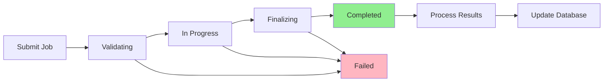

> **Status:** current (supporting reference — semantic-content — Batch API integration reference). Predates the 2026-07-02 spec rewrite; where this conflicts with code or the owning spec's requirements/design, those win.
> **Last verified against code:** carried over 2026-07-02 (e2d75b4) without line-by-line reverification.

# Batch API Integration for Cost Optimization

## Overview

The Batch API integration provides **50% cost savings** on embedding generation by using OpenAI's Batch API for non-time-sensitive operations. This is ideal for overnight regeneration, bulk indexing, and other operations where immediate results are not required.

## Cost Savings

### Pricing Comparison

| Operation | Standard API | Batch API | Savings |
|-----------|-------------|-----------|---------|
| **text-embedding-3-small** | $0.02 per 1M tokens | $0.01 per 1M tokens | 50% |
| **text-embedding-3-large** | $0.13 per 1M tokens | $0.065 per 1M tokens | 50% |
| **text-embedding-ada-002** | $0.10 per 1M tokens | $0.05 per 1M tokens | 50% |

### Example Savings

**Scenario**: Regenerating 100 projects with 10,000 tokens each

- **Standard API**: 1M tokens × $0.02 = **$0.02**
- **Batch API**: 1M tokens × $0.01 = **$0.01**
- **Savings**: **$0.01 (50%)**

For larger portfolios:
- **1,000 projects**: Save **$0.10**
- **10,000 projects**: Save **$1.00**

## When to Use Batch Mode

### ✅ Ideal Use Cases

1. **Overnight Regeneration**
   - Schedule regeneration to run overnight
   - Results ready by morning
   - 50% cost savings

2. **Bulk Indexing**
   - Initial project indexing
   - Large-scale content updates
   - Non-urgent operations

3. **Periodic Maintenance**
   - Weekly/monthly index updates
   - Embedding model upgrades
   - Quality improvements

### ❌ Not Suitable For

1. **Real-Time Search**
   - User-initiated searches need immediate results
   - Use standard API for instant embeddings

2. **Interactive Features**
   - Live content editing
   - Immediate feedback required
   - Use standard API

3. **Time-Sensitive Updates**
   - Critical bug fixes
   - Urgent content changes
   - Use standard API

## Processing Window

- **Batch API**: 24-hour processing window
- **Typical completion**: 12-18 hours
- **Status polling**: Every 1 minute
- **Automatic fallback**: Standard API if batch fails

## Implementation

### 1. Batch Job Submission

```typescript
import { getBatchEmbeddingService } from '@/lib/content/BatchEmbeddingService';

const batchService = getBatchEmbeddingService();

// Prepare batch requests
const requests = chunks.map(chunk => ({
  id: chunk.id,
  content: chunk.content,
  metadata: {
    chunkId: chunk.chunkId,
    projectId: chunk.projectId,
    tier: chunk.tier
  }
}));

// Submit batch job
const result = await batchService.submitBatchJob(requests, {
  model: 'text-embedding-3-small',
  priority: 'normal',
  estimatedTokens: 100000,
  estimatedCost: 0.001,
  projectIds: ['project-1', 'project-2']
});

console.log(`Batch job submitted: ${result.batchId}`);
```

### 2. Status Monitoring

```typescript
// Check batch status
const status = await batchService.checkBatchStatus(batchId);

console.log(`Status: ${status.status}`);
console.log(`Progress: ${status.completedCount}/${status.requestCount}`);
console.log(`Estimated savings: $${status.estimatedSavings.toFixed(4)}`);
```

### 3. Results Processing

```typescript
// Process completed batch
const results = await batchService.processBatchResults(batchId);

console.log(`Embeddings generated: ${results.embeddings.length}`);
console.log(`Actual cost: $${results.actualCost.toFixed(4)}`);
console.log(`Actual savings: $${results.actualSavings.toFixed(4)}`);

// Update database with embeddings
for (const embedding of results.embeddings) {
  await vectorOps.upsertContextChunkWithVector({
    // ... chunk data
    embedding: embedding.embedding
  });
}
```

### 4. Budget-Aware Integration

```typescript
import { getBudgetAwareAI } from '@/lib/content/BudgetAwareAIOperations';

const budgetAwareAI = getBudgetAwareAI();

// Use batch mode for cost savings
const result = await budgetAwareAI.generateEmbedding({
  input: ['content 1', 'content 2'],
  model: 'text-embedding-3-small',
  projectId: 'project-1',
  useBatchMode: true,  // Enable batch mode
  batchPriority: 'normal'
});

if (result.batchId) {
  console.log(`Batch job submitted: ${result.batchId}`);
  console.log('Results will be available within 24 hours');
}
```

## API Endpoints

### Submit Batch Job

```http
POST /api/admin/semantic/batch/submit
Content-Type: application/json

{
  "requests": [
    {
      "id": "chunk-1",
      "content": "Content to embed",
      "metadata": {
        "chunkId": "chunk-1",
        "projectId": "project-1",
        "tier": 3
      }
    }
  ],
  "config": {
    "model": "text-embedding-3-small",
    "priority": "normal",
    "estimatedTokens": 1000,
    "estimatedCost": 0.00001,
    "projectIds": ["project-1"]
  }
}
```

### Check Status

```http
GET /api/admin/semantic/batch/{batchId}/status
```

### Process Results

```http
POST /api/admin/semantic/batch/{batchId}/process
```

### Get Analytics

```http
GET /api/admin/semantic/batch/analytics?startDate=2025-01-01&endDate=2025-01-31
```

### List Active Jobs

```http
GET /api/admin/semantic/batch/list
```

## Batch Job Lifecycle



## Batch Job Priorities

### Low Priority
- Non-urgent maintenance
- Background optimization
- Lowest cost, longest wait

### Normal Priority (Default)
- Regular regeneration
- Scheduled updates
- Balanced cost/time

### High Priority
- Important updates
- Time-sensitive (but not urgent)
- Faster processing

## Analytics and Monitoring

### Cost Savings Dashboard

```typescript
const analytics = await batchService.getBatchAnalytics({
  startDate: new Date('2025-01-01'),
  endDate: new Date('2025-01-31')
});

console.log(`Total jobs: ${analytics.totalJobs}`);
console.log(`Success rate: ${(analytics.successRate * 100).toFixed(1)}%`);
console.log(`Total savings: $${analytics.totalCostSavings.toFixed(2)}`);
console.log(`Avg processing: ${analytics.averageProcessingTime / 1000 / 60 / 60}h`);
```

### Active Job Monitoring

```typescript
const activeJobs = await batchService.listActiveBatchJobs();

for (const job of activeJobs) {
  console.log(`${job.id}: ${job.status}`);
  console.log(`  Progress: ${job.completedCount}/${job.requestCount}`);
  console.log(`  Savings: $${job.estimatedSavings.toFixed(4)}`);
}
```

## Error Handling

### Automatic Fallback

If batch processing fails, the system automatically falls back to standard API:

```typescript
try {
  // Try batch mode first
  const result = await budgetAwareAI.generateEmbedding({
    input: content,
    useBatchMode: true
  });
} catch (error) {
  // Automatic fallback to standard API
  console.log('Batch failed, using standard API');
  const result = await budgetAwareAI.generateEmbedding({
    input: content,
    useBatchMode: false
  });
}
```

### Retry Logic

```typescript
// Retry failed batch jobs
const status = await batchService.checkBatchStatus(batchId);

if (status.status === 'failed') {
  console.log('Batch failed, resubmitting...');
  const newBatch = await batchService.submitBatchJob(requests, config);
}
```

## Best Practices

### 1. Schedule Overnight Operations

```typescript
// Schedule batch job for overnight processing
const scheduleBatchRegeneration = async () => {
  const now = new Date();
  const tonight = new Date(now);
  tonight.setHours(22, 0, 0, 0); // 10 PM
  
  const delay = tonight.getTime() - now.getTime();
  
  setTimeout(async () => {
    await submitBatchJob(/* ... */);
  }, delay);
};
```

### 2. Batch Size Optimization

```typescript
// Optimal batch size: 1,000-10,000 requests
const OPTIMAL_BATCH_SIZE = 5000;

if (requests.length > OPTIMAL_BATCH_SIZE) {
  // Split into multiple batches
  const batches = chunk(requests, OPTIMAL_BATCH_SIZE);
  for (const batch of batches) {
    await batchService.submitBatchJob(batch, config);
  }
}
```

### 3. Priority Management

```typescript
// Use priority based on urgency
const priority = isUrgent ? 'high' : 
                 isScheduled ? 'normal' : 
                 'low';

await batchService.submitBatchJob(requests, {
  ...config,
  priority
});
```

## Configuration

### Environment Variables

```env
# OpenAI API Key (required)
OPENAI_API_KEY=sk-...

# Batch polling interval (optional, default: 60000ms)
BATCH_POLL_INTERVAL=60000

# Max batch size (optional, default: 50000)
MAX_BATCH_SIZE=50000
```

### Database Schema

```prisma
model BatchEmbeddingJob {
  id               String   @id @default(cuid())
  batchId          String   @unique
  status           String
  model            String
  priority         String
  requestCount     Int
  completedCount   Int      @default(0)
  failedCount      Int      @default(0)
  estimatedTokens  Int
  actualTokens     Int?
  estimatedCost    Decimal  @db.Decimal(10, 4)
  actualCost       Decimal? @db.Decimal(10, 4)
  estimatedSavings Decimal  @db.Decimal(10, 4)
  actualSavings    Decimal? @db.Decimal(10, 4)
  projectIds       String[]
  metadata         Json     @default("{}")
  createdAt        DateTime @default(now())
  completedAt      DateTime?
}
```

## Testing

Run the test suite:

```bash
npm run test:batch-api
# or
npx tsx scripts/test-batch-api.ts
```

## Monitoring

### Health Checks

```typescript
// Check batch service health
const health = {
  activeJobs: await batchService.listActiveBatchJobs(),
  analytics: await batchService.getBatchAnalytics(),
  costSavings: analytics.totalCostSavings
};

console.log(`Health: ${health.activeJobs.length} active jobs`);
console.log(`Savings: $${health.costSavings.toFixed(2)}`);
```

### Alerts

Set up alerts for:
- Failed batch jobs
- Long processing times (>24 hours)
- Low success rates (<90%)
- Budget depletion

## Future Enhancements

1. **Automatic Scheduling**
   - Smart scheduling based on usage patterns
   - Optimal time window detection

2. **Batch Prioritization**
   - Dynamic priority adjustment
   - Queue management

3. **Cost Optimization**
   - Automatic batch/standard selection
   - Cost prediction models

4. **Advanced Analytics**
   - Cost trends over time
   - Savings projections
   - ROI calculations

## Support

For issues or questions:
- Check batch job status via API
- Review analytics for patterns
- Contact support with batch ID

## Summary

The Batch API integration provides:
- ✅ **50% cost savings** on embeddings
- ✅ **Automatic fallback** to standard API
- ✅ **Full budget tracking** and analytics
- ✅ **Flexible scheduling** for overnight operations
- ✅ **Queue management** with priorities
- ✅ **Comprehensive monitoring** and alerts

**Recommended for**: Overnight regeneration, bulk indexing, periodic maintenance
**Not recommended for**: Real-time search, interactive features, urgent updates
