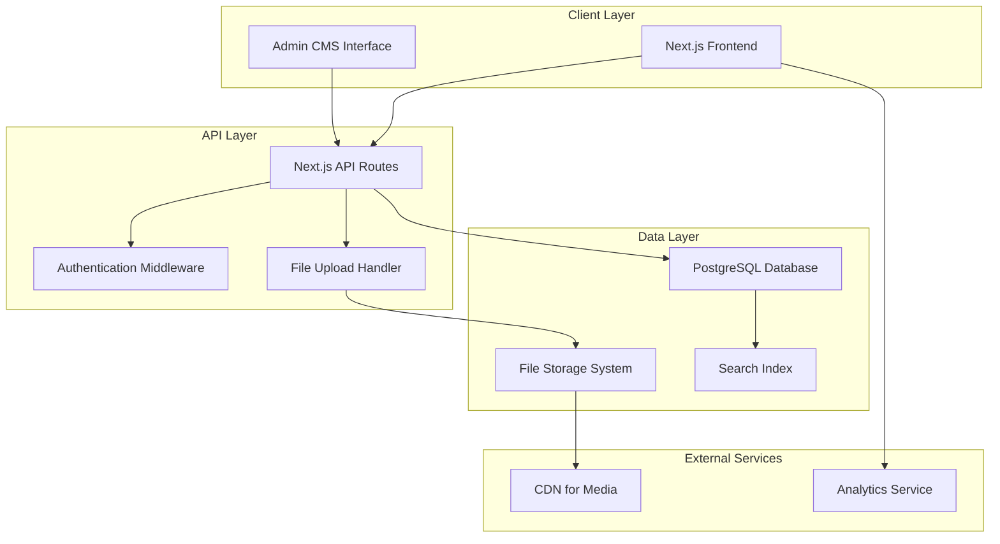

# Design Document

## Overview

The portfolio projects website will be built as a modern, performant web application using Next.js 14 with App Router, providing server-side rendering for SEO optimization and fast initial page loads. The system follows a full-stack architecture with a PostgreSQL database, RESTful API, and a React-based admin CMS. The frontend utilizes shadcn/ui components for consistent, accessible design and Framer Motion for smooth animations.

The application will be deployed on a separate subdomain and designed mobile-first with responsive layouts. The architecture supports real-time filtering, advanced search capabilities, and rich media content including interactive examples and WebXR experiences.

## Architecture

### System Architecture



### Technology Stack

**Frontend:**
- Next.js 14 (App Router)
- React 18
- TypeScript
- Tailwind CSS
- shadcn/ui components
- Framer Motion (animations)
- React Hook Form (forms)
- Zustand (state management)

**Backend:**
- Next.js API Routes
- PostgreSQL with Prisma ORM
- NextAuth.js (authentication)
- Multer (file uploads)
- Sharp (image processing)

**Infrastructure:**
- Development: Vercel (free tier with excellent CI/CD)
- Production: Bluehost (existing hosting)
- Database: PostgreSQL (available on Bluehost)
- Media Storage: Local file system on Bluehost server
- Analytics: Google Analytics (free) or simple view tracking

## Components and Interfaces

### Frontend Components

#### Core Layout Components

**ProjectsLayout**
```typescript
interface ProjectsLayoutProps {
  children: React.ReactNode;
  showFilters?: boolean;
  viewMode: 'grid' | 'timeline';
}
```

**NavigationBar**
```typescript
interface NavigationBarProps {
  tags: Tag[];
  selectedTags: string[];
  onTagSelect: (tags: string[]) => void;
  searchQuery: string;
  onSearchChange: (query: string) => void;
  sortBy: SortOption;
  onSortChange: (sort: SortOption) => void;
  viewMode: 'grid' | 'timeline';
  onViewModeChange: (mode: 'grid' | 'timeline') => void;
}
```

#### Project Display Components

**ProjectGrid**
```typescript
interface ProjectGridProps {
  projects: Project[];
  loading: boolean;
  onProjectClick: (projectId: string) => void;
}
```

**ProjectCard**
```typescript
interface ProjectCardProps {
  project: Project;
  onClick: () => void;
  showViewCount?: boolean;
}
```

**ProjectTimeline**
```typescript
interface ProjectTimelineProps {
  projects: Project[];
  groupBy: 'year' | 'month';
  onProjectClick: (projectId: string) => void;
}
```

#### Project Detail Components

**ProjectModal**
```typescript
interface ProjectModalProps {
  project: Project | null;
  isOpen: boolean;
  onClose: () => void;
}
```

**ProjectMetadata**
```typescript
interface ProjectMetadataProps {
  project: Project;
  relatedProjects: Project[];
}
```

**ProjectArticle**
```typescript
interface ProjectArticleProps {
  content: ArticleContent;
  media: MediaItem[];
  interactiveExamples: InteractiveExample[];
}
```

**MediaCarousel**
```typescript
interface MediaCarouselProps {
  images: CarouselImage[];
  autoPlay?: boolean;
  showThumbnails?: boolean;
}
```

#### Admin Components

**AdminDashboard**
```typescript
interface AdminDashboardProps {
  projects: Project[];
  stats: DashboardStats;
}
```

**ProjectEditor**
```typescript
interface ProjectEditorProps {
  project?: Project;
  onSave: (project: ProjectData) => void;
  onCancel: () => void;
}
```

### Data Models

#### Core Models

**Project**
```typescript
interface Project {
  id: string;
  title: string;
  slug: string;
  description: string;
  briefOverview: string;
  tags: Tag[];
  workDate: Date;
  status: 'draft' | 'published';
  visibility: 'public' | 'private';
  viewCount: number;
  createdAt: Date;
  updatedAt: Date;
  
  // Media
  thumbnailImage: MediaItem;
  metadataImage: MediaItem;
  mediaItems: MediaItem[];
  
  // Content
  articleContent: ArticleContent;
  interactiveExamples: InteractiveExample[];
  
  // Links and Downloads
  externalLinks: ExternalLink[];
  downloadableFiles: DownloadableFile[];
}
```

**MediaItem**
```typescript
interface MediaItem {
  id: string;
  type: 'image' | 'video' | 'gif' | 'webm';
  url: string;
  thumbnailUrl?: string;
  alt: string;
  description?: string;
  width: number;
  height: number;
  fileSize: number;
  order: number;
}
```

**CarouselImage**
```typescript
interface CarouselImage extends MediaItem {
  carouselId: string;
  description: string;
}
```

**ArticleContent**
```typescript
interface ArticleContent {
  id: string;
  content: string; // Rich text/markdown
  embeddedMedia: EmbeddedMedia[];
  projectReferences: ProjectReference[];
}
```

**InteractiveExample**
```typescript
interface InteractiveExample {
  id: string;
  type: 'canvas' | 'iframe' | 'webxr';
  title: string;
  description: string;
  url?: string;
  embedCode?: string;
  fallbackContent: string;
  securitySettings: SecuritySettings;
}
```

**DownloadableFile**
```typescript
interface DownloadableFile {
  id: string;
  filename: string;
  originalName: string;
  fileType: string;
  fileSize: number;
  downloadUrl: string;
  description?: string;
  uploadDate: Date;
}
```

### API Interfaces

#### REST Endpoints

**Projects API**
```typescript
// GET /api/projects
interface GetProjectsResponse {
  projects: Project[];
  totalCount: number;
  hasMore: boolean;
}

// GET /api/projects/[slug]
interface GetProjectResponse {
  project: Project;
  relatedProjects: Project[];
}

// POST /api/projects (Admin only)
interface CreateProjectRequest {
  title: string;
  description: string;
  briefOverview: string;
  tags: string[];
  workDate: string;
  status: 'draft' | 'published';
  visibility: 'public' | 'private';
}

// PUT /api/projects/[id] (Admin only)
interface UpdateProjectRequest extends Partial<CreateProjectRequest> {
  articleContent?: string;
  externalLinks?: ExternalLink[];
}
```

**Search and Filter API**
```typescript
// GET /api/projects/search
interface SearchProjectsParams {
  query?: string;
  tags?: string[];
  sortBy?: 'date' | 'title' | 'popularity';
  sortOrder?: 'asc' | 'desc';
  page?: number;
  limit?: number;
  status?: 'published' | 'draft' | 'all'; // Admin only
}
```

**Media API**
```typescript
// POST /api/media/upload (Admin only)
interface UploadMediaRequest {
  file: File;
  type: 'image' | 'video' | 'attachment';
  projectId?: string;
}

interface UploadMediaResponse {
  mediaItem: MediaItem;
  url: string;
}
```

**Analytics API**
```typescript
// POST /api/analytics/view
interface TrackViewRequest {
  projectId: string;
  timestamp: Date;
  userAgent?: string;
}

// GET /api/analytics/stats (Admin only)
interface AnalyticsStatsResponse {
  totalViews: number;
  popularProjects: Project[];
  viewsByDate: ViewsByDate[];
}
```

## Data Models

### Database Schema

#### Projects Table
```sql
CREATE TABLE projects (
  id UUID PRIMARY KEY DEFAULT gen_random_uuid(),
  title VARCHAR(255) NOT NULL,
  slug VARCHAR(255) UNIQUE NOT NULL,
  description TEXT,
  brief_overview TEXT,
  work_date DATE,
  status VARCHAR(20) DEFAULT 'draft',
  visibility VARCHAR(20) DEFAULT 'public',
  view_count INTEGER DEFAULT 0,
  created_at TIMESTAMP DEFAULT NOW(),
  updated_at TIMESTAMP DEFAULT NOW(),
  
  -- Media references
  thumbnail_image_id UUID REFERENCES media_items(id),
  metadata_image_id UUID REFERENCES media_items(id)
);
```

#### Tags and Relationships
```sql
CREATE TABLE tags (
  id UUID PRIMARY KEY DEFAULT gen_random_uuid(),
  name VARCHAR(100) UNIQUE NOT NULL,
  color VARCHAR(7), -- Hex color
  created_at TIMESTAMP DEFAULT NOW()
);

CREATE TABLE project_tags (
  project_id UUID REFERENCES projects(id) ON DELETE CASCADE,
  tag_id UUID REFERENCES tags(id) ON DELETE CASCADE,
  PRIMARY KEY (project_id, tag_id)
);
```

#### Media and Content
```sql
CREATE TABLE media_items (
  id UUID PRIMARY KEY DEFAULT gen_random_uuid(),
  project_id UUID REFERENCES projects(id) ON DELETE CASCADE,
  type VARCHAR(20) NOT NULL,
  url VARCHAR(500) NOT NULL,
  thumbnail_url VARCHAR(500),
  alt_text VARCHAR(255),
  description TEXT,
  width INTEGER,
  height INTEGER,
  file_size BIGINT,
  display_order INTEGER DEFAULT 0,
  created_at TIMESTAMP DEFAULT NOW()
);

CREATE TABLE article_content (
  id UUID PRIMARY KEY DEFAULT gen_random_uuid(),
  project_id UUID REFERENCES projects(id) ON DELETE CASCADE,
  content TEXT NOT NULL,
  created_at TIMESTAMP DEFAULT NOW(),
  updated_at TIMESTAMP DEFAULT NOW()
);
```

#### Interactive and Download Content
```sql
CREATE TABLE interactive_examples (
  id UUID PRIMARY KEY DEFAULT gen_random_uuid(),
  project_id UUID REFERENCES projects(id) ON DELETE CASCADE,
  type VARCHAR(20) NOT NULL,
  title VARCHAR(255) NOT NULL,
  description TEXT,
  url VARCHAR(500),
  embed_code TEXT,
  fallback_content TEXT,
  security_settings JSONB,
  display_order INTEGER DEFAULT 0
);

CREATE TABLE downloadable_files (
  id UUID PRIMARY KEY DEFAULT gen_random_uuid(),
  project_id UUID REFERENCES projects(id) ON DELETE CASCADE,
  filename VARCHAR(255) NOT NULL,
  original_name VARCHAR(255) NOT NULL,
  file_type VARCHAR(100) NOT NULL,
  file_size BIGINT NOT NULL,
  download_url VARCHAR(500) NOT NULL,
  description TEXT,
  upload_date TIMESTAMP DEFAULT NOW()
);
```

### Search Implementation

**Full-Text Search Setup**
```sql
-- Add search vector column
ALTER TABLE projects ADD COLUMN search_vector tsvector;

-- Create search index
CREATE INDEX projects_search_idx ON projects USING GIN(search_vector);

-- Update search vector trigger
CREATE OR REPLACE FUNCTION update_projects_search_vector()
RETURNS TRIGGER AS $$
BEGIN
  NEW.search_vector := 
    setweight(to_tsvector('english', COALESCE(NEW.title, '')), 'A') ||
    setweight(to_tsvector('english', COALESCE(NEW.description, '')), 'B') ||
    setweight(to_tsvector('english', COALESCE(NEW.brief_overview, '')), 'C');
  RETURN NEW;
END;
$$ LANGUAGE plpgsql;

CREATE TRIGGER projects_search_vector_update
  BEFORE INSERT OR UPDATE ON projects
  FOR EACH ROW EXECUTE FUNCTION update_projects_search_vector();
```

## Error Handling

### Frontend Error Boundaries

**Global Error Boundary**
```typescript
interface ErrorBoundaryState {
  hasError: boolean;
  error?: Error;
  errorInfo?: ErrorInfo;
}

class GlobalErrorBoundary extends Component<PropsWithChildren, ErrorBoundaryState> {
  // Handle React errors gracefully
  // Show fallback UI
  // Log errors to analytics service
}
```

**API Error Handling**
```typescript
interface ApiError {
  status: number;
  message: string;
  code: string;
  details?: any;
}

const handleApiError = (error: ApiError) => {
  switch (error.status) {
    case 404:
      return "Project not found";
    case 403:
      return "Access denied";
    case 500:
      return "Server error. Please try again later.";
    default:
      return error.message || "An unexpected error occurred";
  }
};
```

### Backend Error Handling

**API Error Responses**
```typescript
interface ErrorResponse {
  success: false;
  error: {
    code: string;
    message: string;
    details?: any;
  };
  timestamp: string;
  path: string;
}

// Centralized error handler
export const handleApiError = (error: unknown, req: NextRequest) => {
  if (error instanceof ValidationError) {
    return NextResponse.json({
      success: false,
      error: {
        code: 'VALIDATION_ERROR',
        message: 'Invalid input data',
        details: error.details
      },
      timestamp: new Date().toISOString(),
      path: req.url
    }, { status: 400 });
  }
  
  // Handle other error types...
};
```

### File Upload Error Handling

```typescript
const validateFileUpload = (file: File): ValidationResult => {
  const maxSize = 50 * 1024 * 1024; // 50MB
  const allowedTypes = {
    image: ['image/jpeg', 'image/png', 'image/gif', 'image/webp'],
    video: ['video/mp4', 'video/webm'],
    attachment: ['application/zip', 'application/pdf', 'application/vnd.android.package-archive']
  };
  
  if (file.size > maxSize) {
    return { valid: false, error: 'File size exceeds 50MB limit' };
  }
  
  // Additional validation logic...
};
```

## Testing Strategy

### Unit Testing

**Component Testing with Jest and React Testing Library**
```typescript
// ProjectCard.test.tsx
describe('ProjectCard', () => {
  it('displays project information correctly', () => {
    const mockProject = createMockProject();
    render(<ProjectCard project={mockProject} onClick={jest.fn()} />);
    
    expect(screen.getByText(mockProject.title)).toBeInTheDocument();
    expect(screen.getByText(mockProject.description)).toBeInTheDocument();
  });
  
  it('handles click events', () => {
    const handleClick = jest.fn();
    const mockProject = createMockProject();
    render(<ProjectCard project={mockProject} onClick={handleClick} />);
    
    fireEvent.click(screen.getByRole('button'));
    expect(handleClick).toHaveBeenCalledTimes(1);
  });
});
```

**API Route Testing**
```typescript
// projects.api.test.ts
describe('/api/projects', () => {
  it('returns paginated projects', async () => {
    const req = createMockRequest({ method: 'GET' });
    const res = await GET(req);
    const data = await res.json();
    
    expect(res.status).toBe(200);
    expect(data.projects).toHaveLength(10);
    expect(data.totalCount).toBeGreaterThan(0);
  });
  
  it('filters projects by tags', async () => {
    const req = createMockRequest({ 
      method: 'GET',
      url: '/api/projects?tags=React,TypeScript'
    });
    const res = await GET(req);
    const data = await res.json();
    
    expect(data.projects.every(p => 
      p.tags.some(t => ['React', 'TypeScript'].includes(t.name))
    )).toBe(true);
  });
});
```

### Integration Testing

**End-to-End Testing with Playwright**
```typescript
// projects.e2e.test.ts
test.describe('Projects Page', () => {
  test('filters projects by tag', async ({ page }) => {
    await page.goto('/projects');
    
    // Click on React tag
    await page.click('[data-testid="tag-react"]');
    
    // Verify filtered results
    const projectCards = page.locator('[data-testid="project-card"]');
    await expect(projectCards).toHaveCount(5);
    
    // Verify all visible projects have React tag
    const reactTags = page.locator('[data-testid="project-tag"]:has-text("React")');
    await expect(reactTags).toHaveCount(5);
  });
  
  test('opens project modal on click', async ({ page }) => {
    await page.goto('/projects');
    
    // Click first project
    await page.click('[data-testid="project-card"]:first-child');
    
    // Verify modal opens
    await expect(page.locator('[data-testid="project-modal"]')).toBeVisible();
    
    // Verify URL updates
    expect(page.url()).toContain('/projects/');
  });
});
```

### Performance Testing

**Core Web Vitals Monitoring**
```typescript
// performance.test.ts
describe('Performance Metrics', () => {
  it('meets Core Web Vitals thresholds', async () => {
    const metrics = await measurePagePerformance('/projects');
    
    expect(metrics.LCP).toBeLessThan(2500); // Largest Contentful Paint
    expect(metrics.FID).toBeLessThan(100);  // First Input Delay
    expect(metrics.CLS).toBeLessThan(0.1);  // Cumulative Layout Shift
  });
  
  it('loads images efficiently', async () => {
    const imageLoadTimes = await measureImageLoading('/projects');
    
    expect(imageLoadTimes.average).toBeLessThan(1000);
    expect(imageLoadTimes.p95).toBeLessThan(2000);
  });
});
```

### Security Testing

**Authentication and Authorization Tests**
```typescript
describe('Admin Security', () => {
  it('requires authentication for admin routes', async () => {
    const req = createMockRequest({ 
      method: 'POST',
      url: '/api/projects'
    });
    const res = await POST(req);
    
    expect(res.status).toBe(401);
  });
  
  it('validates file uploads', async () => {
    const maliciousFile = createMockFile('script.js', 'text/javascript');
    const req = createMockRequest({
      method: 'POST',
      url: '/api/media/upload',
      body: { file: maliciousFile }
    });
    
    const res = await POST(req);
    expect(res.status).toBe(400);
  });
});
```

## Deployment Strategy

### Development Environment
- **Hosting**: Vercel free tier for seamless GitHub integration and automatic deployments
- **Database**: Supabase free tier (500MB, perfect for development)
- **Media Storage**: Cloudinary free tier (25GB bandwidth/month)
- **Benefits**: Zero-config deployments, preview deployments for PRs, excellent DX

### Production Environment (Bluehost)

**Self-Hosted Approach**
- Use existing Bluehost shared/VPS hosting
- PostgreSQL database (available in your Bluehost plan)
- Local file storage for media (no additional costs)
- Manual deployment or simple CI/CD with GitHub Actions
- Subdomain setup through Bluehost cPanel

**Cost Benefits**
- No additional monthly fees for hosting, database, or media storage
- Utilize existing Bluehost resources (including PostgreSQL)
- Simple backup and maintenance through cPanel and phpPgAdmin
- PostgreSQL provides superior full-text search and JSON support for complex features

**Technical Considerations**
- Next.js can be deployed as static files with API routes as PHP/Node.js
- Alternative: Build as SPA with separate backend API
- PostgreSQL accessible through phpPgAdmin in cPanel
- Media optimization handled server-side with Sharp
- Database migrations managed through simple scripts or phpPgAdmin

### Self-Hosted Media Management

**Local File Storage Structure**
```
/public/uploads/
  /projects/
    /project-slug/
      /images/
      /videos/
      /attachments/
      /thumbnails/
```

**Media Processing Pipeline**
- Upload files to server directory
- Generate thumbnails and optimized versions with Sharp
- Store file metadata in database
- Serve files directly from server with proper caching headers

**Backup Strategy**
- Regular database backups through cPanel
- File system backups included in Bluehost backup service
- Optional: Sync media files to external storage for redundancy

## CI/CD and Development Workflow

### GitHub Actions Deployment
```yaml
# .github/workflows/deploy.yml
name: Deploy to Bluehost
on:
  push:
    branches: [main]
jobs:
  deploy:
    runs-on: ubuntu-latest
    steps:
      - uses: actions/checkout@v3
      - name: Setup Node.js
        uses: actions/setup-node@v3
      - name: Install and build
        run: npm ci && npm run build
      - name: Deploy via SSH
        uses: appleboy/ssh-action@v0.1.5
        with:
          host: ${{ secrets.HOST }}
          username: ${{ secrets.USERNAME }}
          key: ${{ secrets.SSH_KEY }}
          script: |
            cd /public_html/projects
            git pull origin main
            npm ci --production
            npm run build
```

### Development Environments
- **Local**: Full development environment with hot reload
- **Vercel**: Staging environment for testing and previews
- **Bluehost**: Production environment with custom domain

### Open Source Considerations
- Environment variables template (`.env.example`)
- Sample data seeds for development
- Clear setup documentation in README
- **MIT License**: Allows commercial use while requiring attribution
- Contribution guidelines for community input
- License ensures credit while maximizing adoption potential

## Documentation Strategy

### Essential Documentation
- **README.md**: Setup, installation, and deployment guide
- **API.md**: Endpoint documentation with examples
- **CONTRIBUTING.md**: Development workflow and standards
- **DEPLOYMENT.md**: Production deployment instructions

### Code Documentation
- TypeScript interfaces for self-documenting APIs
- Component props documentation with JSDoc
- Database schema documentation
- Environment configuration guide

The architecture is designed to be cost-effective, self-contained, and showcase-ready, maximizing your existing Bluehost infrastructure while serving as an impressive portfolio piece that demonstrates modern full-stack development skills.